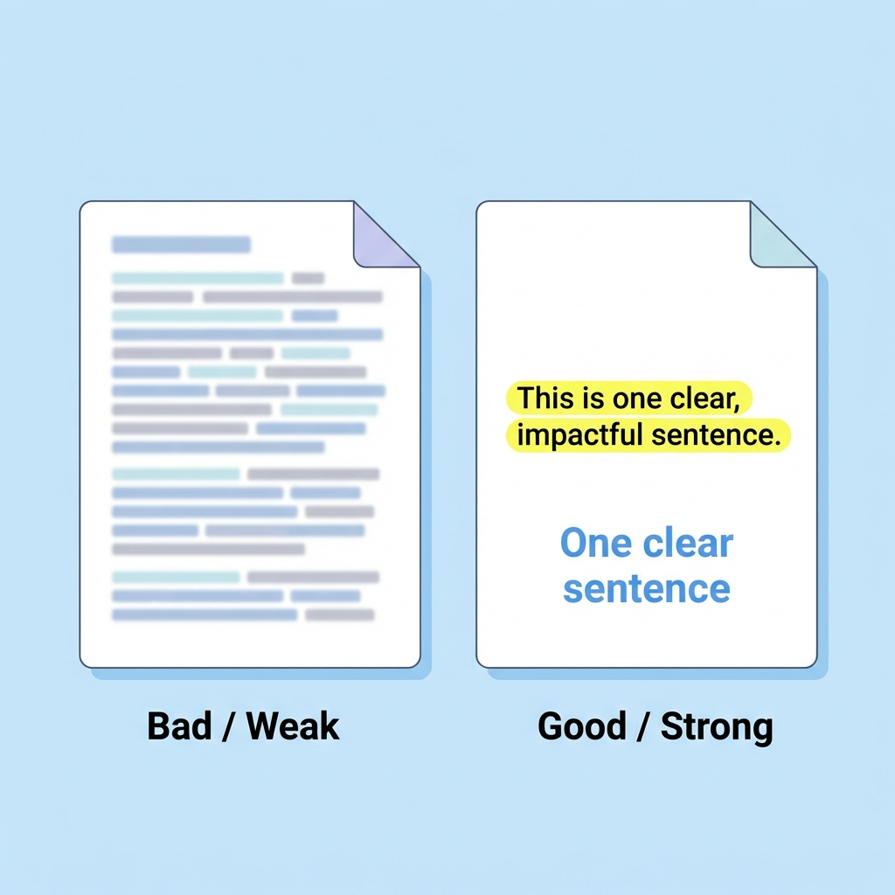
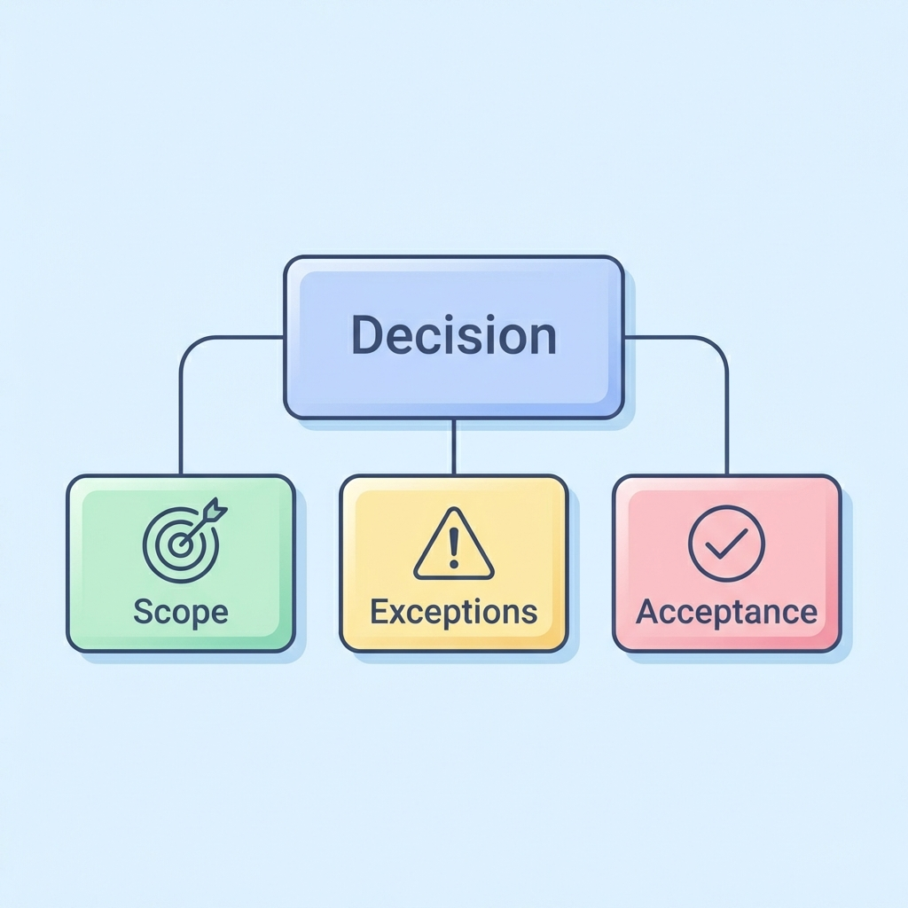
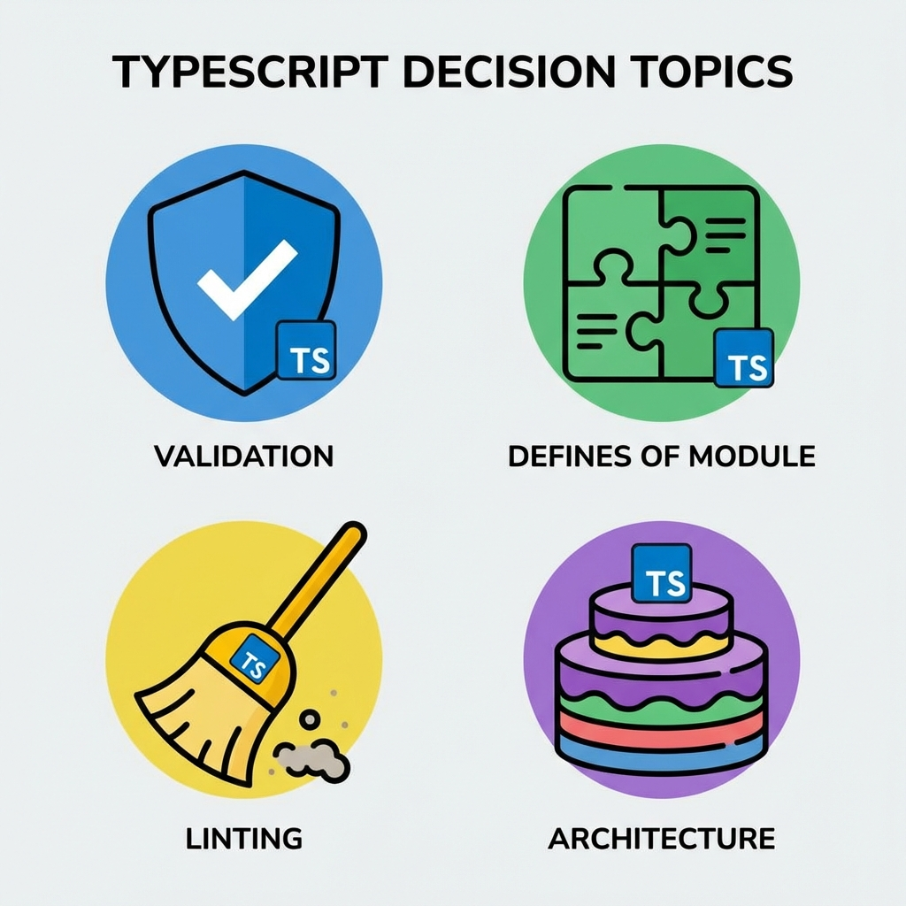
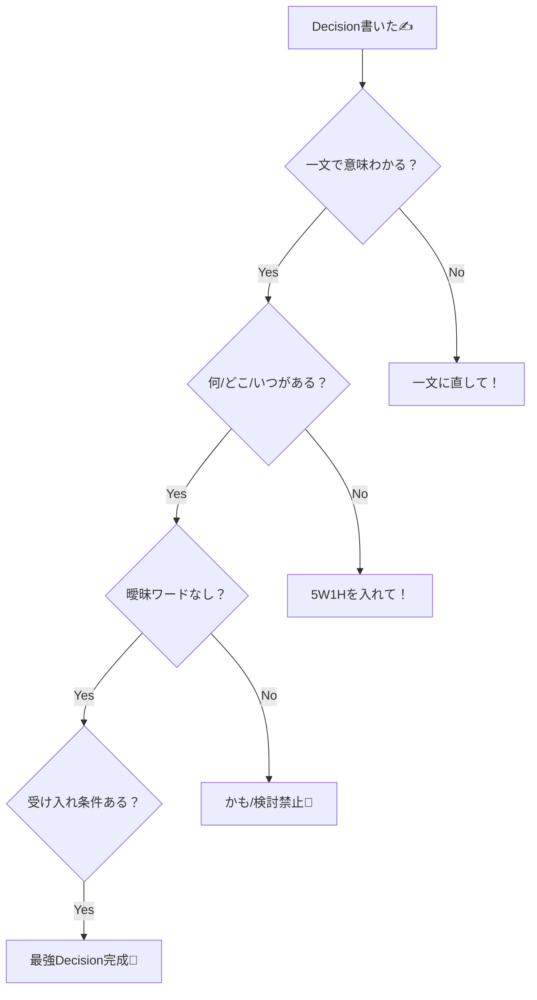

# 第6章：書き方② Decision（結論）は“一文で言い切る”✨🧠

ADRって **「判断のログ」** だから、真ん中の **Decision（結論）** がブレると全体がフワッとしちゃうんだよね🥺💦
定番の構成（Context / Decision / Consequences）でも、Decisionは“核”として扱われます。 ([Architectural Decision Records][1])

この章では、**Decisionを「一文でズバッと言い切る」書き方**を、TypeScriptの例でやさしく練習していくよ〜🫶✨

---

## 1) Decisionって何を書く場所？🤔📝

Decisionは、いちばん大事なここ👇

* ✅ **何を採用するの？**（選んだもの）
* ✅ **どこに適用するの？**（スコープ）
* ✅ **いつから？**（開始タイミング）
* ✅ **例外ある？**（例外ルール）
* ✅ **“採用した”ってどう判定する？**（受け入れ条件・軽くでOK）

ADRは「判断の背景と影響」もセットで残す考え方がよく紹介されてるので、Decisionだけが長文になりすぎないのがコツだよ😉 ([Microsoft Learn][2])

---

## 2) “一文”で言い切るための型（テンプレ）🧩✨



Decisionの一文は、だいたいこの形が最強💪💕

**型A（いちばん基本）**

> We will **採用する** X **を**、Y **のために**、Z **の範囲で**。

**型B（境界がある判断に強い）**

> We will use X **at** boundary Y, and **not** use it inside Z.

**型C（運用・ルール系に強い）**

> We will enforce rule X by Y (lint/CI), starting from date Z.

日本語でもOKだよ👇

> 「私たちは **Xを採用する**（対象：Y、開始：Z、例外：…）」

### 🧠 一文を強くする“動詞”リスト

* ✅ use / adopt / standardize / enforce / deprecate / forbid / require
* ❌ consider / maybe / try / should / might（ぼんやりワード）

---

## 3) Decision一文 + “添え物3点セット”でプロっぽくなる🎀



Decisionは一文でOKなんだけど、**その直下に3つだけ**添えると、急に「運用できるADR」になるよ😳✨

### ✅ 添え物① スコープ（どこまで？）

* 例：`packages/api` のみ / 外部入力の境界のみ / 新規コードから

### ✅ 添え物② 例外（やらない条件）

* 例：PoCは除外 / 既存のレガシー部分は段階移行

### ✅ 添え物③ 受け入れ条件（これ満たしたらOK）

* 例：CIで型チェック必須 / lintが通る / 既存テストが落ちない

---

## 4) “弱いDecision”→“強いDecision” 書き比べ💡✍️

### ❌ 弱い例（ふわふわ😵‍💫）

* 「入力チェックはzodとか使うかも」
* 「状態管理は軽めにしたい」
* 「エラーはいい感じに統一する」

👆これ、読む人が「で、結局どうするの？」ってなるやつ🥺

### ✅ 強い例（言い切り✨）

* 「We will use **Zod** for **runtime validation** of **external inputs at API boundaries**.」
* 「We will standardize client state management on **TanStack Query** for server state, and **avoid global state** unless needed.」
* 「We will represent recoverable errors as **Result-like objects** (no throwing) in domain logic, and throw only at boundaries.」

---

## 5) TypeScriptでありがちなDecisionテーマ例（そのまま使える）🎯💕



Decisionの題材、TSだとこのへんが“ADR向き”になりやすいよ〜🧁

* 🔐 **runtime validation**：Zod / Valibot / 自前…どれ？
* 🧵 **モジュール方針**：ESM基準？CJS混在どうする？
* 🧪 **型チェック運用**：`tsc --noEmit` をCI必須？いつから？
* 🧹 **lint/format**：ESLint/Prettierのルール・例外
* 🧱 **アーキ層の境界**：domainに依存を入れていい？ダメ？
* 🚀 **新機能の採用**：新しいTS構文を使う？（採用範囲どうする？）

（ちなみに、TypeScriptは2025年10月に5.9系のリリースが出ていて、言語機能も増えてるので「新機能を採用する/しない」も判断ネタになりがちだよ🧠） ([TypeScript][3])

---

## 6) “Decisionセクション”の完成形サンプル（コピペOK）📎✨

```md
### Decision
We will use Zod for runtime validation of external inputs at API boundaries.

- Scope: All new endpoints in `apps/api` starting 2026-01-XX.
- Exceptions: Internal-only modules may skip validation if inputs are fully typed and not user-controlled.
- Acceptance criteria:
  - Validation schemas exist for every request/response DTO at the boundary.
  - CI runs `pnpm typecheck` and fails on TS errors.
```

ポイントはこれ👇

* Decisionは **1文** ✅
* 下の箇条書きは **短く** ✅（長文にしない！）

---

## 7) AIでDecisionを“強くする”プロンプト集🤖✨

Decisionって、書いた本人は「伝わってるつもり」になりがち😂
AIにチェックさせると超ラクだよ〜💕

### 🪄 1文に圧縮してもらう

```text
次のDecision文を「曖昧さゼロの一文」に直して。
- 〜かも／検討／いい感じ を禁止
- 何を、どこに、いつから を入れて
文章：<ここに下書き>
```

### 🧷 スコープと例外を洗い出す

```text
このDecisionのスコープ（適用範囲）と例外（適用しない条件）を3つずつ提案して。
Decision：<ここに一文>
```

### 🎯 受け入れ条件を作る

```text
このDecisionが「採用された」と言える受け入れ条件を、CIやレビューで確認できる形で5つ出して。
Decision：<ここに一文>
```

---

## 8) ワーク（手を動かすやつ💪✨）

### 🧪 ワーク1：弱→強 リライト（5分）⏱️

次の弱いDecisionを、強い一文にしてね✍️💕

1. 「入力チェックはライブラリ使う」
2. 「型は厳しめにする」
3. 「API呼び出しは共通化したい」

💡ヒント：「We will use/adopt/enforce…」から始めると勝ち🏆

### 🧪 ワーク2：Decisionに“3点セット”を足す（5分）🧁

ワーク1で作った一文に、

* Scope
* Exceptions
* Acceptance criteria（3つでOK）
  を足して完成〜🎉

---

## 9) Decisionセルフチェックリスト✅🧠

書いたら最後にこれだけ見てね👀✨

* ✅ “一文”だけ読んでも、やることが分かる
* ✅ 「何を」「どこに」「いつから」がある
* ✅ 例外があるなら書いた（ないなら無理に作らなくてOK）
* ✅ 受け入れ条件が“確認できる形”になってる
* ✅ “かも/検討/いい感じ”がゼロ😈❌


```mermaid
flowchart TD
    Start["Decision書いた✍️"] --> Check1{"一文で意味わかる？"}
    Check1 -- Yes --> Check2{"何/どこ/いつがある？"}
    Check1 -- No --> Fix1["一文に直して！"]
    Check2 -- Yes --> Check3{"曖昧ワードなし？"}
    Check2 -- No --> Fix2["5W1Hを入れて！"]
    Check3 -- Yes --> Check4{"受け入れ条件ある？"}
    Check3 -- No --> Fix3["かも/検討禁止👿"]
    Check4 -- Yes --> OK["最強Decision完成🎉"]
```

---

次の章（第7章）は、Decisionの価値を爆上げする **Consequences（結果）** に行くよ〜💎✨
「メリットだけ作文」から卒業する回だよ😉💕

[1]: https://adr.github.io/adr-templates/?utm_source=chatgpt.com "ADR Templates | Architectural Decision Records"
[2]: https://learn.microsoft.com/en-us/azure/well-architected/architect-role/architecture-decision-record?utm_source=chatgpt.com "Maintain an architecture decision record (ADR)"
[3]: https://www.typescriptlang.org/docs/handbook/release-notes/typescript-5-9.html?utm_source=chatgpt.com "Documentation - TypeScript 5.9"
