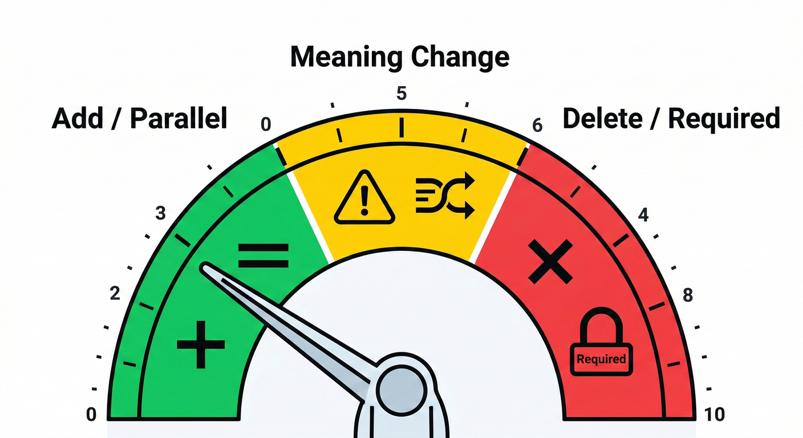
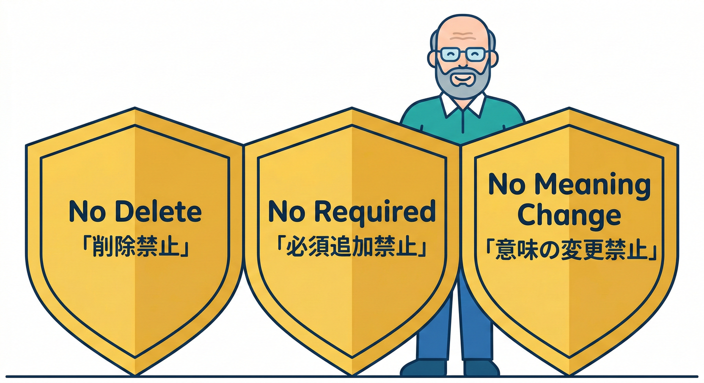
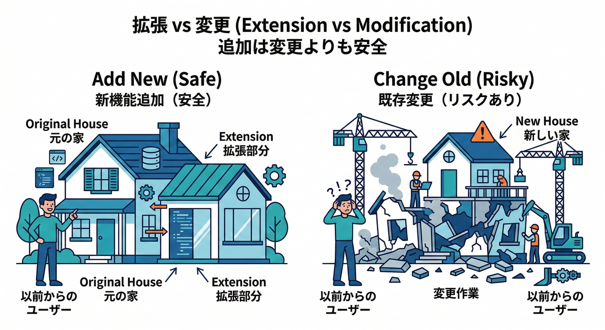
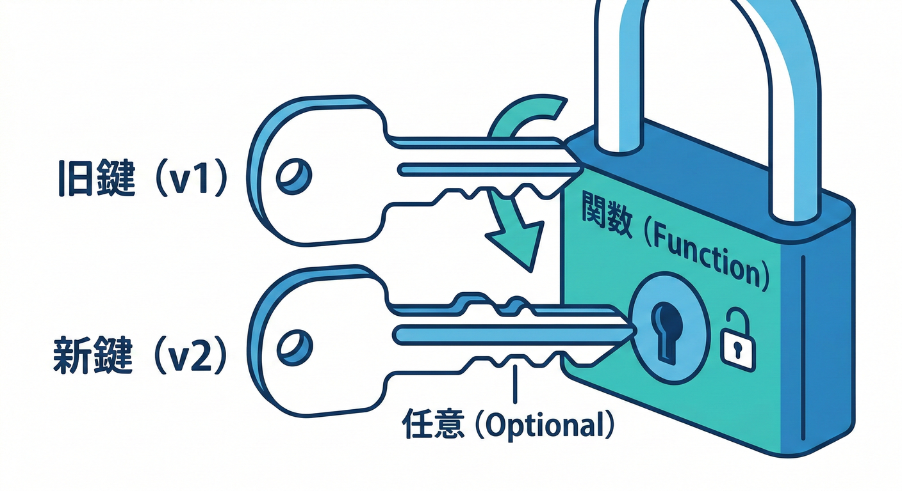
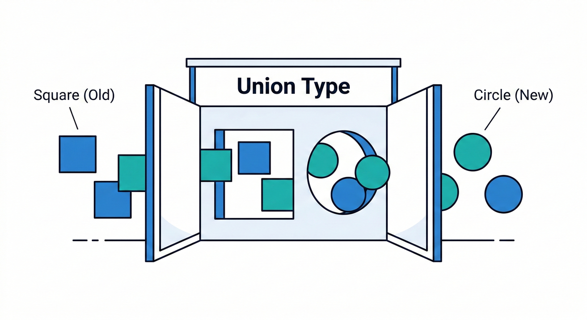
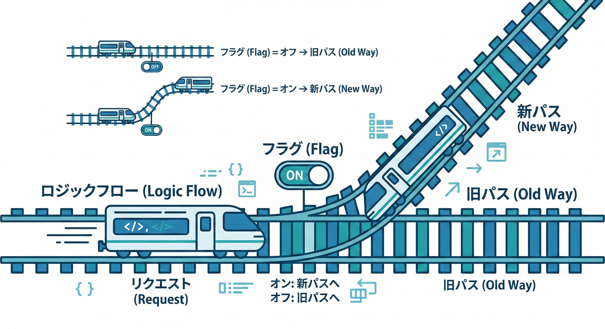

# 第10章：後方互換の基本パターン集🧰🌟

## この章のゴール🎯✨

* 「互換を壊さずに機能追加する」ための **定番パターン** を覚える🧠💡
* 変更が来たときに **MINORで出せる？MAJOR？** を判断できるようになる🔢✨（SemVerの前提）
* 危険な変更を「互換を保つ形」に **書き換えられる** ようになる✍️🛟

## この章で扱う“後方互換”って？🔁

**後方互換（Backward Compatibility）**＝「古い利用者（古いコード・古いクライアント）が、修正なしで動き続ける」ことだよ😊✨
逆に、それが壊れると **破壊的変更（Breaking Change）** で、原則 **MAJOR** 案件になるよ💥

---

# 10-0. まず最重要：守るのは“公開API面”だけ🎭🚪

互換性を守る対象は「公開API（Public Surface）」だよ〜！
第9章のテンプレにもある通り、**公開APIを定義して、それ以外は保証しない** って線引きが超大事✨
だから第10章は「公開APIに変更が入るときの安全なやり方」を集めた章だよ🧰💖

---

# 10-1. まず覚える“危険度3段階”🧯✨



## ✅ 安全（MINORで出しやすい）

* **追加**（しかも既存が壊れない追加）✨
* 旧仕様も受けつつ、新仕様も受けつける（併存）🪜

## ⚠️ 注意（ケース次第）

* 仕様の“意味”を変える（型が同じでも危険💥）
* エラーの種類を増やす（呼び出し側が想定してないと崩れる）😵‍💫

## ❌ 危険（だいたいMAJOR）

* 削除、必須化、型の変更、挙動の変更（デフォルトの意味変更も含む）💣

---

# 10-2. 後方互換を守る「黄金ルール3つ」🥇✨



1. **削除しない**（消したくなったら“非推奨→移行→削除”の順）🚧➡️✅
2. **必須を増やさない**（追加するなら“任意”か“デフォルト”）🎁
3. **意味を変えない**（同じ入力で別の結果になるのは実質破壊💥）

---

# 10-3. パターン集🧰✨（まずはここだけ覚えたら勝ち💖）

## パターンA：新機能は「追加」で出す（既存はそのまま）➕✨



**やりたいこと**：機能を増やしたい
**安全なやり方**：新しい関数・新しいオプション・新しいエンドポイントを“追加”する

**良い例（新関数を追加）✅**

```ts
// 既存（そのまま残す）
export function formatPrice(yen: number): string {
  return `${yen}円`;
}

// 新機能（追加）
export function formatPriceWithTax(yen: number, taxRate = 0.1): string {
  const taxed = Math.round(yen * (1 + taxRate));
  return `${taxed}円（税込）`;
}
```

* 既存利用者は何も直さなくてOK🙆‍♀️✨ → **MINOR** で出しやすい🎉

**ダメ例（既存関数の意味を変える）❌**

```ts
// ある日突然「税込み」に変えた（呼び出し側の計算が全部ズレる）
export function formatPrice(yen: number): string {
  const taxed = Math.round(yen * 1.1);
  return `${taxed}円`;
}
```

* 型が同じでも意味が変わる＝実質破壊💥

---

## パターンB：引数を増やすなら「任意」か「オプションオブジェクト」🎁🧺



**地雷**：既存関数に“必須引数”を増やすのは破壊になりがち💥
（第9章の例にも「必須パラメータ追加」は破壊の代表って書いてあるよ）

**ダメ例（必須引数を追加）❌**

```ts
// 旧: saveUser(user)
// 新: saveUser(user, mode)  ← 旧コードがコンパイル落ち！
export function saveUser(user: User, mode: "fast" | "safe") {
  // ...
}
```

**良い例1（任意引数＋デフォルト）✅**

```ts
export function saveUser(user: User, mode: "fast" | "safe" = "safe") {
  // mode未指定でも動く
}
```

**良い例2（オプションオブジェクト）✅**

```ts
type SaveUserOptions = {
  mode?: "fast" | "safe";
  retryCount?: number;
};

export function saveUser(user: User, options: SaveUserOptions = {}) {
  const mode = options.mode ?? "safe";
  const retryCount = options.retryCount ?? 0;
  // ...
}
```

* 追加が増えても破壊しにくい✨（将来の拡張に強い💪）

---

## パターンC：型を変えたい時は「受け入れを広げる」🔓✨（狭めない！）



後方互換のコツは、基本 **“入力は広く” “出力は慎重に”** だよ😊

**良い例（入力を広げる：union）✅**

```ts
// 旧: stringだけ
// 新: string or number を受けたい（旧もOK）
export function parseUserId(input: string | number): number {
  const n = typeof input === "number" ? input : Number(input);
  if (!Number.isFinite(n)) throw new Error("invalid user id");
  return n;
}
```

**危険例（入力を狭める）❌**

```ts
// 旧: string | number を受けてたのに…
export function parseUserId(input: string): number {
  // numberで呼んでた利用者が死亡💥
  return Number(input);
}
```

---

## パターンD：返り値を変えたい時は「追加」か「別関数」📦✨

返り値の型変更は破壊になりやすいよ😱
（第9章にも“戻り値の型変更”は危険ってある）

**良い例（返り値に“任意フィールド追加”）✅**

```ts
type UserV1 = { id: number; name: string };

// 返り値をリッチにしたい → optional追加（V1利用者は無視できる）
type UserV2 = UserV1 & { nickname?: string };

export function getUser(): UserV2 {
  return { id: 1, name: "Mika", nickname: "みかち" };
}
```

**もっと安全（別関数・別API）✅**

```ts
export function getUserV2(): { id: number; name: string; nickname: string } {
  return { id: 1, name: "Mika", nickname: "みかち" };
}
```

* “新しい期待”を持つ人はV2へ、旧は旧のまま🪜✨

---

## パターンE：削除したいものは「@deprecated」で道を作る🚧💖

第9章のポリシーでも「非推奨→期限→削除」が礼儀だよ〜ってあったね😊
TypeScript + VS Code だと `@deprecated` で“目立つ警告”を出せるから超便利✨

```ts
/**
 * @deprecated Use `getUserV2` instead.
 */
export function getUser() {
  return { id: 1, name: "Mika" };
}

export function getUserV2() {
  return { id: 1, name: "Mika", nickname: "みかち" };
}
```

---

# 10-4. JSON / データ契約での“安全な進化”🧾🧬

（第18章〜にも繋がるけど、ここで先に必須ポイントだけ✨）

## ✅ 安全寄り：任意フィールドを追加する➕

* 古いクライアントは知らないフィールドを無視できることが多い🙆‍♀️

## ❌ 危険：必須フィールド追加、型変更、フィールド削除💥

* 第9章にも “JSON必須項目追加” は破壊例として出てたね😱

**安全なやり方（旧も新もOKにする）✅**

```ts
type PayloadOld = { userId: number };
type PayloadNew = { userId: number; locale?: "ja-JP" | "en-US" }; // optional追加

function handle(payload: PayloadNew) {
  const locale = payload.locale ?? "ja-JP"; // デフォルト補完✨
  // ...
}
```

---

# 10-5. HTTP APIでの“安全な追加”🌐✨（ミニ版）

* **新しいエンドポイントを追加**：`GET /v1/users` は残して、`GET /v1/users/search` を追加🔎
* **レスポンスにフィールドを追加**：ただしクライアントが“厳密デコード”してると壊れることもあるから注意⚠️
* **クエリパラメータ追加**：任意なら安全寄り✨

「挙動を変えたい」なら、**新エンドポイント or フラグ** が安心だよ🪄

---

# 10-6. “意味変更”を避けるためのテク🥷✨（超大事）

**意味変更**って、いちばん事故るやつ😵‍💫💥
だから「変えるなら切り替え式」にするのがコツだよ！

## パターンF：フラグで段階移行🎛️🪜



```ts
type Options = { useNewRule?: boolean };

export function calcScore(input: number, options: Options = {}): number {
  if (options.useNewRule) {
    return input * 2; // 新ルール
  }
  return input; // 旧ルール（デフォルト）
}
```

* デフォルトは旧挙動＝古い利用者が守られる🛟✨
* 新挙動は“選んだ人だけ”が使う🎀

---

# 10-7. 変更が来たときの判断フロー🔁🧠（迷ったらこれ）

1. **それ、公開API？**（Public Surface？）🎭
2. **既存利用者は修正なしで動く？**（破壊的変更の定義）
3. 動くなら → **MINOR/PATCH** の可能性✨
4. 動かないなら → **MAJOR** か、または **“互換を保つ形に書き換え”** を検討🪄

---

# 10-8. ミニ演習📝💖（手を動かすよ〜！）

## 演習1：危険変更を“互換パターン”で救出🛟（15分）

次の変更案を、**後方互換を保つ形**に書き換えてね✨

1. `saveUser(user)` に `mode` を追加したい（でも必須にしたくなる…）
2. `getUser()` の返り値に `nickname` を追加したい（でも必須にしたくなる…）
3. `formatPrice()` を「税込みに変えたい」（意味変更したくなる…）

👉 ヒント：**任意＋デフォルト / 新関数追加 / フラグ** 🧰

---

## 演習2：SemVerクイズ🎮🔢（10分）

次の変更は **MAJOR / MINOR / PATCH** どれ？理由も一言で✍️

* A) 新しい関数 `getUserV2` を追加した
* B) 既存関数の引数を「任意→必須」にした
* C) バグ修正（挙動が“仕様通り”に直った）

（第9章のSemVerルールも見ながらでOKだよ）

---

# 10-9. VS Code + AI活用🤖💞（そのままコピペOK）

## ① 「これ破壊？」判定を手伝わせる🔍

```text
次の変更案は後方互換が壊れますか？
壊れるなら、互換を保った代替案（パターン）を3つ提案して。
前提：公開APIを守る、SemVerに従う。
変更案：<ここに貼る>
```

## ② “互換を保つリファクタ案”を出させる🔧

```text
この関数のシグネチャ変更をしたいけど、既存利用者を壊したくない。
任意引数・optionsオブジェクト・新関数追加・deprecatedのどれが良い？
それぞれのコード例もください。
コード：<貼る>
```

## ③ 変更に合わせたテスト観点を出させる✅

```text
この変更で壊れやすい契約ポイントを列挙して、最小のユニットテスト案を作って。
「旧挙動が維持されてるか」も必ず含めて。
```

---

# まとめ🎀✨

* 後方互換を守るコツは **「削除しない」「必須を増やさない」「意味を変えない」** 🛟💖
* 変えたいなら、だいたい **“追加”か“併存”** で解決できるよ🧰✨
* 第9章で作った互換ポリシー（SemVer・破壊の定義・非推奨）を、**第10章のパターンで実装に落とす** のが流れだよ〜😊🌸

---

次は、もしよければ「あなたの題材（ライブラリ or 小さなHTTP API）」を1つ決めて、**“危険変更→互換パターンで救出”** を一緒に実例でやろうね🧁✨
