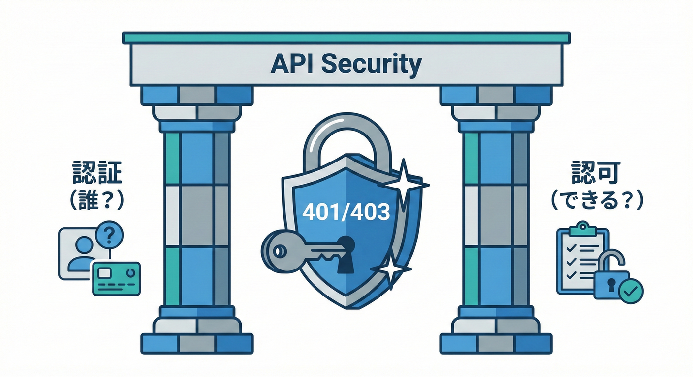
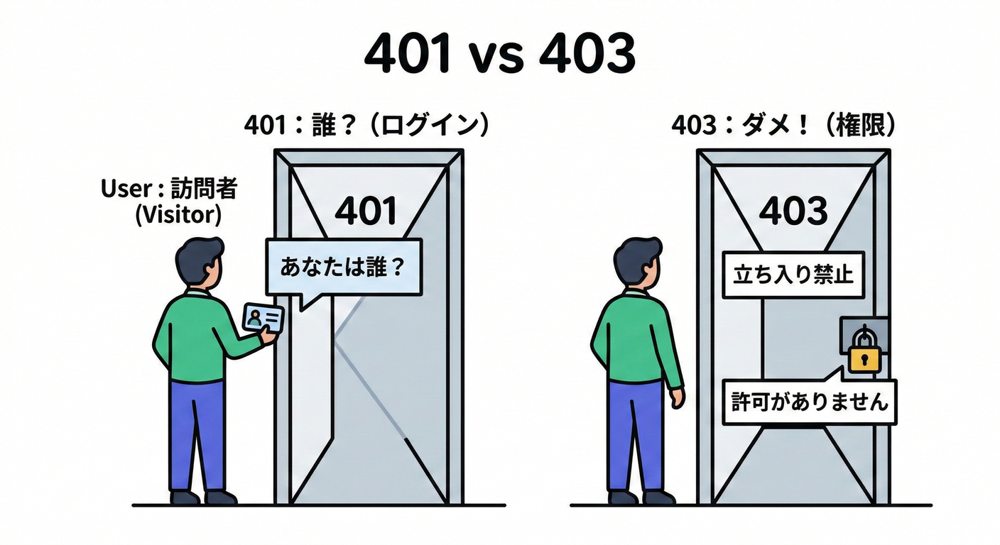
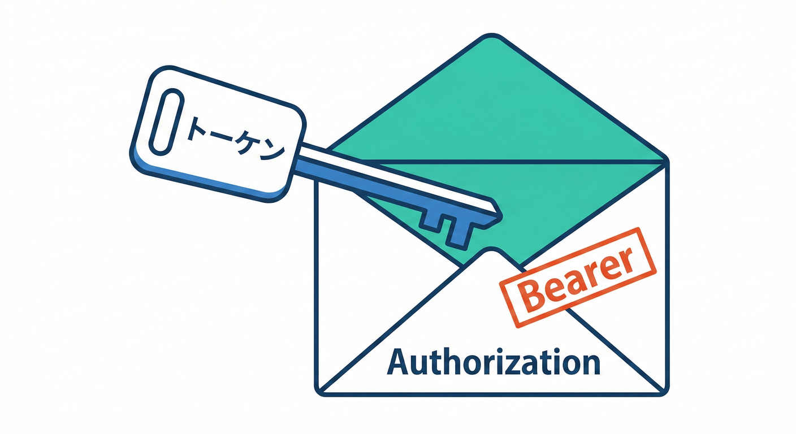
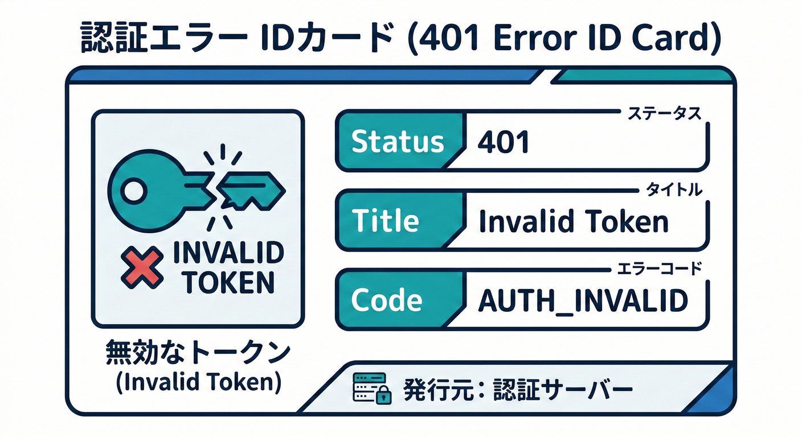
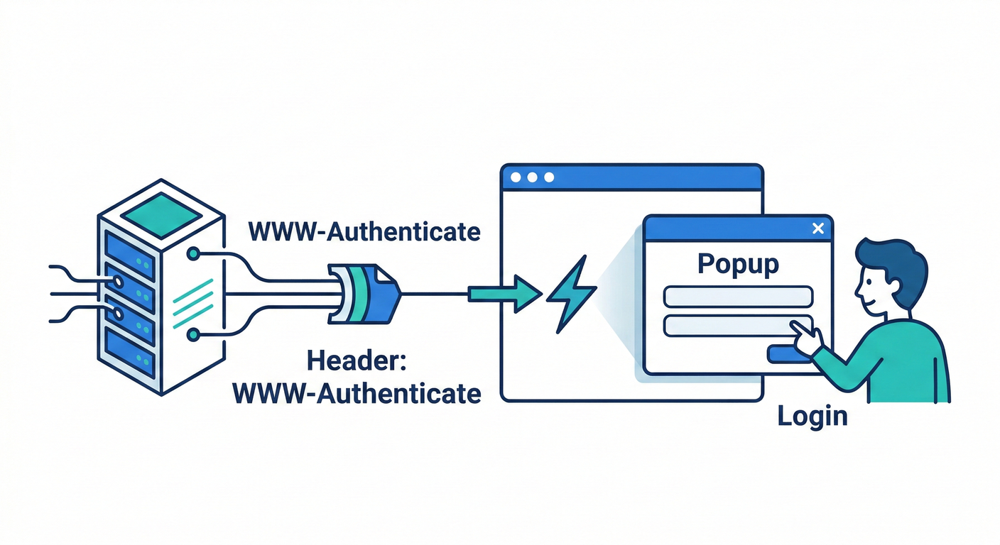
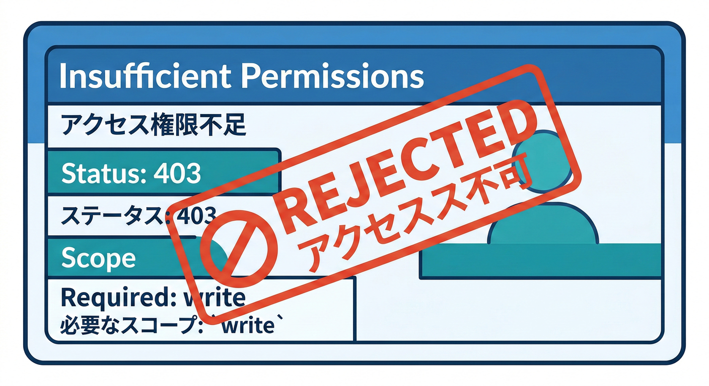
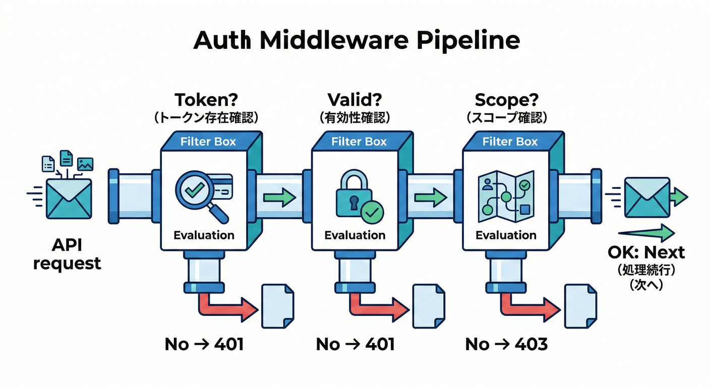
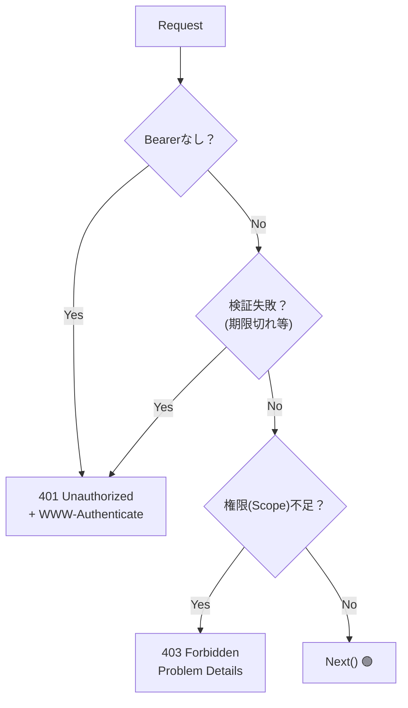
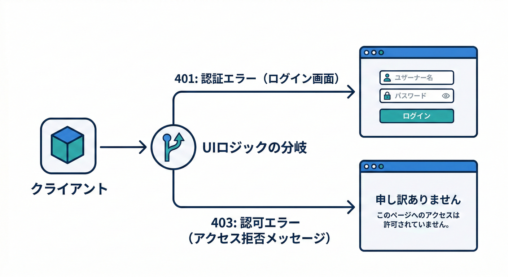

# 第23章：HTTP API契約②：認証とエラーの契約🔐📣



## ねらい🎯✨

この章では「認証（ログイン的なやつ）🔑」と「エラー（困った時の返し方）🚨」を、**APIの“契約”としてカチッと統一**できるようにするよ〜！🧡

---

## 23.1 まず大事：認証(Authentication)と認可(Authorization)は別モノ💡👀



* **認証（Authentication）🔑**
  「あなた誰？」を確かめる（トークン持ってる？本物？期限切れ？など）

* **認可（Authorization）🎫**
  「その人に、それやる権限ある？」を確かめる（adminだけOK、とか）

この区別ができると、**401/403の使い分け**が一気にクリアになるよ✨

---

## 23.2 ステータスコードの“約束”を固定しよう📌🔢

## ✅ 401 Unauthorized：認証できてない（または認証情報が無効）

* **認証情報が足りない / 無効**なとき
* 401を返すとき、サーバは **`WWW-Authenticate` ヘッダー必須**だよ📣（HTTPのルール） ([RFCエディタ][1])

例：

* トークン未送信
* トークン期限切れ
* トークン壊れてる
* 署名検証できない

## ✅ 403 Forbidden：認証はできたけど、権限がない🙅‍♀️

* 「あなたが誰か」は分かるけど
  **その操作は許可できない**とき

HTTP仕様でも、403は「分かってるけど拒否する」って意味だよ〜🚪✋ ([RFCエディタ][1])

---

## 23.3 Bearerトークンの“送る場所”を契約にする📮🪪



よくある契約はこれ👇

* リクエストヘッダに
  `Authorization: Bearer <access_token>`

Bearerトークンは「持ってる人が使えちゃう」性質なので、**漏れたら終わり**🥶
だから **保存・転送の漏洩対策が超大事**って明記されてるよ ([IETF Datatracker][2])

## 🚫 やっちゃダメ寄り：URL（クエリ）にトークンを入れる

URLは履歴・ログ・リファラ等で漏れやすいので、**BearerはURLに載せない推奨**だよ⚠️ ([IETF Datatracker][2])

---

## 23.4 OAuthの“いま”っぽい前提（超ざっくり）🧠✨

* **OAuth 2.1** は、OAuth 2.0の現代運用をまとめ直して、
  2.0のRFC（6749/6750）を置き換える方向の仕様として整理されてるよ📚 ([IETF Datatracker][3])
* セキュリティの「今どきの推奨」は **RFC 9700（Best Current Practice）** にまとまってる🛡️ ([IETF Datatracker][4])

この章のゴールは「OAuthフロー完全理解」じゃなくて、
**API側の契約として“認証エラーをどう返すか”を固定する**ことだよ🧡

---

## 23.5 エラー形式を統一する：Problem Details（RFC 9457）を採用しよう🧾✨

APIのエラーって、バラバラだと地獄…😵‍💫
だから **エラーJSONの標準フォーマット**として **RFC 9457** があるよ！（7807を置き換え） ([RFCエディタ][5])

## ✅ Content-Type はこれ

* `application/problem+json` ([RFCエディタ][5])

## ✅ だいたい使う“基本メンバー”🎁

* `type`：エラー種別を表すURI（省略すると `about:blank` 扱い） ([RFCエディタ][5])
* `title`：短いタイトル
* `status`：HTTPステータス（入れておくと親切）
* `detail`：人間向け説明（ログにも便利）
* `instance`：そのエラーの発生IDっぽいもの（サポート用） ([RFCエディタ][5])

RFCの例もこんな感じ（403の例）で出てるよ〜🧾 ([RFCエディタ][5])

---

## 23.6 「認証＆権限」まわりのエラー契約テンプレ📐🔐

ここがこの章のメインだよ〜！！📣✨
**認証・権限エラーは“誰が実装しても同じ形”**にしよう💪

## A) 認証失敗（401）テンプレ🔑❌



### HTTP



* Status: `401`
* Header: `WWW-Authenticate` を必ず付ける ([RFCエディタ][1])

### Problem Details（例）

* `type`: `https://api.example.com/problems/auth/invalid-token`
* `title`: `"Invalid access token"`
* `status`: `401`
* `detail`: `"Token is expired or invalid."`
* `instance`: `"urn:request:<id>"`（requestIdでもOK）
* 拡張フィールド（おすすめ）：

  * `code`: `"AUTH_INVALID_TOKEN"`
  * `traceId`: `"..."`

### Bearerの標準エラー値（覚えておくと強い）🧠

Bearer周りは仕様に **error値**があるよ（例：`invalid_request` / `invalid_token` / `insufficient_scope`） ([IETF Datatracker][2])

---

## B) 権限不足（403）テンプレ🎫❌



### HTTP

* Status: `403`

### Problem Details（例）

* `type`: `https://api.example.com/problems/auth/insufficient-scope`
* `title`: `"Insufficient permissions"`
* `status`: `403`
* `detail`: `"Required scope: write:orders"`
* `instance`: `"urn:request:<id>"`
* 拡張フィールド：

  * `code`: `"AUTH_INSUFFICIENT_SCOPE"`
  * `requiredScopes`: `["write:orders"]`

---

## 23.7 “契約として書く”とこうなる📝✨（仕様テンプレ）

API仕様書（OpenAPIでも社内Wikiでも）に、最低これを固定しよ〜📌

* 認証方式：`Authorization: Bearer <token>`
* 認証が必要なエンドポイント一覧（or 原則：全部必要、例外だけ列挙）
* 401の返し方：

  * `WWW-Authenticate` 必須
  * `application/problem+json`
  * `type/title/status/detail/instance` を基本とする
  * `code/traceId` の拡張を採用
* 403の返し方：

  * 401と同じProblem Details形式
  * `requiredScopes` などを拡張で返す（任意）

---

## 23.8 TypeScript 実装例（ミニ）🧩✨

## 1) エラーをProblem Detailsで返すヘルパー🧾

```ts
type ProblemDetails = {
  type?: string;
  title?: string;
  status?: number;
  detail?: string;
  instance?: string;

  // 拡張フィールド（自由に追加OK）
  code?: string;
  traceId?: string;
  requiredScopes?: string[];
};

function problem(
  status: number,
  body: ProblemDetails,
  opts?: { wwwAuthenticate?: string }
) {
  return {
    status,
    headers: {
      "Content-Type": "application/problem+json; charset=utf-8",
      ...(opts?.wwwAuthenticate ? { "WWW-Authenticate": opts.wwwAuthenticate } : {}),
    },
    body: JSON.stringify({ status, ...body }),
  };
}
```

## 2) 認証チェック（超ざっくり）🔐

```ts
function getBearerToken(authHeader: string | undefined): string | null {
  if (!authHeader) return null;
  const [scheme, token] = authHeader.split(" ");
  if (scheme?.toLowerCase() !== "bearer") return null;
  if (!token) return null;
  return token;
}

// 例：トークン検証の結果（本物っぽい形だけ）
type VerifyResult =
  | { ok: true; userId: string; scopes: string[] }
  | { ok: false; reason: "missing" | "invalid" | "expired" };

function verifyAccessToken(token: string): VerifyResult {
  // 本物の実装では署名検証や失効チェックなどをするよ
  if (token === "expired") return { ok: false, reason: "expired" };
  if (token === "bad") return { ok: false, reason: "invalid" };
  return { ok: true, userId: "u_123", scopes: ["read:orders"] };
}
```

## 3) 401 / 403 を統一して返すイメージ🚦



（Expressっぽい擬似コード）

```ts
function authMiddleware(req: any, res: any, next: any) {
  const token = getBearerToken(req.headers["authorization"]);
  if (!token) {
    const r = problem(401, {
      type: "https://api.example.com/problems/auth/missing-token",
      title: "Missing access token",
      detail: "Send Authorization: Bearer <token>.",
      code: "AUTH_MISSING_TOKEN",
      traceId: req.id,
    }, {
      wwwAuthenticate: 'Bearer realm="api", error="invalid_request"',
    });
    res.status(r.status).set(r.headers).send(r.body);
    return;
  }

  const v = verifyAccessToken(token);
  if (!v.ok) {
    const r = problem(401, {
      type: "https://api.example.com/problems/auth/invalid-token",
      title: "Invalid access token",
      detail: "Token is expired or invalid.",
      code: v.reason === "expired" ? "AUTH_EXPIRED_TOKEN" : "AUTH_INVALID_TOKEN",
      traceId: req.id,
    }, {
      wwwAuthenticate: 'Bearer realm="api", error="invalid_token"',
    });
    res.status(r.status).set(r.headers).send(r.body);
    return;
  }

  // req.user に詰めて後段へ
  req.user = v;
  next();
}

function requireScope(required: string) {
  return (req: any, res: any, next: any) => {
    const scopes: string[] = req.user?.scopes ?? [];
    if (!scopes.includes(required)) {
      const r = problem(403, {
        type: "https://api.example.com/problems/auth/insufficient-scope",
        title: "Insufficient permissions",
        detail: `Required scope: ${required}`,
        code: "AUTH_INSUFFICIENT_SCOPE",
        requiredScopes: [required],
        traceId: req.id,
      });
      res.status(r.status).set(r.headers).send(r.body);
      return;
    }
    next();
  };
}
```

ポイントはここだよ👇💕

* 401は `WWW-Authenticate` を付ける（HTTPのルール） ([RFCエディタ][1])
* Bearerの `error="invalid_token"` / `error="invalid_request"` などを使うと、クライアントが判断しやすい🧠 ([IETF Datatracker][2])
* ボディはProblem Details（RFC 9457）で統一🧾 ([RFCエディタ][5])



---

## 23.9 クライアント側（fetch）の扱い方🍪🌐



## ✅ クライアントの基本行動ルール

* **401**：認証情報がダメ
  → ログインやトークン更新（refresh）を検討
* **403**：権限がない
  → 画面上で「権限がないよ」って案内（自動リトライしない）

```ts
async function callApi() {
  const res = await fetch("https://api.example.com/orders", {
    headers: { Authorization: "Bearer " + "expired" },
  });

  if (res.ok) return res.json();

  const contentType = res.headers.get("content-type") ?? "";
  if (contentType.includes("application/problem+json")) {
    const p = await res.json();
    if (res.status === 401) {
      // 例：再ログインやトークン更新導線へ
      throw new Error(`401: ${p.code ?? p.title}`);
    }
    if (res.status === 403) {
      throw new Error(`403: ${p.code ?? p.title}`);
    }
  }

  throw new Error(`HTTP ${res.status}`);
}
```

---

## 23.10 ミニ演習🎮📝

## 演習1：認証エラー表を作ろう📋✨

次を埋めてみてね👇

* 401（未ログイン/期限切れ/不正）で返す `type` と `code`
* 403（権限不足）で返す `type` と `code`
* `detail` は「利用者が次に何をすべきか」まで書く💡

例：

* `AUTH_MISSING_TOKEN` → 「AuthorizationヘッダにBearerを付けてね」
* `AUTH_EXPIRED_TOKEN` → 「更新して再試行してね」

## 演習2：Problem Detailsに“拡張フィールド”を1つ足す🎁

おすすめはどれかを追加👇

* `traceId`（ログと突合できる）
* `errors`（バリデーションで使うやつ）
* `requiredScopes`（403のとき神）

---

## 23.11 AI活用（そのままコピペOK）🤖💬✨

* 「このAPIの401/403のエラー契約（type/code/detail）を提案して。利用者が次に何をすべきかまで書いて」🧾💡
* 「RFC 9457のProblem Detailsを前提に、うちのAPI向けのエラー形式テンプレ（拡張フィールド込み）を作って」📦✨
* 「このエンドポイントに必要なscope設計案を出して。最小権限でお願い」🛡️🎫
* 「401と403の使い分けがブレないように、判断フローチャートを文章で作って」🧠📌

[1]: https://www.rfc-editor.org/rfc/rfc9110.html "RFC 9110: HTTP Semantics"
[2]: https://datatracker.ietf.org/doc/html/rfc6750 "
            
                RFC 6750 - The OAuth 2.0 Authorization Framework: Bearer Token Usage
            
        "
[3]: https://datatracker.ietf.org/doc/draft-ietf-oauth-v2-1/ "
            
    
        draft-ietf-oauth-v2-1-14 - The OAuth 2.1 Authorization Framework
    

        "
[4]: https://datatracker.ietf.org/doc/rfc9700/ "
            
        RFC 9700 - Best Current Practice for OAuth 2.0 Security

        "
[5]: https://www.rfc-editor.org/rfc/rfc9457.html "RFC 9457: Problem Details for HTTP APIs"
