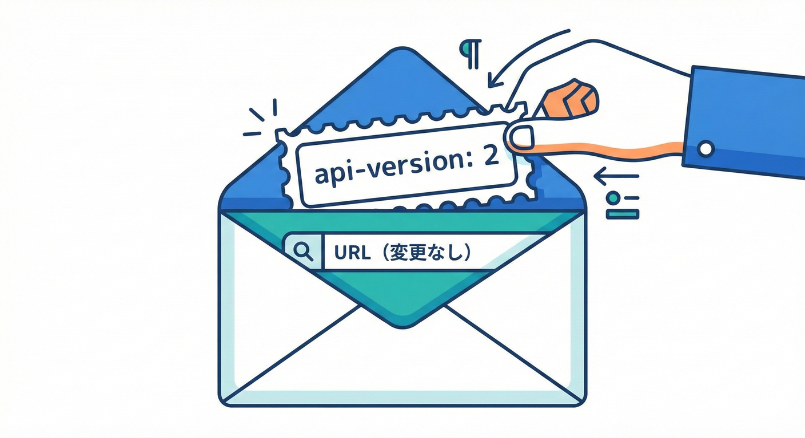
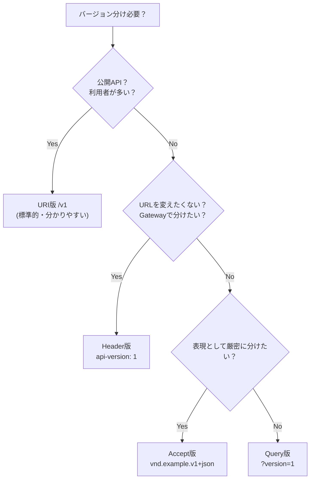

# 第24章：APIバージョニング①：戦略の選び方（URL/ヘッダ等）🧭🔁


## この章でできるようになること 🎯✨

* 「そもそもバージョン分けが必要か？」を判断できる ✅
* **URL / クエリ / ヘッダ / Media Type（Accept）** の代表4方式を、メリデメ込みで説明できる 📚
* 自分のAPIに合う方式を、**判断軸（運用・移行・キャッシュ・見つけやすさ）**で選べる 🧠
* TypeScriptで「バージョン指定して呼ぶ」リクエスト例を書ける ✍️💻

---

## 0) まず最初に：バージョニングは「最後の手段」にしよ？🧯💡

APIって、できるだけ **同じバージョンのまま進化（Evolve）**できると運用がラクだよ〜！🌱
例えばこういう変更は、基本「壊れにくい」ので**バージョンを増やさず**に済むことが多いよ👇✨ ([Redocly][1])

* フィールドを **追加**（しかも任意にする）➕
* 新しいエンドポイントを **追加** ➕🌐
* 既存の挙動を変えずに、レスポンスに情報を **足す** 🧾➕

逆に、こういうのは「破壊的変更」になりやすいから、**バージョン分けを検討**する感じ👇😵‍💫💥

* フィールド削除 🗑️
* 型変更（string → number など）🔁
* 意味変更（同じ値なのに意味が変わる）🌀
* エラー形式を別物にしちゃう 😭

---

## 1) 代表4方式をざっくり把握しよう 🧭✨

ここからは「どうやってバージョンを表現するか？」の話だよ〜💖
代表はこの4つ👇（実務でもよく出る！）

1. **URI（URLパス）**：`/v1/...`
2. **Query（クエリ）**：`...?version=1`
3. **Header（カスタムヘッダ）**：`api-version: 1`
4. **Media Type（Acceptヘッダ）**：`Accept: application/vnd...v1+json`

Microsoft の設計ガイドでも、この4つの比較が整理されてるよ。([Microsoft Learn][2])

---

## 2) 選び方の判断軸（これだけ持って帰って🎁✨）

方式選びは「好み」じゃなくて、だいたいこの軸で決まるよ👇💡

* **見つけやすさ**：URL見ればバージョンが分かる？🔍
* **キャッシュ/CDN相性**：同じリクエストが同じキャッシュキーになる？🧊
* **クライアント実装のラクさ**：呼ぶ側がミスりにくい？🧠
* **運用のしやすさ**：監視・ログでバージョン別に追える？📈
* **ドキュメント/SDKの作りやすさ**：説明がシンプル？📚
* **ゲートウェイ/プロキシ制約**：ヘッダで通せる？書き換えされない？🚧

---

## 3) 方式別：メリデメと向いてる場面 🧁📌

### A) URI（URLパス）版：`/v1/...` 🛣️✨

例：`GET https://api.example.com/v1/customers/3`

**いいところ 🥰**

* URL見ただけで分かる（ドキュメントも書きやすい）📚🔎
* キャッシュしやすい（URLがバージョンで分かれる）🧊 ([Microsoft Learn][2])

**つらいところ 🥲**

* バージョンが増えるほど、サーバ側のルーティングが増えてゴチャつきがち 🧩
* リンク（HATEOAS）をやるなら、リンクにもバージョンが混ざって大変になることがあるよ〜💦 ([Microsoft Learn][2])

**向いてる 🙆‍♀️**

* 公開APIで「分かりやすさ」最優先 👀
* CDNやキャッシュを効かせたい 🌬️🧊
* 多数の利用者がいる（説明コストを下げたい）📣

ちなみに Google のAPI方針では「RESTはURIパスの先頭に **v1** のような**メジャーバージョン**を入れる」運用が基本だよ（しかも **v1.1 みたいな小数は出さない**）。([Google AIP][3])

---

### B) Query（クエリ）版：`...?version=1` 🧷

例：`GET https://api.example.com/customers/3?version=2`

**いいところ 🥰**

* 「同じリソースは同じURIで」って意味的にはスッキリしやすい（好む人もいる）🧠 ([Microsoft Learn][2])
* 仕組みとして実装が単純なことが多い 🛠️

**つらいところ 🥲**

* 古いブラウザやプロキシで、**クエリ付きのキャッシュが効かない**ケースがあると言及されてるよ😢 ([Microsoft Learn][2])
* 監視やドキュメント上で「バージョンがパッと見えにくい」ことも 🙈

**向いてる 🙆‍♀️**

* すでに「api-version=...」文化がある（例：サービス仕様で固定されてる）
* 内部APIで、利用者が少なくて統制できる 🏢

---

### C) Header（カスタムヘッダ）版：`api-version: 1` 🧾✨



URLは変えず、リクエストヘッダでバージョンを伝える方法だよ💡
例：`GET /customers/3` + `Custom-Header: api-version=2`（例として紹介されてる）([Microsoft Learn][2])

**いいところ 🥰**

* URLがスッキリ（見た目がきれい）🧼
* 既存URLを変えずに運用できる ✅ ([Microsoft Learn][2])

**つらいところ 🥲**

* 呼ぶ側がヘッダを付け忘れる事故が起きやすい（デフォルトをどうするか要設計）😵‍💫 ([Microsoft Learn][2])
* キャッシュ設計が難しくなることがある（同じURLでもヘッダで中身が変わるから）🧊🌀 ([Microsoft Learn][2])

**向いてる 🙆‍♀️**

* URLを固定したい（ルーティングを変えたくない）🧱
* APIゲートウェイでヘッダ分岐が得意 🧰
* 監視・ログにバージョンヘッダを確実に残せる 📝

補足：Microsoft のストレージ系APIでは「リクエストごとにバージョンを明示する」設計が推奨として書かれてるよ（思想として参考になる）📌 ([Microsoft Learn][4])

---

### D) Media Type（Accept）版：`Accept: application/vnd...v1+json` 🍱✨

例：`Accept: application/vnd.contoso.v1+json`（例として紹介）([Microsoft Learn][2])

**いいところ 🥰**

* HTTPの「コンテンツネゴシエーション」の考え方に沿っている 📦
* HATEOASと相性が良い（リンクにMIMEタイプを含められる）🌐🧷 ([Microsoft Learn][2])

**つらいところ 🥲**

* サーバ側の実装がちょい面倒（Accept解析→適切な表現を返す）🧩 ([Microsoft Learn][2])
* 指定が合わないと **406 Not Acceptable** を返す設計になる場合があるよ 🥺 ([Microsoft Learn][2])
* これもキャッシュが難しくなることがある（ヘッダで中身が変わる）🧊🌀 ([Microsoft Learn][2])
* そもそもAccept/Content-TypeなどHTTPの表現ルールは IETF の仕様（RFC 9110）に基づいてるよ📜 ([RFCエディタ][5])

**向いてる 🙆‍♀️**

* 「リソースは同じ、表現（representation）が違う」って分け方がしたい 🧠
* メディアタイプをきっちり管理できるチーム 🧑‍🍳

---

## 4) 迷ったらこれ！ざっくり決定フロー 🧭✨

* **公開APIで、利用者が多い** → まず **URI版（/v1）** が無難 💖
* **URLを変えたくない／ゲートウェイで分岐したい** → **Header版** 👍
* **表現（MIME）として厳密に分けたい** → **Accept（Media Type）版** 🍱
* **歴史的事情でクエリ固定** → **Query版**（ただし注意点は理解して使う）⚠️

Redocly の整理でも、**Pathは見える化とキャッシュ相性が強い**、**HeaderはREST寄りだけど見つけにくい**、**Queryはキャッシュ面の注意**って比較になってるよ。([Redocly][1])



---

## 5) TypeScriptで呼ぶ例（方式別）💻🌟

### A) URI（/v1）で呼ぶ 🛣️

```ts
const res = await fetch("https://api.example.com/v1/customers/3");
if (!res.ok) throw new Error(`HTTP ${res.status}`);
const data = await res.json();
console.log(data);
```

### B) Query（?version=2）で呼ぶ 🧷

```ts
const url = new URL("https://api.example.com/customers/3");
url.searchParams.set("version", "2");

const res = await fetch(url);
if (!res.ok) throw new Error(`HTTP ${res.status}`);
const data = await res.json();
console.log(data);
```

### C) Header（api-version: 2）で呼ぶ 🧾

```ts
const res = await fetch("https://api.example.com/customers/3", {
  headers: {
    "api-version": "2",
  },
});
if (!res.ok) throw new Error(`HTTP ${res.status}`);
const data = await res.json();
console.log(data);
```

### D) Media Type（Accept）で呼ぶ 🍱

```ts
const res = await fetch("https://api.example.com/customers/3", {
  headers: {
    Accept: "application/vnd.example.v1+json",
  },
});
if (!res.ok) throw new Error(`HTTP ${res.status}`);
const data = await res.json();
console.log(data);
```

---

## 6) ミニ演習：あなたのアプリに最適な方式を選ぼう ✍️🌸

次のチェックに答えて、最後に方式を1つ選んでね😊📝

### ステップ1：条件を書き出す 🧠

* 利用者は誰？（社内だけ？外部ユーザも？）👥
* クライアントは何種類？（Web/モバイル/バッチ…）📱🖥️
* キャッシュ/CDNを使う？🧊
* 旧バージョンを何か月残したい？⏳

### ステップ2：方式を仮決定する 🧭

* 見つけやすさ最優先 → URI
* URL固定したい → Header
* 表現として分けたい → Accept
* 事情があって… → Query

### ステップ3：理由を「判断軸」で説明する 📌

例）

* 「利用者が多いから、URLで見えるURI版」
* 「CDNでキャッシュしたいからURI版」
* 「URLは固定したいからHeader版」

---

## 7) AI活用プロンプト（コピペOK）🤖💖

* 「次の条件で、URI/Query/Header/Acceptのどれが最適？判断軸ごとに理由もつけて」
* 「このAPI変更は“バージョン増やすべき”？ “進化（非破壊）で吸収すべき”？判断して」 ([Redocly][1])
* 「Header版にした場合の“付け忘れ事故”を防ぐ設計（デフォルト、エラー、ログ）を提案して」
* 「Accept版にした場合、406の扱い（返す？デフォルトに落とす？）の方針案を作って」 ([Microsoft Learn][2])
* 「バージョン別の監視項目（利用率、移行率、エラー率）を、最低限セットで作って」

---

## 8) よくある落とし穴（先に潰そっ）🕳️💥

* **“小数バージョン地獄”**：`v1.1` とか増やすほど、運用も説明も地獄😇

  * 参考：Google は「外に見せるのは基本メジャー（v1）だけ」運用。([Google AIP][3])
* **同じURLでヘッダだけ変えるのにキャッシュ考えない**：想定外のデータが返って事故る🧊🌀 ([Microsoft Learn][2])
* **移行期間ゼロ**：旧クライアントが即死😵

  * 「同じアプリ内で新旧バージョン併存できる期間」「十分な告知＆Deprecation」が必要って方針もあるよ📣 ([Google AIP][3])

---

## まとめ 🎀✨

* まずは「非破壊な進化」で済ませられないかチェック 🌱 ([Redocly][1])
* 必要なら代表4方式（URI / Query / Header / Accept）から選ぶ 🧭 ([Microsoft Learn][2])
* 迷ったら「公開APIならURI（/v1）が無難」になりやすい 💖
* 方式を決めたら、次章で「旧版サポートと移行運用」をちゃんと設計して、炎上を防ぐよ〜🔥➡️🧯

[1]: https://redocly.com/blog/api-versioning-best-practices "API versioning best practices"
[2]: https://learn.microsoft.com/en-us/azure/architecture/best-practices/api-design "Web API Design Best Practices - Azure Architecture Center | Microsoft Learn"
[3]: https://google.aip.dev/185 "AIP-185: API Versioning"
[4]: https://learn.microsoft.com/en-us/rest/api/storageservices/versioning-best-practices "Versioning best practices (REST API) - Azure Storage | Microsoft Learn"
[5]: https://www.rfc-editor.org/rfc/rfc9110.html?utm_source=chatgpt.com "RFC 9110: HTTP Semantics"
