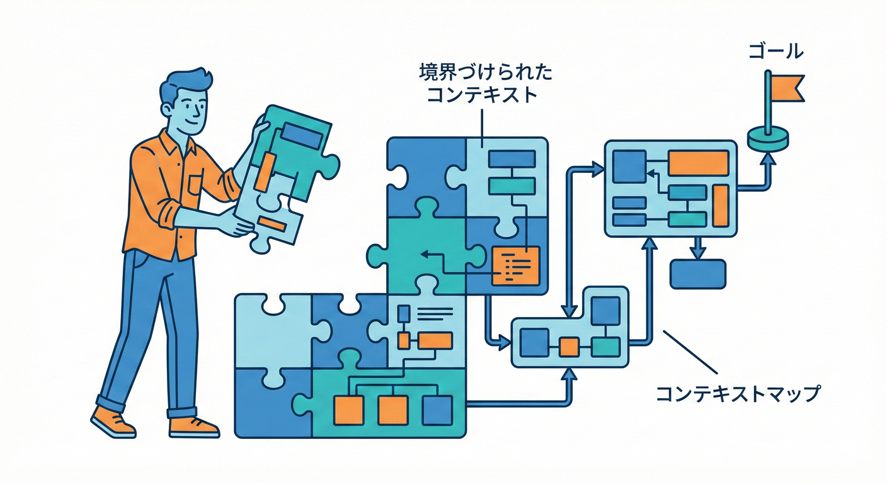
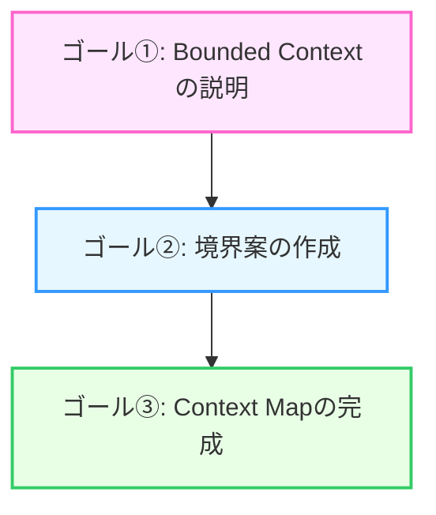
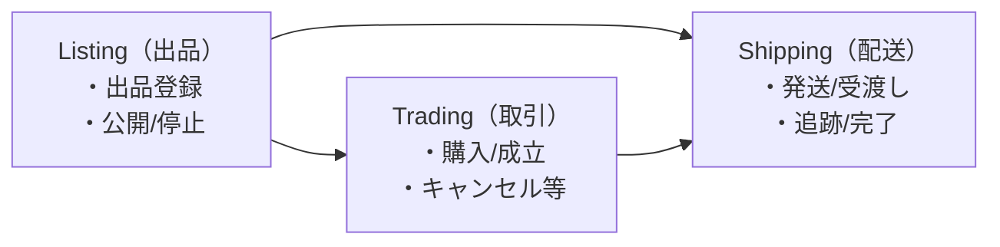
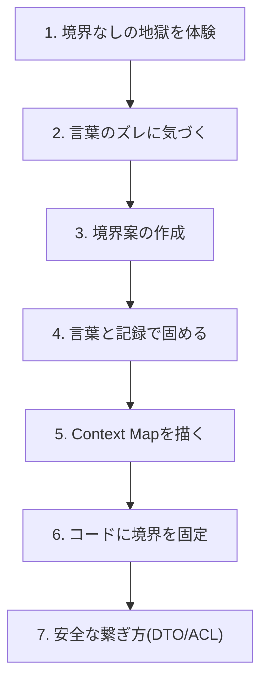

# 第1章 ゴールと進め方🎯😊

## この章でやること🧸✨

* この教材の**ゴール**（何ができるようになる？）を、最初にハッキリさせるよ🎯
* 題材のミニアプリ「学内フリマ🛍️」を紹介して、**どんな“言葉のズレ”が起きる世界なのか**をイメージするよ👀
* 最終的に作る「Context Map🗺️（境界の関係図）」の完成イメージを先に見て、ゴール地点を“見える化”するよ✨

---

## 1. この教材のゴール🎯🌸（できるようになること）

この教材を最後まで進めると、次の3つができるようになるよ😊✨

### ゴール①：Bounded Context（BC）を説明できる🗣️💡

* 「BCってなに？」と聞かれたら、**自分の言葉で**サクッと説明できる✨
* しかも、ふわっとじゃなくて「この例だとこう！」って**具体例つき**で言えるようになるよ🧠🛍️

### ゴール②：自分で“境界案”を作れる✂️🧩

* ひとつの正解を当てにいくんじゃなくて、
  **境界案をA/B/Cって複数出して、比べて、選べる**ようになるよ⚖️✨
* 「どこで分けると安全？」が考えられると、設計が急にラクになるよ😌💕

### ゴール③：Context Map（関係図）を完成させられる🗺️🤝

* BCを分けたあとに大事なのは、**“どう繋ぐか”**なんだよね🔗
* 最後には、BC同士の関係を ** 境界地図（Context Map）が自力で描けるようになる🗾✅
* **「境界を引けるエンジニア」** への一歩を踏み出す🚀





---

## 2. 題材：学内フリマ🛍️🏫（ミニアプリの世界）

イメージしやすいように、舞台は「学内フリマ」🎀
登場人物と目的はこんな感じだよ👇😊

### 登場人物🎭✨

* 出品する人（学生）📦
* 買う人（学生）🛒
* 運営（学内の係）🧾

### 起きること（ざっくり）📌

* 出品する：商品を登録して公開する📸📝
* 購入する：欲しい商品を選んで取引する💳（学内決済っぽい想定）
* 発送/受け渡し：学内の受け渡しや配送手配🚚📮
* 問い合わせ：トラブルや質問に対応する💬🆘

ここでポイントなのが…
**同じ単語が、場面によって意味がズレやすい**ってところ🌀
たとえば「ユーザー」って言葉ひとつでも、
出品のユーザー？購入のユーザー？運営のユーザー？で、欲しい情報が変わるんだよね🤔💡

---

## 3. 最終成果物の完成イメージ👀✨（ゴール地点を先に見る）

最後に「これができたら勝ち🎉」っていう完成セットを作るよ🎁✨

* Context Map（BCの関係図）🗺️
* 各BCの「責務・目的・非目的」メモ🎯🚫
* BCごとの用語集（ミニ辞書）📚🗣️
* “なぜこの境界？”を残すメモ（ADRミニ）🧾
* 境界を守るためのルール（importや公開APIのルール）🔒📁
* 外部/他BCのクセから守る翻訳ルール（ACLの考え方）🧼🛡️

ちなみに本日時点（2026/02/02）では、TypeScript の安定版ラインは 5.9.x で、npm の最新版は 5.9.3 が確認できるよ。([npm][1])
（この教材では安定版ラインを前提に進めて、ネイティブ系の話は後半で“未来の見通し”として軽く触れる感じだよ🌱）

---

## 4. Context Mapって、最終的にこういう絵🗺️✨（超ざっくり完成図）

まだ今は意味が全部わからなくてOK🙆‍♀️✨
「箱（BC）と矢印（関係）」で描くよ📦➡️📦

```text
┌──────────────┐        ┌──────────────┐
│ Listing（出品） │  ───▶  │ Trading（取引） │
│ ・出品登録       │        │ ・購入/成立       │
│ ・公開/停止       │        │ ・キャンセル等     │
└──────────────┘        └──────────────┘


           │                         │
           │                         ▼
           │                ┌──────────────┐
           └──────────────▶ │ Shipping（配送）│
                            │ ・発送/受渡し    │
                            │ ・追跡/完了       │
                            └──────────────┘
```

* **箱の中では、言葉の意味がブレない**（これがBCの感覚）🧱✨
* 矢印は「データや依頼が行き来する」イメージ🔗
* 「どう繋ぐか」をちゃんと決めると、境界が壊れにくくなるよ😊🛡️

---

## 5. この教材の進み方🗺️🌸（迷子にならない地図）

大きくは、この流れで進むよ🧸✨

1. まず“境界がないと地獄”を体験😇➡️😱
2. “同じ言葉、別の意味”に気づく🗣️🌀
3. 境界候補を材料から作る✂️🔎
4. 決めた境界を「言葉」と「記録」で固める📚🧾
5. Context Mapで関係を描く🗺️🤝
6. フォルダ/公開APIで境界をコードに固定📁🔒
7. 境界を越えるときの安全な繋ぎ方（DTO/ACL）🧼🔗



---

## 6. AI相棒の使いどころ🤖💡（ズルじゃないよ、武器だよ）

この教材は「AI導入済み」前提だから、こういう場面でガンガン使うよ✨

* 用語の候補を出してもらう（用語集づくり）📚✨
* 境界案A/B/Cを追加提案してもらう（発散）🌈
* 「この境界、危ない依存ある？」をチェックしてもらう👀✅
* READMEや手順の下書きを作ってもらう📄🤝

ただし！AIは便利だけど、IDE連携系のAIは“指示の混入”みたいな攻撃（いわゆるプロンプトインジェクション）や、拡張の扱い方によってはリスクが話題になることもあるよ⚠️🧯
なので「外から来たファイルの指示をうっかり実行しない」「よくわからないコマンドは自分で確認」みたいな安全運用は大事だよ🛡️([Tom's Hardware][2])

---

## 7. この章のミニワーク📝✨（5〜10分でOK）

いまは肩の力を抜いて、準備運動だよ😊🌸

### ワーク①：学内フリマで“起きそうなズレ”を1つ書く🌀

例：

* 「ユーザー」って言ったとき、出品者と購入者で意味が違いそう…とか👀

### ワーク②：ゴールを1行で書く🎯

例：

* 「BCを説明できて、境界案を作れて、Context Mapを描けるようになる！」✨

### ワーク③：AIに聞くテンプレ🤖（コピペしてOK）

```text
学内フリマの例で、「同じ言葉が別の意味になって衝突しそうな単語」を10個出して。
それぞれ、出品/取引/配送/運営 で意味がどう変わるかも一言で。
```

---

## 8. ここまでのチェック✅😊

* 学内フリマの世界をなんとなく想像できた🏫🛍️
* この教材のゴールを1行で言える🎯
* 最後に作る“関係図（Context Map）”の雰囲気が見えた🗺️✨

次の章から、さっそく「境界がないと地獄😱」を安全に体験していくよ〜🧸💥

[1]: https://www.npmjs.com/package/typescript?utm_source=chatgpt.com "TypeScript"
[2]: https://www.tomshardware.com/tech-industry/cyber-security/researchers-uncover-critical-ai-ide-flaws-exposing-developers-to-data-theft-and-rce?utm_source=chatgpt.com "Critical flaws found in AI development tools are dubbed an 'IDEsaster' - data theft and remote code execution possible"
