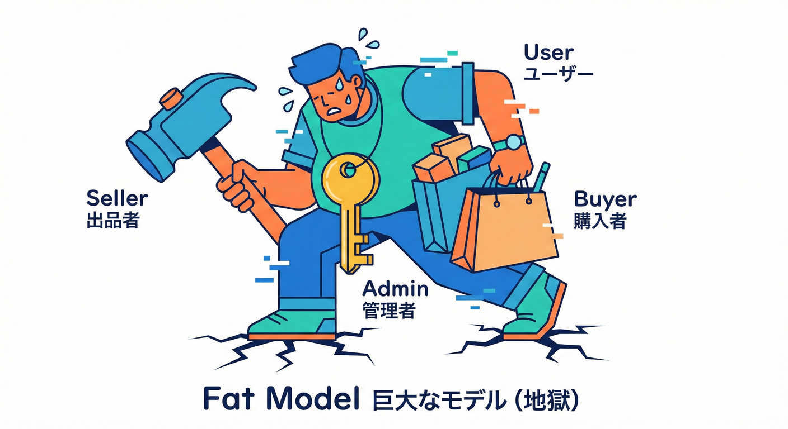
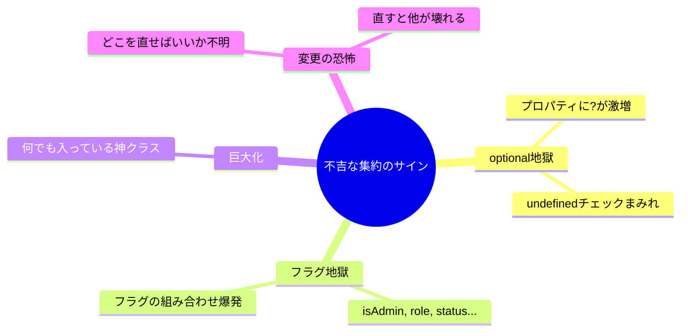
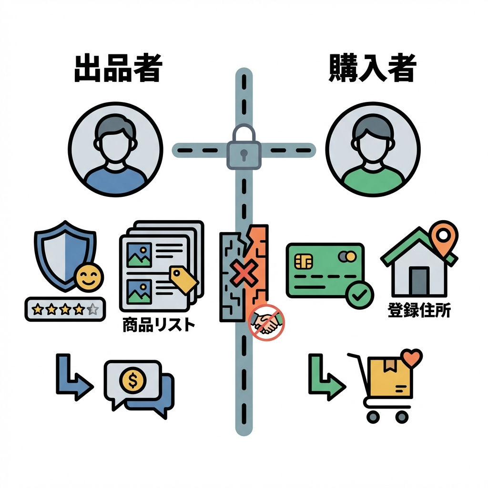
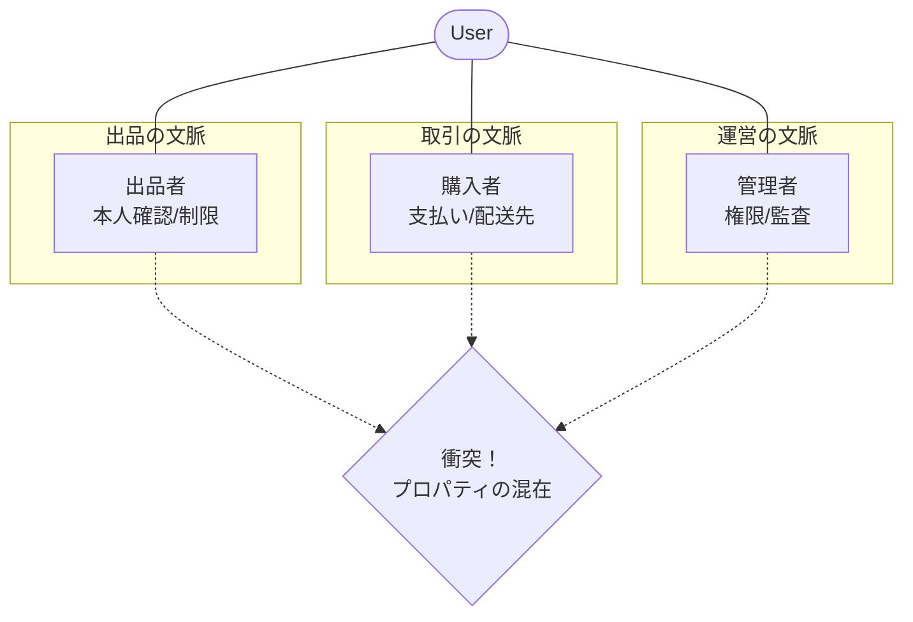
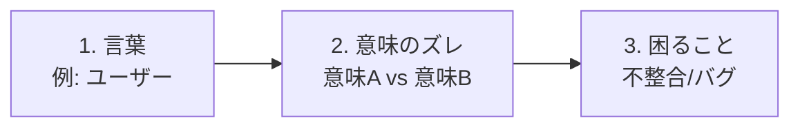

# 第2章 まずは “境界がないと地獄” を体験😇➡️😱

## この章のゴール🎯✨

* 「全部ひとつモデル（なんでも `User`）」が、どうして壊れやすいのかを**体感**する😱💥
* “同じ言葉が衝突する” って、具体的にどう困るの？を**説明できる**ようになる🗣️🧠
* 最後に「衝突リスト（何が混ざって困る？）」を自分で作る📝✨

---

## 1. まず最初に：学内フリマの “あるある地獄” を見よう🏫🛍️

学内フリマって、ぱっと見シンプルだけど…
登場人物が増えると、**同じ言葉が別の意味**になりがちだよ〜😵‍💫🌀

たとえば「ユーザー」って言葉ひとつ取っても…

* 出品する人（出品者）📦
* 買う人（購入者）🛒
* 困ったら問い合わせる人（問い合わせ者）📩
* 不正をチェックする人（運営/管理者）🛡️

……ぜんぶ「ユーザー」でいい？ 🤔
**ぜんぜん良くない**ことが多いの😇💥（ここがBCの入り口！）

---

## 1. 1本道の限界：1つのモデルを全員で使う😵‍💫💥



まず、Bounded Context（BC）を意識せずに「とりあえず User クラス」を作った時の事故を見てみよう〜😊
「とりあえず `User` 型を1個作って全部に使お〜」ってやると、最初は早い✨
でも、すぐこうなる👇😱

* プロパティが増殖する📈😵
* `isAdmin` とか `role` とかフラグ地獄🚩🚩🚩
* 「この画面では必須」「こっちでは不要」が混ざって **optional地獄** (`?` だらけ) 🌀
* 例外・分岐・テストが爆発する💥🧪



## 万能 `User` の例（“混ぜた結果”）🧨

```ts
// 地獄の入口：全部入りUser 😇➡️😱
export type User = {
  id: string;
  name: string;

  // 購入者っぽい情報
  shippingAddress?: string;     // 購入者は必要、出品者は不要…のはず
  paymentMethod?: "card" | "cash";

  // 出品者っぽい情報
  sellerLevel?: "bronze" | "silver" | "gold";
  bankAccount?: string;

  // 運営っぽい情報
  isAdmin?: boolean;
  adminPermissions?: string[];

  // なんか色々
  banned?: boolean;
};
```

これ、**今は**「便利〜💕」って思っちゃう。
でもね、次にこういう機能が来た瞬間に詰むよ😇

* 「出品者だけ本人確認が必要です」🪪
* 「購入者だけ住所が必須です」🏠
* 「運営だけBAN解除できます」🔓
* 「購入者の支払いはカードのみになりました」💳

全部 `User` に足す？
うん、足した瞬間から **衝突の始まり** です😱💥

---

### 2.1 なぜUserが巨大になるのか？🦖💥



想像してみてほしい。ひとつの巨大な「User」クラスがあって…

同じ「ユーザー」でも、文脈が違うと意味が変わるよね👇

* 出品の文脈のユーザー：**出品できる人**（出品枠/出品制限/本人確認…）📦
* 購入の文脈のユーザー：**買える人**（支払い/配送先/購入制限…）🛒
* 運営の文脈のユーザー：**管理できる人**（権限/監査/不正対応…）🛡️



この「意味が違うのに、同じ型で表現しようとする」のが事故の根っこだよ😵‍💫🌱
（BCの定義はまさに「用語とルールが一貫する範囲」って話に繋がるよ。([InfoQ][1])）

---

## 4. 事故が起きる瞬間：バグの匂いを嗅ぐ👃💣

## 4-1. “optional地獄” バグ（実例っぽいやつ）😱

購入の処理で「住所が必要」なのに、万能 `User` は `shippingAddress?` だから…

```ts
type Order = { id: string; buyer: User };

export function createOrder(order: Order) {
  // 本当は buyer.shippingAddress が必須なのに…
  const address = order.buyer.shippingAddress;

  // 住所がundefinedでも進んじゃう（または例外が飛ぶ）
  if (!address) {
    throw new Error("住所が未設定です"); // 例外だらけの世界へ💥
  }

  return { ...order, shippingAddress: address };
}
```

「じゃあ `shippingAddress` を必須にしよう！」ってすると、今度は
出品側の処理が「住所なんて知らんが？」ってなる😇🌀

## 4-2. “フラグ地獄” バグ🚩😵‍💫

役割が増えると、分岐が増える👇

```ts
export function canListItem(user: User): boolean {
  if (user.banned) return false;

  // 出品者っぽい条件が、購入者にも混ざる
  if (user.sellerLevel === "gold") return true;

  // 「本人確認済み」も足そう
  // 「出品枠」も足そう
  // 「学年」も足そう
  // …気づけば分岐まみれ😇
  return false;
}
```

こうなると、仕様変更が来たときに…

* どこを直せばいいか分からない😵
* 直したら別の機能が壊れる😱
* テストは増えるけど、何を守ってるか不明🧪🌀

**“変更が怖い” が常態化**するよ〜😇💥

---

## 5. 「衝突リスト」を作る📝✨（この章の成果物）

ここからが本番だよ〜🥳🎀
“同じ言葉が混ざって困るやつ” を、先に文字であぶり出すよ🔥

## 5-1. 衝突リストの作り方（超かんたん）🍰

次の3点セットで書くのがおすすめ📝✨

1. **言葉**（例：ユーザー）
2. **意味A / 意味B**（例：出品者 / 購入者）
3. **混ざると困ること**（例：必須項目が違う、ルールが違う）



## 5-2. 例：この章の衝突リスト（サンプル）🧾✨

* **ユーザー**

  * 意味A：出品者（本人確認、出品制限、振込情報…）📦
  * 意味B：購入者（住所、支払い、購入制限…）🛒
  * 混ざると困る：`User` が optional だらけになって、例外/分岐/バグが増える😱

* **ステータス**

  * 意味A：出品ステータス（出品中/停止/削除）📦
  * 意味B：取引ステータス（支払待ち/発送中/完了）📮
  * 混ざると困る：状態遷移がぐちゃぐちゃになり、矛盾が出る🚦💥

* **キャンセル**

  * 意味A：購入キャンセル（支払い前/後でルールが違う）🛒
  * 意味B：出品取り下げ（取引中は不可、など）📦
  * 混ざると困る：例外ケースが雪だるま式に増える⛄😇

---

## 6. ミニ演習✍️🧸（10分でOK）

## お題：学内フリマの “衝突しそうな言葉” を5個探す🔍✨

下のテンプレをコピペして埋めてみてね📝💕

```md
- 言葉：
  - 意味A：
  - 意味B：
  - 混ざると困ること：

- 言葉：
  - 意味A：
  - 意味B：
  - 混ざると困ること：
```

💡ヒント（探しやすいところ）

* 人を表す言葉（ユーザー、会員、出品者、購入者…）👤
* お金の言葉（価格、手数料、返金…）💰
* 状態の言葉（ステータス、完了、キャンセル…）🚦
* 書類/記録の言葉（取引、注文、履歴、通知…）📜

---

## 7. AIに手伝ってもらう🤖💕（質問テンプレつき）

「言葉の衝突」は、AIと相性めっちゃ良いよ〜😳✨
理由：**発想の幅（漏れ防止）**に強いから🧠💨

## 7-1. 衝突候補を増やすプロンプト🌈

```text
学内フリマを題材にしています。
「同じ言葉が別の意味になる」可能性がある用語を10個挙げてください。
各用語について、意味A/意味B と、混ざると起きる不具合例もセットで。
```

## 7-2. “万能User” の事故例を作らせるプロンプト🚑

```text
学内フリマで「Userを1種類に統一した設計」をしたときに起きがちなバグを、
具体的なシナリオで5個書いてください（例外、optional地獄、フラグ地獄など）。
```

## 7-3. 仕様変更で壊れるポイントを洗い出すプロンプト💥

```text
次の仕様変更が入るとき、万能なUserモデルが壊れる箇所を洗い出してください：
- 出品者は本人確認必須
- 購入者は住所必須
- 運営だけBAN解除可能
「どこに分岐やoptionalが増えるか」を中心に説明してください。
```

---

## 8. この章のまとめ🎀✨

* 「全部ひとつモデル」は最初ラクだけど、**用語とルールが混ざる**と一気に壊れやすくなる😇➡️😱
* 地獄のサインはこれ👇

  * optionalだらけ 🌀
  * フラグだらけ 🚩
  * 分岐だらけ 🧩
  * 変更が怖い 😵
* だから最初にやるべきは、コードを直す前に
  **“衝突リスト（言葉のズレ）” を作って見える化**すること📝✨
* BCは「用語とルールが一貫する範囲」を作って、衝突を隔離する考え方だよ🛡️([InfoQ][1])

---

## 参考（この教材の前提に関わる最新情報）🧷

* TypeScript の stable な最新ラインは 5.9 系で、npm の latest は 5.9.3。([npm][2])
* TypeScript 5.9 の主な変更点（例：`import defer` のサポート）は公式リリースノートにまとまってるよ。([typescriptlang.org][3])
* TypeScript 6.0/7.0（ネイティブ移行の流れ）は公式の進捗記事で方針が説明されているよ。([devblogs.microsoft.com][4])

[1]: https://www.infoq.com/news/2019/06/bounded-context-eric-evans/?utm_source=chatgpt.com "Defining Bounded Contexts — Eric Evans at DDD Europe"
[2]: https://www.npmjs.com/package/typescript?utm_source=chatgpt.com "TypeScript"
[3]: https://www.typescriptlang.org/docs/handbook/release-notes/typescript-5-9.html?utm_source=chatgpt.com "Documentation - TypeScript 5.9"
[4]: https://devblogs.microsoft.com/typescript/progress-on-typescript-7-december-2025/?utm_source=chatgpt.com "Progress on TypeScript 7 - December 2025"
