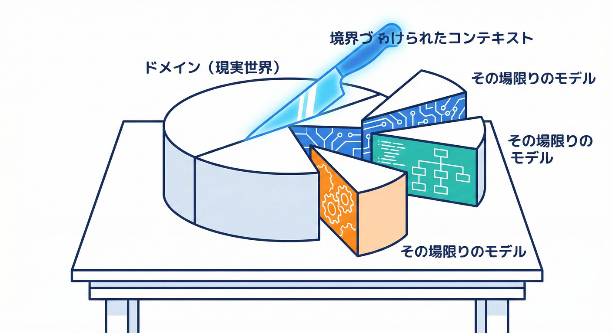
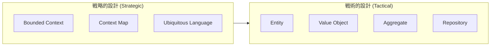
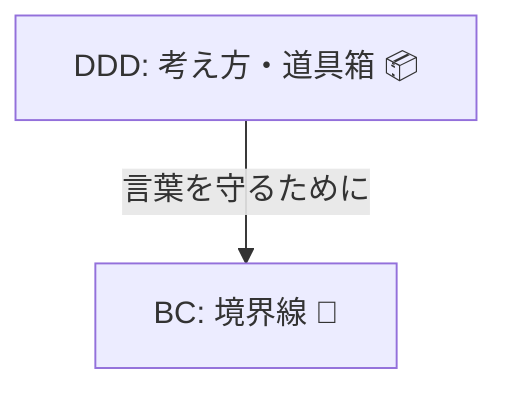
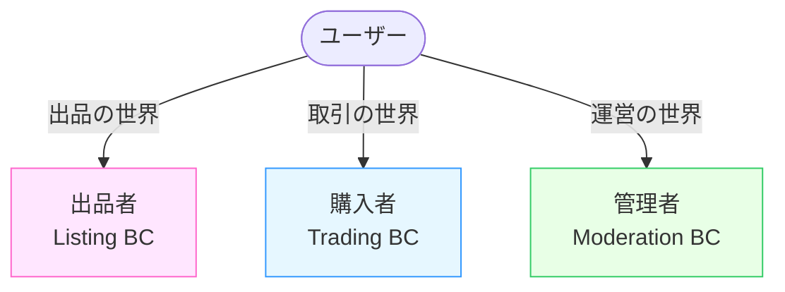

# 第3章 DDDとBCの関係（超やさしく）🧠🌱

## この章のゴール🎯✨

* **DDD（ドメイン駆動設計）**と**BC（Bounded Context / 境界づけられたコンテキスト）**の関係を、ふわっとじゃなく「説明できる」ようになる😊
* 学内フリマ🛍️の例で、「同じ言葉が衝突する」感じをつかむ💥
* 最後に、**BCとは何かを1〜2行で**自分の言葉にする✍️💖

---

## 1. DDDの地図（超シンプル）🗺️✨



「DDDって難しそう…」って思うかもしれないけど、大事なのはこの2つだけ！😊

* **現実世界（業務）の“言葉”と“ルール”を大事にして**
* **ソフトウェアの形を作っていく考え方**🧩

ポイントは「技術より先に、意味（ドメイン）を守る」ってところ🌱
DDDは“コーディングのテクニック集”っていうより、**チームで迷子にならないための道具箱**みたいな感じ📦✨

ちなみにDDDは大きく2つに分かれて語られることが多いよ👇

* **戦略（ストラテジック）**：大きい設計。どこで境界を切る？どこが別世界？🗺️
* **戦術（タクティカル）**：小さい設計。Entity/Value Objectとか、型やルールの作り方🧱



この章の主役は、戦略側のど真ん中にいる **BC** だよ🛡️✨

---

## 3-2. BC（Bounded Context）ってなに？🧱🛡️

BCはDDDの中心パターンのひとつで、ざっくり言うと…

✅ **「言葉（モデル）の意味がブレない範囲」を、はっきり区切ること**

たとえばDDDでは、大きいモデルを扱うときに **“モデルを分けて、関係を明確にする”**のが大事だよ、って考えるんだけど…
その分け方の代表がBC、ってイメージ🌸
（「DDDは大きなモデルをBCで分割し、相互関係を明確にする」って説明されるよ。）([martinfowler.com][1])

---

## 3-3. DDDとBCの関係を一言で🧠✨

ここ、超大事なのでスパッと言うね✂️💖

* **DDD＝ドメインを大事にして設計する“考え方・やり方”📚**
* **BC＝DDDでドメインの言葉を守るための“境界線”🧱**



つまり…

🌟 **DDDという大きな地図の中に、BCという「境界線の引き方」がある** 🗺️✨

BCがあると何がうれしいかというと👇

* 同じ単語でも意味が混ざらない🧠✨
* ルールの違う世界を、ムリに1つのモデルでまとめなくていい🙆‍♀️
* 変更が起きても「この境界の中だけ見ればいい」になりやすい🔧

---

## 3-4. 例：学内フリマで「同じ言葉」が衝突する🛍️💥

学内フリマの世界では、「ユーザー」って言葉が出てきそうだよね🙂
でも実は、“ユーザー”は1種類じゃないことが多いの🌀

### 例：「ユーザー」が3つに割れる🌪️

* **出品者（Seller）**：出品・在庫・発送準備などが関心ごと📦
* **購入者（Buyer）**：購入・支払い・受取・レビューなどが関心ごと🧾
* **運営（Admin）**：通報対応・規約・停止・監査などが関心ごと🛡️

このとき「ユーザー」という言葉を1つのクラスにまとめると…

* 欲しいデータが違うのに同居する
* ルールも違うのに同居する
* そのうち**“なんでもUser”**になって事故る😇➡️😱



そこでBCの出番✨

* 出品の世界（例：Listing）
* 取引の世界（例：Trading）
* 運営の世界（例：Moderation）

みたいに **“別世界”として区切って、それぞれの世界で言葉を固定する**🧱✨

---

## 3-5. TypeScriptでの超ミニ実演🧸💻

「同じUserでも、世界が違えば別物でOK」って感覚を、コードでちょい体験するよ😊

### ✅ 例：BCごとに“User”を別ファイルにする（概念だけ先取り）📁

```ts
// contexts/listing/User.ts（出品の世界）
export type User = {
  userId: string;
  nickname: string;
  // 出品者として必要な情報だけでOK
  canList: boolean;
};
```

```ts
// contexts/trading/User.ts（取引の世界）
export type User = {
  userId: string;
  displayName: string;
  // 購入者として必要な情報だけでOK
  paymentStatus: "ok" | "blocked";
};
```

ポイント🌟

* **同じ名前でも、ファイル（＝世界）が違えば意味も違っていい**🙆‍♀️
* 逆に、同じファイル・同じ世界で意味がブレるのが一番こわい😱

※ここでは“感覚をつかむ”のが目的だよ😊（本格的なフォルダ境界は後の章でしっかりやる📁✨）

---

## 3-6. 「BCとは何か」を1〜2行で書くテンプレ✍️💕

この章の成果物はこれ👇

### ✅ 書き方テンプレ（コピペして埋めてOK）📝

* **BCとは、［対象の世界］の中で、［言葉］の意味が［こう固定される］範囲のこと。**

### 記入例（学内フリマ）🛍️

* **BCとは、出品の世界の中で、「ユーザー」が“出品者としての意味”で固定される範囲のこと。**

---

## 3-7. よくある勘違い（やさしく潰す）🧯🙂

### ❌「BCって機能別に分けること？」

機能別っぽく見えることは多いけど、いつもそうとは限らないよ🌱
BCは「機能」よりも、**“モデルの意味がぶつからない範囲”**が基準になりやすい✨
（BCは機能領域だけで区切らなくてもよく、目的に応じて分割に使える…という話もあるよ。）([Microsoft Learn][2])

### ❌「BCってマイクロサービスのこと？」

BCは**設計上の境界**で、サービス分割と1対1になるとは限らないよ🧩
同じプロセス内でもBCは作れるし、後から分割の材料にもなる🌸

---

## 3-8. AIに聞く用：そのまま使える質問テンプレ🤖💬

コピペして投げてOK✨（返ってきた文章は“自分の言葉”に直すのがコツだよ✍️😊）

* **「DDDとBounded Contextの関係を、女子大学生向けに超やさしく例つきで説明して」**
* **「学内フリマで『ユーザー』が衝突しそうなパターンを10個出して。衝突理由も一言で」**
* **「出品・取引・運営の3つに分けるとき、各BCの“用語が固定される例”を出して」**
* **「BCの1〜2行定義を5パターン作って。自然で短い日本語にして」**

---

## 3-9. 本日時点のミニ最新メモ（安心用）🧷✨

* TypeScriptの安定版ラインは **5.9系（npmのlatestは5.9.3）**として確認できるよ。([npm][3])
* 公式の案内でも、インストール例の“現在”として **5.9** が示されているよ。([TypeScript][4])
* そして将来に向けて、TypeScriptは **ネイティブ実装プレビュー**も進んでる（npmで `@typescript/native-preview` が案内されてる）。([Microsoft for Developers][5])
* TypeScript 7（ネイティブ系）の進捗も公式ブログで継続的に共有されているよ。([Microsoft for Developers][6])

---

## この章のチェック✅✨

* 「DDD＝道具箱📦 / BC＝境界線🧱」って説明できる
* 学内フリマで「ユーザー」が衝突する理由を言える🌀
* **BCの定義を1〜2行で書けた**✍️💖

[1]: https://www.martinfowler.com/bliki/BoundedContext.html?utm_source=chatgpt.com "Bounded Context"
[2]: https://learn.microsoft.com/en-us/archive/msdn-magazine/2009/february/best-practice-an-introduction-to-domain-driven-design?utm_source=chatgpt.com "Best Practice - An Introduction To Domain-Driven Design"
[3]: https://www.npmjs.com/package/typescript?utm_source=chatgpt.com "TypeScript"
[4]: https://www.typescriptlang.org/download/?utm_source=chatgpt.com "How to set up TypeScript"
[5]: https://devblogs.microsoft.com/typescript/announcing-typescript-native-previews/?utm_source=chatgpt.com "Announcing TypeScript Native Previews"
[6]: https://devblogs.microsoft.com/typescript/progress-on-typescript-7-december-2025/?utm_source=chatgpt.com "Progress on TypeScript 7 - December 2025"
