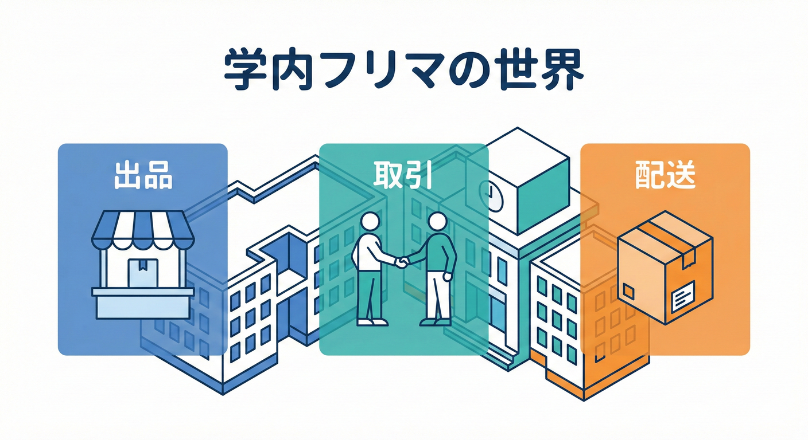
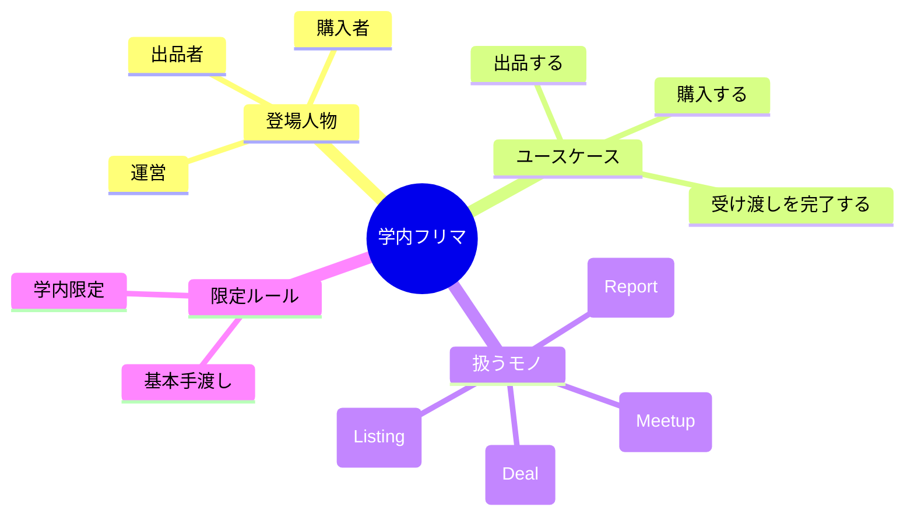
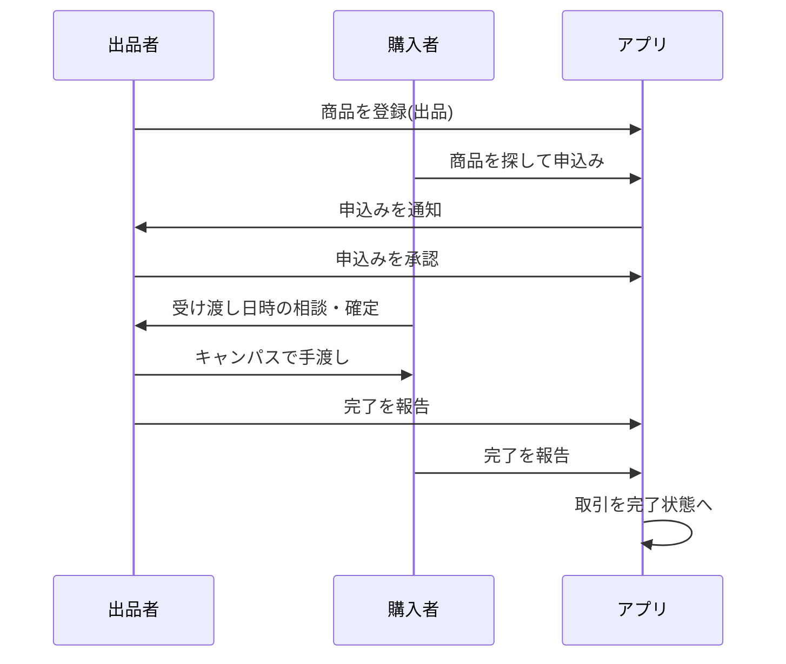
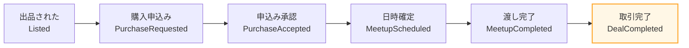

# 第4章 例題の世界観（学内フリマ）を決める🏫🛍️

この章はね、「これから境界（Bounded Context）を切っていくための材料」を集める回だよ〜😊✨
材料がないと境界も切れないので、まずは**世界観（ルール・登場人物・用語・やりたいこと）**を“軽く”決めちゃうよ🧺💕

---

## 1. アプリ概要：学内フリマ🛍️🏫



今回の例題はこれ👇

* **登場人物（役割）**：だれが何をする？👤👤👤
* **ユースケース3つ**：出品・購入・発送📌
* **イベントの流れ（ざっくり時系列）**：何が起きる？⏳
* **用語メモ（ミニ辞書）**：同じ言葉がズレないように🗣️📚
* **やらないこと（非目的）**：最初から全部盛りしない🍱🚫



---

## 4-2. 学内フリマのストーリー（30秒で想像できるやつ）🎬✨

舞台は大学🏫
学生が使わなくなった教材やガジェットを、学内限定で売買できる「フリマ」アプリ🛍️📱

* 出品者：売りたい（教科書、参考書、キーボード、マウス…）📚⌨️
* 購入者：安く買いたい💰
* 運営（学内フリマ係）：トラブルを減らしたい・安全に回したい🛡️

ポイントは「学内限定」🔒
これで本人確認や受け渡し（キャンパス内）など、**ちょい独自ルール**が作りやすいよ😉✨

---

## 4-3. 登場人物（役割）を決めよう🎭🌟

まずは**役割（ロール）**として考えるのがコツだよ😊
同じ人でも場面で役割が変わるからね（ここ重要！）🧠✨

### ① 出品者（Seller）🧑‍🎓📦

* 物を登録して売りに出す
* 値段・受け渡し場所・状態を書く
* 売れたら受け渡しする

### ② 購入者（Buyer）🧑‍🎓🛒

* 探して買う
* 支払い（または学内決済）をする
* 受け取ったら完了する

### ③ 運営（Admin / Moderator）🧑‍💼🛡️

* 通報対応
* 出品停止、ユーザー制限
* 取引のトラブル仲裁（最低限）

### ④ 配送担当…は作らない（今回は）🚚❌

学内フリマは基本「手渡し」想定にするとシンプルだよ🙆‍♀️
（発送は“手渡しの約束”として扱う感じにする📍）

---

## 4-4. まずは「扱うモノ（対象）」を決める🧺🧩

アプリで扱う対象（名詞）を並べるよ〜📝✨
これが後で「モデル」になっていくよ！

* 出品（Listing）📦
* 商品（Item）🎁
* 価格（Price）💴
* 取引（Deal / Trade）🤝
* 受け渡し予定（Meetup）📍🕒
* 通報（Report）🚨
* 評価（Rating）⭐（※今回は後回しでもOK）

ここで大事なのは **「画面」じゃなくて「現実で何があるか」** を先に置くことだよ😊🪞
（画面から入ると、境界がUI都合になりがち〜⚠️）

---

## 4-5. ユースケース3つ（この章のメイン）📌🛍️

「ユースケース＝やりたいことの単位」だよ🎯
ここでは“文章でOK”！コードはまだ薄くていい😊✨

### ユースケース① 出品する📦✨

* 出品者が、商品を登録する
* 必須：タイトル、価格、状態、受け渡し方法（手渡し）、受け渡し候補日時
* できれば：写真、説明文

**成功のイメージ**：一覧に表示され、他の学生が見つけられる👀✨

---

### ユースケース② 購入する🛒💰

* 購入者が出品を見つける
* 「購入したい」を押す（申込み）
* 出品者が承認する（在庫が1つだから）✅
* 受け渡し日時を確定する📅

**成功のイメージ**：取引が「進行中」になり、受け渡し待ちになる🤝✨

---

### ユースケース③ 受け渡し（発送）を完了する📍🎉

* 受け渡しが終わったら「完了」を押す
* 片方だけ完了だと揉めるので、**両者が完了**で確定にする（案）✅✅

**成功のイメージ**：取引が「完了」になり、履歴として残る📜✨



---

## 4-6. “何が起きる？”（イベント）で時系列を作る📣⏳

ユースケースをイベントにすると、境界の匂いが出てくるよ👃✨
（次の章以降でめっちゃ使う！）

ざっくり時系列👇

1. 出品された（Listed）📦
2. 購入申込みされた（PurchaseRequested）🛒
3. 申込みが承認された（PurchaseAccepted）✅
4. 受け渡し予定が決まった（MeetupScheduled）📍
5. 受け渡し完了が報告された（MeetupCompletedByBuyer / Seller）✅
6. 取引が完了した（DealCompleted）🎉
7. （任意）通報された（Reported）🚨



**コツ**：

* 「〜画面を開いた」みたいなのはイベントにしない🙅‍♀️
* 「現実で状態が変わった」ものだけにする✨

---

## 4-7. ミニ用語集（まず10語だけ）📚🗣️

あとで「同じ言葉なのに意味が違う」問題が出るから、今のうちに軽く固定しよ😊✨

例（そのまま使ってOK）👇

* 出品：売るために登録された状態📦
* 商品：売買対象のモノ🎁
* 取引：売り手と買い手が合意して進む一連🤝
* 申込み：買いたい意思表示🛒
* 承認：出品者が申込みをOKする✅
* 受け渡し：手渡しで渡す行為📍
* 完了：両者が受け渡しを認めた状態🎉
* 通報：違反やトラブルを運営に知らせる🚨
* 運営：学内フリマを管理する役割🛡️
* 学内限定：大学の関係者だけが使える前提🔒

---

## 4-8. 最初に「やらないこと」を決める（暴走防止）🚫🍱

世界観が広がりすぎると、設計の練習ができなくなるの🥺💦
なので最初は、こういうのは**後回し**でOK👇

* 決済のガチ実装（カード、振込など）💳❌
* 配送会社連携（宅配）📦🚚❌
* ポイント、クーポン🎟️❌
* レコメンド（おすすめ）🤖❌
* チャット機能💬❌（あったら便利だけど重い！）

---

## 4-9. TypeScriptで「世界観のスケッチ」を書いてみよう🧸💻

ここでは“設計の土台”として、**型だけ**軽く作るよ😊
（まだ境界は切ってないので、ひとまず `domainSketch` みたいな気持ちでOK✨）

```ts
// 世界観スケッチ（まだ境界は切らない！）📝✨

export type UserId = string;
export type ListingId = string;
export type DealId = string;

export type Role = "Seller" | "Buyer" | "Admin";

export type ListingCondition = "New" | "LikeNew" | "Good" | "Fair";

export type DealStatus =
  | "Requested"      // 申込みされた
  | "Accepted"       // 承認された
  | "MeetupScheduled"// 受け渡し予定あり
  | "Completed";     // 両者完了

export interface Listing {
  id: ListingId;
  sellerId: UserId;
  title: string;
  priceYen: number;
  condition: ListingCondition;
  isActive: boolean; // 売り切れ/停止などの超ざっくり
}

export interface PurchaseRequest {
  listingId: ListingId;
  buyerId: UserId;
  requestedAt: Date;
}

export interface Deal {
  id: DealId;
  listingId: ListingId;
  sellerId: UserId;
  buyerId: UserId;
  status: DealStatus;
  meetup?: {
    place: string;
    at: Date;
  };
  completedBySeller: boolean;
  completedByBuyer: boolean;
}
```

✅ここでの正解は「完璧なモデル」じゃないよ！
**“このアプリで起きること”が読める**ならOK😊✨

---

## 4-10. AI相棒に聞くテンプレ🤖💬（コピペOK）

### ① 登場人物の追加候補を出してもらう🎭

```text
学内フリマの例題で、登場人物（役割）の候補を追加で10個出して。
ただし「学内限定」「手渡し中心」を前提にして、現実的なものだけにして。
```

### ② ユースケースを“学生向けの文章”に整えてもらう✍️

```text
次の3つのユースケースを、女子大学生が読んで理解できる文章に整えて。
(1) 出品する (2) 購入する (3) 受け渡し完了する
難しい専門用語は避けて、でも曖昧すぎないようにして。
```

### ③ イベント列の抜け漏れチェック🔍

```text
次のイベント列に抜け漏れがないかチェックして、足りないイベントがあれば提案して。
Listed → PurchaseRequested → PurchaseAccepted → MeetupScheduled → MeetupCompleted → DealCompleted
学内フリマ（手渡し中心）前提で。
```

---

## 4-11. 章末チェック✅✨（ここまでできたらOK！）

次の5つが揃ってたら合格だよ〜🎉

* [ ] 役割が3つ以上ある（Seller/Buyer/Admin）👤
* [ ] ユースケースが3つ文章で書けてる📌
* [ ] イベントが時系列で並んでる⏳
* [ ] 用語が10語くらいメモできてる📚
* [ ] 「やらないこと」が3つ以上決まってる🚫

---

## ちょい補足：TypeScriptの“今”も一応チェックしておこう👀✨

教材を書いてる時点の TypeScript の `latest` は、npm のパッケージページで確認できるよ📦🔍（例：5.9.3 が latest と表示されている時期があるよ）。([npm][1])
5.9 系の変更点は公式のリリースノートにまとまってるので、気になったらここを見るのが安心😊📘([TypeScript][2])
それと、ネイティブ移植プレビュー（将来の高速化の流れ）も公式から出てるよ〜🚀([Microsoft for Developers][3])

[1]: https://www.npmjs.com/package/typescript?utm_source=chatgpt.com "TypeScript"
[2]: https://www.typescriptlang.org/docs/handbook/release-notes/typescript-5-9.html?utm_source=chatgpt.com "Documentation - TypeScript 5.9"
[3]: https://devblogs.microsoft.com/typescript/announcing-typescript-native-previews/?utm_source=chatgpt.com "Announcing TypeScript Native Previews"
