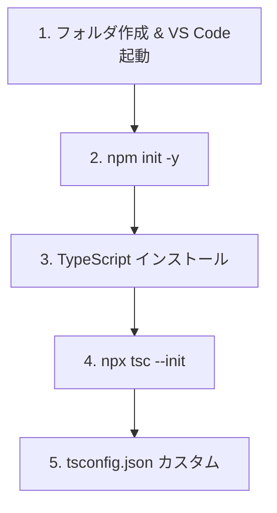
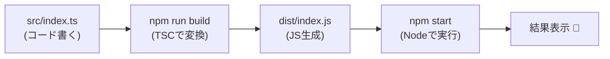
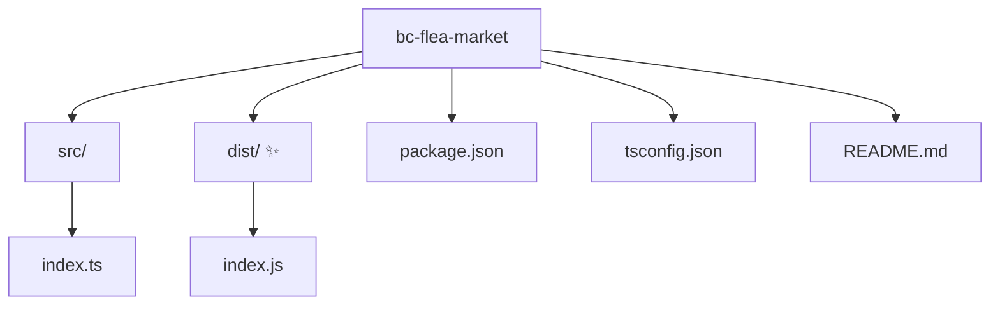

# 第5章 開発セットアップ（Windows/VS Code/TS）🔧💻

## この章のゴール🎯✨

この章が終わったら、次の3つができてればOKだよ〜😊🫶

* TypeScriptの空プロジェクトを作れる📦
* `src/index.ts` を動かせる🚀
* 手順が書いてある `README.md` を用意できる📄🤖

---

## 5.1 まず“最新バージョン”を確認しよ✅🧸

2026/02/02時点での目安はこれ👇

* TypeScript（安定版）: **5.9.3**（npmのlatest）📌 ([npm][1])
* Node.js（実行環境）: **LTSを使う**のが安心（Latest LTSは **v24.13.0** 表示）🟩 ([Node.js][2])
* VS Code: **1.108（Dec 2025）** が公開されていて、2026/01/08リリース日が案内されてるよ🧠✨ ([Visual Studio Code][3])

> ここで大事なのは「NodeはLTS」「TypeScriptはnpmのlatest（安定版）」って覚え方だよ😉💡
> Nodeは偶数メジャーがLTSになりやすい流れもあるよ（ProductionはLTS推奨）🧩 ([endoflife.date][4])

---

## 5.2 Node.js（LTS）を入れる🟩⬇️

## 手順🍀

1. Node.js公式から **LTS** を入れる🧸
2. インストールが終わったら、VS Codeのターミナル（PowerShell）を開くよ🪟💻
3. バージョン確認✨

```bash
node -v
npm -v
```

## うまくいってるサイン✅

* `node -v` が表示される🎉
* `npm -v` も表示される🎉

## つまずきがちポイント😵‍💫

* `node` が見つからない：**VS Codeを一回閉じて開き直す**（PATH反映のため）🔁
* それでもダメ：Windowsを再起動すると直ることが多いよ🧸💤

---

## 5.3 VS Code側の準備🧩🛠️

## 便利な拡張（入れておくと快適）🌟

* GitHub Copilot（またはAIチャット系）🤖💬
* ESLint（後で静的チェックに使う）🧹
* Prettier（整形担当✨）🎀
* EditorConfig（インデントの事故を減らす）📏

## ちいさな設定おすすめ（迷子防止）🧸🧭

* VS Codeのターミナルを開く：`Ctrl + @`
* 保存時に整形（Prettier）をONにしておくと、コードがぐちゃぐちゃになりにくいよ✨🧼

---

## 5.4 プロジェクトを作る📦🚀（最小セット）

## ① フォルダ作成＆VS Codeで開く📁

好きな場所でOK！例：

```bash
mkdir bc-flea-market
cd bc-flea-market
code .
```

## ② npmプロジェクト初期化🧁

```bash
npm init -y
```

## ③ TypeScriptを入れる（開発用）🧠

安定版のlatestが **5.9.3** だよ📌 ([npm][1])

```bash
npm i -D typescript@5.9.3
```

## ④ tsconfig.json を作る⚙️

```bash
npx tsc --init
```

作られた `tsconfig.json` を、初心者向けに少しだけ整えるよ😊
（ぜんぶ理解しなくてOK！“動く形”が大事🫶）



**おすすめの最小カスタム例👇**

```json
{
  "compilerOptions": {
    "target": "ES2022",
    "module": "CommonJS",
    "rootDir": "src",
    "outDir": "dist",
    "strict": true,
    "esModuleInterop": true,
    "skipLibCheck": true
  }
}
```

> TypeScript 5.9には、Node向けの新しい安定オプション（`node20`）もあるよ🌿
> ただ最初はCommonJSでOK！ESMは慣れてからで大丈夫😊 ([TypeScript][5])

---

## 5.5 “動く”を確認しよう🎬✨

## ① `src/index.ts` を作る📝

```bash
mkdir src
```

`src/index.ts` を作って、これを書く👇

```ts
const message: string = "Hello TypeScript! 🥳✨";
console.log(message);
```

## ② package.json にスクリプト追加🧾

`package.json` の `"scripts"` をこうしてね👇

```json
{
  "scripts": {
    "build": "tsc",
    "start": "node dist/index.js",
    "typecheck": "tsc --noEmit"
  }
}
```

## ③ ビルドして実行🚀

```bash
npm run build
npm start
```

**表示されたら成功🎉🎉🎉**
`Hello TypeScript! 🥳✨`



---

## 5.6 “README.md” をAIで作って整える📄🤖✨

ここはAIが得意なところ〜！まずAIに下書きを作ってもらって、最後に自分で整えるよ🫶🎀

## AIに投げるテンプレ（コピペOK）💬🤖

```text
このリポジトリ用に README.md を日本語で作って。
対象は初心者。内容に入れてほしいもの：
- このプロジェクトの目的（TypeScriptのセットアップ練習）
- 必要なもの（Node LTS / npm / VS Code）
- セットアップ手順（npm install、build、start、typecheck）
- フォルダ構成（src, dist, tsconfig.json）
- よくあるエラーと対処（nodeが見つからない、distがない等）
文章はやさしい口調で、絵文字も少し入れて。
```

## “自分で整える”チェックポイント✅✨

* コマンドが本当に合ってるか（`npm run build` とか）👀
* フォルダ名が今の構成と一致してるか📁
* 余計な手順が混ざってないか（いきなりReactとか）✂️

---

## 5.7 よくある詰まりポイント集🧯😵‍💫

## Q1. `node dist/index.js` が失敗する（distがない）📦💥

**原因あるある**：ビルドしてない
**対処**👇

```bash
npm run build
npm start
```

## Q2. `npx` が動かない🌀

**対処**：ターミナルを開き直して再実行🔁
それでもダメなら `npm -v` が出るか確認してね✅

## Q3. どのTypeScriptが使われてるかわからない🤔

VS Codeで `Ctrl + Shift + P` → **TypeScript: Select TypeScript Version** → **Use Workspace Version** を選ぶと安心だよ🧸✨

---

## 5.8 ミニ演習（5分）🕔💪✨

## 演習A：型チェックだけ走らせてみよう🧠✅

```bash
npm run typecheck
```

## 演習B：関数を1個作って型を感じる🧩

`src/index.ts` をこう変えてみて👇

```ts
function formatPrice(yen: number): string {
  return `${yen.toLocaleString("ja-JP")}円`;
}

console.log("出品価格:", formatPrice(1200), "🛍️✨");
```

動かしてみよ〜🚀

```bash
npm run build
npm start
```

---

## 5.9 ここまでの成果物🎁✨

この章が終わった時点で、フォルダの中身はだいたいこんな感じになってるよ📁😊

* `package.json`（scripts入り）🧾
* `tsconfig.json` ⚙️
* `src/index.ts` 🧠
* `dist/index.js`（build後に生成）📦
* `README.md`（AI下書き→自分で整えたもの）📄🤖



---

## ちょこっと未来の話🌱（読み飛ばしOK）

TypeScriptは今後、ネイティブ版コンパイラ（プレビュー）がnpmで配布されてたりして、速度アップが進んでるよ🚄✨
`@typescript/native-preview` の最新は **7.0.0-dev系** みたいな開発版が出てる（プレビュー）📦 ([npm][6])
公式もロードマップの進捗を定期的に出してるよ🗓️ ([Microsoft for Developers][7])

（ただし、この教材の序盤は安定版TypeScriptでOK🙆‍♀️✨）

[1]: https://www.npmjs.com/package/typescript?utm_source=chatgpt.com "TypeScript"
[2]: https://nodejs.org/en/about/eol?utm_source=chatgpt.com "End-of-Life (EOL)"
[3]: https://code.visualstudio.com/updates?utm_source=chatgpt.com "December 2025 (version 1.108)"
[4]: https://endoflife.date/nodejs?utm_source=chatgpt.com "Node.js"
[5]: https://www.typescriptlang.org/docs/handbook/release-notes/typescript-5-9.html?utm_source=chatgpt.com "Documentation - TypeScript 5.9"
[6]: https://www.npmjs.com/package/%40typescript/native-preview?utm_source=chatgpt.com "typescript/native-preview"
[7]: https://devblogs.microsoft.com/typescript/progress-on-typescript-7-december-2025/?utm_source=chatgpt.com "Progress on TypeScript 7 - December 2025"
