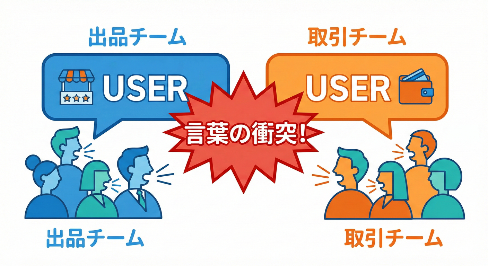
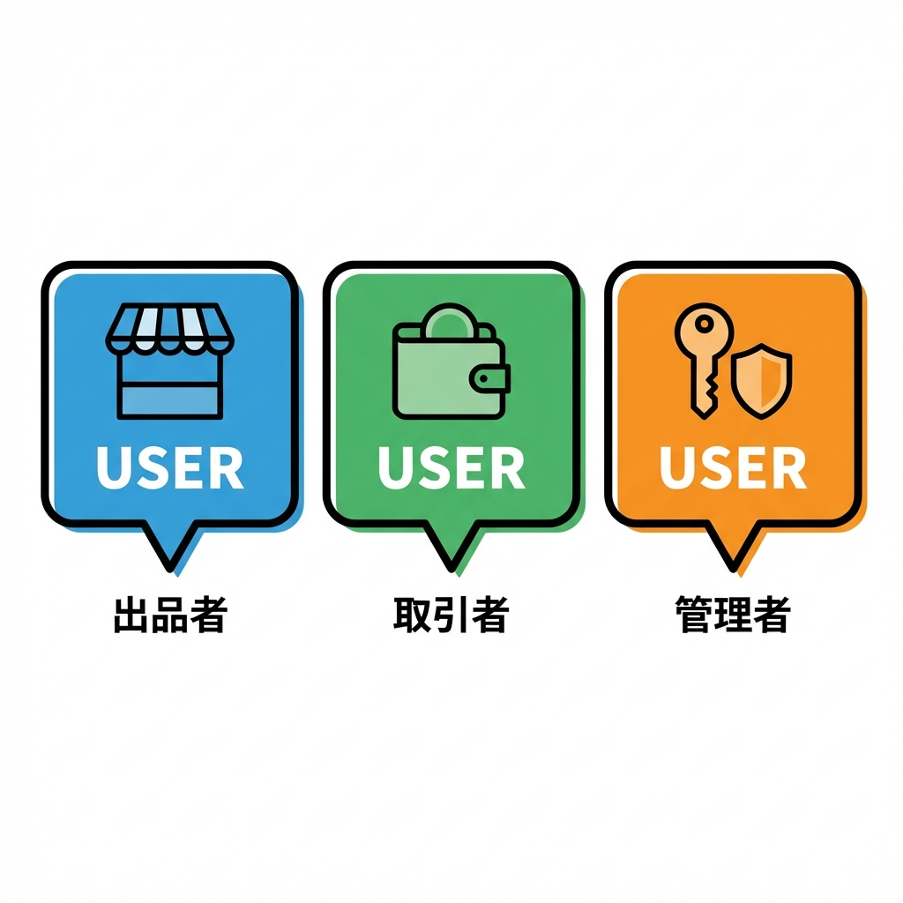
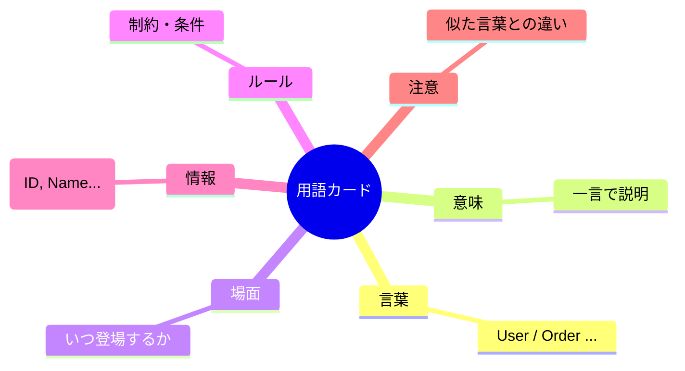
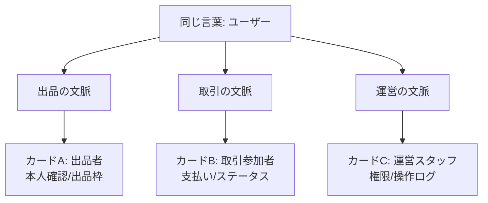
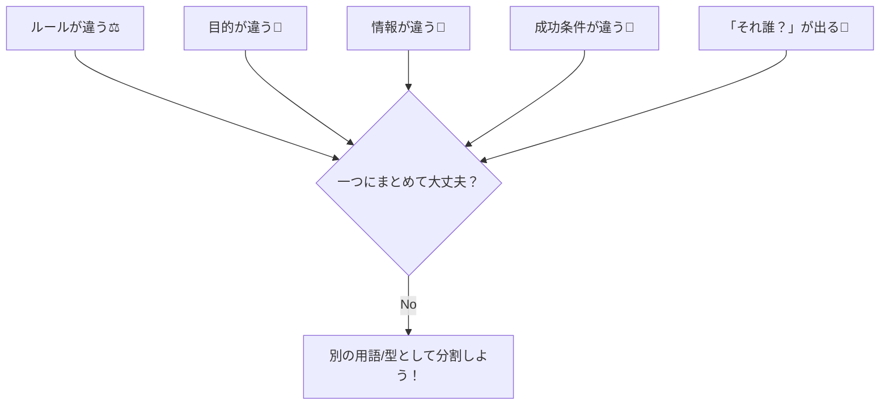

# 第6章 “同じ言葉、別の意味” がBCの出発点🗣️💡

## この章でできるようになること🎯✨

* 「同じ言葉なのに、話してる内容がズレてる😵‍💫」を見抜ける👀
* ズレた言葉を「用語カード🃏」にして、意味を固定できる🧷
* TypeScriptの型で“意味の混線”を止める最初の一歩が踏み出せる🛡️💻

---

## 6-1. まずは“ズレ”を体験しよ😇➡️😱

学内フリマ🛍️で、こんな会話が起きるよ👇

* A「ユーザーが出品できなくてさ〜😣」
* B「ユーザーって…購入者？出品者？運営？🤔」
* A「え、ユーザーはユーザーでしょ？😇」
* B「うちの決済の“ユーザー”は支払い情報を持ってる人だよ…💳」
* A「出品の“ユーザー”は本人確認が通ってる人だよ…🪪」

## 1. 言葉の衝突（Word Collision）💥🗣️



## 2. 同じUserでも中身が違う🧸🏷️

<!--  -->

たとえば「User」という言葉。
プロジェクトが大きくなると、同じ「User」や「Order」という言葉でも、**場所によって意味がズレる** ことがあるよ😵‍💫
ソフトウェアは曖昧さが苦手だから、曖昧なままだと設計が崩れやすいんだ💥（だから境界が必要になる）([martinfowler.com][1])

---

## 6-2. なぜ“言葉のズレ”はヤバいの？💣😵‍💫

### ヤバさ①：同じ変数名・同じ型名に“別ルール”が混ざる🧨

「User」に “出品のルール” と “決済のルール” が同居すると…

* どこで何をチェックすべきか分からない😵
* 追加修正すると別機能が壊れる😱
* テストが書きにくい🧪💦

### ヤバさ②：チームの会話がすれ違う📣💥

言葉が曖昧だと、会話の時点でバグが生まれる…！
DDDでは、**開発者とドメインの人が同じ意味で話せる言葉（ユビキタス言語）**が大事って考えるよ🧠✨([martinfowler.com][1])

### ヤバさ③：境界がないと“翻訳”の場所がなくなる🧽

外部サービスや別機能の都合（命名、単位、状態）が、そのまま中心のモデルに侵入してくる😖
だから「ここから先は別の言葉・別モデルね🧱」って線を引く必要があるんだ✨（それがBCの超重要な入口）([martinfowler.com][2])

---

## 6-3. 解決の第一歩：用語カード🃏✨（言葉→意味→場面）

この章の成果物はこれ！
**用語カード（言葉→意味→使う場面）**🃏✨

### ✅ 用語カードのフォーマット（テンプレ）

* **言葉**：
* **意味（1文で）**：
* **使う場面（いつ登場する？）**：
* **ルール（守ること）**：
* **持つ情報（必要な属性）**：
* **似た言葉/注意（混ざりやすい相手）**：



---

## 6-4. “ユーザー”を割ってみよう🍉🧩（例：学内フリマ）

ここでは「ユーザー」を、あえて3枚に割るよ🃏🃏🃏

### 🃏カードA：出品のユーザー（出品者）

* **言葉**：出品者
* **意味（1文で）**：出品機能を使える人（本人確認や出品制限の対象）
* **使う場面**：出品作成、出品停止、出品数カウント
* **ルール**：出品数上限、禁止品目、本人確認必須など
* **持つ情報**：出品可能フラグ、出品枠、ニックネーム
* **似た言葉/注意**：「購入者」と混ざりがち⚠️

### 🃏カードB：取引のユーザー（購入・売買）

* **言葉**：取引参加者
* **意味（1文で）**：取引（購入/売却）に参加して状態が進む人
* **使う場面**：購入、キャンセル、受取確認
* **ルール**：支払い期限、キャンセル規定、評価ルール
* **持つ情報**：取引IDとの紐づき、取引ステータス上の権限
* **似た言葉/注意**：出品者と同一人物でも“意味”は別🧠✨

### 🃏カードC：運営のユーザー（管理・問い合わせ）

* **言葉**：運営スタッフ
* **意味（1文で）**：違反対応や問い合わせ対応ができる人
* **使う場面**：通報対応、強制停止、監査ログ閲覧
* **ルール**：権限レベル、操作ログ必須、監査対象
* **持つ情報**：権限ロール、操作理由、担当範囲
* **似た言葉/注意**：一般ユーザーと絶対に混ぜない🚫



こういう感じで、**同じ「ユーザー」でも、目的が違えば“必要な情報”も“ルール”も違う**よね😊✨
この「違う」をちゃんと分けるのが、BCの入口だよ🧱([martinfowler.com][2])

---

## 6-5. “ズレ語”を見つけるチェックリスト🔍✅

次のサインが出たら、**同じ言葉が割れる可能性**高いよ⚠️

* ルールが違う（上限、期限、禁止、例外…）⚖️
* 目的が違う（出品したい / 支払いたい / 監査したい）🎯
* 持つ情報が違う（本人確認 / 支払い / 権限）🧾
* 成功条件が違う（出品成立 / 決済成立 / 対応完了）🏁
* 会話で「それ誰のこと？」が増える🤔💬



---

## 6-6. TypeScriptミニ演習：同名っぽいけど型を分ける🧩🛡️

目標はこれ👇
**“同じ人”でも、意味が違うなら型を分ける**（混線をコンパイルで止める💪）

### ① 型を3つ作る🧸💻

```ts
// ユーザーIDは同じ文字列でもいいけど、意味が違うので型を分けるよ🧩
type ListingUser = {
  kind: "ListingUser";
  userId: string;
  displayName: string;
  canList: boolean;
  listingQuota: number; // 出品枠🧺
};

type TradingUser = {
  kind: "TradingUser";
  userId: string;
  tradeBan: boolean;
  activeTradeCount: number; // 進行中取引数🔁
};

type AdminUser = {
  kind: "AdminUser";
  userId: string;
  role: "moderator" | "admin";
  canViewAuditLog: boolean;
};
```

### ② “取引を開始する”は TradingUser だけが入れるようにする🛍️➡️📦

```ts
type Trade = {
  tradeId: string;
  sellerId: string;
  buyerId: string;
};

function startTrade(seller: TradingUser, buyer: TradingUser): Trade {
  if (seller.tradeBan || buyer.tradeBan) {
    throw new Error("取引できないユーザーがいるよ😢");
  }

  return {
    tradeId: crypto.randomUUID(),
    sellerId: seller.userId,
    buyerId: buyer.userId,
  };
}
```

### ③ 間違えて ListingUser を入れると怒られる😆⚠️（大事！）

```ts
const listingUser: ListingUser = {
  kind: "ListingUser",
  userId: "u-1",
  displayName: "みさき",
  canList: true,
  listingQuota: 3,
};

// ❌ これは型が違うのでコンパイルで止まる（混線防止🛡️）
startTrade(listingUser, listingUser);
```

ここで止まってくれるのが最高だよね😊✨
「人間の注意」じゃなくて「型」で守ると、未来の自分が助かる🧸🛡️

---

## 6-7. AI相棒🤖に頼むときの“良い聞き方”テンプレ💬✨

AI拡張（例：GitHub のCopilot、OpenAI のCodex系など）には、**素材を渡してから頼む**のがコツだよ🎀

### テンプレ①：用語カードを増やす🃏

* 「学内フリマの用語を10個挙げて、用語カード（言葉/意味/場面/ルール/必要属性/混ざり注意）で出して。特に“同じ言葉が割れそうなもの”を優先して。」

### テンプレ②：ズレ検知のレビュー👀

* 「この文章の中で“同じ言葉が別の意味で使われている可能性”がある箇所を指摘して、割った場合の候補名も出して。」

### テンプレ③：型名の命名案🏷️

* 「“ユーザー”が3種類に割れた。Listing/Trading/Admin それぞれに自然な名前（日本語と英語）を5案ずつ出して。初心者が読んで迷わないのを優先して。」

---

## 6-8. この章の成果物📦✨（提出物イメージ）

### ✅ 最低ライン（これだけでOK！）😊

* 用語カード **10枚**🃏

  * うち **3枚は“割れた言葉”**（例：ユーザー、注文、ステータス など）🍉

### ✅ おすすめライン（できたら強い💪）

* “割れた言葉”について

  * 「なぜ割ったか」1行メモ✍️
  * 「混ざると起きる事故」1行メモ💥

---

## 6-9. まとめ🧸✨

* **同じ言葉でも、目的が違えば意味が違う**🧠
* ソフトウェアは曖昧さが苦手だから、**意味は固定しよう**🧷([martinfowler.com][1])
* 固定する道具が **用語カード🃏**、守る武器が **TypeScriptの型🛡️**

---

## 次章予告📌😊

次は「BCって結局なに？（やさしい定義）」を、今日作った用語カードを使ってスッと腹落ちさせるよ🧱✨([martinfowler.com][2])

[1]: https://martinfowler.com/bliki/UbiquitousLanguage.html?utm_source=chatgpt.com "Ubiquitous Language"
[2]: https://www.martinfowler.com/bliki/BoundedContext.html?utm_source=chatgpt.com "Bounded Context"
