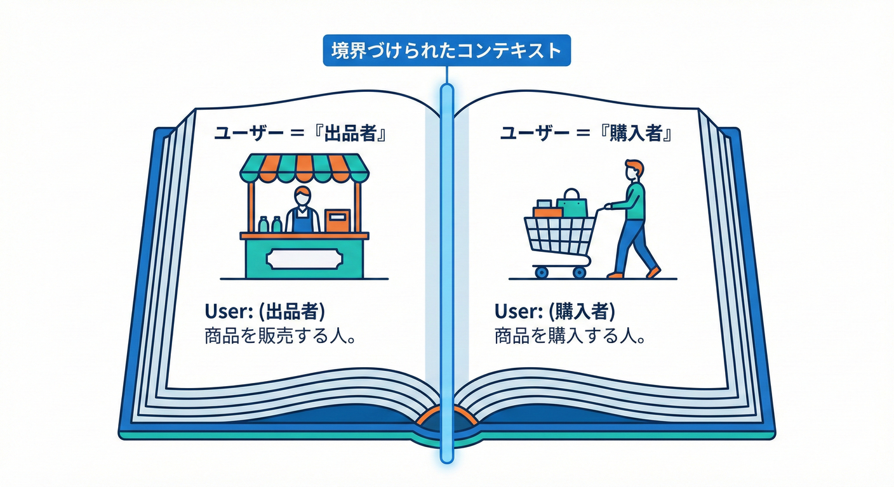
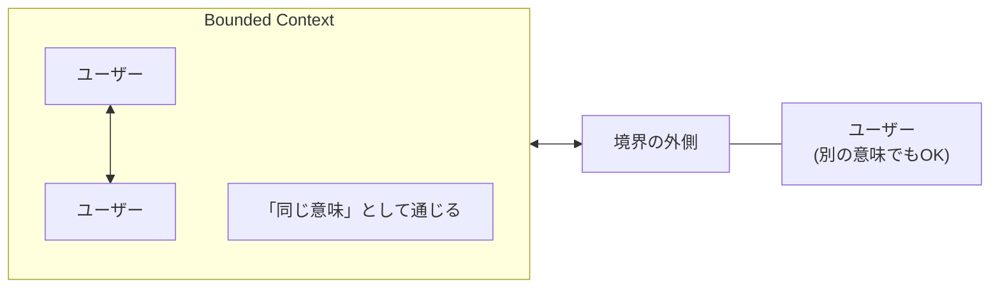
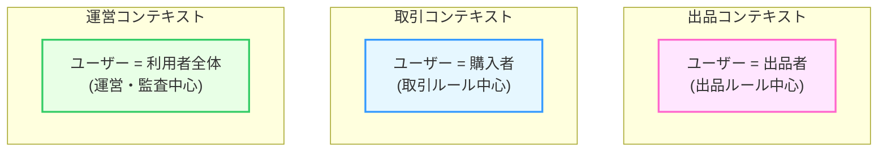
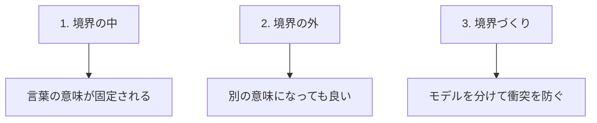

# 第7章 BCの定義（やさしい版）📌😊

## この章でできるようになること🎯✨

* **Bounded Context（BC）** を、かんたんな言葉で説明できる🗣️💡
* 「境界の中では言葉の意味が固定される」感覚をつかむ🧱🔒
* 例題（学内フリマ🛍️）の言葉で **BCの定義を言い換え** できる✍️😊

---

## 1. Bounded Context（BC）を1行で言うと 📝🎯



結論から言うとこれ！👇

**「同じ言葉が、同じ意味で通じる範囲」** だよ🧸✨

* その範囲の中では、用語（＝ユビキタス言語）が **ブレない** 🧷
* 範囲の外に出たら、同じ単語でも **別の意味** になってOK🙆‍♀️



この考え方は、DDD（ドメイン駆動設計）の中心にある「言葉を守る」ための境界線だよ🛡️📚
（「ある範囲では特定のドメインモデルが適用される境界」みたいな説明でもOK）([martinfowler.com][1])

---

## 2) “同じ言葉、別の意味” が起きると何がまずいの？😵‍💫🌀

学内フリマ🛍️でよくある「地雷ワード」＝ **ユーザー** を考えてみよう🧨💥

* 出品する人にとっての「ユーザー」＝ **出品者** 🏷️
* 買う人にとっての「ユーザー」＝ **購入者** 🛒
* 運営にとっての「ユーザー」＝ **アカウントを持つ人（利用者全員）** 🧑‍🎓🧑‍🏫

これを **全部まとめて “User” 1個** にしちゃうと…
「このUserって住所いる？本人確認いる？出品制限ある？」みたいな話が混ざって、設計がグチャる🌀😇➡️😱

だからBCは、こう言ってる感じ👇

> 「言葉がブレるなら、**モデルも分けよう**。
> ブレない範囲を作って、その中では **同じ言葉＝同じ意味** にしよう」🧱✨

“言葉がブレないようにする”って発想は、ユビキタス言語の考え方そのものだよ📚🗣️([martinfowler.com][2])

---

## 3) 図でつかむ：BCは「意味の防波堤」🌊🧱

文章で図にするとこんな感じだよ👇

* 📦 **出品コンテキスト（Listing）**

  * 「ユーザー」＝ **出品者**（出品ルールが中心）
* 📦 **取引コンテキスト（Trading）**

  * 「ユーザー」＝ **購入者 or 取引当事者**（支払い・合意・キャンセルが中心）
* 📦 **運営コンテキスト（Admin）**

  * 「ユーザー」＝ **利用者全体**（停止・通報・規約が中心）



  * 「ユーザー」＝ **利用者全体**（停止・通報・規約が中心）

ポイントはこれだけ🎈

✅ **箱（BC）の中では、言葉は1つの意味に固定**
✅ **箱が違えば、同じ単語でも意味が違っていい**
✅ **意味が違うなら、モデルも分けていい（むしろ分ける）**([martinfowler.com][1])

---

## 4) よくある誤解：BC＝マイクロサービス？🤔💭

ちょい注意⚠️
BCは **「設計の境界（意味の境界）」** で、必ずしも「サービス分割」そのものじゃないよ🧸

* 1つのアプリの中に **複数BC** があっても普通🙆‍♀️
* 将来、BCごとに分けてマイクロサービス候補にすることはある（けど最初から固定じゃない）🔧🌱([Microsoft Learn][3])

---

## 5) TypeScriptでイメージを固定してみる（超ミニ）🧩💻

「同じUserでも、BCが違えば別物」って、コードでも雰囲気が出せるよ😊
（ここでは“分けてOK”の感覚を掴むのが目的だよ🎀）

```ts
// contexts/listing/types.ts
export type User = {
  sellerId: string;
  displayName: string;
  // 出品に必要な情報だけ
  canList: boolean;
};

// contexts/trading/types.ts
export type User = {
  buyerId: string;
  displayName: string;
  // 取引に必要な情報だけ
  paymentMethodRegistered: boolean;
};
```

同じ名前 `User` でも、**置き場所（BC）が違う** から意味がブレない🧱✨
これが “BCの定義（意味が固定される範囲）” の超実務版だよ🛠️😊

---

## 6) 章のメイン課題：BCの定義を「例題の言葉」で言い換えよう✍️🛍️

## ✅ ステップ1：まずテンプレ（穴埋め）🧸📝

次の文を埋めてみてね👇

* **BCとは**：「＿＿＿＿＿＿＿＿＿＿＿＿＿＿＿＿」
* **境界の中では**：「＿＿＿＿＿＿＿＿＿＿＿＿＿＿＿＿」
* **境界の外では**：「＿＿＿＿＿＿＿＿＿＿＿＿＿＿＿＿」



例（こんな感じでOK）🌸

* BCとは：「学内フリマで、言葉の意味がブレない範囲」
* 境界の中では：「Userが“出品者”として固定される」
* 境界の外では：「Userは“購入者”として別の意味になってもOK」

## ✅ ステップ2：自分のBCを1つ作る🏷️✨

学内フリマで、どれか1つ選んでね👇

* 「出品」📦
* 「取引」🤝
* 「配送」🚚
* 「運営」🛡️

選んだBCについて、これを書こう📝

* このBCで「ユーザー」は何者？🧑‍🎓
* このBCで一番大事なルールは？⚖️
* このBCでは扱わないこと（非目的）は？🚫

---

## 7) AI相棒🤖に聞くときの “良い聞き方” テンプレ🪄✨

## ① 定義の言い換えを作ってもらう📝

```text
学内フリマの題材で「Bounded Context」を超やさしい日本語で定義して。
条件：
- 「境界の内側では言葉の意味が固定される」を必ず入れる
- 例として「ユーザー」が出品者/購入者で意味が変わる話を入れる
- 2〜3文で短く
```

## ② “同じ単語が衝突している箇所” を洗い出す🔎

```text
学内フリマで用語が衝突しそうな単語を10個出して。
それぞれ「どの場面で意味が変わるか」も1行で書いて。
例：ユーザー（出品者/購入者/運営）
```

## ③ BC候補を1つ提案してもらう📦

```text
学内フリマで「出品」BCを想定する。
このBCのユビキタス言語（用語）を10個、短い定義つきで提案して。
条件：他のBC（取引/配送/運営）と混ざりそうな用語は注意書きを添えて。
```

---

## 8) 理解チェック✅🎓（サクッと！）

## Q1. BCの中で大事なのはどれ？🤔

A. **言葉の意味がブレないこと**🧱✨

## Q2. 同じ単語が別BCで別の意味でもいい？

A. **いいよ🙆‍♀️（むしろ自然）**。だから境界が必要🌸

## Q3. BCは「サービス分割」と同じ？

A. **同じじゃない**（まずは意味の境界）🧸

## Q4. BCを決めると何がラクになる？

A. 会話がラク、設計がラク、変更がラクになりやすい😊✨

---

## まとめ🌷📌

* **BC＝同じ言葉が同じ意味で通じる範囲**🧱🔒
* 境界の中では **ユビキタス言語が固定** される🗣️📚([martinfowler.com][1])
* 同じ単語が別BCで別の意味でもOK（だから混ぜない）🧩✨
* TypeScriptでも「置き場所（BC）を分ける」と意味が固定されやすい📁💻

---

## ちょい豆知識（TypeScriptの今どき）🌱🧠

TypeScriptは安定版ラインで **5.9.3** が配布されていて、5.9では `import defer` や Node.js 20向けの安定モード（`--module node20`）などが整理されてるよ📦⚙️([npm][4])

[1]: https://www.martinfowler.com/bliki/BoundedContext.html?utm_source=chatgpt.com "Bounded Context"
[2]: https://martinfowler.com/bliki/UbiquitousLanguage.html?utm_source=chatgpt.com "Ubiquitous Language"
[3]: https://learn.microsoft.com/en-us/azure/architecture/microservices/model/domain-analysis?utm_source=chatgpt.com "Using domain analysis to model microservices"
[4]: https://www.npmjs.com/package/typescript?utm_source=chatgpt.com "TypeScript"
