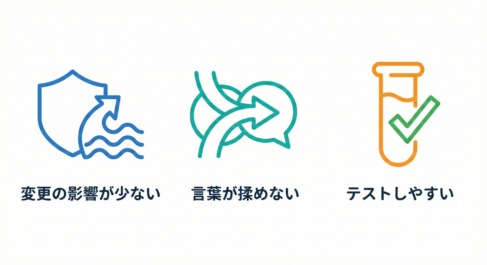
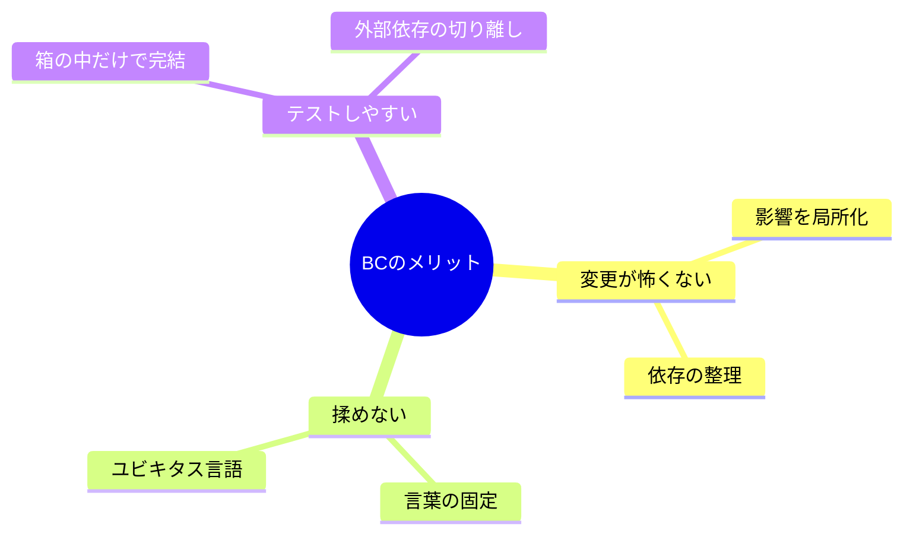
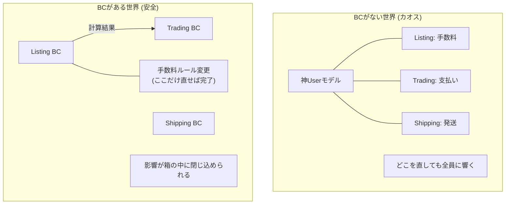
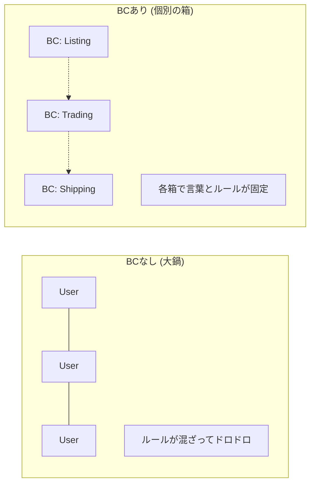

# 第8章 何が嬉しいの？（メリット3つ）🎁✨

Bounded Context（BC）って、最初はちょっと地味に見えるんだけど…実は「あとでめちゃ助かる」系の強い味方だよ〜💪🌷
この章では、BCの“うれしさ”を **3つ**にしぼって、学内フリマ🛍️の例でスッキリ体感していくよ😊

---

## 1. BCを導入する3つのメリット 🎁✨



境界を引くと、具体的に何がいいの？っていうのを3つ挙げるよ😊
* 「BCがある世界 / ない世界」を比べて、違いを説明できる👀
* 自分の例題（学内フリマ）でも、メリットをメモにできる📝✨

---

## まず結論：メリット3つ🎁💖

1. **変更が怖くない**（影響が局所化する）🛡️🔧
2. **チームでも揉めない**（言葉の意味が固定される）🗣️📌
3. **テストしやすい**（境界がある＝試しやすい）🧪✅



BCは「モデルが通用する範囲をハッキリさせる」考え方で、違うモデルを混ぜると混乱が起きるから、境界を明示しようね〜という発想だよ📦🚧 

---

## ① 変更が怖くない（影響が局所化する）🛡️🔧

## “怖い変更”って何？😱

変更が怖いのは、だいたい **どこまで影響が飛ぶか分からない** ときだよね🌀
BCがないと、いろんな機能が同じ言葉・同じモデルに寄りかかって、いつの間にか依存が増えがち…💥

Microsoftの設計ガイドでも、境界があいまいだと「隠れた依存」「密結合」「まずいインターフェース」みたいな問題が出やすいよ〜って話が出てくるよ📎⚠️ ([Microsoft Learn][1])

## 学内フリマ🛍️で例えると…

たとえば、こんな3つのBCがあるとするね👇

* Listing（出品）📦
* Trading（取引）💳
* Shipping（配送）🚚

### 変更例：出品の手数料ルールを変える💰

* 旧：手数料は一律 5%
* 新：カテゴリごとに変える（本は3%、家電は8%…）📚🔌

**BCがある世界**🌈

* 「手数料」は Listing のルールとして完結しやすい
* Trading は「請求された手数料の結果」を受け取るだけでOK
* Shipping はそもそも手数料に関心ない🚚✨
  → 変更の波が **必要なところだけ** に届く感じ🌊📍

**BCがない世界**🌧️

* どこにも「手数料の責任者」がいない
* いろんな場所に手数料計算が散って、全部探して直す羽目に😵‍💫
* 直したら別の機能が壊れる😱
  → 「どこ壊れた…？」が起きやすい🔍💦



BCは「このモデルが通用する範囲」を明確にして、範囲の中では用語とルールを一貫させようね、っていう作戦だよ🧱✨ 

---

## ② チームでも揉めない（言葉の意味が固定される）🗣️📌

## 揉めポイント第1位🥇：同じ単語、別の意味

たとえば「ユーザー」って単語、めっちゃ危険ワード⚠️

* 出品する人（出品者）
* 買う人（購入者）
* 問い合わせする人（一般利用者）
* 運営側の管理者

みんな「ユーザー」って呼びがちだけど、必要な情報も、守るルールも違うよね😵‍💫🌀

## BCがあると何が起きる？😊

BCの中では、チーム全員が同じ言葉を同じ意味で使う（＝ユビキタス言語）って考え方が強いの🗣️🤝
定義の文書では、ユビキタス言語は「BCの中で、みんなが使う共通の言葉」って説明されてるよ📚✨ 

つまり…

* Listing の「User」＝出品者寄りの人（出品に必要な情報が中心）📦
* Trading の「User」＝支払い・取引に責任を持つ人💳
* Shipping の「User」＝受け取り先の情報が大事な人🚚

同じ “User” でも、**別の箱（BC）なら別物でOK** 🙆‍♀️✨
これができると、会話がスムーズになって揉めにくいよ〜😊🫶

---

## ③ テストしやすい（境界がある＝試しやすい）🧪✅

テストがしんどいのって、だいたいこういうとき👇

* 1つ直すと、どこが壊れるか分からない😱
* いろんな事情（DB/外部API/UI）が絡みすぎて、試すのが大変😵‍💫
* 何が正しい振る舞いか曖昧🌀

でもBCがあると、「この箱のルールはここ！」って決まるから、**箱の中だけでテストしやすい**の🧪✨

しかも「自動テストで破綻（モデルの分裂）を早めに検知しようね」みたいな話も出てくるよ📌 

---

## 図でイメージしよ〜🗺️✨（文章の図）

## BCがない世界😵‍💫

* ぜんぶが1つの大鍋🍲
* どこでも同じ「User」を使う
* 取引の都合が出品を汚す / 配送の都合が取引を汚す…🌀

## BCがある世界😊

* 箱が分かれてる📦📦📦
* 箱の中は言葉もルールも一貫🧱
* 箱をまたぐときは「受け渡し」を意識できる🎁（これは後半で育てるよ🌱）



---

## TypeScriptミニ演習🧸💻（“同じ名前でも別物”を体験）

> ねらい：**別BCなら、同じ名前でも意味が違ってOK** を体で覚えるよ🧠✨

下は「ListingのUser」と「TradingのUser」が別物な例だよ👇
（ファイルを分けるイメージで読んでね📁）

```ts
// contexts/listing/user.ts
export type User = {
  sellerId: string;      // 出品者としてのID
  displayName: string;   // 表示名
  listingLimit: number;  // 出品上限（出品BCのルール）
};
```

```ts
// contexts/trading/user.ts
export type User = {
  accountId: string;     // 決済・取引のID
  paymentStatus: "ok" | "hold";
  bannedUntil?: Date;    // 取引停止など（取引BCのルール）
};
```

✨ポイント

* 同じ `User` でも、中身が違うのが自然🙂
* 「同じ言葉を全システムで統一しなきゃ！」は、むしろ事故りやすい🚑
* 統一が必要なのは **BCの中** だよ📌 

---

## テストしやすさミニ演習🧪✅（箱の中だけで確かめる）

例：Listing（出品）で「手数料を計算する」だけをテストする🌷
外部APIもDBもいらないよ〜🙂

```ts
// contexts/listing/fee.ts
export function calcListingFee(priceYen: number, category: "book" | "electronics"): number {
  if (priceYen <= 0) throw new Error("price must be > 0");

  const rate = category === "book" ? 0.03 : 0.08;
  return Math.floor(priceYen * rate);
}
```

```ts
// contexts/listing/fee.test.ts
import { strict as assert } from "node:assert";
import { test } from "node:test";
import { calcListingFee } from "./fee";

test("book is 3%", () => {
  assert.equal(calcListingFee(1000, "book"), 30);
});

test("electronics is 8%", () => {
  assert.equal(calcListingFee(1000, "electronics"), 80);
});

test("invalid price throws", () => {
  assert.throws(() => calcListingFee(0, "book"));
});
```

✨気持ちよさポイント

* **出品のルール**だけをサクッと確認できる🧪
* Trading や Shipping の事情が入ってこないから、テストが短くて安定する😊
* こういう“小さく確かめられる箱”が増えると、変更が怖くなくなるよ🛡️✨

---

## ワーク📝✨「BCがある世界 / ない世界」比較メモを作る

## 1) まず、学内フリマの困りごとを想像😵‍💫➡️🙂

下の表を埋めてみてね✍️✨（短い言葉でOK！）

| 観点  | BCがない世界🌧️      | BCがある世界🌈      |
| --- | --------------- | -------------- |
| 変更  | どこまで影響？が不明😱    | 影響が局所化📍🛡️    |
| 言葉  | 「ユーザー」が人により違う🌀 | BC内で意味が固定📌🗣️ |
| テスト | 依存が絡んで重い😵      | 箱の中だけで軽い🧪     |

## 2) 最後に1行まとめ💬

「BCがあると、私は〇〇が嬉しい！」みたいに書くと、モチベが上がるよ🔥😊

---

## AI相棒🤖💖（プロンプト例）

※そのままコピペして、回答を “短く・具体的に” させるのがコツだよ✂️✨

## ① 比較メモを手伝ってもらう📝

* 目的：BCのメリットが「自分の言葉」になる

```text
学内フリマの例で、Bounded Contextが「ない世界」と「ある世界」を比較したいです。
観点は「変更の怖さ」「用語の揉め」「テストのしやすさ」。
それぞれ、1行ずつ “具体例つき” で書いてください（長文禁止）。
```

## ② 用語の揉めポイントを洗い出す🗣️⚠️

```text
学内フリマのドメインで、同じ単語が別の意味になりそうなものを10個挙げてください。
各単語について「意味A」「意味B」「起きる事故例」を1行ずつ。
```

## ③ テストを作る観点を出してもらう🧪

```text
Listing（出品）BCのルールを小さくテストしたいです。
「外部依存なし」でテストできるルール例を5つ挙げ、各ルールに対してテストケース案を2つずつください。
```

（AI拡張は、GitHub Copilot や OpenAI Codex 系を想定だよ🤖💻）

---

## よくある勘違いQ&A🧸❓

## Q1. BCって「マイクロサービスにする」って意味？

A. ちがうよ〜🙂
BCはまず「意味とルールの境界」を切る考え方で、物理的に分けるかは別問題だよ🧱✨ ([martinfowler.com][2])

## Q2. 用語は全体で統一した方が良くない？

A. 統一したくなる気持ち、分かる…！🥹
でも「同じ言葉でも、文脈（BC）が違えば意味が違う」ことが多いから、**BC内で統一**が安全だよ📌🗣️ 

## Q3. BCを分けると、分断されない？😢

A. 分けっぱなしはダメだけど、**関係を明示する**のがセットだよ🗺️🤝
だから後半で Context Map をやるよ〜（箱と矢印！）📦➡️📦 ([martinfowler.com][2])

---

## まとめ🧁✨（この章で覚えたい3つ）

* BCがあると **変更の影響が局所化**して怖くない🛡️
* BCがあると **言葉の意味が固定**されて揉めにくい🗣️📌
* BCがあると **箱の中だけでテスト**できて、安心が増える🧪✅

---

## ミニ課題🎒✨（提出物イメージ）

* 「BCがない世界 / ある世界」比較メモ（表）📝
* 1行まとめ（“私の嬉しい”）💬

---

## おまけ：教材内の環境メモ（最新版チェック済）🧸📌

* npm 上の TypeScript パッケージの latest は **5.9.3**（表示上の最新）だよ🧩 ([npm][3])
* TypeScript のネイティブ版プレビュー（将来の高速化ライン）も公式に案内が進んでるよ⚡（後半で“見通し”として軽く触れる用） ([devblogs.microsoft.com][4])

[1]: https://learn.microsoft.com/en-us/azure/architecture/microservices/model/domain-analysis?utm_source=chatgpt.com "Using domain analysis to model microservices"
[2]: https://www.martinfowler.com/bliki/BoundedContext.html?utm_source=chatgpt.com "Bounded Context"
[3]: https://www.npmjs.com/package/typescript?utm_source=chatgpt.com "TypeScript"
[4]: https://devblogs.microsoft.com/typescript/announcing-typescript-native-previews/?utm_source=chatgpt.com "Announcing TypeScript Native Previews"
