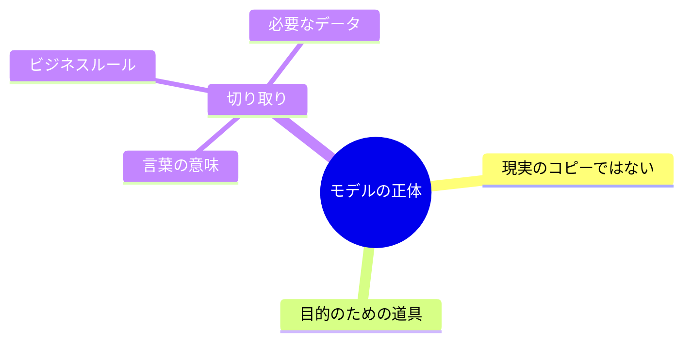
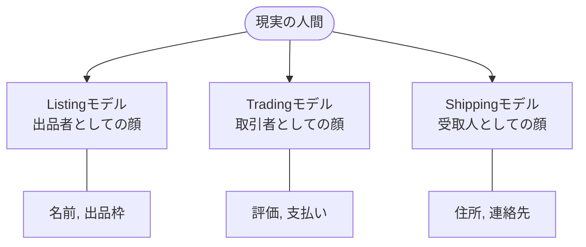
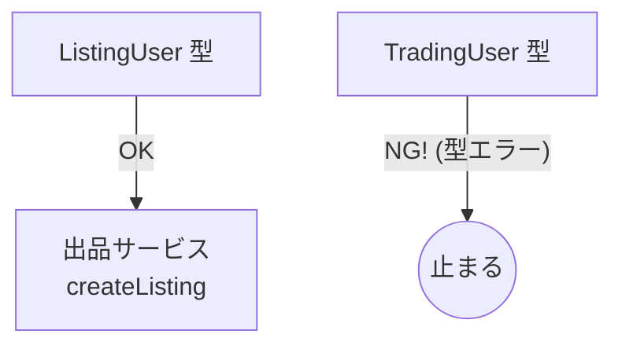

# 第9章 “境界の中のモデル” って何？🧱🧠

## この章でできるようになること🎯✨

* 「モデル」＝何を指すのか、やさしい言葉で説明できる🗣️💡
* 同じ **User** でも、コンテキストごとに **別モデルでOK** な理由がわかる🙆‍♀️🙆‍♂️
* 学内フリマ🛍️の例で、**BCごとに必要な情報（属性）を分けて書ける**📝✨

---

## 1) そもそも「モデル」って何？🧩

モデルは、**現実のコピー**じゃないよ🙅‍♀️
モデルは、**目的のために“必要なところだけ”を切り取った道具**だよ🔧✨


たとえば地図🗺️って、現実をぜんぶ再現してないよね？

でも「目的（迷わず到着する🚶‍♀️）」には十分役に立つ！それがモデルの感覚🧠🌟

**モデル =（その境界の中で）言葉の意味 + ルール + 必要なデータのセット**📦✨



---

## 2) Bounded Context（境界）の中では「モデルが1つに固定される」🧱🔒

BCは、ざっくり言うと
**“言葉の意味がブレない範囲”** だったよね🧷✨

だからBCの中では、

* 同じ単語は、同じ意味で使う🗣️
* ルールも、その意味に合わせて作る⚖️
* データも、その意味に合わせて持つ🗄️

ってなるよ😊

---

## 3) 重要ポイント：同じ「User」でも、BCごとに別モノでOK🙆‍♀️🧡

ここが今日の主役👑✨

**“User” は万能名詞すぎる**から、BCが変わると意味が変わりやすいの🥺🌀
なので、BCごとに **別モデル**に分けるのが自然だよ🌸

* 出品の文脈のUser（出品者としての情報が欲しい）🛍️
* 取引の文脈のUser（購入者/支払い/合意が欲しい）💳
* 配送の文脈のUser（受取先/連絡/配送制約が欲しい）📦



「全部入りUser」を作ると、だいたい後で泣く😭💥
（変更が怖い・影響が読めない・テストがしんどい…）

---

## 4) 学内フリマ🛍️でやってみよう：BC別 “User” の分解例🧠✨

ここでは例として、3つのBCを置くよ📦📦📦

* Listing（出品）🛍️
* Trading（取引）🤝
* Shipping（配送）📦

### 4-1) まず「そのBCで、Userは何者？」を一言で決める🏷️

**User**って言いながら、実際には “役割” を見てることが多いよ👀✨

* ListingのUser：**出品者**（何を出す人？出品できる？）🛍️
* TradingのUser：**取引当事者**（買う/売る、合意、支払い）🤝💳
* ShippingのUser：**受取人**（どこに送る？受け取れる？）📦🏠

この一言が決まると、持つべき情報がスッと絞れる😊✂️

---

### 4-2) 次に「そのBCで必要な情報だけ」を選ぶ🧺✨

ここが“モデルは道具”の実践だよ🔧

例：**同じ人**でも、BCで必要な情報は違ってOK🙆‍♀️
（そして、**必要ない情報は持たない**ほうが強い💪✨）

#### ✅ User情報の例（あくまでサンプル）

| BC             | このBCでのUserの意味 | 例：持ちたい属性（必要最小限）                       |
| -------------- | ------------- | ------------------------------------- |
| Listing（出品）🛍️ | 出品者           | sellerId / 表示名 / 出品停止フラグ / 出品上限（必要なら） |
| Trading（取引）🤝  | 取引当事者         | traderId / 評価 / 支払い手段ID（参照）/ 取引制限フラグ  |
| Shipping（配送）📦 | 受取人           | receiverId / 住所 / 連絡方法（配送連絡）/ 受取可能条件  |

ポイントはこれ👇✨

* 「このBCで判断するルールに必要？」で選ぶ⚖️
* そのBCが“責任を持つ”情報だけを持つ👩‍💻🏷️
* 他のBCの都合の情報は、基本持たない🚫

---

## 5) モデルを分けると何が嬉しいの？🎁✨（超リアル編）

### 5-1) 変更が怖くなくなる😌🛡️

配送の都合で住所の仕様が変わっても、取引モデルが巻き込まれにくい📦➡️🤝
（“User全部入り”だと巻き込まれがち😭）

### 5-2) 用語のケンカが減る🕊️✨

「Userって、出品者のこと？購入者のこと？」問題が消える🧠🌸

### 5-3) テストが軽くなる🧪✨

BC内のモデルが小さい＝テストデータが小さい＝しんどさが減る😊🎉

---

## 6) よくある事故パターン集🚑💥（先に回避しよう）

### 事故①：万能Userクラス（全部盛り）🍱😇➡️😱

* どこで何を使ってるか追えない
* ちょい変更で全部壊れる
* “触ったら負け”オブジェクトになる

**回避**：BCごとに小さく分ける✂️✨

### 事故②：DBのテーブル構造がモデルになっちゃう🗄️➡️🧠😵

テーブルは保存都合、モデルは目的都合！
同じ形である必要はないよ🙆‍♀️✨

### 事故③：別BCのルールを持ち込む🧳🚫

Shippingの制約（住所・配送可否）をTradingに入れ始めると、境界が溶ける🫠
**回避**：「このBCの判断？」って毎回聞く👂✨

---

## 7) TypeScriptミニ演習：BCごとに “別User型” を作ってみる🧸💻

ここでは **「同名でもOK」** を体で覚えるよ🧠✨
（わざと似せた名前にして、混ざる怖さも体感しよう😇）

```ts
// contexts/listing/model.ts
export type ListingUserId = string & { readonly __brand: "ListingUserId" };

export type ListingUser = {
  id: ListingUserId;
  displayName: string;
  canList: boolean;        // 出品できる？
  listingLimit: number;    // 出品上限（例）
};
```

```ts
// contexts/trading/model.ts
export type TradingUserId = string & { readonly __brand: "TradingUserId" };

export type TradingUser = {
  id: TradingUserId;
  reputationScore: number;     // 評価
  tradingRestricted: boolean;  // 取引制限
};
```

```ts
// contexts/shipping/model.ts
export type ShippingUserId = string & { readonly __brand: "ShippingUserId" };

export type ShippingUser = {
  id: ShippingUserId;
  address: {
    postalCode: string;
    line1: string;
    line2?: string;
  };
  contact: {
    email?: string;
    phone?: string;
  };
};
```

### 7-1) 関数もBCごとに「欲しいUser」を指定する📮✨

```ts
// contexts/listing/service.ts
import { ListingUser } from "./model";

export function createListing(user: ListingUser, title: string) {
  if (!user.canList) throw new Error("出品できません");
  if (user.listingLimit <= 0) throw new Error("出品上限です");
  return { listingId: crypto.randomUUID(), title, sellerName: user.displayName };
}
```



これで何が起きるかというと…👀✨
**TradingUser を createListing に渡そうとすると、型で止まる**🛑💡
（「そのUser、出品者の情報持ってないよ？」って言ってくれる😊🧠）

---

## 8) ワーク：あなたのBC別Userを“自分の言葉”で作る📝💖

次の手順でやると迷いにくいよ😊✨

### Step 1️⃣：BCごとに「Userの役割」を一言で書く🏷️

* ListingのUser：＿＿＿＿＿
* TradingのUser：＿＿＿＿＿
* ShippingのUser：＿＿＿＿＿

### Step 2️⃣：そのBCで発生する「判断」を3つ書く⚖️

例（Listingなら）：

* 出品できる？
* 上限超えてない？
* 禁止カテゴリじゃない？

（ここが決まると、必要な属性が見えてくる👀✨）

### Step 3️⃣：必要な属性だけを列挙する🧺✂️

* “あったら便利” じゃなくて “ないと判断できない” を優先💪✨
* 迷ったら **保留** にしてOK（増やすのは後からでもできる）🌱

---

## 9) AI相棒🤖：モデル作りに使うと強い質問テンプレ💬✨

そのままコピペでOKだよ🧸💕

### テンプレ①：BC別Userの属性候補を出す

```text
学内フリマのドメインで、Bounded Context を3つ（Listing/Trading/Shipping）想定しています。
各BCにおける「User」の役割を一言で定義し、必要最小限の属性案をそれぞれ5〜8個提案してください。
属性ごとに「なぜそのBCで必要か（判断/ルール/責務）」も1行で添えてください。
「便利そうだから」ではなく「ないと困る」優先でお願いします。
```

### テンプレ②：盛りすぎチェック（境界を溶かさない）

```text
以下はBC別Userモデル案です。これらの属性のうち、
1) 別BCの都合が混ざっていそうなもの
2) そのBCの責務として持つべきでないもの
を指摘し、削除/移動の提案をしてください。理由も短くお願いします。
（モデル案を貼る）
```

---

## 10) この章のまとめ📦✨

* モデルは **現実のコピーじゃなく、目的のための道具**🔧🗺️
* BCの中では、**言葉の意味・ルール・必要データがセット**で固定される🧱🔒
* 同じ「User」でも、BCが違えば **別モデルでOK**（むしろそれが自然）🙆‍♀️💖
* TypeScriptの型で **境界の混ざり**を早めに止められる🛑🧠✨

---

### （最新情報メモ）TypeScriptの npm パッケージの latest は 5.9.3 として公開されています。([npmjs.com][1])

[1]: https://www.npmjs.com/package/typescript?utm_source=chatgpt.com "TypeScript"
