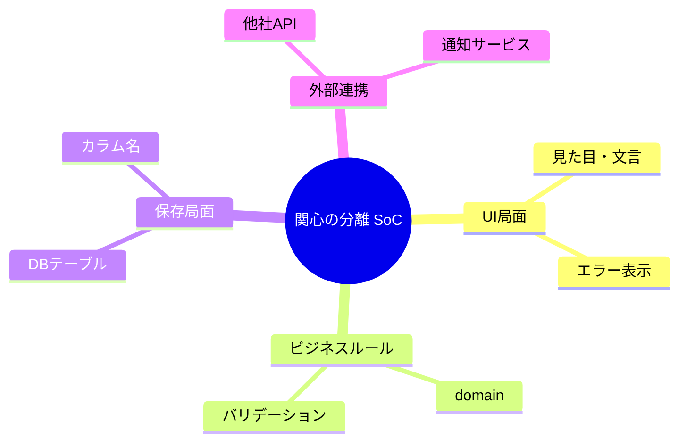
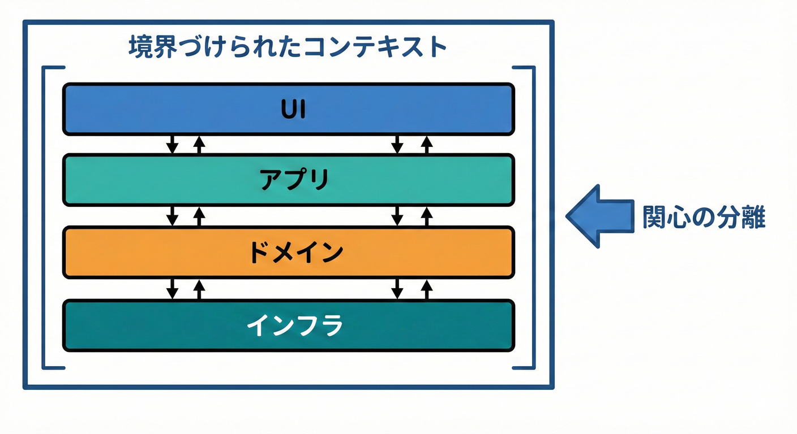
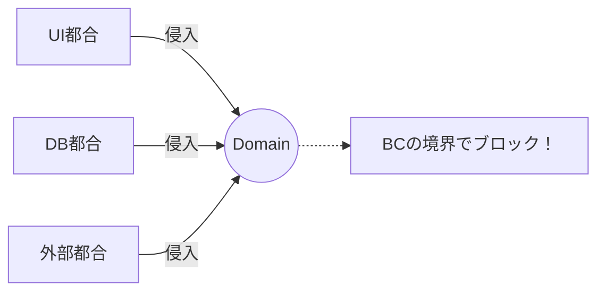
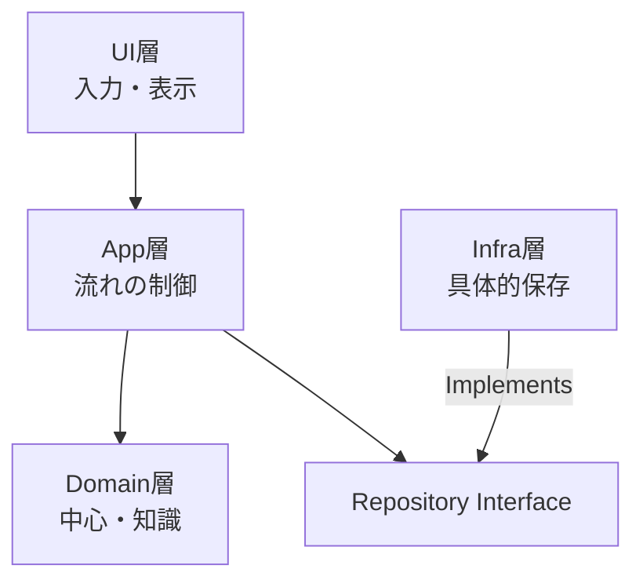

# 第10章 SoC と Bounded Context のつながり🔍🧼

## この章でできるようになること🎯✨

* SoC（関心の分離）って何かを、**ふわっとじゃなく説明**できる🙂🫶
* **BCがSoCの強力なやり方の1つ**だと腑に落ちる🧠💡
* UI都合・DB都合・外部サービス都合が、**ドメインを汚す瞬間**を見分けられる👀🧽
* 「混ぜると困るものリスト」を作って、**設計の守り方**が分かる🧾🛡️

---

## 10.1 SoCってなに？🧁✨

SoCは **Separation of Concerns** の略で、ひとことで言うと…

> 「気にすること（関心）を、混ぜずに分けて置こうね」🍱✨

たとえば、学内フリマ🛍️で「出品」って機能を作るとき…

* 🖥️ 画面の関心：ボタンの位置、入力フォームの見た目、エラーメッセージの文章
* 📜 ルールの関心：出品タイトルは必須、価格は0円NG、説明は2000文字まで
* 🗄️ 保存の関心：DBにどう保存する？どのテーブル？どのカラム？
* 🌐 外部の関心：画像アップロード、通知、決済などの外部サービス連携



これらを**ごちゃ混ぜ**にすると、あとでこうなるよ〜😇➡️😱

* 画面ちょい変更しただけで、ルールが壊れる💥
* DBの都合で、ドメインの言葉が歪む🌀
* 外部サービスのクセで、コードがベタベタに汚れる🧽

---

## 1. 関心の分離（SoC）と BC の関係 🧩✨



「関心の分離」って、プログラミングでよく聞くよね😊
BC（Bounded Context）は、その考え方を **“ドメインの言葉” と “責務のまとまり” に対して、もっと強く適用したもの** だよ🧠🧱

## ✅ SoCが守りたいもの（ざっくり）🍀

* UI・DB・外部連携と、業務ルールを混ぜない🧼
* 変更が起きても、影響範囲を小さくする✂️
* テストしやすくする🧪✨

## ✅ BCが守りたいもの（超ざっくり）🌸

* **同じ言葉が、同じ意味で通る世界**を作る🗣️🔒
* 責任の範囲（何を扱い、何を扱わない）を固定する🏷️📌
* 境界を越えるときは、ちゃんと“翻訳”する🌍➡️🏠

つまり…

* SoC：**混ざると困る関心（UI/DB/外部）を分ける**🍱
* BC：**混ざると困る意味（言葉/ルール/責務）を分ける**🧠🧱

同じ「分ける」でも、BCはより「意味」と「責任」に効くよ💘

---

## 10.3 「混ぜるとヤバい」代表3パターン😇➡️😱

ここ、超大事なので、事故例を3つで覚えちゃおう🧠⚡

---

## パターンA：UI都合がドメインに侵入🖥️➡️📜

### よくある混入物🧨

* 画面文言（「価格を入力してください」みたいな文章）
* 表示形式（「¥1,200」みたいなフォーマット）
* 画面の状態（ローディング中、モーダル開閉など）

### なにが困る？😵

* 画面を変えたら、ドメインロジックまで変更が波及💥
* APIやバッチなど「画面がない入口」でもロジックが使いにくい🙅‍♀️

✅ 目指す感覚：
**ドメインは “ルールの結果” を返すだけ**。
「どう表示するか」はUIが決める🎀

---

## パターンB：DB都合がドメインをねじ曲げる🗄️➡️🧠

### よくある混入物🧨

* DBのカラム名をそのままドメイン名にする
* NULLの都合で「本当は必須」なのに optional が増える
* 正規化/非正規化の都合が、業務ルールに混ざる

### なにが困る？😵

* DB変更＝ドメイン変更になって、変更が怖い😱
* “意味のある型” が消えて、ただのデータ袋になる🌀

✅ 目指す感覚：
ドメインは「意味のある形（型）」で考える💎
DBは「保存の形」🗄️
形が違ってOK🙆‍♀️（だから変換が必要になる✨）

---

## パターンC：外部サービス都合が中心モデルを汚す🌐➡️🧽

### よくある混入物🧨

* 外部APIのフィールド名がそのまま内部に入る
* 外部の状態（status文字列）が、そのまま内部の状態になる
* 外部の欠損値・単位・時刻表現が、そのまま染み込む

### なにが困る？😵

* 外部が変わるたびに内部が壊れる🧨
* “自分のアプリの言葉” が消えて、他人の言葉で生きることに…😇



✅ 目指す感覚：
外部は外部。内部は内部。
境界に **翻訳係**（ACLみたいな役）を置く🛡️🧾

※AI拡張やIDE連携も、ここに近い事故が起きやすいよ⚠️（後で対策やるね🙂）

---

## 10.4 学内フリマで、SoC×BCをコードの形にする📁🔒

ここでは「出品BC（Listing）」を例に、**分け方の型**を作るよ🧸✨

## ざっくり構造イメージ📦

```text
src/
  contexts/
    listing/
      domain/        # ルールと意味の中心🧠
      app/           # ユースケース（入口の流れ）🎮
      infra/         # DB/外部連携🗄️🌐
      ui/            # 画面・APIハンドラ🖥️📡


```

ポイントはこれ👇✨

* domainは「意味」と「ルール」だけ🧠📜
* appは「やる順番」だけ（ドメインを呼ぶ係）🎮
* infraは「保存や外部の具体」だけ🗄️🌐
* uiは「入力→呼び出し→表示」だけ🖥️

---

## ミニ例：価格のルールは domain に置く🪙🔒

```ts
// src/contexts/listing/domain/money.ts
export class Money {
  private constructor(private readonly yen: number) {}

  static create(yen: number): Money {
    if (!Number.isInteger(yen)) throw new Error("価格は整数でね🙏");
    if (yen <= 0) throw new Error("価格は1円以上だよ💦");
    return new Money(yen);
  }

  value(): number {
    return this.yen;
  }
}
```

✅ ここが大事💡

* 「¥1,200」みたいな表示は **domainに入れない**🧼
* エラーメッセージの文章は最小限でOK（UIで差し替えてもOK）🎀

---

## ミニ例：保存は interface で切る🧾✂️

```ts
// src/contexts/listing/domain/listingRepository.ts
import { Listing } from "./listing";

export interface ListingRepository {
  save(listing: Listing): Promise<void>;
  findById(id: string): Promise<Listing | null>;
}
```

domainは「保存したい気持ち」だけ持つ☺️
「どのDB？どう保存？」は知らない🙅‍♀️✨

---

## ミニ例：ユースケースは app に置く🎮✨

```ts
// src/contexts/listing/app/createListing.ts
import { Money } from "../domain/money";
import { ListingRepository } from "../domain/listingRepository";
import { Listing } from "../domain/listing";

export type CreateListingInput = {
  title: string;
  priceYen: number;
};

export class CreateListing {
  constructor(private readonly repo: ListingRepository) {}

  async execute(input: CreateListingInput): Promise<{ listingId: string }> {
    const price = Money.create(input.priceYen);
    const listing = Listing.create({ title: input.title, price });

    await this.repo.save(listing);

    return { listingId: listing.id() };
  }
}
```

✅ app層は「処理の流れ」担当🧭

* 入力を受け取る
* domainの型に変換
* domainのルールに通す
* repoで保存

---

## ミニ例：DBは infra に閉じ込める🗄️🔒

```ts
// src/contexts/listing/infra/inMemoryListingRepository.ts
import { ListingRepository } from "../domain/listingRepository";
import { Listing } from "../domain/listing";

export class InMemoryListingRepository implements ListingRepository {
  private store = new Map<string, Listing>();

  async save(listing: Listing): Promise<void> {
    this.store.set(listing.id(), listing);
  }

  async findById(id: string): Promise<Listing | null> {
    return this.store.get(id) ?? null;
  }
}
```

まずはインメモリでOK🙆‍♀️
SoCができてると、あとでDBに差し替えても「domain/app」が揺れにくいよ✨

---

## 10.5 今日の成果物「混ぜると困るものリスト」🧾⚠️

ここからが本題のアウトプットだよ📝✨
下のテンプレを埋めていこう🙂💕

## テンプレ📄

* 🖥️ UI都合（例：画面文言、表示形式、画面状態）

  * 例：
  * 例：
  * 例：

* 🗄️ DB都合（例：カラム名、NULL事情、保存形式）

  * 例：
  * 例：
  * 例：

* 🌐 外部都合（例：外部APIの命名、単位、欠損、状態）

  * 例：
  * 例：
  * 例：

* 🧠 意味の衝突（例：同じ単語が別の意味）

  * 例：
  * 例：
  * 例：

💡 コツ：
「それ、domainに入った瞬間に “意味” が歪む？」って自問すると見つけやすいよ🧠🔍

---

## 10.6 ミニ演習3つ🧪✨

## 演習1：これはどの関心？仕分けゲーム🍱🎮

次の要素を、4カテゴリに振り分けてみよう👇
（UI / ドメイン / 保存 / 外部）

* 「価格は1円以上」
* 「¥1,200の表示」
* 「フォームのプレースホルダー文言」
* 「Listingsテーブルのprice_yenカラム」
* 「外部決済のstatus = authorized」
* 「出品できるのは学内ユーザーだけ」
* 「画像アップロードの署名付きURL」
* 「DBのインデックス設計」

✅ 目安：
“ルール” はドメイン寄り、
“見せ方” はUI寄り、
“保存の形” は保存寄り、
“他人の世界” は外部寄り🌍✨

---

## 演習2：混ぜ混ぜ関数を分けよう🧽✂️

下みたいな関数があったら、どこが混ざってる？を指摘して、**3つに分割**してみよう🙂

```ts
function createListingFromForm(form: { title: string; priceText: string }) {
  if (form.title.trim() === "") alert("タイトル必須です"); // UI文言
  const yen = Number(form.priceText.replace("¥", ""));   // 表示形式に依存
  if (yen <= 0) throw new Error("invalid");              // ルール

  // DB都合が混入（例）
  return { listing_title: form.title, price_yen: yen, created_at: new Date().toISOString() };
}
```

✅ 目標：

* UI：入力チェックやメッセージ（ただしルールの本体は持たない）
* domain：価格やタイトルのルール
* infra：保存用の形（カラム名など）

---

## 演習3：自分のBCに「立入禁止」看板を立てる🚧🏷️

「出品BC」のdomainに、これ禁止！って3つ書いてみよう🙂✨

例👇

* 「画面文言を入れない」🖥️🚫
* 「DBのカラム名を型名にしない」🗄️🚫
* 「外部status文字列をそのまま状態にしない」🌐🚫

---

## 10.7 AI相棒の使い方🤖💬

AIはめちゃ便利だけど、**SoCの観点**で使うと爆伸びするよ📈✨
（依頼の仕方＝観点が命🔥）

## 仕分け依頼🧺

* 「この関数の中にある関心を “UI / domain / infra” に分類して、混入点を指摘して」🧠🔍

## 分割依頼✂️

* 「domainに残すべきルールだけ抽出して、TypeScriptのクラス/関数にして」🧱✨

## 入口依頼🚪

* 「app層のユースケースとして、入力→変換→domain呼び出し→repo保存の流れを書いて」🎮🧭

---

## 10.8 AI拡張を使うときの安全メモ🔐⚠️

AI拡張は便利だけど、「拡張機能マーケット」には危ないものも混ざることがあるよ🥲
最近、VS Codeの“AIっぽい”拡張が**データを抜く**ケースが報告されてる⚠️ ([TechRadar][1])
さらに、AI入りIDE全般で「プロンプト注入」などを入口に、情報漏えいや危険な動作につながる研究報告も出てるよ🧯 ([Tom's Hardware][2])

だから、最低限これだけは守ろう👇🧸🛡️

* 拡張は「提供元・実績・レビュー」を確認してから入れる👀
* 怪しい“AIアシスタント拡張”を増やしすぎない（特に用途かぶり）🧨
* リポジトリ内の指示ファイルやREADMEの“見えない指示”に注意（コピペ誘導など）🕵️‍♀️
* 機密（APIキー等）はワークスペースに平文で置かない🔑🚫
* AIに「秘密情報を貼らない」ルールを自分に課す🙅‍♀️💦

---

## 10.9 2026/02時点の小ネタ🍀

* TypeScript 5.9系では `import defer` など、モジュール実行タイミングをコントロールする提案への対応が入ってるよ（挙動を理解して使うと事故りにくい）🧠✨ ([typescriptlang.org][3])
* TypeScriptはネイティブ移行に向けたプレビューも配布されていて、`@typescript/native-preview` で試せるよ⚡ ([Microsoft for Developers][4])
* さらに、将来のネイティブ移行（TypeScript 7系）に向けた進捗とロードマップも公式が継続的に出してるよ🗺️✨ ([Microsoft for Developers][5])

この流れがあるからこそ、**UI/DB/外部の都合をdomainから分離しておく**のが、将来の変化にめちゃ強い💪😊

---

## この章のまとめ🧁✨

* SoCは「関心を混ぜない」🍱
* BCは「意味と責任を混ぜない」🧠🧱
* 混入しやすいのは **UI都合・DB都合・外部都合** の3つ😇➡️😱
* 成果物は「混ぜると困るものリスト」🧾⚠️
* domainを守れると、変更が怖くなくなる🛡️💕

---

## 自己チェック✅✨

* [ ] domainに画面文言や表示形式が入ってない🖥️🚫
* [ ] domainがDBカラム名やNULL事情に引っ張られてない🗄️🚫
* [ ] 外部の命名やstatusが、そのまま内部モデルに入ってない🌐🚫
* [ ] 境界を越えるところで「変換/翻訳」ポイントが言える🧾✨
* [ ] 「混ぜると困るものリスト」が埋まってる📝💮

[1]: https://www.techradar.com/pro/security/malicious-microsoft-vscode-ai-extensions-might-have-hit-over-1-5-million-users "Malicious Microsoft VSCode AI extensions might have hit over 1.5 million users | TechRadar"
[2]: https://www.tomshardware.com/tech-industry/cyber-security/researchers-uncover-critical-ai-ide-flaws-exposing-developers-to-data-theft-and-rce "Critical flaws found in AI development tools are dubbed an 'IDEsaster' — data theft and remote code execution possible | Tom's Hardware"
[3]: https://www.typescriptlang.org/docs/handbook/release-notes/typescript-5-9.html?utm_source=chatgpt.com "Documentation - TypeScript 5.9"
[4]: https://devblogs.microsoft.com/typescript/announcing-typescript-native-previews/?utm_source=chatgpt.com "Announcing TypeScript Native Previews"
[5]: https://devblogs.microsoft.com/typescript/typescript-native-port/ "A 10x Faster TypeScript - TypeScript"
