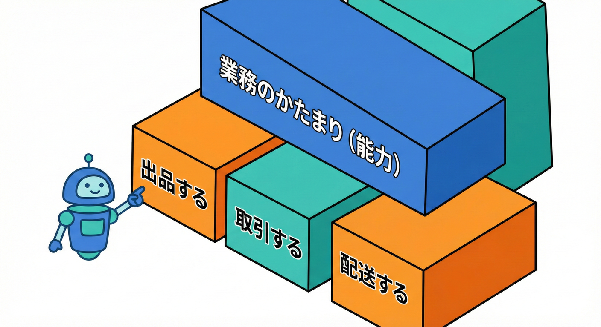
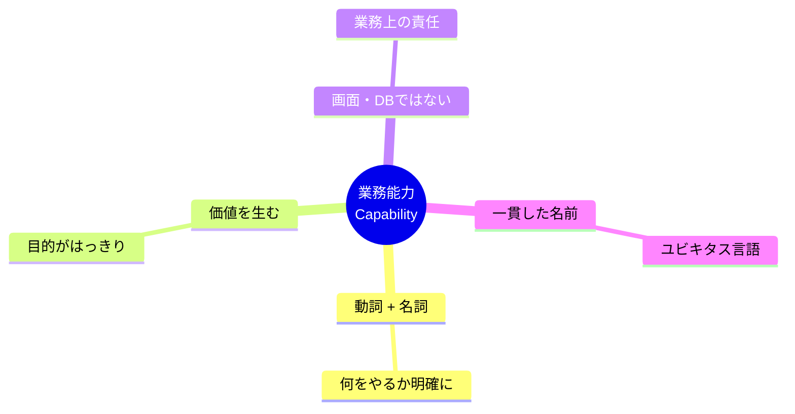
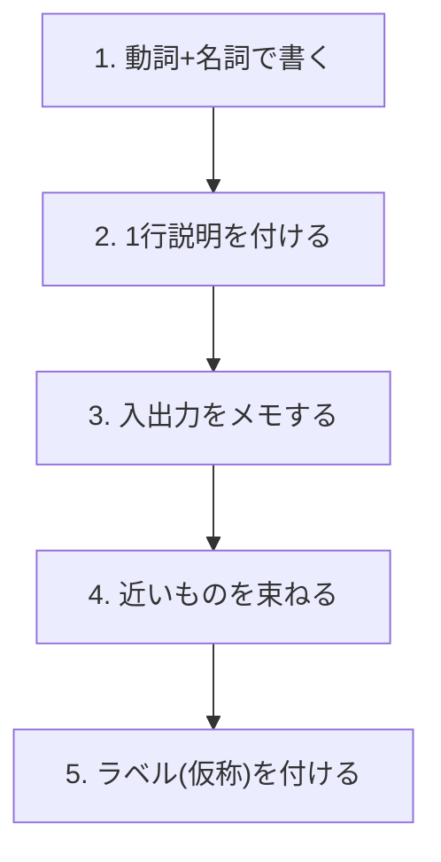
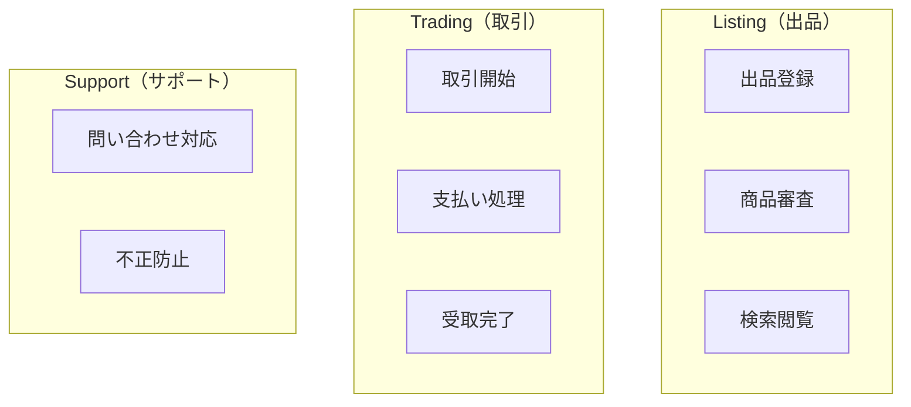

# 第11章 まず “業務のかたまり（能力）” を並べる🧱📋✨

## この章のゴール🎯🌸

* 「境界づけられたコンテキスト（BC）」を考える前に、材料になる **“業務のかたまり（能力 / Capability）”** を集められるようになるよ🧺✨
* 最終的に **能力リスト（ざっくりでOK）** を作って、次の章で「イベントで切る」に進める状態にするよ🚶‍♀️💨

---

## 1) “能力（Capability）”ってなに？🧠💡



**能力＝「誰かのために、ある価値を生み出す“仕事の単位”」**だよ😊✨
たとえば学内フリマなら…

* 「出品できるようにする」🛍️
* 「支払いを成立させる」💳
* 「発送できるようにする」📦
* 「トラブルを解決する」🧯

みたいな感じ！
ここで大事なのは、**画面（UI）やDBのテーブルじゃなくて、“やってる仕事”で考える**ことだよ🧼✨



> BCは「ドメインを理解して分ける」流れの中で作っていく、っていう説明がよくあるよ📚（まずドメイン分析→BC定義、みたいな順番）([Microsoft Learn][1])

---

## 2) なんで能力を並べると、境界候補が見えてくるの？🔎✂️

BCって、いきなり正解が降ってくるものじゃないの🥺
でもね、能力を並べると…

* **“責任”のまとまり**が見える👀✨（出品の責任、決済の責任…）
* **ルールが違う場所**が見える⚖️（キャンセル規約、手数料、禁止行為…）
* **言葉の意味がズレる場所**が見える🗣️🌀（同じ「ユーザー」でも役割が違う！）

結果として、**「ここで境界切ったほうがよさそう」**が出てくるの🎀
（能力のまとまりとBCを結びつけて考える話は、Capability→BCの方向で語られることが多いよ）([Architecture & Governance Magazine][2])

---

## 3) 能力リストの作り方：5ステップ🪄📝



### Step 1：動詞＋名詞で書く✍️✨

能力名は **「〜を管理する」「〜を成立させる」「〜を通知する」**みたいに、動きがわかる形にするよ🏃‍♀️💨

* 出品を登録する🛍️
* 取引を成立させる🤝
* 支払いを処理する💳
* 配送を手配する📦
* 問い合わせに対応する📩

### Step 2：1行説明をつける🧸

「何のための能力？」がブレないように、**一言で目的**を書くよ😊

例：

* 支払いを処理する：取引の代金を安全に回収し、支払い状態を確定する💳🔒

### Step 3：入出力（きっかけ／結果）をメモする📣➡️🎁

* きっかけ：購入ボタンが押された🛒
* 結果：支払い完了になった✅

### Step 4：似てるものを束ねる🧩

あとで境界候補にしやすいように、**近い仕事をグルーピング**するよ📦✨
（この時点では、きれいに分けようとしなくてOK🙆‍♀️）

### Step 5：束に“ラベル（仮の名前）”をつける🏷️

例：

* 出品まわり →「Listing（出品）」
* 取引まわり →「Trading（取引）」
* 配送まわり →「Shipping（配送）」

* **束に“ラベル（仮の名前）”をつける🏷️**



※このラベルが、後でBC名の候補になりやすいよ🎯

---

## 4) 学内フリマ例：能力リスト（ざっくり版）🏫🛍️✨

まずは **“多めに”** 出すのがコツだよ🌈（削るのは後でOK✂️）

| 能力（動詞＋名詞）       | 1行で目的             | よく出てくる言葉（例）     |
| --------------- | ----------------- | --------------- |
| 出品を登録する🛍️      | 商品を公開できるようにする     | 出品、商品、価格、画像     |
| 出品を審査する🕵️‍♀️   | 規約違反を防ぐ           | 禁止品、通報、公開/非公開   |
| 検索・閲覧を提供する🔎    | 欲しい物を見つけやすくする     | カテゴリ、キーワード、並び替え |
| 取引を開始する🤝       | 購入意思を確定して取引を作る    | 購入、取引、在庫        |
| 支払いを処理する💳      | 代金を回収して状態を確定する    | 支払い、手数料、決済状態    |
| 発送を手配する📦       | 配送情報を確定し発送へ進める    | 住所、配送方法、追跡      |
| 受け取り完了にする✅      | 取引を完了状態へ          | 受取、評価、完了        |
| 返金・キャンセルを処理する↩️ | 例外対応を安全に行う        | キャンセル、返金、期限     |
| 問い合わせに対応する📩    | 困りごとを解決する         | 問い合わせ、チケット、対応履歴 |
| 通知する🔔          | 状態変化を関係者へ伝える      | メール、プッシュ、通知履歴   |
| 学内本人確認を扱う🪪     | 学内ユーザーとしての信頼を担保する | 学籍、認証、権限        |
| 不正・荒らしを防止する🧯   | 安全な場を守る           | 通報、制限、凍結        |

この表は、後の章（イベント、ルール、データ寿命…）で “切り口” を増やして、境界案に育てていくよ🌱✨

---

## 5) 便利な「能力カード」テンプレ🃏✨

能力を1枚カードとして扱うと、境界を考えるときに超ラクだよ😊

* 能力名（動詞＋名詞）：
* 目的（1行）：
* 主な登場人物（誰が使う？）：
* きっかけ（何が起きたら動く？）：
* 結果（終わったら何が残る？）：
* 大事なルール（3つまで）：
* 大事なデータ（名詞で）：
* 外部に頼るもの（あれば）：

---

## 6) ミニ演習（この章の“手を動かす”パート）📝💪✨

### 演習A：能力を12個出してみよう🌈

学内フリマで、上の表を参考にしつつ **最低12個** 書くよ🧸
ポイントは「細かすぎなくてOK」🙆‍♀️
（例：通知は1つにまとめてOK、まずは粗く！）

### 演習B：3〜5グループに束ねよう📦📦📦

出した能力を、直感でいいから束ねてね😊
例：

* 出品まわり🛍️
* 取引まわり🤝
* 配送まわり📦
* サポート/安全まわり🧯
* アカウント/信頼まわり🪪

### 演習C：用語がズレそうな単語に★を付けよう⭐

同じ言葉でも意味が変わりやすい単語に★をつけてね✨
例：

* ユーザー★（購入者？出品者？運営？）
* 状態★（支払い状態？配送状態？取引状態？）
* キャンセル★（購入側？運営側？期限は？）

この★が増える場所は、**境界の匂い**がしやすいよ👃💡

---

## 7) AI相棒🤖✨に投げる質問テンプレ（コピペOK）

### テンプレ1：能力を“動詞＋名詞”で増やす🧠💥

```text
学内フリマのドメインで、業務のかたまり（能力）を「動詞＋名詞」で20個出して。
UIやDBではなく業務の責任で。重複しそうなら似ているものもあえて出してOK。
各能力に1行の目的も付けて。
```

### テンプレ2：能力をグルーピングして“境界候補”を作る📦🏷️

```text
この能力リストを3〜5グループにまとめて、各グループに境界候補の名前を付けて。
「なぜそのまとまりか」を1〜2行で説明して。
用語が衝突しそうな単語があれば列挙して。
```

### テンプレ3：“混ぜると事故りそう”を指摘させる🚑⚠️

```text
この能力リストで、同じモデル（例：User, Order, Status）を共有すると壊れそうな箇所を指摘して。
「何がズレるか」を具体例つきで。
```

---

## 8) よくある失敗あるある😵‍💫➡️🙂

### 失敗1：画面ごとに能力を作っちゃう📱

* ❌「出品画面」「購入画面」
* ✅「出品を登録する」「取引を開始する」
  画面は変わりやすいけど、業務の責任は比較的安定しやすいよ🧱✨

### 失敗2：技術の都合で切っちゃう🗄️

* ❌「DBアクセス」「API層」
* ✅「支払いを処理する」「返金を処理する」
  技術はあとから変えられるけど、業務の責任がブレると設計が迷子になりやすいよ🧭💦

### 失敗3：細かすぎて“能力100個”になる🐜

最初は粗くてOK🙆‍♀️
次の章以降で、イベントやルールを見ながら自然に分割が起きるよ🌱

---

## 9) この章の成果物📦✨

* 能力リスト（12個以上）📝
* 3〜5のグループ分け（仮でOK）📦
* ★マーク付きの「ズレそう単語リスト」⭐

---

## 10) 小さな最新メモ（今のTypeScriptの流れ）🧸💻🌱

* npm上のTypeScriptは **5.9.3** がLatestとして表示されているよ（2025-09-30公開、直近数か月はこのラインが安定版として扱われている状態）([npm][3])
* それとは別に、**ネイティブ実装のプレビュー**が公開されていて、TypeScript 7に向けた進捗も公式ブログで継続的に共有されているよ🧪🚀([Microsoft for Developers][4])

（この章の作業自体は“業務の切り分け”なので、ここは「へぇ〜」くらいでOKだよ😊）

---

## まとめ🧁✨

能力（業務のかたまり）を並べると、境界の材料がそろうよ🧺
次の章からは、その材料を **「イベント」「ルール」**みたいな切り口でさらに強くしていくよ📣⚖️✨

[1]: https://learn.microsoft.com/en-us/azure/architecture/microservices/model/domain-analysis?utm_source=chatgpt.com "Using domain analysis to model microservices"
[2]: https://www.architectureandgovernance.com/elevating-ea/dds-bounded-context-canvas-and-capabilities/?utm_source=chatgpt.com "DDS - Bounded Context Canvas and Capabilities"
[3]: https://www.npmjs.com/package/typescript?utm_source=chatgpt.com "TypeScript"
[4]: https://devblogs.microsoft.com/typescript/announcing-typescript-native-previews/?utm_source=chatgpt.com "Announcing TypeScript Native Previews"
