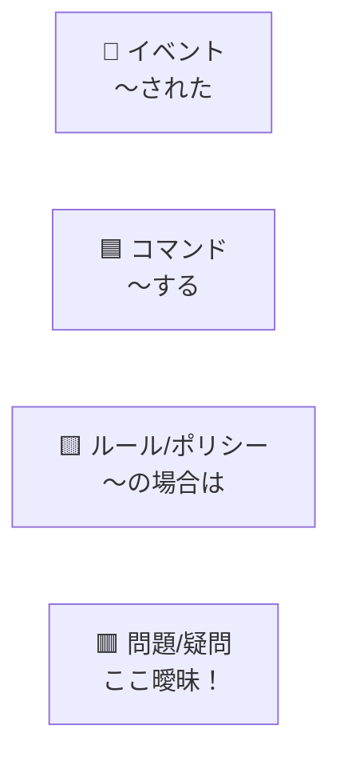
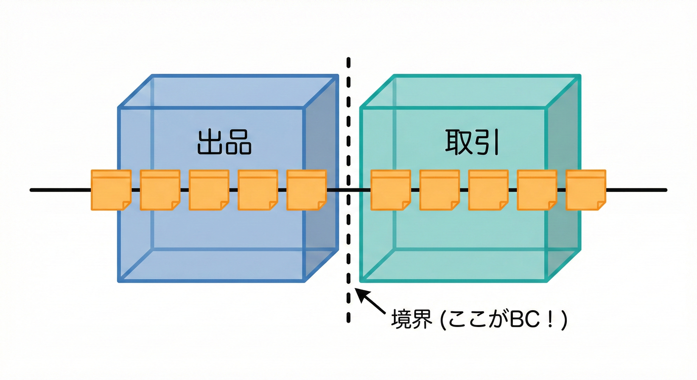
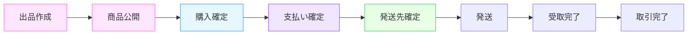
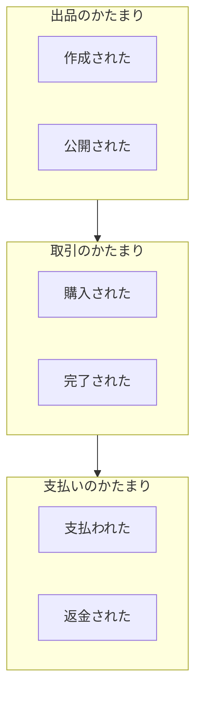

# 第12章 イベントで切る（Event Storming風ミニ）📣🕰️✨

## ねらい🎯

「何が起きる？」を時系列に並べて、**境界（BC）の候補**を見つけられるようになるよ😊✨
今日は“ガチのワークショップ”じゃなくて、**1人でもできる EventStorming 風ミニ**で進めるよ🧸🌸

---

## 12.1 EventStormingってなに？🧡📝

EventStorming（公式表記は **EventStorming** で1語だよ🧡）は、ドメインの出来事を**付箋でワーッと並べて**、業務の流れやルールの分かれ目を見つけるやり方だよ😊
中心になるのは **Domain Event（ドメインイベント）**で、基本は **過去形の動詞**で書くのがコツ！
例：「出品された」「購入された」「支払いが確定した」みたいにね🧡✨ ([ウィキペディア][1])

---

## 12.2 今日やる “EventStorming風ミニ” の完成物🎁✨

この章のゴールはこれだよ👇😊

* ✅ **イベント列（時系列）**：何が起きるかを並べたもの⏳
* ✅ **イベントのかたまり（クラスター）**：似た出来事のグループ📦
* ✅ **境界候補メモ**：「ここ、別コンテキストかも？」の当たり🎯
* ✅ **用語メモ**：「同じ言葉なのに意味違う！」のメモ🗣️📝

---

## 12.3 準備するもの🧰✨

* 付箋アプリでも、ノートでも、MarkdownでもOK📌
* 色分けは“気分”でいいけど、迷ったらこれ👇（本家の雰囲気）

  * 🧡イベント（Domain Event）
  * 🟦コマンド（「〜する」）
  * 🟨ルール/ポリシー（「〜の場合は…」）
  * 🟥問題/疑問（「ここ曖昧！」）
  * 🟥問題/疑問（「ここ曖昧！」）
    EventStormingは付箋色を使う文化があるよ〜くらいの理解でOK😊 ([ウィキペディア][1])



---

## 2. 実際にやってみよう🖋️✨



手順はかんたん😊👇
## ステップ0：対象シーンを1つに絞る🎬

いきなり全部やると散らかるので、今日はこれに絞るよ👇
**「出品 → 購入 → 支払い → 発送 → 受取」**📦➡️🎁

---

## ステップ1：イベント（過去形）を“思いつく限り”書く🧡📝

コツは2つだけ😊

* **過去形**にする（起きた事実）
* **業務的に意味がある出来事**を書く

まずは例として、こんな感じ👇（あとで増やしてOK）🧡

* 🧡 取引が完了した



「イベントは過去形の動詞」っていう原則に沿ってるよ🧡 ([ddd-crew.github.io][2])

---

## 1. なぜ「イベント」から入るの？⏳👀


BCを見つける時、「データ（テーブル）」から考えると、どうしても大きな1つの塊になっちゃいがちだよ😵‍💫
（紙でも、付箋アプリでも、MarkdownでもOK！）

例（ざっくり）👇

1. 🧡 出品が作成された
2. 🧡 商品情報が公開された
3. 🧡 購入が確定した
4. 🧡 支払いが確定した
5. 🧡 発送先が確定した
6. 🧡 発送された
7. 🧡 受取が完了した
8. 🧡 取引が完了した

---

## ステップ3：“混ざると危険”を赤で刺す🟥⚠️

並べていると、だいたいここで「あれ？」が出るよ😊
疑問や事故の匂いは🟥で刺す！

例👇

* 🟥 「購入が確定した」って **支払い前？後？**
* 🟥 キャンセルはどこで起きる？（購入後？支払い後？発送後？）
* 🟥 “購入者” と “受取人” は同じ人？別人あり？
* 🟥 “出品取り下げ” はいつでもできる？

この🟥が、あとで境界やルールを切るヒントになるよ🧠✨

---

## ステップ4：イベントを“かたまり”で囲む📦✨（ここが境界候補！）

次に、イベントを眺めて「近いもの」をまとめるよ😊
ポイントは **同じ目的・同じ関心**っぽいものが集まること！

例として、こう分かれやすい👇

### 📦 出品（Listingっぽい）

* 出品が作成された
* 商品情報が公開された
* （取り下げされた）

### 📦 取引（Tradingっぽい）

* 購入が確定した
* 取引が開始された
* 取引が完了した
* （キャンセルされた）

### 📦 支払い（Paymentっぽい）

* 支払いが確定した
* （支払いが失敗した）
* （返金が確定した）

### 📦 発送（Shippingっぽい）

* 発送先が確定した
* 発送ラベルが発行された
* 発送された
* 受取が完了した



この「かたまり」＝ **境界候補（BC候補）**になりやすいよ🎯✨
EventStormingは、こういう“業務の流れ”をイベントで見える化して合意を作るのが得意なんだ🧡 ([ウィキペディア][1])

---

## ステップ5：用語のズレをメモする🗣️📝（BCの種🌱）

イベントの近くに「そのとき出てくる言葉」をメモするよ😊
この時点で、ズレが出やすい！

例👇

* 「購入」：支払い前の仮押さえ？支払い完了？
* 「取引」：購入と同じ？発送まで含む？
* 「ユーザー」：出品者？購入者？運営？
* 「住所」：購入者のプロフィール？取引ごとの配送先？

この“言葉の意味が変わる場所”が、境界を切る強い根拠になるよ🧠✨

---

## 12.5 ありがちな失敗あるある😇➡️😱（回避テク付き）

## 失敗①：イベントが「作業」になってる🌀

* ❌「出品画面を開いた」
* ✅「出品が作成された」
  画面操作じゃなくて、**業務的に意味がある結果**を書くよ😊

## 失敗②：名詞だらけで止まる🧊

* ❌「出品」「購入」「発送」
* ✅「出品が作成された」「購入が確定した」「発送された」
  **過去形の動詞**にすると進む！🧡 ([ddd-crew.github.io][2])

## 失敗③：最初から境界を決めにいく😵

今日は“発見”の日だよ😊
境界の確定は次章以降の判断フェーズでやるので、まずは材料集め🧺✨

---

## 12.6 TypeScriptミニ演習💻🧡：イベントを“型”で並べてみよう

イベントを雑にでも型にすると、**言葉の粒度**が揃って気持ちいいよ😊✨

```typescript
// まずは「イベント名」を型で表現（細かすぎなくてOK！）
type DomainEventName =
  | "ListingCreated"
  | "ListingPublished"
  | "PurchaseConfirmed"
  | "PaymentConfirmed"
  | "ShippingAddressConfirmed"
  | "LabelIssued"
  | "Shipped"
  | "Delivered"
  | "TradeCompleted";

type DomainEvent = {
  name: DomainEventName;
  at: number;           // 並べ替え用（簡易タイムライン）
  note?: string;        // 疑問や補足
};

// 例：イベント列（超ミニ）
const timeline: DomainEvent[] = [
  { name: "ListingCreated", at: 10 },
  { name: "ListingPublished", at: 20 },
  { name: "PurchaseConfirmed", at: 30, note: "支払い前？後？" },
  { name: "PaymentConfirmed", at: 40 },
  { name: "ShippingAddressConfirmed", at: 50 },
  { name: "LabelIssued", at: 60 },
  { name: "Shipped", at: 70 },
  { name: "Delivered", at: 80 },
  { name: "TradeCompleted", at: 90 },
];

// 時系列に整列
const sorted = [...timeline].sort((a, b) => a.at - b.at);
console.log(sorted);
```

## ちょい課題📝✨

* `note` を増やして、🟥疑問を3つ以上入れてみよう
* `DomainEventName` を **最低5つ追加**して、流れを豊かにしてみよう

  * 例：「ListingWithdrawn」「PaymentFailed」「TradeCanceled」「RefundConfirmed」など💡

---

## 12.7 AI相棒🤖への質問テンプレ（コピペOK）✨

## ① イベント出しを増やす🧡

```text
学内フリマの「出品→購入→支払い→発送→受取」の流れについて、
ドメインイベント（過去形の出来事）をできるだけ多く列挙して。
粒度は「業務的に意味のある結果」にして、画面操作は避けて。
```

## ② 抜け漏れチェック✅

```text
このイベント列を見て、典型的に抜けがちなイベント（失敗・例外・キャンセル・返金など）を追加提案して。
追加理由も一言ずつ添えて。
```

## ③ 境界候補の“かたまり”提案📦

```text
このイベント列を、境界（Bounded Context）候補のかたまりに分類して。
分類の根拠（関心・ルール・データの寿命など）も短く書いて。
```

---

## 12.8 まとめ🧸✨（この章でできるようになったこと）

* 🧡 ドメインイベントを **過去形**で並べられるようになった ([ddd-crew.github.io][2])
* ⏳ 時系列で流れを見て、🟥疑問（事故の匂い）を刺せるようになった
* 📦 イベントの“かたまり”から **境界候補（BC候補）**を作れるようになった ([ウィキペディア][1])
* 🗣️ 言葉のズレをメモして、境界の根拠を増やせるようになった

[1]: https://en.wikipedia.org/wiki/Event_storming?utm_source=chatgpt.com "Event storming"
[2]: https://ddd-crew.github.io/eventstorming-glossary-cheat-sheet/?utm_source=chatgpt.com "EventStorming Glossary & Cheat sheet - ddd-crew.github.io"
