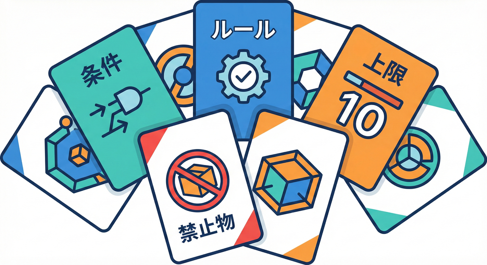
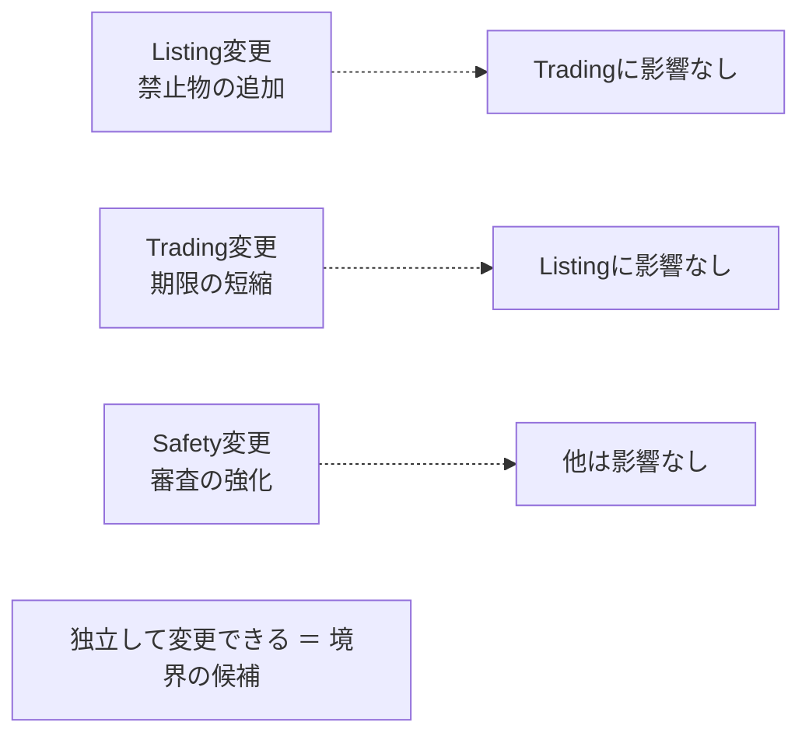
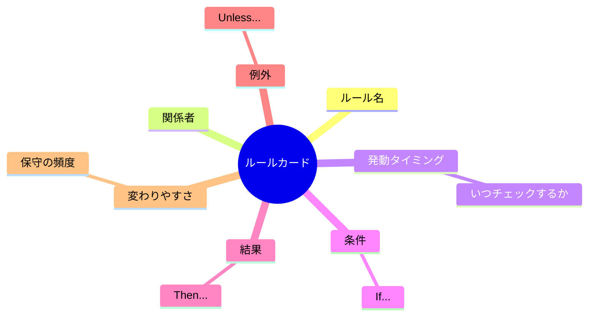
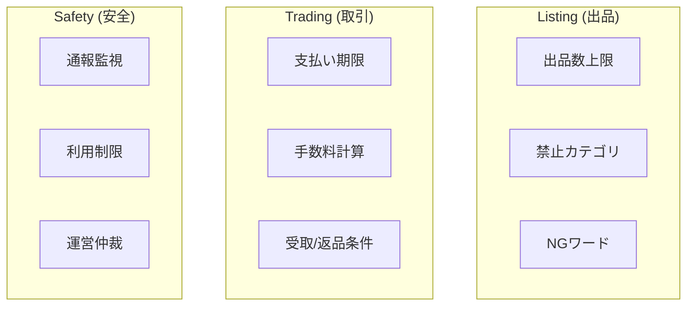

# 第13章 ルールの違いで切る⚖️🧠

([Past chat][1])

## この章のゴール🎯✨

* 「ルール（業務ルール）」を見つけて、カードみたいに整理できる🃏📝
* ルールが **似てる/違う** を見て、境界（BC）の候補を作れる✂️📦
* 最後に「ルールのまとまり」を **3つ** 作れる🧩🧩🧩

---

## 1. なぜ「ルール」が境界になるの？⚖️🧱



「同じ商品を扱う」にしても、出品のルールと取引のルールは全然違うよね？😊

> 「こういう条件のとき、こうしなきゃいけない」っていう決まりごと📌

たとえば学内フリマだと…🛍️🏫

* 出品は1人10件まで！🔟
* 禁止物（薬・危険物など）は出品NG！🚫
* 購入後24時間以内に支払いがないと自動キャンセル！⏰
* 返品できる/できない条件がある！📦↩️
* 手数料はカテゴリによって違う！💰

この「決まり方」が **違う場所** は、境界になりやすいんだよ〜⚖️✨

---

## 2) ルールの違いが「境界」を教えてくれる理由🧭✨

ルールで切ると何がうれしいの？🎁
ポイントはこの3つ👇

## ① 変わるタイミングが違う🌀

* 出品ルールだけ頻繁に変わる（例：禁止物の追加）🧾
* 取引ルールだけ変わる（例：支払い期限の変更）⏳
* 運営ルールだけ変わる（例：通報の扱いを厳しく）🚨

**変わる理由が違う**＝別の“都合”で動いてる、ってことになりがち💡



## ② 責任者（判断する人）が違う👩‍💼👩‍🏫🧑‍🔧

* 学生の体験を良くしたい人🙂
* お金やトラブルを減らしたい人💰🛡️
* 安全・規約・通報を見てる人🚨📜

責任者が違うと、ルールの言葉も判断もズレやすいよね🌀

## ③ 例外の出方が違う🌪️

例外が増えるほど、コードも会話もゴチャる😵‍💫
だから **例外の性質が違う場所** は分けたくなる✂️✨

---

## 3) 手順：ルールで境界候補を作る “5ステップ” 🪜🧩

## Step 1：ルールを集める🧲📝

ユースケース（出品・購入・発送）から、「決まりごと」を抜くよ🔎✨
**“must/should/can’t”** っぽい文が見つかったら、それはルール候補📌

## Step 2：ルールカードにする🃏

ルールを **1枚＝1ルール** にするのがコツ！
ごちゃ混ぜを防げるよ🧼✨

**ルールカードのテンプレ👇**

* ルール名：
* だれに関係？（出品者/購入者/運営…）
* いつ発動？（出品時/購入時/発送時…）
* 条件：
* 結果：
* 例外：
* 変わりやすさ：高/中/低



## Step 3：カードを「似てるもの同士」で束ねる🧩

束ね方は雑でOK🙆‍♀️
まずは “ざっくり3束” を目標にするよ🎀

## Step 4：束に名前をつける🏷️✨

名前は **業務の言葉** で！
例：Listing（出品） / Trading（取引） / Trust&Safety（安全）など📦

## Step 5：境界の確認質問をする❓

束ごとに、こう聞けたら強い💪✨

* 「この束のルール、他の束が知らなくても困らない？」🤔
* 「この束だけ変更しても、他が壊れない？」🔧
* 「この束は誰が責任持つ？」👩‍💼

---

## 4) 学内フリマ例：ルールをカードにしてみよう🛍️🃏

まずは素材として、例のルールを並べるね👇（サンプル）✨

## ルール候補（12個）📝

**出品まわり（Listingっぽい）📦**

1. 出品は1人10件まで🔟
2. 禁止カテゴリ（危険物など）は出品不可🚫
3. 出品タイトルにNGワードがあると掲載停止🛑
4. 価格は0円不可＆上限あり💰

**購入・取引まわり（Tradingっぽい）🤝**
5. 購入後24時間以内に支払いがないとキャンセル⏰
6. 手数料はカテゴリで変わる（例：電子機器は高め）🧾
7. 取引キャンセルは「発送前まで」なら可能📦
8. 返品は「説明と違う/破損」など条件つき↩️

**運営・安全まわり（Trust & Safetyっぽい）🛡️**
9. 通報が一定数で自動的に出品を非表示🚨
10. 悪質ユーザーは利用停止（期間/永久）🔒
11. 取引トラブルは運営が仲裁して判断👩‍🏫
12. 個人情報（住所/連絡先）を本文に書いたらNG🙅‍♀️

---

## 5) 成果物：ルールのまとまり “3つ” を作る🧩🧩🧩

ここからが本番！🎉
さっきの12ルールを、**3つの束** に分けるよ✂️✨



## まとまり例（サンプル回答）✅

### A) Listing（出品ルール）📦📝

* 1 出品数の上限🔟
* 2 禁止カテゴリ🚫
* 3 NGワード🛑
* 4 価格の範囲💰

👉 「出品できる状態か？」を決めるルールたち✨

### B) Trading（取引ルール）🤝💸

* 5 支払い期限⏰
* 6 手数料🧾
* 7 キャンセル条件📦
* 8 返品条件↩️

👉 「取引が成立して進められるか？」のルールたち✨

### C) Trust & Safety（運営・安全ルール）🛡️🚨

* 9 通報で非表示🚨
* 10 利用停止🔒
* 11 仲裁/判断👩‍🏫
* 12 個人情報NG🙅‍♀️

👉 「全体を安全に保つ」ためのルールたち✨

---

## 6) “境界っぽい匂い” チェックリスト👃✅

束を作ったら、次をチェックすると精度が上がるよ✨

* ルールの変更理由が同じ？違う？🌀
* 例外の種類が同じ？違う？🌪️
* ルールが参照してる情報が同じ？違う？🗂️
* 「運営判断」が入るかどうか（入る束は別になりがち）👩‍🏫
* その束の言葉（用語）がブレない？🗣️🔒

---

## 7) TypeScriptミニ演習：ルールを “束ごと” にコードへ固定📁🔒

ここでは **Listing（出品ルール）** だけを、まず小さく実装してみるよ🧸💻
（ポイント：**ルールを1関数に詰め込まない** ✋💦）

## フォルダ案📁

* `src/contexts/listing/domain/ListingDraft.ts`
* `src/contexts/listing/domain/listingRules.ts`
* `src/contexts/listing/application/publishListing.ts`

## ① 出品の下書き（Draft）型📄

```ts
// src/contexts/listing/domain/ListingDraft.ts
export type ListingDraft = {
  sellerId: string;
  title: string;
  priceYen: number;
  category: "books" | "gadgets" | "other";
};

export type RuleViolation = {
  code: string;
  message: string;
};
```

## ② ルールは「小さな関数」に分ける🧩

```ts
// src/contexts/listing/domain/listingRules.ts
import { ListingDraft, RuleViolation } from "./ListingDraft";

type ListingRule = (draft: ListingDraft) => RuleViolation | null;

const rule_priceMustBePositive: ListingRule = (d) => {
  if (d.priceYen <= 0) return { code: "price.nonPositive", message: "価格は1円以上にしてね💰" };
  return null;
};

const rule_titleMustNotContainNgWord = (ngWords: string[]): ListingRule => (d) => {
  const hit = ngWords.find((w) => d.title.includes(w));
  if (hit) return { code: "title.ngWord", message: `タイトルに使えない言葉があるよ🙅‍♀️（"${hit}"）` };
  return null;
};

const rule_categoryMustNotBeForbidden = (forbidden: Set<string>): ListingRule => (d) => {
  if (forbidden.has(d.category)) {
    return { code: "category.forbidden", message: "このカテゴリは出品できないよ🚫" };
  }
  return null;
};

export const validateListingDraft = (draft: ListingDraft): RuleViolation[] => {
  const rules: ListingRule[] = [
    rule_priceMustBePositive,
    rule_titleMustNotContainNgWord(["連絡先", "住所", "電話番号"]),
    rule_categoryMustNotBeForbidden(new Set(["gadgets"])), // サンプル：ガジェット禁止にしてみた
  ];

  return rules
    .map((r) => r(draft))
    .filter((x): x is RuleViolation => x !== null);
};
```

## ③ アプリ層（ユースケース）でまとめて判定する🚪✨

```ts
// src/contexts/listing/application/publishListing.ts
import { ListingDraft } from "../domain/ListingDraft";
import { validateListingDraft } from "../domain/listingRules";

export const publishListing = (draft: ListingDraft) => {
  const violations = validateListingDraft(draft);
  if (violations.length > 0) {
    return { ok: false as const, violations };
  }

  // ここではDB保存などはまだやらない（後の章でやるよ🧸）
  return { ok: true as const, listingId: "listing_123" };
};
```

## できたらチェック✅🧪

* 「出品ルール」だけが `listing` の中に閉じてる？📦
* 取引（支払い期限とか）のルールを混ぜてない？🤝🚫
* 例外が増えても “ルール関数” を追加するだけで済みそう？➕✨

---

## 8) AI相棒🤖に頼むと爆速になるところ💨✨

## ルール抽出プロンプト（ユースケース文から抜く）🧲

```text
学内フリマのユースケース文を貼るので、
「業務ルール」を1行1ルールで抽出して。
各ルールは「いつ / 条件 / 結果 / 例外（あれば）」も短く付けて。
最後に、似ているルール同士を3グループに束ねて、グループ名も提案して。
```

## ルールの“境界チェック”プロンプト👃✅

```text
この3つのルールグループ案は境界（BC）の候補として妥当？
「変更理由」「責任者」「例外の性質」「必要データ」の4観点で、
混ざって困るポイントがあれば指摘して。改善案も出して。
```

## TypeScript実装の“ルール分割”レビュー依頼🧼

```text
このTypeScriptコードは、業務ルールが1か所にベタ書きになってない？
ルール関数の分割、命名、テストしやすさの観点で改善案を出して。
```

---

## 9) まとめ🧸✨

* ルールは「境界の材料」になりやすい📌
* ルールカードにして、似てるものを束ねると見えてくる🃏🧩
* まずは **3つのまとまり** を作れたら大成功🎉🎉🎉

---

## 次の章へのつながり🔗⌛

次の **第14章** は「データの寿命で切る」🗄️⌛
今日作った“ルールのまとまり”が、データ（短命/長命/監査）の分け方にも効いてくるよ✨

---

## 参考🔎

TypeScriptの安定版ライン（npmのLatest表示）として 5.9.3 が掲載されている。([npm][2])
TypeScript 5.9 の公式リリースノート。([TypeScript][3])
Bounded Context の説明（Martin Fowler）。([martinfowler.com][4])
TypeScript 5.9 の発表（Microsoft）。([Microsoft for Developers][5])
AI拡張の例として、GitHub Copilot や OpenAI Codex のような支援ツールがある（一般的な名称として本文では例示）。

[1]: https://chatgpt.com/c/6980401d-0c98-83a5-be48-933fea4ae992 "開発セットアップガイド"
[2]: https://www.npmjs.com/package/typescript?utm_source=chatgpt.com "TypeScript"
[3]: https://www.typescriptlang.org/docs/handbook/release-notes/typescript-5-9.html?utm_source=chatgpt.com "Documentation - TypeScript 5.9"
[4]: https://www.martinfowler.com/bliki/BoundedContext.html?utm_source=chatgpt.com "Bounded Context"
[5]: https://devblogs.microsoft.com/typescript/announcing-typescript-5-9/?utm_source=chatgpt.com "Announcing TypeScript 5.9"
