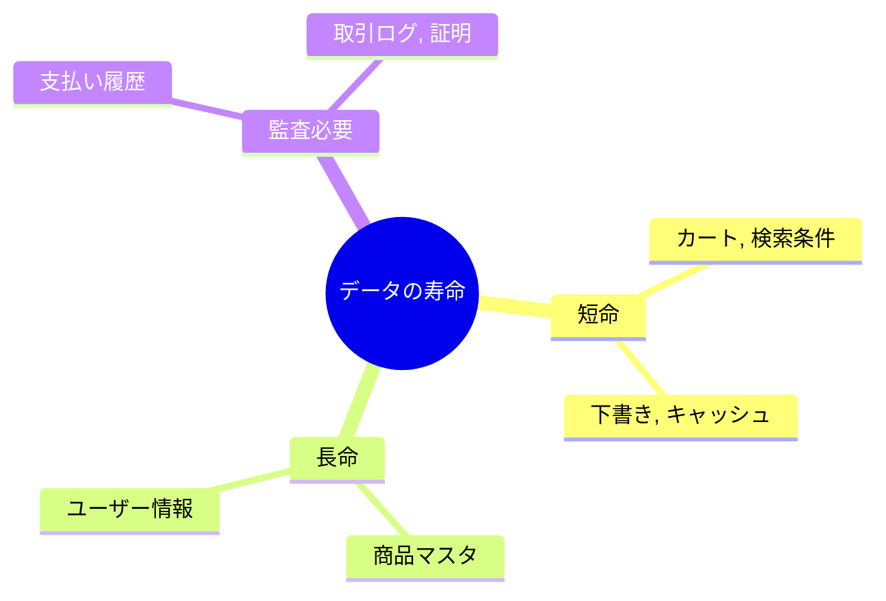
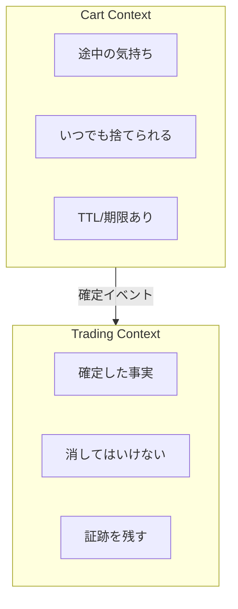

# 第14章 データの寿命で切る🗄️⌛

## 1. 「データの寿命」ってなに？⏳📦


BCを見つける時、そのデータが「いつ生まれて、いつ役割を終えるか」を見るのはめちゃくちゃ有効だよ😊✨
ざっくり言うと、こんな3タイプに分かれるよ👇

* **短命データ（すぐ消えてOK）**🫧
  例：カートの中身、検索条件、途中保存の下書き、画面の一時状態…🛒📝
* **長命データ（ずっと残す）**🏛️
  例：出品情報、ユーザー情報、取引情報、商品マスタ…📦👤
* **監査が必要なデータ（“証拠”として残す）**🧾🔒
  例：支払い履歴、取引の状態遷移ログ、発送記録、問い合わせ対応履歴…💳🚚



ここが混ざると、設計が一気にしんどくなるよ😵‍💫💥
だから **「寿命が違うデータは、境界（Bounded Context）の候補」** になりやすいの🎯✨

---

## 14.2 例題（学内フリマ🛍️）で “寿命” を見てみよう👀

同じ「取引」まわりでも、データの寿命がバラバラだよね👇

### 🛒 カート（短命）

* カートの中身（選んだ商品IDのリスト）
* クーポン入力途中
* 一時的な送料見積もり
* 「購入手続き中」セッション

👉 なくなっても、**もう一回作れる**（再入力で復元できる）ことが多い🫧

### 📜 取引履歴（長命 + 監査）

* 取引ID、購入者、出品者、金額、購入日時
* 状態：購入→支払い完了→発送→受け取り→完了
* キャンセル理由、返金の証跡

👉 後から説明できないと困るので、**消しにくい**🧾🔒


---

## 14.3 “寿命で切る” と何が嬉しいの？🎁✨

### ① 消していいものがハッキリする🧹🫧

短命データは「期限切れで消す」を前提にできるから、DBがぐちゃぐちゃになりにくいよ😊

### ② 設計のルールがスッキリする📏✨

短命データは「早くて軽い」が正義⚡
監査データは「正確で追跡できる」が正義🔒
同じ場所に置くと、方針が衝突してカオスになるの😇➡️😱

### ③ 境界が自然に見えてくる🗺️

* カート＝「購入前の一時領域」🛒
* 取引＝「確定した事実の管理」📜
  …みたいに、言葉と責務が分かれてくるよ🧠✨

---

## 14.4 “寿命で切る” ときのチェック質問🧩💡

データを見つけたら、これを自問してみてね👇

1. **これ、消えたら困る？**😨
2. **再生成できる？**🔁
3. **後から説明（監査）する必要ある？**🧾
4. **保管期間が決まってそう？（例：24時間、30日、卒業まで…）**📅
5. **更新頻度は？（秒単位？月1回？）**⏱️

この答えが違うデータ同士は、同じ境界に置くと揉めやすいよ⚠️

---

## 14.5 文章でわかる “図” 🖊️🗺️

頭の中のイメージはこんな感じ👇

* **[Cart Context]**🛒

  * “途中の気持ち” を持つ（まだ確定してない）
  * 期限が切れたら捨てる🫧
  * 目的：購入手続きをスムーズにする✨

* **[Trading Context]**📜

  * “確定した事実” を持つ（後で説明できる）
  * 状態遷移をちゃんと残す🔒
  * 目的：取引を正しく完了させる🎯



ポイント：**「途中」** と **「確定」** が同居すると事故りやすいよ💥

---

## 14.6 ミニ演習：データ寿命の分類表を作ろう📝✨

次のデータを、**短命 / 長命 / 監査必要** に分類してみよう😊
（学内フリマを想定🛍️）

* カートの中身（商品ID一覧）🛒
* 検索フィルタ（価格帯・カテゴリ）🔎
* 出品情報（タイトル、説明、価格）📦
* 購入履歴（購入日時、金額、相手）🧾
* 取引ステータスの変更ログ（いつ誰が何をした）🚦
* 問い合わせのやりとり（運営が対応した証跡）📩
* 送料見積もりのキャッシュ（数分で古くなる）🚚

### ✅ 目安（答えの例）

* 短命：検索フィルタ、送料見積もりキャッシュ、カート
* 長命：出品情報
* 監査必要：購入履歴、ステータス変更ログ、問い合わせ履歴

---

## 14.7 TypeScriptミニ演習：寿命つきデータを “型で” 表現する🧸💻

短命データは「期限」を型と関数で持たせると、境界の気持ちが出るよ🫧✨

```ts
// 寿命（TTL: time to live）つきの一時データ
export type Ephemeral<T> = {
  value: T;
  createdAt: Date;
  expiresAt: Date; // 期限が命！
};

export function createEphemeral<T>(value: T, ttlMs: number, now = new Date()): Ephemeral<T> {
  return {
    value,
    createdAt: now,
    expiresAt: new Date(now.getTime() + ttlMs),
  };
}

export function isExpired(e: Ephemeral<unknown>, now = new Date()): boolean {
  return now.getTime() >= e.expiresAt.getTime();
}
```

### 🛒 カートに適用してみる

```ts
export type CartItem = { listingId: string; qty: number };
export type Cart = { userId: string; items: CartItem[] };

const cart = createEphemeral<Cart>(
  { userId: "u1", items: [{ listingId: "L100", qty: 1 }] },
  1000 * 60 * 60 // 1時間で期限切れ
);

if (isExpired(cart)) {
  // 「消してOK」が仕様として表現できる🫧
  console.log("カート期限切れ。破棄します🧹");
}
```

💡 コツ：
**短命データに「expiresAt（期限）」が自然に生える**なら、別コンテキスト候補の匂いが強いよ👃✨

---

## 14.8 よくある事故パターン集😇➡️😱

### ❌ 事故①：カートに “確定情報” を入れちゃう

「カートに入った時点で取引IDを作る」みたいにすると、
期限切れで消したくても消せなくなる（監査が絡む）🧾⚠️

✅ 対策：
カートは “購入前の一時領域” に徹する🛒🫧
確定は Trading 側でやる📜

### ❌ 事故②：長命データに “短命キャッシュ” が混ざる

取引テーブルに「最新の送料見積もり」を入れる…とかね🚚💥
更新頻度が違いすぎて、設計が歪むよ😵‍💫

✅ 対策：
キャッシュはキャッシュとして別扱い（期限切れで消せる形）🧹✨

---

## 14.9 境界案（BC候補）に落とすテンプレ📦🗺️

寿命で切れそうなら、次を埋めてみてね📝

* **候補BC名**：Cart / Trading / Support …🏷️
* **このBCが扱うデータの寿命**：短命 / 長命 / 監査🧾
* **このBCの目的**：何のために存在する？🎯
* **絶対に扱わないもの（非目的）**：ここ大事🚫✨
* **期限・保管期間のルール**：TTLや保持年限など📅

---

## 14.10 AIに聞くときの質問テンプレ🤖💬

### ① データ寿命の棚卸し

```text
学内フリマの機能について、データを「短命」「長命」「監査必要」に分類したいです。
次のデータ一覧を分類し、分類理由（1行）と、混ぜると起きる事故例も1つずつ挙げてください：
- （ここにデータ一覧）
```

### ② 境界候補の提案

```text
データ寿命の違いを根拠に、Bounded Context の境界案を3つ提案してください。
各案について「メリット」「デメリット」「最初に作るならどれが安全か」もください。
```

### ③ 既存設計の危険チェック

```text
この設計で「短命データ」と「監査データ」が混ざっていないかチェックして、
混ざっている場合は分離案（フォルダ構成/型/責務）を提案してください。
（ここに設計メモ or コード断片）
```

---

## 14.11 最新事情メモ（TypeScriptまわり）🧷📌

* TypeScript の安定版ラインは **5.9 系**で、npm 上の最新は **5.9.3**。 ([npm][1])
* 5.9 の主な変更点は公式リリースノートにまとまってるよ。 ([Microsoft for Developers][2])
* エディタが使う TypeScript は「ワークスペースの TypeScript を選ぶ」運用ができる（コマンドから切替）。 ([Visual Studio Code][3])
* さらに先の話として、ネイティブ版のプレビューも進行中（VS Code 拡張や npm で試せるプレビューが案内されてる）。 ([Microsoft for Developers][4])

---

## 14.12 まとめ🎀✨

* データには寿命がある：**短命 / 長命 / 監査**🫧🏛️🧾
* 寿命が違うデータが混ざると、設計が壊れやすい😵‍💫
* 「途中（カート）」と「確定（取引）」は分けると強い🛒📜
* TypeScript では **expiresAt** みたいな “期限” を型で表現すると、境界がキレイに育つよ🧸💡

[1]: https://www.npmjs.com/package/typescript?utm_source=chatgpt.com "TypeScript"
[2]: https://devblogs.microsoft.com/typescript/announcing-typescript-5-9/?utm_source=chatgpt.com "Announcing TypeScript 5.9"
[3]: https://code.visualstudio.com/docs/typescript/typescript-compiling?utm_source=chatgpt.com "Compiling TypeScript"
[4]: https://devblogs.microsoft.com/typescript/announcing-typescript-native-previews/?utm_source=chatgpt.com "Announcing TypeScript Native Previews"
