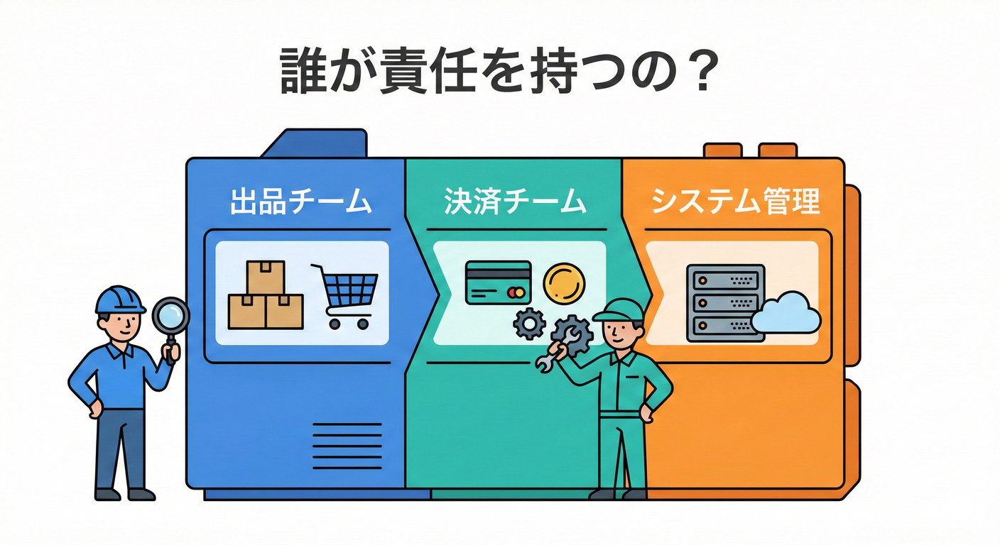
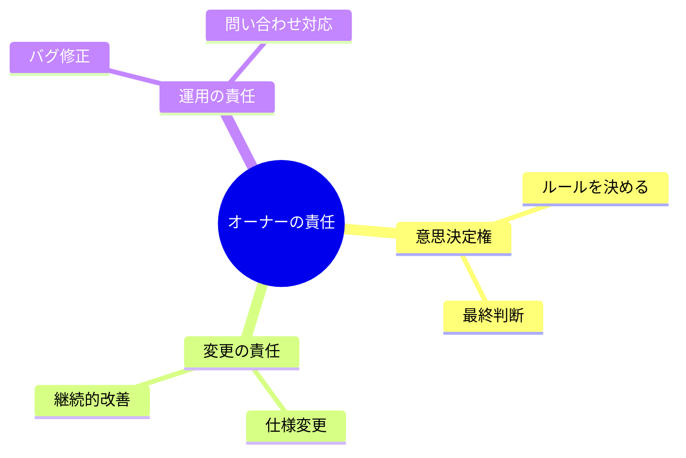
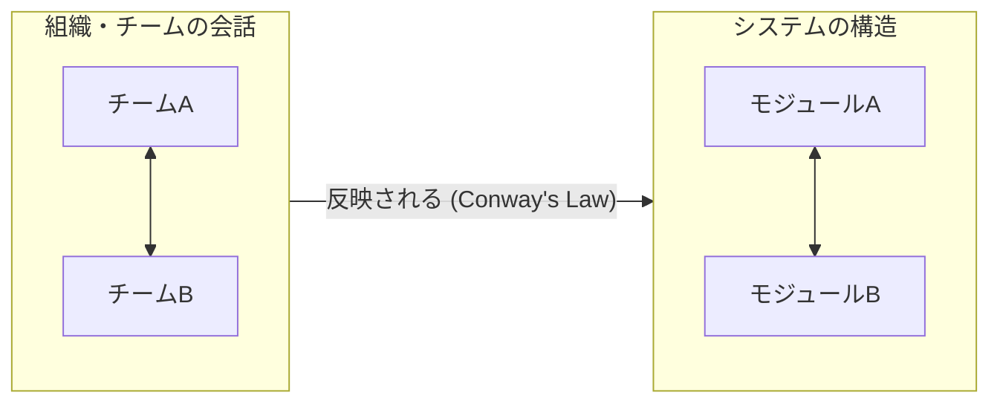
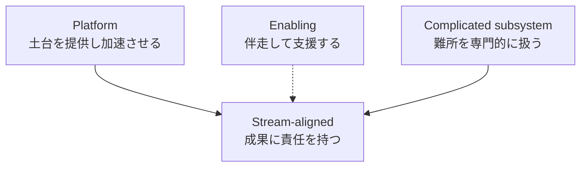
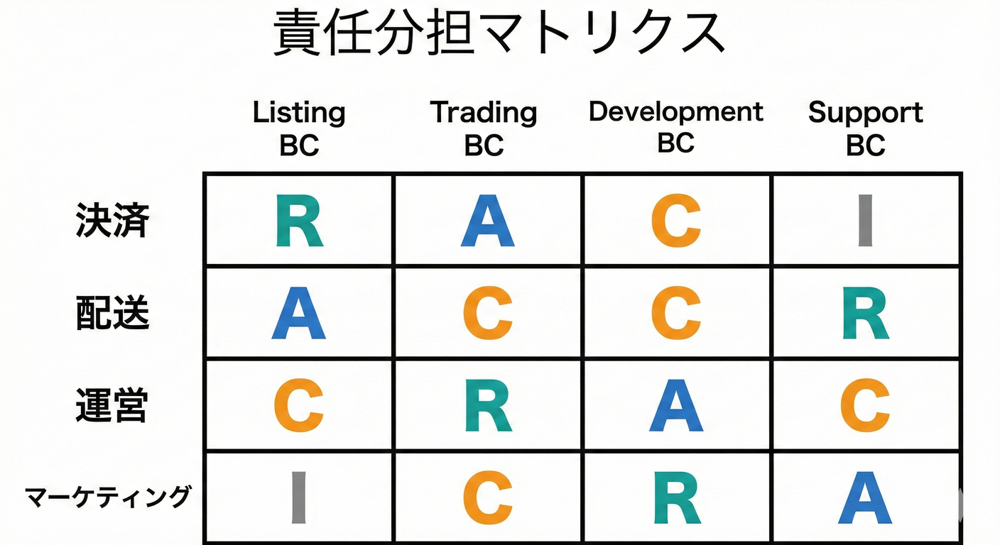

# 第15章 “責任者（オーナー）” 視点で切る👩‍💻🏷️

## この章でできるようになること🎯✨

* 「この機能、誰が責任を持つの？」を言語化できる🗣️🧠
* 責任の境目から、境界案（BCの候補）を作れる✂️📦
* 「共有しすぎて地獄😇➡️😱」を避ける判断ができる🚫🔥

---

## 15.1 なんで“責任者”で切ると強いの？🤔💡

システムって、だんだん大きくなると「仕様決める人」「保守する人」「困ったとき直す人」が分かれてくるよね🧩
このとき **“責任の境界” が曖昧** だと、こうなる…👇😵‍💫

* 仕様変更のたびに「え、誰が決めるの？」会議が発生🌀
* バグが出たとき「それウチじゃない」たらい回し🏓
* みんなが触れる場所が増えて、怖くて変更できない😱🔧

逆に、責任者がハッキリしてると **自分のエリアを自分の判断で直せる**＝変更に強い💪✨
これって、チーム設計の考え方（価値の流れに沿って“所有”する発想）とも相性がいいんだ🗺️🤝 ([teamtopologies.com][1])

---

## 1. 「オーナー」ってだれ？👮‍♂️👷‍♀️



これ、実はエンジニアが忘れがちな「超大事な視点」だよ！🧠✨

ここでいうオーナーは「作業担当者」じゃなくて、ざっくりこの3つを持ってる人（チーム）だよ👇✨

1. **意思決定権**：ルールを決める（or 最終判断する）🧠✅
2. **変更の責任**：仕様変更・改善を引き受ける🔁🛠️
3. **運用の責任**：壊れたら直す、問い合わせに向き合う🚑📞



この「作る→動かす→直す」までの責任を持つ考え方は、チーム設計の文脈でも強調されるよ🧩 ([アトラシアン][2])

---

## 15.3 “チームの境目”と“システムの境目”は似てくる🪞🧩（Conwayの法則）

有名な話で、**組織のコミュニケーション構造が、システム構造に反映されやすい**っていう考え方があるよ📣🧠
そして「望むアーキテクチャにしたいなら、チームの会話の形から変える」っていう“逆方向の工夫”も語られてるの✨ ([martinfowler.com][3])

つまり…
**責任者（チーム）の境界がブレると、コードの境界もブレやすい**😇➡️😱


だからこそ「責任者視点で境界を考える」は現実的で効くんだよね💪🏷️

---

## 15.4 チーム設計のヒント：4つのチームタイプで考える🧠🗂️

「責任者」って言っても、全員が同じ仕事を持つわけじゃないよね🙂
チーム設計の整理として、Team Topologies では **4つの基本タイプ**が紹介されてるよ👇✨ ([teamtopologies.com][1])

* **Stream-aligned**：価値の流れに沿って、成果に責任を持つ中心チーム🌊🎯
* **Platform**：他チームが速く安全に進める土台を提供🧱🚀
* **Enabling**：一時的に助けて、できるようにして去る（育成支援）🪽📚
* **Complicated subsystem**：専門性が高い難所を担当🧠🔬



ここから得られるコツはこれ👇
「ビジネスのルール（例：出品・取引・配送）を **プラットフォーム側が抱え込む**」みたいな形にすると、責任がねじれやすい⚠️
（その“ねじれ”が境界崩壊の入口になりがち💥）

---

## 15.5 例題（学内フリマ🛍️🏫）で “責任者マップ” を作ろう🗺️🖊️

まず、機能（能力）をざっくり並べるよ（第11章の続き感覚でOK）🧺✨
そして「誰が責任者？」を付ける！

## ステップ①：登場する“責任者ロール”を置く🎭

例（学内フリマ）だとこんな感じ👇

* 運営（学内フリマ運営チーム）🏫🧑‍💼
* 出品者サイド（学生ユーザー体験）🧑‍🎓🛍️
* 購入者サイド（学生ユーザー体験）🧑‍🎓💳
* 配送・受け渡し（学内受け渡し/配送窓口）📦🚚
* 決済（外部決済 or 学内決済の連携）💳🔗
* 問い合わせ・不正対応（サポート/モデレーション）🛡️📞
* 共通基盤（ログイン、通知、監視など）🧱🔔

## ステップ②：能力×責任者を当てはめる（ミニRACI）🧾✨

RACIはこう👇

* **R**：実作業の責任（やる）
* **A**：最終責任（決める）
* **C**：相談される（助言）
* **I**：通知される（知っておく）

例（サンプル）👇（最初は雑でOK！）

| 能力（機能のかたまり）       | A（最終）   | R（実作業）    | C（相談）        | I（通知）               |
| ----------------- | ------- | --------- | ------------ | ------------------- |
| 出品（掲載・編集・取り下げ）📝  | 運営🏫    | 出品体験🧑‍🎓 | サポート🛡️      | 購入体験🧑‍🎓           |
| 取引（購入・確定・キャンセル）🤝 | 運営🏫    | 購入体験🧑‍🎓 | 決済💳/サポート🛡️ | 出品体験🧑‍🎓           |
| 決済連携（支払い状態の反映）💳  | 決済💳    | 決済💳      | 運営🏫         | 購入体験🧑‍🎓           |
| 配送/受け渡し（発送・受領）📦  | 配送📦    | 配送📦      | 運営🏫         | 出品体験🧑‍🎓/購入体験🧑‍🎓 |
| 不正/規約違反対応🛡️      | サポート🛡️ | サポート🛡️   | 運営🏫         | 全員📣                |



---

## 15.6 “責任者マップ”から境界案（BC候補）を起こすコツ✂️📦✨

責任者マップができたら、次は境界のタネ探しだよ👀🌱
見つけ方はシンプル👇

## コツA：A（最終責任）が変わるところは境界候補🏷️

「ここから先は、決める人が違う」＝ルールが違う可能性が高い⚖️✨
ルールが違う場所は、モデルも言葉もズレやすい🌀

## コツB：夜中に起こされる人が違うところは境界候補😴📞

運用責任が分かれるところは、切る価値が高い🔥
（“壊れたとき誰が直す？”は超リアルな境界線🧯）

## コツC：調整が多い“接点”は「翻訳」が必要かも🌍➡️🏠

責任者が違うのに、同じデータや同じ用語で直結させると事故りやすい😇➡️😱
ここは後の章（ACLとかDTO）で守る場所になりやすいよ🧼🛡️

※チーム境界を良い形に見つけるための考え方（境界ヒューリスティクス）も紹介されてるよ🔎 ([teamtopologies.com][4])

---

## 15.7 よくある失敗パターン集😇➡️😱（早めに回避！）

## 失敗①：全員で“共同所有”にしちゃう🤝💥

「みんなが触れる＝誰も責任を取らない」になりがち😵‍💫
境界が溶けて、仕様も言葉もぐちゃぐちゃ🫠

## 失敗②：基盤チームが業務ルールまで抱える🧱➡️⚖️

基盤は“加速装置”なのに、業務判断まで抱えると渋滞する🚗🚗🚗
プラットフォームの誤用が問題になりやすい点も整理されてるよ⚠️ ([teamtopologies.com][5])

## 失敗③：責任の境界を「画面」で決める📱✂️

画面の都合で切ると、運用・ルールの責任がズレることがある😵
（次章で「UIフローとドメインフローを分ける」へつながるよ🪞🚦）

---

## 15.8 演習①：責任者マップ（Ownership Map）を作る📝✨

## お題🛍️

学内フリマで、次の能力にA/R/C/Iを付けてみよう👇

* 出品（掲載・編集・停止）📝
* 購入（確定・キャンセル）🛒
* 決済（支払い状態、返金）💳
* 配送/受け渡し（発送、受領確認）📦
* 通知（メール/アプリ通知）🔔
* 問い合わせ（取引トラブル、違反）📞🛡️

## 成果物🎁

* RACI表（上の表みたいなやつ）🧾
* 境界候補（箱）を **最低3つ** 書く📦📦📦

  * 例：出品 / 取引 / 配送 / 決済 / サポート …など

---

## 15.9 演習②：TypeScriptで“責任者マップ”をデータ化する📌💻

「口で言ってるだけ」だと忘れるから、**マップをJSON相当に落として固定**しちゃうよ🧷✨
（あとでADRやドキュメントに貼れる！📄）

```ts
// ownership-map.ts
type OwnerRole =
  | "Ops"          // 運営🏫
  | "SellerUX"     // 出品者体験🧑‍🎓
  | "BuyerUX"      // 購入者体験🧑‍🎓
  | "Payments"     // 決済💳
  | "Shipping"     // 配送📦
  | "Support"      // サポート🛡️
  | "Platform";    // 基盤🧱

type RACI = {
  A: OwnerRole;       // 最終責任✅
  R: OwnerRole[];     // 実作業🛠️
  C?: OwnerRole[];    // 相談🤝
  I?: OwnerRole[];    // 通知📣
};

type CapabilityKey =
  | "Listing"
  | "Trading"
  | "PaymentSync"
  | "ShippingFlow"
  | "Notifications"
  | "ModerationSupport";

const ownershipMap: Record<CapabilityKey, RACI> = {
  Listing: {
    A: "Ops",
    R: ["SellerUX"],
    C: ["Support"],
    I: ["BuyerUX"],
  },
  Trading: {
    A: "Ops",
    R: ["BuyerUX"],
    C: ["Payments", "Support"],
    I: ["SellerUX"],
  },
  PaymentSync: {
    A: "Payments",
    R: ["Payments"],
    C: ["Ops"],
    I: ["BuyerUX"],
  },
  ShippingFlow: {
    A: "Shipping",
    R: ["Shipping"],
    C: ["Ops"],
    I: ["SellerUX", "BuyerUX"],
  },
  Notifications: {
    A: "Platform",
    R: ["Platform"],
    C: ["Ops"],
    I: ["SellerUX", "BuyerUX", "Support"],
  },
  ModerationSupport: {
    A: "Support",
    R: ["Support"],
    C: ["Ops"],
    I: ["SellerUX", "BuyerUX"],
  },
};

// ✅ 雑チェック：Aが未設定の能力がないか
const missingA = Object.entries(ownershipMap)
  .filter(([, v]) => !v.A)
  .map(([k]) => k);

if (missingA.length > 0) {
  throw new Error(`A（最終責任）が未設定: ${missingA.join(", ")}`);
}

console.log("Ownership Map OK ✅");
```

## ねらい🎯

* 「責任者が決まってる能力」と「決まってない能力」が見える化👀✨
* あとで境界を直す時も、差分が追いやすい🔁🧾

---

## 15.10 AI相棒に頼むときの“良い聞き方”テンプレ🤖💬✨

## テンプレ①：RACI表をたたき台で作らせる🧾

```text
学内フリマの機能を以下に列挙します。
- 出品（掲載・編集・停止）
- 購入（確定・キャンセル）
- 決済（支払い状態、返金）
- 配送/受け渡し（発送、受領確認）
- 通知（メール/アプリ通知）
- 問い合わせ（取引トラブル、規約違反）

責任者ロールは以下です。
- Ops（運営）
- SellerUX（出品者体験）
- BuyerUX（購入者体験）
- Payments（決済）
- Shipping（配送）
- Support（サポート/不正）
- Platform（共通基盤）

RACI（A/R/C/I）で表を作り、迷う箇所は「要確認」と理由も添えてください。
```

## テンプレ②：境界候補を“責任の切れ目”から提案させる✂️📦

```text
添付のOwnership Map（能力→A/R/C/I）を読んで、
「Aが変わる場所」「運用責任が分かれる場所」を根拠に
Bounded Context候補を3案ください。
各案は：境界名、責務、非目的、境界が効く理由（責任者視点）をセットで。
```

## テンプレ③：たらい回しが起きそうな接点を洗い出す🏓⚠️

```text
このOwnership Mapの中で「共同所有になっている」「Cが多すぎる」
「責任がねじれそう」な能力・境界を指摘し、改善案をください。
特にPlatformが業務ルールを抱えそうな箇所があれば優先で。
```

※生成AIの組織導入をうまく進める話でも、チーム設計や役割の整理が重要になりやすいよ🧩🤖 ([teamtopologies.com][6])

---

## 15.11 まとめチェック✅✨（これが言えたら勝ち！🎉）

* 「ここは誰が決める？（A）」が全部にある✅
* 「壊れたら誰が直す？」が自然に言える✅
* 共有しすぎゾーン（共同所有）を見つけられる✅
* 責任の切れ目から境界案（BC候補）を3つ出せる✅

---

## 15.12 次章につながるよ🪞🚦

責任者で境界候補が出せたら、次は **“画面の流れ”に引きずられずに**、業務としての流れを分けて考えるステップへ進むよ📚✨

[1]: https://teamtopologies.com/key-concepts?utm_source=chatgpt.com "Key Concepts"
[2]: https://www.atlassian.com/devops/frameworks/team-topologies?utm_source=chatgpt.com "Team Topologies"
[3]: https://martinfowler.com/bliki/ConwaysLaw.html?utm_source=chatgpt.com "Conway's Law"
[4]: https://teamtopologies.com/key-concepts-content/finding-good-stream-boundaries-with-independent-service-heuristics?utm_source=chatgpt.com "Finding good stream boundaries with Independent Service ..."
[5]: https://teamtopologies.com/news-blogs-newsletters/2024/11/24/revisiting-team-topologies-misuses-of-platform-teams?utm_source=chatgpt.com "Revisiting Team Topologies: Misuses of Platform Teams"
[6]: https://teamtopologies.com/news-blogs-newsletters/2025/1/28/how-team-topologies-can-transform-generative-ai-integration?utm_source=chatgpt.com "How Team Topologies Can Transform Generative AI ..."
