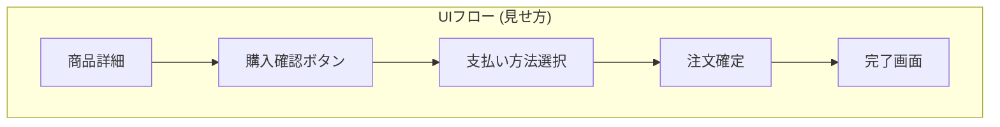
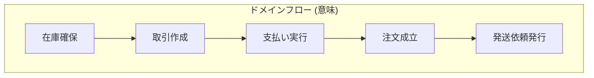
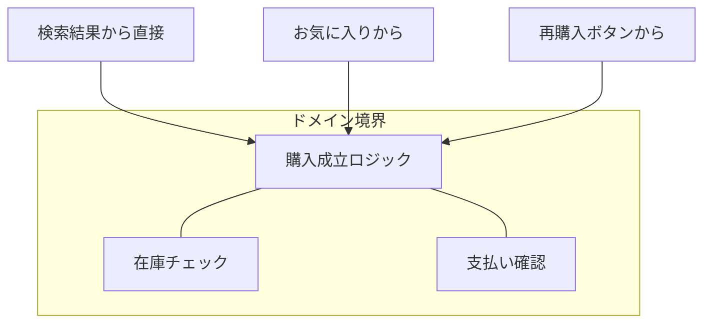
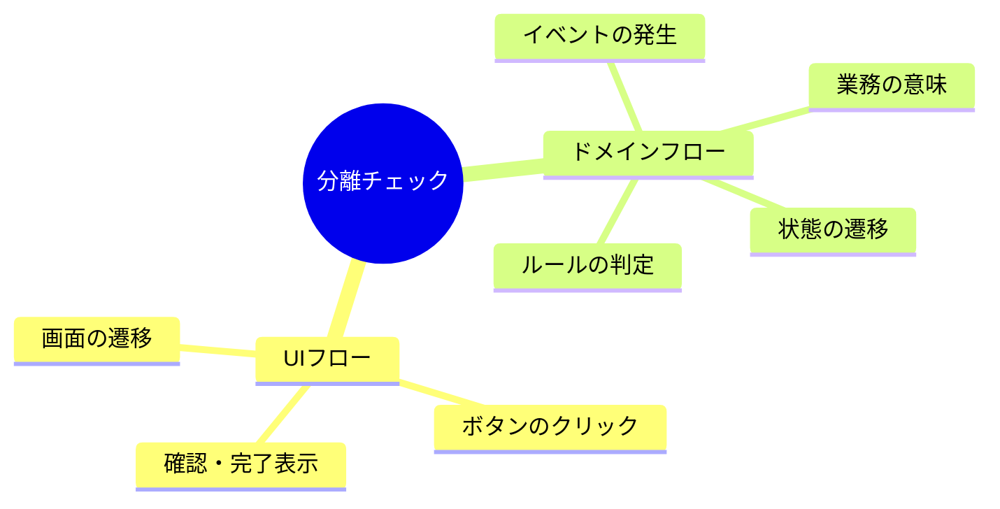

# 第16章 UIフローとドメインフローを分けて考える🪞🚦

## この章でできるようになること🎯✨

* 画面遷移（UIフロー）に引きずられずに、「業務の流れ（ドメインフロー）」を言葉で書けるようになる📝💡
* 「境界（BC）を切る材料」として、UI都合と業務都合を分離して整理できるようになる✂️🧠
* 同じ機能でも、**UIの見え方**と**業務の意味**が違うことを説明できるようになる🗣️🌸

---

## 1. なぜ UI の流れと ドメイン の流れを分けるの？🎨➡️🔧


````carousel

<!-- slide -->

````

これ、初心者がいちばんハマりやすい「境界の罠」だよ😵‍💫🧯

* ユーザーが「どの画面からどの画面へ行くか」
* ボタン、入力フォーム、確認画面、完了画面…みたいな“見た目の都合”が中心🎨✨

## ドメインフロー（業務の意味の流れ）🏷️➡️📦

* システムが「業務として何を成立させるか」
* 例：出品が成立する／購入が成立する／支払いが確定する／発送依頼が作られる…みたいな“ルールの都合”が中心⚖️🚦

**ポイント🧸💡**：
UIは「見せ方」、ドメインは「意味」。
この2つを混ぜると、あとから地味に壊れていきます…😇💥
（「UIとドメインを分離すると理解しやすい・テストしやすい・複数UIに対応しやすい」みたいな話は、Martin Fowler も昔から強調してるよ📚✨）([martinfowler.com][1])

---

## 2) なんで「画面の都合」で境界を切ると危ないの？😵‍💫⚠️

## 危ない理由①：画面は“変わりやすい”🌪️📱

* デザイン変更、導線改善、ABテストで画面はすぐ変わるよね😆💦
* 画面の区切り＝境界にしちゃうと、UI変更がそのままドメイン設計を揺らす😱

## 危ない理由②：同じ業務が複数のUIにまたがる🧵🧠

* 例えば「購入」って、

  * 一覧から買う
  * お気に入りから買う
  * 期限切れ再購入から買う
    …みたいに入口が増えがち🌈✨
* でもドメイン的には「購入が成立する」って意味は同じことが多い🙆‍♀️



## 危ない理由③：UIに合わせると“業務ルールが散らばる”🧹💔

* 画面Aでもチェック、画面Bでもチェック、APIでもチェック…みたいに
  **同じルールがコピペ祭り**になりやすい😇🌀
* その結果「片方だけ直し忘れ」→ バグの温床🐛💥

（この考え方は「外側（Web/UIなど）は詳細で、中心（ビジネスルール）を支配させない」系のアーキテクチャでよく語られるよ📘✨ Clean Architecture の有名な主張としても知られてる🛡️）([Goodreads][2])

---

## 3) 例：学内フリマ🛍️🏫で分けてみよ〜✨

ここでは「購入する」を題材にするよ😊🌸

## A) UIフロー（画面の流れ）🖥️➡️✅

1. 商品一覧を見る👀
2. 商品詳細を見る🔎
3. 「購入する」ボタンを押す🖱️
4. 支払い方法を選ぶ💳
5. 確認画面でOKする✅
6. 完了画面🎉

## B) ドメインフロー（業務の意味の流れ）📦➡️🧾

1. **取引（注文）を作成する**（購入意思を確定）🧾✨
2. **在庫（出品枠）を確保する**（二重購入を防ぐ）🧷⚠️
3. **支払いを確定する**（成功/失敗の結果が出る）💳🚦
4. **取引状態を更新する**（例：支払い済み）🚦🔁
5. **発送依頼を作る**（必要なら配送側へ渡す）📮📦

**見てほしい所👀✨**：

* UIでは「確認画面」が大きい存在でも、ドメインでは「支払い確定」や「在庫確保」の方が本体だったりする🧠💡
* UIは“人間に見せる段取り”、ドメインは“成立させるルール”なんだよね🌸

---

## 4) 分離のコツ：まず“二重メモ”を作る📝🪞

次のテンプレで書くと、分けやすいよ✨

## テンプレ① UIフロー（画面メモ）📱

* 画面名
* 入力項目
* ボタン
* 次の画面
* 例外（エラー表示）

## テンプレ② ドメインフロー（意味メモ）🏷️

* 目的（何を成立させたい？）🎯
* ルール（守る条件）⚖️
* 状態（どんな状態がある？）🚦
* イベント（何が起きたと言える？）📣
* 失敗（何がダメで成立しない？）🚫

これを **同じ機能に対して両方書く**だけで、
「画面都合で切ってた…😇」に気づけるようになるよ🫶✨



---

## 5) “境界探し”に効く！ドメインフローの見つけ方🔎✂️

## ステップ1：動詞を「業務っぽい動詞」にする🗣️✨

UIの動詞はこうなりがち👇

* クリックする
* 画面を開く
* 入力する
* 確認する

ドメインの動詞はこうしたい👇

* 出品する
* 購入を確定する
* 支払いを確定する
* 発送依頼を作る
* キャンセルする

## ステップ2：ルールが出るところに印をつける🖊️⚖️

「〜できない」「〜しないといけない」が出たら、そこはドメイン寄り💡

* 未成年は高額商品を買えない🚫
* 取引中は価格変更できない🚫
* 出品は1人同時に10件まで📌

## ステップ3：状態遷移があるところは“ドメインの芯”🚦🧠

状態がある＝業務としての意味がある

* 出品中 → 取引中 → 支払い済み → 発送待ち → 完了 🎉
  こういうのはUIより先に、ドメインで固めたい✨

---

## 6) TypeScriptミニ演習（10〜20分）⏱️🧸💻

## お題🛍️

「購入する」機能について、UIフローとドメインフローを分けて書いてみよう✨

### ① UIフロー（6ステップ）を書く📝

* 画面名をつける（例：商品詳細、購入確認…）
* ボタン名を書く（例：購入する、確定する）

### ② ドメインフロー（5ステップ）を書く📝

* “成立させたいこと” を1行で書く（例：購入取引を成立させる）
* ルールを3つ書く
* 状態を3つ以上書く（例：取引中、支払い済み、完了）

### ③（おまけ）ドメインの「言葉」を固定する🏷️✨

* 「購入」って言葉、何を指す？（注文作成？支払い完了？）
* その言葉をこの章では1つに決めて、メモしておく📌

---

## 7) TypeScriptで“境界の匂い”を感じるミニ例🧩✨

ここは「UIではなく、意味で関数名を作る」練習だよ😊
（まだ実装は雑でOK！“名前”が主役🎀）

```ts
// UIっぽい名前（避けたい寄り）
function onClickBuyButton() {}
function showConfirmScreen() {}

// ドメインっぽい名前（うれしい寄り）
type PlaceOrderCommand = {
  buyerId: string;
  listingId: string;
  paymentMethod: "card" | "cash";
};

type OrderPlacedEvent = {
  orderId: string;
  buyerId: string;
  listingId: string;
};

function placeOrder(cmd: PlaceOrderCommand): OrderPlacedEvent {
  // ここで本当は「在庫確保」「ルールチェック」などが起きるイメージ✨
  return {
    orderId: "order_123",
    buyerId: cmd.buyerId,
    listingId: cmd.listingId,
  };
}
```

**ここでの狙い🎯**：

* `onClick` とか `showScreen` は UI都合のにおいが強い👃💦
* `placeOrder` みたいに、業務の意味がわかる名前がドメイン寄り🧠✨

---

## 8) AI相棒に聞くテンプレ🤖💬（そのままコピペOK）

## テンプレA：UI→ドメイン変換🪄

* 「この画面遷移を、業務の意味の流れ（ドメインフロー）に書き換えて。UI用語（画面/ボタン/クリック）を使わないで、業務動詞で5〜8ステップにしてね。ルールと状態も列挙して。」

## テンプレB：境界候補を拾う✂️

* 「このドメインフローの中で、ルールが違う塊・状態が別管理になりそうな塊を3つに分けて。各塊に“能力名（例：取引管理、支払い管理）”を付けて理由も書いて。」

## テンプレC：言葉のブレ検出🧷

* 「この文章で、同じ単語が別の意味で使われてそうな箇所を指摘して。候補ごとに“この章ではこう定義すると良さそう”も提案して。」

---

## 9) よくある事故パターン集😇🚑（先に知って回避しよ！）

* **事故①：画面単位でモジュールを切る** → “業務がまたがって詰む”🌀
* **事故②：確認画面がドメインの中心になる** → “成立条件が散らばる”💥
* **事故③：UIの入力項目＝ドメインのモデル** → “あとで属性の意味が崩れる”😵‍💫
* **事故④：エラー文言がそのままドメインルール名になる** → “仕様変更に弱い”📉

---

## 10) 章末チェック✅💗（できたら勝ち！）

* [ ] UIフローを「画面名 + ボタン + 次の画面」で書けた🖥️
* [ ] ドメインフローを「業務動詞」で書けた🏷️
* [ ] ルール（〜できない/〜しなきゃ）を3つ以上抜き出せた⚖️
* [ ] 状態（ステータス）を3つ以上列挙できた🚦
* [ ] 同じ単語の意味ブレ候補を1つ見つけた🧷

---

## 参考（さらっと）📚✨

* UIとドメイン（プレゼンテーションとドメイン）を分離する理由や効果の整理：Martin Fowler の記事がわかりやすいよ🫶([martinfowler.com][1])
* TypeScriptの現行安定版ライン（5.9系）の公式情報（リリースノート・発表）：([npmjs.com][3])

[1]: https://martinfowler.com/bliki/PresentationDomainSeparation.html?utm_source=chatgpt.com "Presentation Domain Separation"
[2]: https://www.goodreads.com/work/quotes/25319615-clean-architecture?page=4&utm_source=chatgpt.com "Clean Architecture Quotes by Robert C. Martin(page 4 of 14)"
[3]: https://www.npmjs.com/package/typescript?utm_source=chatgpt.com "TypeScript"
