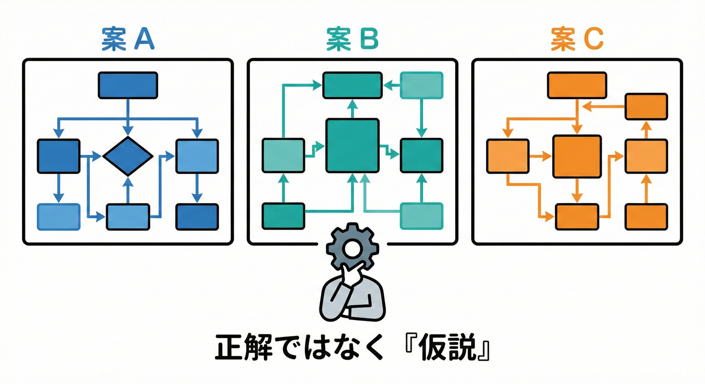
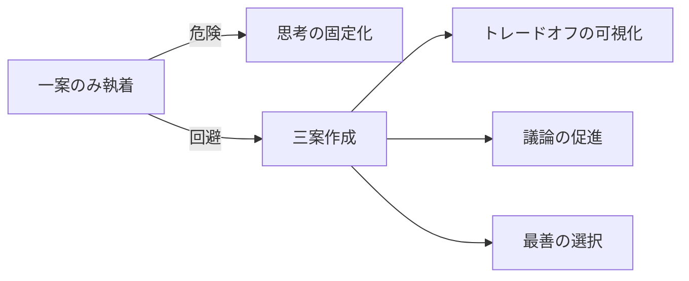
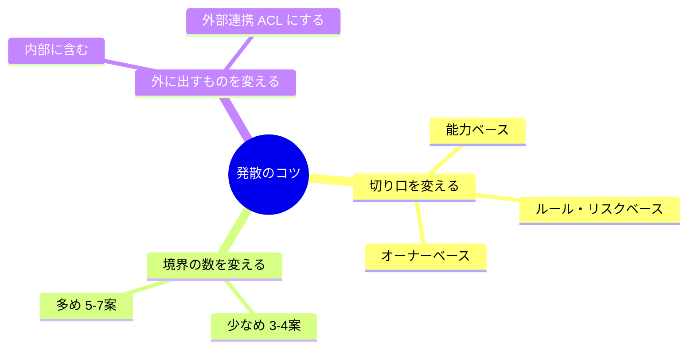
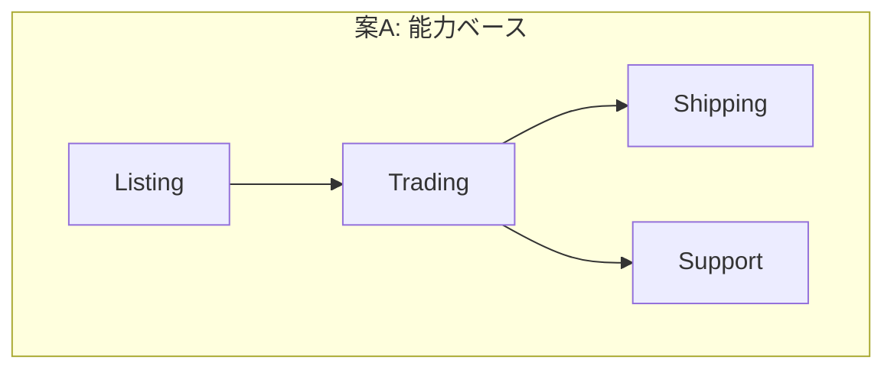
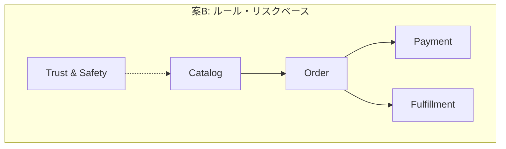
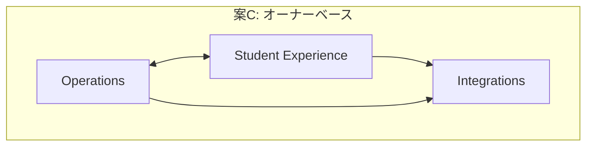

# 第17章 境界案を3つ作る 発散 🌈📝

## この章のゴール🎯✨

* 「境界（Bounded Context）の“案”を3つ」作れるようになる🧠💡
* 正解探しじゃなくて、「仮説を出す力」を育てるよ🌱😊
* 次の章（第18章）で、3案を比べて1案に絞る準備などの「対話」をすることが、この章の最大の成果だよ😊✨


---

## まず大事な考え方🧸🧱



### 境界は “正解” じゃなくて “仮説” 🧪✨

同じ題材でも、切り方はいくつもあり得るよ😊
だからまずは「3つ出す」＝視野が広がるのが最大の価値💖

### 3案を作ると何が嬉しい？🎁

* **思考が固定化しない**（最初の案に縛られない）🌀
* **トレードオフが見える**（メリットだけじゃなく弱点も見える）👀
* **チームで議論しやすい**（A/B/Cから選べる）🗣️✨



---

## 準備する材料🧺📋

前の章（11〜16）で作ったメモを机に並べる感じでOKだよ📝✨

* 能力リスト（例：出品、購入、配送、問い合わせ…）🧱
* イベント列（出品した／購入した／発送した…）📣⏳
* ルールのまとまり（返品、手数料、制限…）⚖️
* データ寿命メモ（短命／長命／監査必要）🗄️⌛
* 責任者メモ（誰が面倒を見る？）👩‍💻🏷️
* UIフローとドメインフローの分離メモ🪞🚦

---

## 発散のコツ3つ🌈✨

### コツ1️⃣ 切り口を変える🔪

同じ切り口で3案作ると、だいたい似るよ😇
だから「切り口を変えて」3案にするのが強い💪

おすすめ切り口セット👇

* **案A：能力（機能のまとまり）で切る** 🧱
* **案B：ルール／リスク（壊れやすい所）で切る** ⚠️
* **案C：責任者（オーナー）／運用で切る** 👩‍💻

### コツ2️⃣ 境界の数を変える🔢

* 少なめ（3〜4）→ 分かりやすいけど、混ざりやすい😵
* 多め（5〜7）→ きれいだけど、連携が増える🔗

### コツ3️⃣ “外に出すもの” を変える📦

たとえば「決済」や「配送連携」を

* 内側に含める案
* 外部サービス扱いにしてACL前提の案
  みたいに変えると、案が一気に違ってくるよ🛡️✨



---

## 境界案テンプレ これを3枚作る🗒️🖊️

A/B/Cそれぞれ、下のテンプレを埋めよう😊
（最初はざっくりでOK！完璧禁止🙅‍♀️）

### 1) 境界案の全体像🗺️

* 案名：A / B / C（あとで“愛称”つけてもOK）🏷️
* コンテキスト一覧（箱）：

  * BC1：
  * BC2：
  * BC3：
  * （必要ならBC4…）
* 関係（矢印）：

  * BC1 → BC2（何を渡す？）
  * BC2 → BC3（何を頼む？）

### 2) 各BCのミニ仕様📌

各BCごとにこれ👇

* 一言説明（なに担当？）🙂
* 扱うこと✅（3つくらい）
* 扱わないこと🚫（2つくらい）
* 代表イベント📣（2〜4個）
* 代表用語🗣️（5個くらい）
* データ寿命の特徴🗄️（短命/長命/監査）
* オーナー想定👩‍💻（誰の仕事？）

### 3) 不安メモ😵‍💫（超大事）

* ここが揉めそう
* ここが依存強そう
* ここは後で分割しそう
  を1〜2行で書く📝✨
  （次章の比較で武器になるよ⚔️）

---

## 例題 学内フリマで境界案を3つ作ってみる🏫🛍️✨

ここからは例だよ😊
あなたの材料メモ（イベント列とか）に合わせて、名前や箱の数は変えてOK🧸

````carousel

<!-- slide -->

<!-- slide -->

````

---

### 境界案A 能力で切る 王道🧱✨

**ねらい：機能のまとまりが直感的で分かりやすい**😊

**箱（BC）** 📦

1. **Listing**（出品）🛍️
2. **Trading**（取引）🤝
3. **Shipping**（配送）📦
4. **Support**（問い合わせ）💬

**矢印（関係）** ➡️

* Listing → Trading（出品情報を参照）
* Trading → Shipping（発送依頼を作る）
* Trading ↔ Support（トラブル対応の受付）

**ミニ仕様例**

* Listing✅：出品登録／在庫（出品中か）／検索用情報
* Listing🚫：支払い状態／発送状態
* Trading✅：購入・キャンセル・完了／取引状態遷移
* Shipping✅：発送依頼・追跡番号・受け取り完了
* Support✅：問い合わせチケット・回答・履歴

**不安メモ😵‍💫**

* 「取引状態」と「発送状態」の境界が曖昧になりがち（どっちが真実？）
* 検索要件が増えるとListingが肥大化しやすい

---

### 境界案B ルールとリスクで切る 安全志向⚖️🛡️

**ねらい：壊れやすい場所（ルールが濃い場所）を隔離する**⚠️

**箱（BC）** 📦

1. **Catalog**（出品カタログ）📚🛍️
2. **Order**（注文・取引）🧾🤝
3. **Payment**（決済・手数料）💳💰
4. **Fulfillment**（発送・受領）📦✅
5. **TrustSafety**（違反・通報・制限）🚨🧑‍⚖️

**矢印（関係）** ➡️

* Order → Payment（支払い作成・確認）
* Order → Fulfillment（発送依頼作成）
* TrustSafety → Catalog/Order（制限・凍結の反映）

**ミニ仕様のポイント**

* Paymentは「手数料・返金・支払い期限」みたいな**ルールの塊**を持つ💡
* TrustSafetyは「出品制限」「通報」「凍結」など**運営ルール**を集中管理🚨

**不安メモ😵‍💫**

* BCが増えて連携が増える（DTOやイベントが必要になりやすい）🔗
* 学習コストはAより上がる（でも現実のサービスっぽい）

---

### 境界案C オーナーで切る 運用リアル系👩‍💻🌍

**ねらい：誰が面倒を見るか（責任）で境界を決める**🏷️

**箱（BC）** 📦

1. **StudentExperience**（学生の出品・購入体験）🧑‍🎓🛍️
2. **Operations**（運営・問い合わせ・監査）👩‍💼🗂️
3. **Integrations**（外部連携：決済・配送）🔌🌐

**矢印（関係）** ➡️

* StudentExperience → Integrations（支払い依頼・配送依頼）
* Operations ↔ StudentExperience（凍結・調査・問い合わせ）
* Operations → Integrations（返金・例外処理）

**ミニ仕様のポイント**

* Integrationsは“外の世界”と話す担当。中の言葉を汚さないためにACLが出番になりやすい🧼🛡️
* Operationsは監査ログ・履歴・調査が強い（長命データ多め）🗄️📜

**不安メモ😵‍💫**

* StudentExperienceが大きくなりやすい（後で分割前提になりがち）
* “業務能力”の切り方より抽象度が高いので、慣れるまでふわっとしやすい☁️

---

## 3案を “違う案” にするためのチェック✅👀

3案できたら、これ確認しよ😊

* A/B/Cで「切り口」がちゃんと違う？🔪
* A/B/Cで「箱の数」が違う？🔢
* A/B/Cで「外に出すもの（連携前提）」が違う？📦
* どの案にも「不安メモ」がある？（ない案は考察が浅いこと多い）📝

---

## TypeScriptミニ演習 境界案をコードで管理する📁🧩

設計メモをコードにすると、PRで差分が見えて便利だよ😊✨
（“設計のメモ＝資産”になる💎）

```ts
// context-plans.ts
type ContextName =
  | "Listing"
  | "Trading"
  | "Shipping"
  | "Support"
  | "Catalog"
  | "Order"
  | "Payment"
  | "Fulfillment"
  | "TrustSafety"
  | "StudentExperience"
  | "Operations"
  | "Integrations";

type BoundaryPlan = {
  planId: "A" | "B" | "C";
  concept: string; // この案の切り口
  contexts: {
    name: ContextName;
    summary: string;
    inScope: string[];
    outOfScope: string[];
    mainEvents: string[];
    mainTerms: string[];
  }[];
  relations: { from: ContextName; to: ContextName; description: string }[];
};

export const planA = {
  planId: "A",
  concept: "能力（機能のまとまり）で切る",
  contexts: [
    {
      name: "Listing",
      summary: "出品とカタログ情報を担当",
      inScope: ["出品登録", "出品中/停止", "検索用情報"],
      outOfScope: ["支払い状態", "発送状態"],
      mainEvents: ["Listed", "ListingSuspended"],
      mainTerms: ["Listing", "Seller", "Category", "Condition", "PricePreview"],
    },
    {
      name: "Trading",
      summary: "購入〜取引完了までの状態遷移を担当",
      inScope: ["購入", "キャンセル", "取引状態遷移"],
      outOfScope: ["追跡番号の管理"],
      mainEvents: ["Purchased", "Canceled", "TradeCompleted"],
      mainTerms: ["Trade", "Buyer", "Status", "CancelPolicy"],
    },
    {
      name: "Shipping",
      summary: "発送依頼と受領確認を担当",
      inScope: ["発送依頼", "追跡番号", "受領完了"],
      outOfScope: ["購入ルールの判断"],
      mainEvents: ["ShipmentRequested", "Shipped", "Delivered"],
      mainTerms: ["Shipment", "TrackingNumber", "Carrier"],
    },
    {
      name: "Support",
      summary: "問い合わせと対応履歴を担当",
      inScope: ["問い合わせ", "回答", "対応履歴"],
      outOfScope: ["取引状態の最終決定"],
      mainEvents: ["TicketOpened", "TicketReplied", "TicketClosed"],
      mainTerms: ["Ticket", "Message", "Category"],
    },
  ],
  relations: [
    { from: "Listing", to: "Trading", description: "出品情報を参照する" },
    { from: "Trading", to: "Shipping", description: "発送依頼を作成する" },
    { from: "Trading", to: "Support", description: "トラブル時に問い合わせを作る" },
  ],
} satisfies BoundaryPlan;

// おまけ：関係を一覧表示してみよう😊
export function printRelations(plan: BoundaryPlan) {
  for (const r of plan.relations) {
    console.log(`${plan.planId}: ${r.from} -> ${r.to} (${r.description})`);
  }
}
```

### やってみよう✍️😊

* `planB` と `planC` も同じ形で作ってみてね🌈
* `ContextName` にあなたのBC名を追加していくと、タイポが減って気持ちいいよ🧼✨

---

## AIへの質問テンプレ 発散を手伝わせる🤖💖

CopilotやCodexに投げる用の“型”だよ😊
（材料メモを貼ってから使うのがコツ！）

### テンプレ1 3案を作って

```text
あなたはDDDのコーチです。
題材は「学内フリマ」です。

以下の材料から、Bounded Context の境界案を3つ（A/B/C）出してください。
Aは能力で切る、Bはルール/リスクで切る、Cは責任者で切ってください。

材料：
- 能力リスト：{ここに貼る}
- イベント列：{ここに貼る}
- ルールのまとまり：{ここに貼る}
- データ寿命メモ：{ここに貼る}
- 責任者メモ：{ここに貼る}

出力フォーマット：
- 案ごとに、BCの箱一覧（名前+一言）
- BCごとの InScope/OutOfScope
- BC間の関係（矢印と受け渡す情報）
- 各案の弱点（不安メモ）を2つ
```

### テンプレ2 似すぎ問題を解消して

```text
以下の境界案A/B/Cが「似すぎ」かもしれません。
それぞれがもっと違う案になるように、切り口のズラし方を提案して、
具体的に「箱の分け直し案」を出してください。

案A：{貼る}
案B：{貼る}
案C：{貼る}
```

### テンプレ3 不安メモを強化して

```text
次の境界案の「将来困る点」を、現場の運用を想像して指摘してください。
特に、依存が強くなる点、責任が曖昧になる点、データの真実が揺れる点に注目して、
不安メモを5個作ってください。

境界案：{貼る}
```

---

## おまけ 最近のTypeScriptの動き さらっと🧸💻

* TypeScript 5.9 系のリリースノートが公開されていて、VS Code側も 5.9 を取り込む流れがあるよ🧩✨ ([TypeScript][1])
* npmの `typescript` パッケージは、この章の執筆時点で **latest が 5.9.3** と表示されているよ📦✨ ([npm][2])
* さらに先の話として、公式ブログで **TypeScript 6.0 は 5.9 と 7.0 の橋渡し**、そして **7.0（ネイティブ移行）の進捗**が共有されてるよ🌱 ([Microsoft for Developers][3])
* ネイティブ版のプレビューは npm の `@typescript/native-preview` として案内されてるよ（試す人向け）🧪 ([npm][4])

---

## まとめ この章の成果物🎁✨

* 境界案 **A/B/C の3つ** 🌈
* それぞれに「箱」「矢印」「In/Out」「イベント」「用語」「不安メモ」🧾✅
* できれば `context-plans.ts` で管理して差分が見える状態📁✨

次の第18章で、A/B/Cを比較して「採用案」を決めるよ⚖️👀💕

[1]: https://www.typescriptlang.org/docs/handbook/release-notes/typescript-5-9.html?utm_source=chatgpt.com "Documentation - TypeScript 5.9"
[2]: https://www.npmjs.com/package/typescript?utm_source=chatgpt.com "TypeScript"
[3]: https://devblogs.microsoft.com/typescript/progress-on-typescript-7-december-2025/?utm_source=chatgpt.com "Progress on TypeScript 7 - December 2025"
[4]: https://www.npmjs.com/package/%40typescript/native-preview?utm_source=chatgpt.com "typescript/native-preview"
