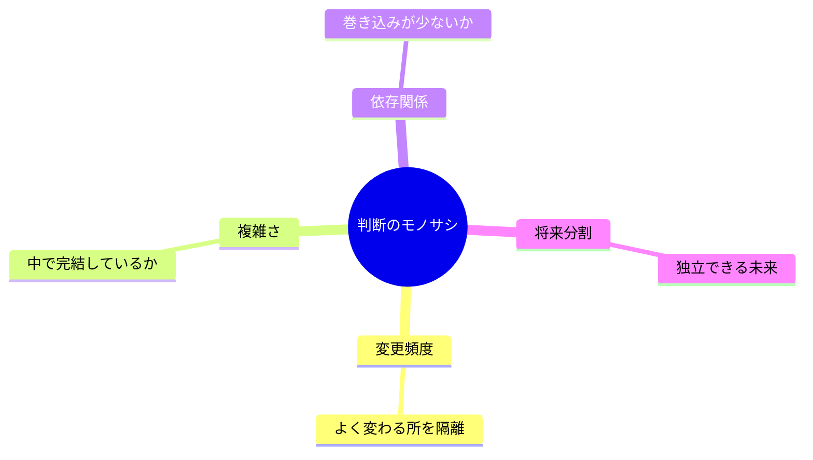
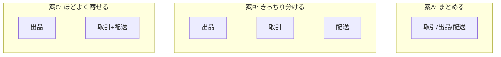
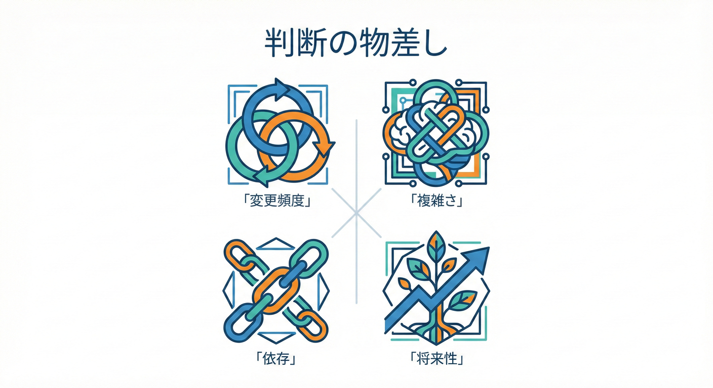

# 第18章 境界案を比べる 判断⚖️👀

## この章でできるようになること🎯✨

* 境界案A/B/Cを「なんとなく」じゃなくて、**物差し**で比べられるようになる🧠📏
* どれを採用するかを**トレードオフ**で決められるようになる⚖️💡
* 採用理由を**3行で説明**できるようになる✍️😊

---

## 18.1 まず超大事な前提📌🧠

境界づけられたコンテキスト（Bounded Context）は、**その中では言葉とモデルが一貫する範囲**のことだよ🧱🗣️
つまり「同じ言葉が、同じ意味で通じる」範囲を守るための境界線✨
この考え方は Martin Fowler の解説でも「大きいモデルを分割して、関係性を明示する」として整理されてるよ。([martinfowler.com][1])
また Eric Evans の **DDD Reference** でも「ある境界の中で、そのモデルが定義され適用される」と定義されてるよ。([Domain Language][2])

ここを忘れると、比較が「好み大会」になっちゃうので要注意⚠️🥺

---

## 18.2 境界案の比較でよく起きる悩み😵‍💫🌀

境界案って、だいたい全部それっぽく見えるんだよね😂
でも実際はこう👇

* **変更が多い場所**と**安定してる場所**が同居してると、改修がしんどい😵‍💫🔧
* 境界を細かくしすぎると、今度は**つなぎ込み**が増えて複雑になる😵‍💫🔗
* 境界を大きくしすぎると、言葉が混ざって**モデルがベチャッ**となる😇➡️😱

だから「正解を当てる」じゃなくて、**いまの目的に合う案を選ぶ**のがコツだよ🧸💕

---

## 18.3 判断の物差し まずは4つ🧭✨

この章では、境界案A/B/Cを次の4つで比べるよ📊👀
（点数化できるから強い💪✨）



## ① 変更頻度🛠️🔁

* よく変わるルールと、めったに変わらないルールが混ざってない？
* 変更が多いところだけ、うまく隔離できてる？

💡目安：
「毎月ルールが増える場所」は、別の境界にしたいことが多いよ📈✨

## ② 複雑さの閉じ込め🧠🧱

* 難しいルールが、他の場所に漏れてない？
* その境界の中で、理解が完結する？

💡目安：
「その話、ここで完結するよね？」が多いほど勝ち🏆😊

## ③ 依存の強さ（結合の弱さ）🔗⚠️

* ある境界が変わったとき、他の境界も巻き込まない？
* 連携が「内部モデル直結」になってない？

💡目安：
境界の外とは「必要最低限の情報」だけで話すのが理想🧼📦

## ④ 将来の分割しやすさ🌱✂️

* もし将来チームが増えたり、機能が伸びたら分けやすい？
* 逆に「一度決めたら分けるの地獄」になってない？

💡目安：
「あとで独立させる未来」が想像できる境界は強い🚀✨

---

## 18.4 スコアリング表で比べよう📊✨

境界案A/B/Cを、各項目 **1〜5点**でつけるよ📝😊

* 1点：かなりツラい😱
* 3点：まあ許容🙂
* 5点：めっちゃ良い😍

## スコア表テンプレ🧾✅

* 変更頻度（分離できてる？）🛠️
* 複雑さ（閉じ込めできてる？）🧠
* 依存（巻き込み少ない？）🔗
* 将来分割（伸びても大丈夫？）🌱

点数だけじゃなくて、**ひとこと理由**も書くのが超大事✍️✨
理由があると、あとで迷子にならないよ🧭😊

---

## 18.5 例 学内フリマの境界案を比べる🛍️🏫

ここは「例」だよ〜📌（自分の案A/B/Cに置き換えてね😊）

## サンプル境界案🎁

* **案A**：出品・取引・配送をまとめて「取引」ひとつにする📦
* **案B**：出品 / 取引 / 配送 を分ける📦📦📦
* **案C**：出品と取引は分ける、配送は取引に寄せる🚚➡️📦



## サンプル比較（イメージ）👀✨

* 変更頻度🛠️

  * 案A：2点（配送変更が取引を巻き込む）😵‍💫
  * 案B：4点（配送変更を隔離しやすい）😊
  * 案C：3点（まあ隔離できるけど境界が揺れやすい）🙂

* 複雑さ🧠

  * 案A：2点（ルールが1か所に集まりすぎ）😱
  * 案B：4点（難しい話が分散しすぎないバランス）✨
  * 案C：3点（配送が取引に混ざって複雑になりがち）🌀

* 依存🔗

  * 案A：2点（中が巨大で、どこ触っても波及）🌊
  * 案B：4点（境界越えを意識しやすい）🧼
  * 案C：3点（配送が混ざるぶん、依存が残る）😵

* 将来分割🌱

  * 案A：2点（分けたくなった時に大工事）🛠️💥
  * 案B：5点（伸びたらそのまま独立しやすい）🚀
  * 案C：3点（配送の独立が後で痛いかも）⚠️

👉 この例だと、**案Bが採用されやすい**って感じだね😊
でも大事なのは「点数」より「理由」だよ✍️✨

---

## 18.6 判断でやりがちな罠あるある😇⚠️

## 1. 案を比較する時の「4つのモノサシ」📏⚖️



どの案がいいか迷ったら、この4つの観点で評価してみよう😊✨
画面都合が変わっただけで境界も崩れがち😵‍💫

👉 境界は「業務の意味」と「ルールのまとまり」で見るのが基本🧠✨

## 罠2 共有したら楽そうで Shared Kernel を増やす🧬😵‍💫

共有を増やすと、あとで調整地獄になりやすい💥
（共有は“最小”が鉄則…！）

## 罠3 今の人数だけで最適化しすぎる👥➡️🧟‍♀️

「今は1人だから全部まとめよ〜」もアリだけど、
伸びたときに分割不能になると泣く😭

👉 「将来分割しやすいか」を必ず一回見る🌱✨

---

## 18.7 採用案を1つに決める 書き方テンプレ✍️😊

採用したら、理由を**3行**で書くよ🧾✨
（これが次の章の記録にもつながるよ📌）

## 3行テンプレ🎀

1. **採用案**：案○○
2. **決め手**：変更頻度と複雑さを一番うまく閉じ込められる
3. **捨てた理由**：案△△は依存が強く、将来分割が難しい

これだけで「ちゃんと考えた感」めっちゃ出る😍✨


---

## 18.8 AI相棒に手伝ってもらう質問テンプレ🤖💬

AIに投げるときは「比較の軸」を渡すのがコツだよ🧠📌

## テンプレ① 点数と理由の叩き台を作る📊

* 「境界案A/B/Cがあります。変更頻度・複雑さ・依存・将来分割の4軸で、各案を1〜5点で仮採点し、1項目につき理由を1行ずつ書いてください。」

## テンプレ② 依存が強い箇所を見つける🔗👀

* 「案Bで、境界越えの依存が強くなりそうなポイントを列挙し、依存を弱める工夫（DTO/ACL/公開API）を提案してください。」

## テンプレ③ 反対意見も作る🥺⚖️

* 「採用案に対する“反対意見”を3つ作ってください。その反対意見への反論（対策）も書いてください。」

---

## 18.9 ミニ演習 TypeScriptでスコア表を型安全にする🧩💻

「スコア表」をコードにしておくと、後で見返すとき楽だよ🧸✨
（点数と理由がズレないのが嬉しい😊）

```ts
type Candidate = "A" | "B" | "C";
type Criterion = "change" | "complexity" | "dependency" | "futureSplit";

type Score = 1 | 2 | 3 | 4 | 5;

type Evaluation = {
  score: Score;
  reason: string; // 1行でOK
};

type Matrix = Record<Candidate, Record<Criterion, Evaluation>>;

const matrix: Matrix = {
  A: {
    change: { score: 2, reason: "変更が多い領域が混ざりやすい" },
    complexity: { score: 2, reason: "ルールが集中して理解が重い" },
    dependency: { score: 2, reason: "どこを触っても波及しやすい" },
    futureSplit: { score: 2, reason: "分割したくなった時に大工事" },
  },
  B: {
    change: { score: 4, reason: "変更が多い領域を分離しやすい" },
    complexity: { score: 4, reason: "複雑さを境界内に閉じ込めやすい" },
    dependency: { score: 4, reason: "境界越えを意識しやすい" },
    futureSplit: { score: 5, reason: "独立させる未来が描きやすい" },
  },
  C: {
    change: { score: 3, reason: "ある程度分けられるが揺れやすい" },
    complexity: { score: 3, reason: "配送が混ざると複雑になりがち" },
    dependency: { score: 3, reason: "依存が残る可能性がある" },
    futureSplit: { score: 3, reason: "配送独立が後で痛いかも" },
  },
};

const total = (c: Candidate) =>
  (Object.values(matrix[c]) as Evaluation[]).reduce((sum, e) => sum + e.score, 0);

const ranking = (["A", "B", "C"] as Candidate[])
  .map((c) => ({ candidate: c, total: total(c) }))
  .sort((x, y) => y.total - x.total);

console.log(ranking);
```

🎯やること

* 自分の案A/B/Cに置き換えて、点数と理由を書き換える📝
* `ranking` を見て「点数が高い案」が出るか確認👀✨
* ただし最後は必ず「理由」を読んで判断⚖️😊

---

## 18.10 今日のまとめ📦✨

* 境界案の判断は「正解当て」じゃなくて**トレードオフ選択**だよ⚖️💡
* 4つの物差し（変更頻度・複雑さ・依存・将来分割）で比べると迷いにくい🧭😊
* 採用理由は**3行**にすると、次に進みやすい✍️✨

TypeScriptは本日時点で npm の latest が **5.9.3** だよ。([npm][3])
（この章の演習コードも、その安定版ラインで気持ちよく動く想定だよ🧸💻）

[1]: https://www.martinfowler.com/bliki/BoundedContext.html?utm_source=chatgpt.com "Bounded Context"
[2]: https://www.domainlanguage.com/wp-content/uploads/2016/05/DDD_Reference_2015-03.pdf?utm_source=chatgpt.com "Domain-Driven Design Reference"
[3]: https://www.npmjs.com/package/typescript?utm_source=chatgpt.com "TypeScript"
