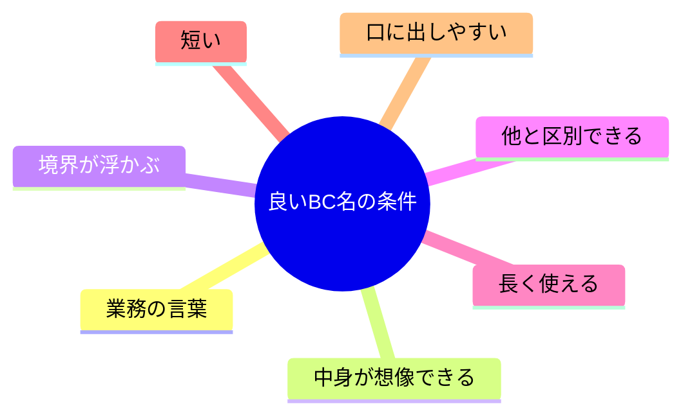
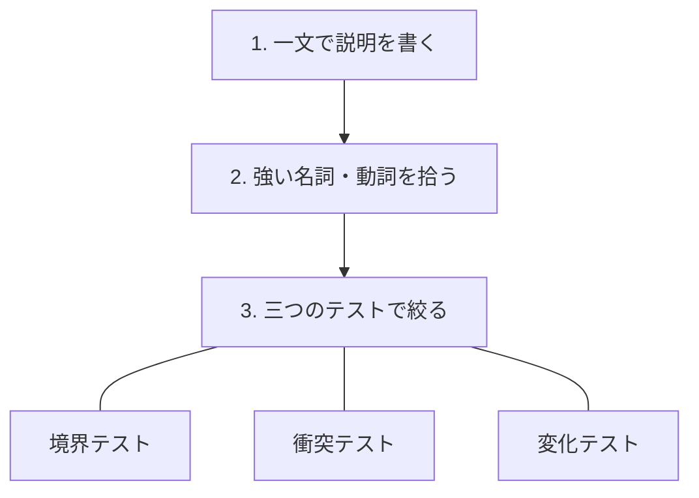
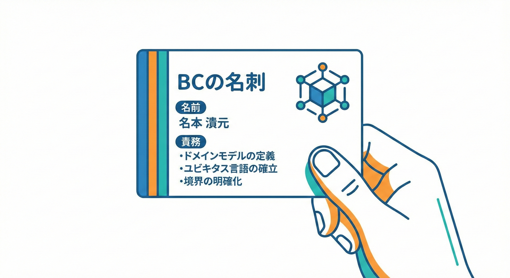
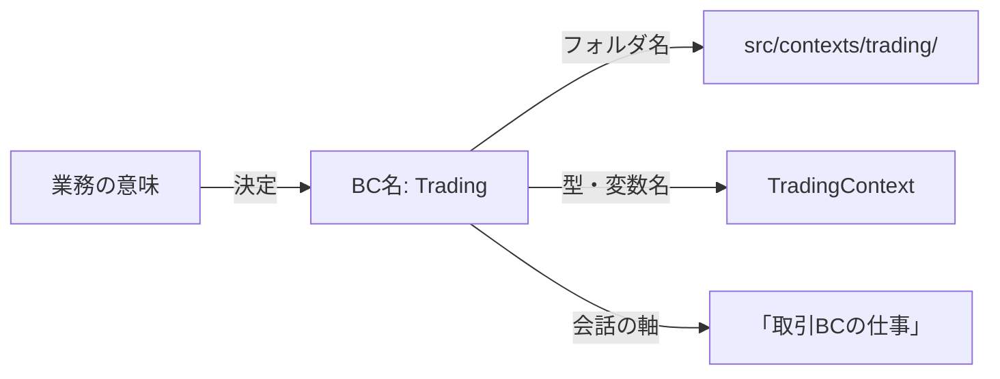

# 第19章 コンテキスト名を決める（超大事）🏷️✨

## 19.1 この章でできるようになること🎯💖

この章のゴールはこれだよ👇✨

* **各BC（Bounded Context）に、ブレない名前を付けられる**🧱🧠
* **「名前＋一言説明」をセットで書ける**✍️🌸
* **“名前の曖昧さ” から起きる境界崩壊を防げる**🛡️🚧

---

## 19.2 なぜ「名前」がそこまで重要なの？😳💥

BCの名前って、ただのラベルじゃないの。

**BC名＝境界の説明書の“表紙”**📘✨
表紙がフワッとしてると、中身（責務）もフワッとして…こうなる👇😇➡️😱

* 会話で「それ、どっちの話？」が増える🌀
* いつのまにか別BCのルールが混ざる🥺💦
* 結果、コードも「なんでも入り口」になって崩れる🚪💥

逆に、名前が良いと…✨

* 相談・レビューが速くなる🏃‍♀️💨
* 迷ったときに「ここまで／ここから」を守りやすい🧱🔒
* ドメインの言葉（ユビキタス言語）が育つ🌱📚

---

## 19.3 まず大原則：BC名は「機能名」じゃなくて「意味のまとまり名」🧠📌

BCは「画面」や「API」単位じゃなくて、**意味がブレない範囲**だよね。

だから名前も、

* ❌ `UserScreen` / `PaymentAPI` / `Database`（実装都合っぽい）
* ⭕ `Trading`（取引）/ `Listing`（出品）/ `Shipping`（配送）みたいに **“業務の意味” が先**✨

**「そのBCは何の世界？」が一発で伝わる名前**が正解に近いよ🏷️💕

---

## 19.4 良いBC名の条件 7つ🌈✅

名前を考えるとき、これをチェックしてね👇✨

1. **業務の言葉で言える**（会話で使える）🗣️
2. **何を扱うかが想像できる**（中心テーマが見える）🎯
3. **何を扱わないかも想像できる**（境界が浮かぶ）🚧
4. **他のBCと区別できる**（似た言葉でも混同しない）🧩
5. **長く使える**（UI/DB/技術変更に引きずられない）🕰️
6. **短い**（2〜3語くらいが強い）✂️
7. **口に出しやすい**（会議で噛まない😂）



---

## 19.5 ありがちな“ダメ名前”図鑑😇📚

これ、めっちゃよく出る…！でも危険⚠️

* `Common` / `Shared` / `Core` 🧨
  → **「何が入っていいか不明」**で、最終的に“何でも箱”になる
* `Util` / `Helper` / `Base` 🧹
  → 便利そうに見えて、境界を壊す“抜け道”になりがち
* `Main` / `App` / `General` 🌫️
  → でかすぎて、責務が説明できない

**ポイント：名前が抽象的すぎる＝責務が抽象的になる**🫠💦

---

## 19.6 命名の作り方テンプレ（超実用）🧰✨



### ステップ1：そのBCを「一文」で説明する✍️🧸

まず名前を考える前に、これを書くよ👇

* 「このBCは、〇〇を△△する世界」
* 「このBCでは、□□のルールだけを扱う」

この一文が書けないなら、**境界がまだ曖昧**なサイン🚨

---

### ステップ2：「中心の名詞」と「中心の動詞」を拾う🔎🧠

一文から、主役ワードを抜き出すよ👇

* 名詞（何の話？）：出品物／取引／配送／支払い…
* 動詞（何をする？）：登録する／成立させる／発送する／精算する…

---

### ステップ3：3つのテストで絞る⚖️👀

#### ✅ テストA：境界テスト（ここまで？どこから？）🚧

その名前を聞いた人が、こう言える？

* 「それはこのBCの仕事っぽい」🙂
* 「それは別BCっぽい」🙅‍♀️

曖昧なら、名前が弱いか、境界が混線してるかも🌀

#### ✅ テストB：衝突テスト（他BCと紛れない？）🧩

似た名前が並んだときに混乱しない？

例：`Order` と `Ordering` と `Purchase` が並ぶと混ざりやすい😵‍💫

#### ✅ テストC：変化テスト（画面や実装が変わっても生きる？）🕰️

* 画面が増える／減る
* DBが変わる
* APIが同期→非同期になる

それでも名前が意味を保てる？💡

---

## 19.7 例題：学内フリマを3つのBCにした場合🛍️🏫

境界案がこうだったとするね👇（例）

* 出品の世界
* 取引の世界
* 配送の世界

このとき、名前はこんなふうに作れるよ🏷️✨

### 候補例（“短い＋意味が強い”）💪

* **Listing（出品）**：出品物を登録し、公開状態を管理する世界📦📝
* **Trading（取引）**：購入・成立・キャンセルなど、取引のルールを扱う世界🤝💳
* **Shipping（配送）**：発送依頼、追跡、受け取りなど配送の流れを扱う世界🚚📮

ここで大事なのは、**英語か日本語か**よりも👇
**会話でズレないか**、**責務が想像できるか**だよ🧠✨

---

## 19.8 「名前＋一言説明」を“名刺”として固定する🪪✨

BC名は、単体だとまたブレやすいから、**名刺セット**にするよ📇💕

### BC名刺テンプレ（そのままコピペOK）📝



```markdown
## Bounded Context 名刺

- 名前：◯◯（英語なら◯◯ / 日本語なら◯◯）
- 一言説明：このBCは「◯◯を△△する世界」
- 境界キーワード（3つ）：◯◯ / ◯◯ / ◯◯
- 混ぜたくないもの（1つ）：◯◯（←別BCの責務）
```

「混ぜたくないもの」が書けると、境界が一気に強くなるよ🛡️🔥
（次章の「目的・非目的」にもスムーズにつながる✨）

---

## 19.9 コードに落とす前の“表記ルール”も決めよう🧾📁

名前が決まったら、**表記のゆれ**を潰すのがコツだよ🙂✨

* ドキュメント表記：`Listing` / `Trading` / `Shipping`（先頭大文字）
* フォルダ表記：`listing` / `trading` / `shipping`（小文字）
* 文章表記：出品BC／取引BC／配送BC（日本語で会話しやすく）

例（フォルダだけ先取り）📁✨

```text
src/
  contexts/
    listing/
    trading/
    shipping/
```

---

## 19.10 演習：あなたの境界案に“強い名前”を付けよう🌸📝



Chapter 18で選んだ境界案に対して、これをやってみよう💪✨

### 演習1：各BCに候補名を3つ出す🌈

1つのBCにつき、候補名を3つ（短め）✍️

* 候補A：業務ど真ん中の言葉🎯
* 候補B：少し広め（将来拡張を見て）🧺
* 候補C：少し狭め（責務を絞って）✂️

### 演習2：3テストで点数を付ける📊✨

各候補に、0〜2点で採点するよ（合計6点満点）

* 境界テスト（0〜2）🚧
* 衝突テスト（0〜2）🧩
* 変化テスト（0〜2）🕰️

### 演習3：勝った名前を“名刺”にして固定🪪💖

19.8のテンプレを埋めて完成🎉

---

## 19.11 AI相棒🤖に頼むときの質問テンプレ（めっちゃ使える）💬✨

「名前出して〜」だけだと、微妙な案が混ざりやすいので、**制約つき**で頼むのがコツだよ🧠💕

```text
次のBounded Contextの命名案を出して。

【BCの一言説明】
このBCは「（ここに1文）」の世界。

【中心キーワード】
名詞：○○、○○、○○
動詞：○○する、○○する

【命名の条件】
- 抽象名（Core/Common/Shared/General/Util）は禁止
- 会話で使いやすい短い名前（1〜2語）
- 他BCと衝突しにくい
- 日本語名 + 英語名（コード用） + フォルダ名（小文字）もセットで

【出力形式】
- 候補10個（理由つき）
- “混ざりやすい別BC責務” を1つ予測して注意書きも添えて
```

AIが出した案は、そのまま採用じゃなくて、**19.6の3テストでふるいにかける**のが勝ちパターン🏆✨

---

## 19.12 よくある失敗とリカバリ🩹😵‍💫

### 失敗①：名前が“でかすぎる”🌫️

例：`User` / `Management` / `System`

* ✅ リカバリ：**何を管理？何の世界？**を一文に戻す✍️

### 失敗②：名前が“実装に寄りすぎる”🔧

例：`Api` / `DB` / `Frontend`

* ✅ リカバリ：業務の名詞・動詞に置き換える🛍️🤝🚚

### 失敗③：英語がカッコよくて意味が伝わらない😎➡️😵

例：`Fulfillment` を誰も説明できない

* ✅ リカバリ：**会話用の日本語名**もセットで付けてOK📛✨

---

## 19.13 提出前チェックリスト✅✨

* [ ] BC名を聞いて、**一言説明**がすぐ言える🎤
* [ ] `Core/Common/Shared`系の“なんでも箱”がない🧨
* [ ] 他BCと紛れない（衝突しない）🧩
* [ ] 画面やDBが変わっても意味が残る🕰️
* [ ] 名前＋名刺テンプレが埋まっている🪪✨

---

## 19.14 ミニ補足：本日時点のTypeScript周辺の動き（超短く）🧸💡

* npm上のTypeScriptは **latest が 5.9.3** と表示されているよ。([npm][1])
* TypeScript 5.9 では、たとえば `import defer` などの機能がリリースノートに載ってるよ。([TypeScript][2])
* ネイティブ移行の検証用として `@typescript/native-preview` が npm に公開されている（プレビュー）。([npm][3])
* ネイティブ版（TypeScript 7）についての進捗も公式ブログで継続的に共有されているよ。([devblogs.microsoft.com][4])

[1]: https://www.npmjs.com/package/typescript?utm_source=chatgpt.com "TypeScript"
[2]: https://www.typescriptlang.org/docs/handbook/release-notes/typescript-5-9.html?utm_source=chatgpt.com "Documentation - TypeScript 5.9"
[3]: https://www.npmjs.com/package/%40typescript/native-preview?utm_source=chatgpt.com "typescript/native-preview"
[4]: https://devblogs.microsoft.com/typescript/progress-on-typescript-7-december-2025/?utm_source=chatgpt.com "Progress on TypeScript 7 - December 2025"
