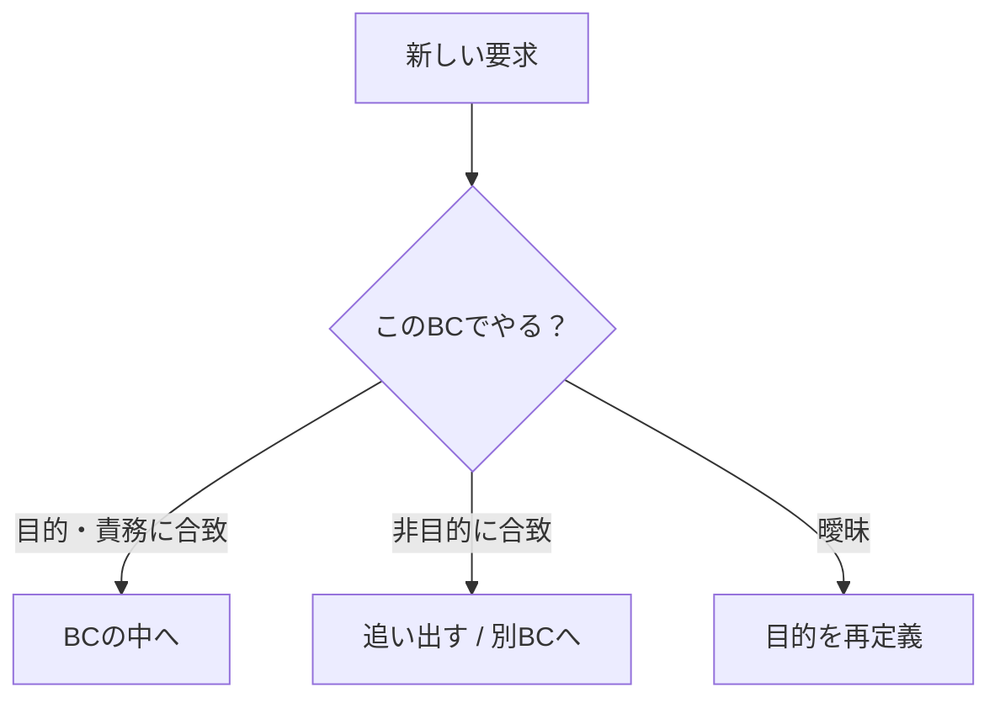
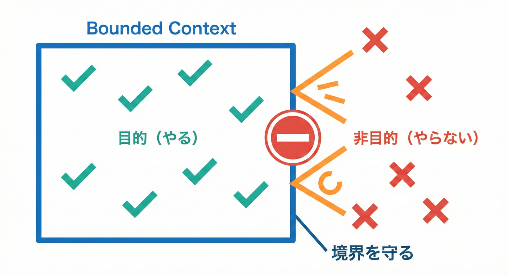
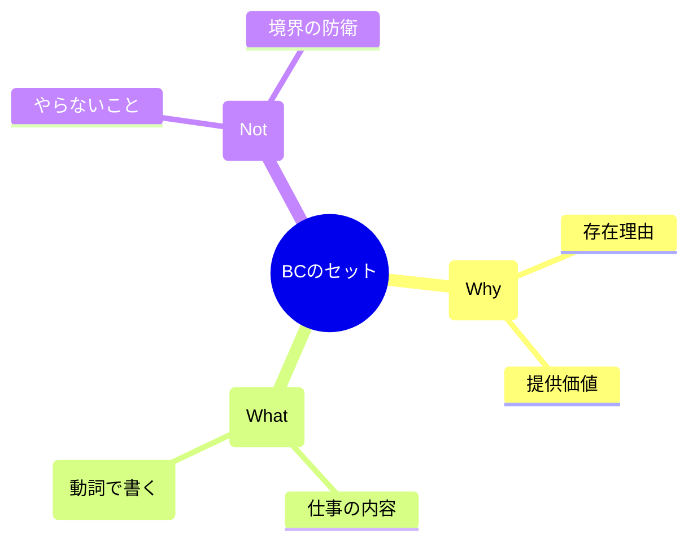
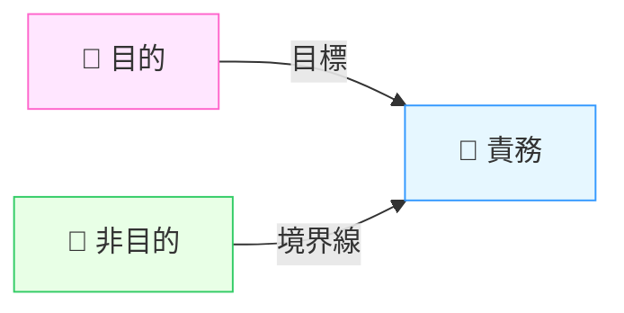

# 第20章 各BCの「責務・目的・非目的」を書く🎯🚫

## 20.1 まず結論：これを書くと、境界が“守れる”ようになる🛡️✨

Bounded Context（BC）って、見た目は「箱を分ける」だけに見えるけど…
本当に強いのは **“文章で境界を固定する”** ことだよ📝💪

この章のゴールはこれ👇

* 各BCについて **目的（Why）／責務（What）／非目的（Not）** の3点セットを書けるようになる🎯
* あとから機能が増えても「それ、どのBC？」で迷子にならないようにする🧭✨
* 仕様の会話で “言った言わない” を減らす📣➡️📄



---

## 20.2 「目的・責務・非目的」って何が違うの？🧠💡



### ✅ 目的（Purpose / Why）

* **そのBCが存在する理由**（何の価値を出す箱？）
* だいたい **1〜2文** でOK✨

例：

* 「出品情報を“公開できる状態”に整えて、一覧表示できるようにする」🛍️

### ✅ 責務（Responsibilities / What）

* **そのBCが面倒を見る仕事**（やること）
* コツは **動詞で書く**（作る／更新する／検証する／確定する…）✍️

例：

* 「出品の公開条件を検証する」✅
* 「出品の表示用データを組み立てる」🧩

### ✅ 非目的（Non-goals / Not）

* **ここではやらないこと**（境界を守る宣言）🚫
* これがないと、BCがズルズル太って破綻しやすい😵‍💫

例：

* 「決済の確定は扱わない」🚫💳
* 「配送会社APIの統合は扱わない」🚫📦



---

## 20.3 書き方テンプレ：BCカード🃏✨

このテンプレを各BCに1枚ずつ作るよ📄💕

```text
【BC名】（英語名でも日本語でもOK）

🎯 目的（1〜2文）
- 

🧩 責務（5〜10個くらい）
- （動詞で）  
- （動詞で）

🚫 非目的（3〜8個くらい）
- （やらないことを明言）
- （他BCに追い出したいこと）

🧷 境界メモ（任意）
- よく混ざる単語：
- 代表ユースケース：
- 外部とのやり取り：
```

---

## 20.4 例題（学内フリマ🛍️）で3つのBCを書いてみる✍️✨

ここでは、わかりやすく **3つのBC** を例にするね👇

* Listing（出品）🛍️
* Trading（取引）🤝
* Shipping（配送）📦

（※実際はもっと増えてOK。まずは少数で練習が大事だよ🧸）

---

### ① Listing（出品）🛍️

🎯 目的

* 出品者が商品を登録し、公開できる状態に整えて、閲覧できるようにする👀✨

🧩 責務

* 出品を作成する（タイトル／説明／価格など）✍️
* 出品の公開条件を検証する（必須項目、禁止ワードなど）✅
* 出品の状態を管理する（下書き／公開／停止）🚦
* 出品の検索・一覧・詳細表示向けのデータを提供する🔎
* 出品の編集ルールを守る（公開中に変えられる項目など）🧷
* カテゴリやタグなど「出品の見つけやすさ」を管理する🏷️

🚫 非目的

* 購入処理（支払い確定）をしない🚫💳
* 取引の進行（購入後の状態遷移）を管理しない🚫🤝
* 配送手続き（発送ラベル、追跡番号）を扱わない🚫📦
* 返金・返品の判定をしない🚫💸（必要なら別BCへ）

💡 よく混ざる注意ワード

* 「在庫」：出品の残数？ 取引の確保？（後者はTrading寄りになりやすい）🌀

---

### ② Trading（取引）🤝

🎯 目的

* 購入から完了までの「取引の進行」を安全に管理し、当事者（購入者・出品者）の合意を状態で表す🔁✨

🧩 責務

* 取引を開始する（購入意思 → 取引生成）🛒
* 取引の状態を管理する（例：開始→支払い待ち→支払い済→発送待ち→完了）🚦
* 取引の当事者を確定する（購入者・出品者）👤
* 取引に必要なスナップショットを保持する（購入時点の価格・商品名など）📌
* 取引のキャンセル条件を判定する（期限切れなど）⏰
* 取引IDを軸に、他BCと連携できる“取引の事実”を提供する🧾

🚫 非目的

* 出品の編集・公開ルールを決めない🚫🛍️（Listingの領域）
* 配送会社とのAPI連携をしない🚫📦（Shippingの領域）
* 問い合わせ対応（CS業務）をしない🚫💬（Supportなどへ）
* “画面の都合” で状態を増やさない🚫🪞（業務の状態だけ！）

💡 境界のコツ

* Tradingは「いま取引がどの段階か」だけに集中すると強い💪✨

---

### ③ Shipping（配送）📦

🎯 目的

* 発送に必要な情報を整え、発送〜配達までの配送進行を追跡できるようにする🚚✨

🧩 責務

* 発送先情報（住所など）を検証・正規化する🏠✅
* 発送依頼を作成する（取引を元に配送ジョブ生成）🧾
* 追跡番号・配送ステータスを管理する🔎
* 発送期限や配送ルールを扱う（例：〇日以内に発送）⏳
* 配送イベント（発送した／配達完了）を記録する📣

🚫 非目的

* 取引の状態遷移そのものを決めない🚫🤝（Shippingは配送の事実を出すだけ）
* 出品の内容（説明文、カテゴリ）を扱わない🚫🛍️
* 決済の成否を扱わない🚫💳
* “学生同士の受け渡し” など配送しない形の業務を無理に飲み込まない🚫🧺（別ルートに）

💡 境界のコツ

* Shippingは「配送の世界のルール」だけに閉じると壊れにくい🧼✨



---

## 20.5 よくある失敗あるある😇➡️😱

### 失敗①：責務が“名詞だけ”になってる🌀

❌「出品、検索、取引、配送」
✅「出品を公開できる状態に整える」「検索用の表示データを組み立てる」みたいに **動詞で** ✍️✨

### 失敗②：非目的が“書いてない”＝境界が溶ける🫠

非目的がないと、こうなる👇

* 「ついでに決済もここで…」
* 「配送のAPIもここで…」
* 「あれ、巨大BC爆誕」💥

### 失敗③：目的が“手段”になってる🔧

❌「DBに保存する」
✅「出品を公開できる状態に整える」
目的は **価値（ユーザー・業務）** に寄せるとブレにくいよ🎁✨

---

## 20.6 ミニ演習：あなたのBCで3点セットを書こう📝💕

1. BCを1つ選ぶ（まずは1つでOK）🎯
2. 代表ユースケースを2つ書く（例：出品する／公開停止する）📌
3. そのユースケースに必要な“判断”を抜き出す（条件・ルール）⚖️
4. ルールが集まる場所＝責務になりやすい🧩✨
5. 「これは別の箱のほうが自然？」を非目的に追い出す🚫📦

演習フォーマット👇（コピペでOK）

```text
【BC名】

🎯 目的：
-

🧩 責務：
- 
- 
- 

🚫 非目的：
- 
- 
- 
```

---

## 20.7 AI相棒🤖に投げる“勝ちプロンプト”テンプレ🎀

### テンプレA：責務の洗い出し🧩

```text
学内フリマのBC「（BC名）」について、目的（1〜2文）、責務（動詞で10個以内）、非目的（5個以内）を提案して。
前提：責務は“判断やルールが集まる場所”を優先。非目的は境界を太らせないために強めに書く。
```

### テンプレB：非目的を強くする🚫

```text
このBCの責務リストを見て、境界を壊しやすい項目（他BCに寄せるべきもの）を指摘して。
さらに「非目的」を具体的な文章にして5つ提案して。
（責務リスト：...）
```

### テンプレC：レビュー観点を作る👀✅

```text
このBCカード（目的/責務/非目的）をレビューするチェックリストを10項目作って。
初心者でもPRで確認できる粒度で。
```

---

## 20.8 最新メモ（2026/02/02時点）🧸💻✨

* TypeScript の npm 配布は **5.9.3 が latest** になっているよ。([npm][1])
* 5.9 では、仕様提案に沿った **遅延モジュール評価（import defer）** のサポートが入ってるよ（新しめ話題）。([TypeScript][2])
* さらに先の話として、コンパイラ等の **ネイティブ移植（Go）** を進めるロードマップも公式に出てるよ。([Microsoft for Developers][3])

（この章の成果物は文章中心だから、ここは「いまの空気感」くらいでOK🌱）

---

## 20.9 この章の完成チェック✅✨

* [ ] 各BCに「目的」が1〜2文で書けてる🎯
* [ ] 「責務」が動詞で書けてる🧩
* [ ] 「非目的」が具体的で、追い出し先が想像できる🚫📦
* [ ] 3つを読んだだけで「このBCに入れるべきか」が判断できる🧭✨

---

## 第21章につながるポイント📚🗣️✨

この章で作った「目的・責務・非目的」は、そのまま **BCごとの用語集（ユビキタス言語）** を作るときの土台になるよ🧱✨

[1]: https://www.npmjs.com/package/typescript?utm_source=chatgpt.com "TypeScript"
[2]: https://www.typescriptlang.org/docs/handbook/release-notes/typescript-5-9.html?utm_source=chatgpt.com "Documentation - TypeScript 5.9"
[3]: https://devblogs.microsoft.com/typescript/typescript-native-port/?utm_source=chatgpt.com "A 10x Faster TypeScript"
