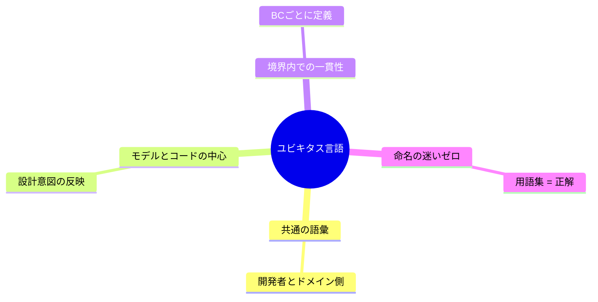
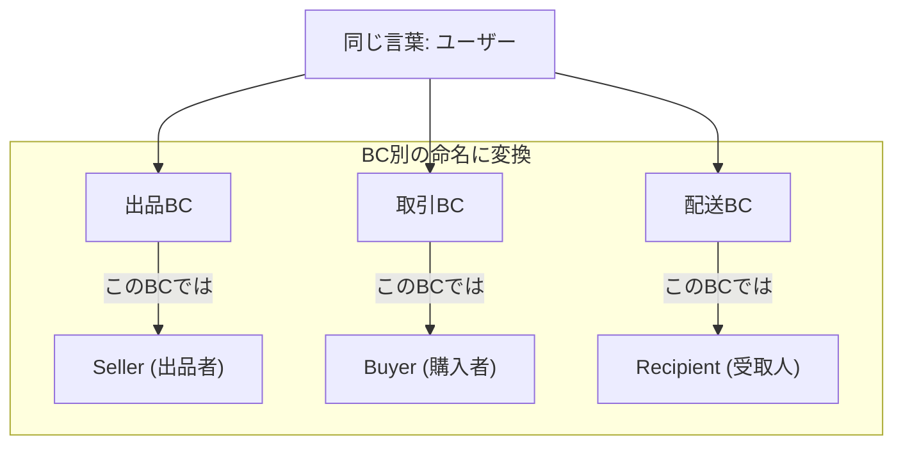
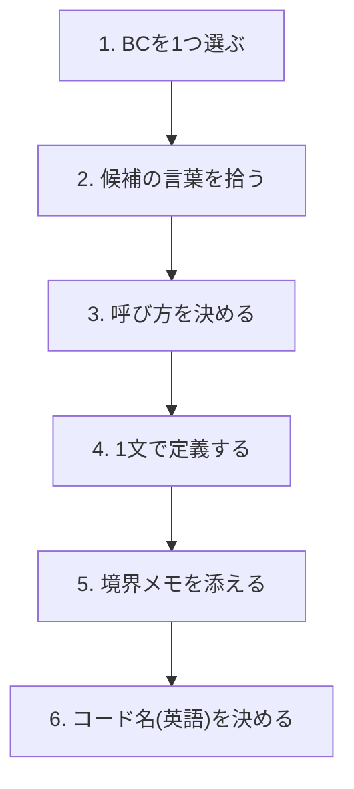
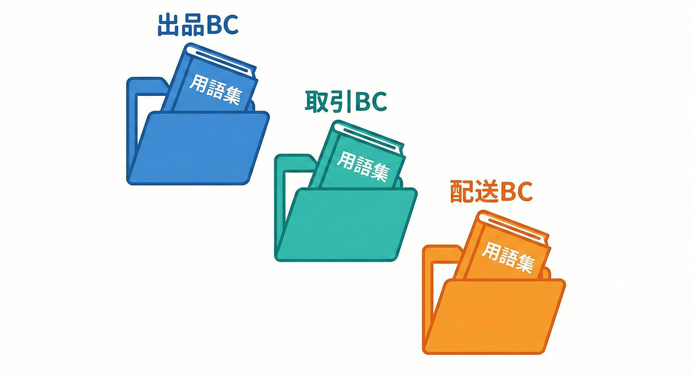

# 第21章 用語集（ユビキタス言語）をBCごとに作る📚🗣️✨

## この章でできるようになること🎯💞

* 「同じ言葉なのに意味が違う😵‍💫」を、BCごとにスッキリ整理できる✨
* BCごとの**ミニ辞書（10語くらい）**を作って、チームで共有できる📖
* そのままコードの命名（型・関数・フォルダ）に繋げられる🧩💻

---

## 21.1 そもそも「ユビキタス言語」ってなに？🧠🌸


ユびキタス言語（Ubiquitous Language）は、**開発者とドメイン側（利用者・運営など）が、同じ意味で同じ言葉を使う**ための共通語彙だよ📣✨
DDDでは、この「言葉」を**モデル（設計）とコードの中心**に置くのが大事って考え方があるの😊🧩 ([martinfowler.com][1])



そして超重要ポイントはこれ👇
**「モデル（＝言葉の意味）は、境界の中で一貫していないとダメ」**
だからこそ、**BCごとに用語集を分ける**のが強い💪✨ ([martinfowler.com][1])

---

## 21.2 “同じ単語、別の意味” を放置すると起きる事故😇➡️😱

例：学内フリマ🛍️で「ユーザー」という言葉が出てきたとして…

* 出品の文脈：出品する人（出品者）👩‍💻
* 取引の文脈：支払いして受け取る人（購入者）🧑‍🎓
* 配送の文脈：住所や受取窓口を持つ人（受取人）📦

これを全部「User」で雑にまとめると、こうなる👇

* いつの間にか **Userに属性が増殖**する（住所、決済、学籍番号、配送希望…）🧟‍♀️
* 「このUserって誰のこと？」で会話が止まる🌀
* テストが地獄（前提が文脈ごとに変わる）🧪💥



---

## 21.3 BC別用語集の作り方 6ステップ🧁✨



ここからは「手順が命」だよ〜！🧭💞

### Step 1：BCを1つ選ぶ（今日は “出品BC” からでもOK）📦

まずは **BCを1つだけ**に絞るのがコツ！一気に全部やると混乱するよ😵‍💫

### Step 2：候補の言葉を拾う🧺📝

拾う場所はこのへん👇

* ユースケース（出品する、編集する、公開する…）🎮
* イベント（出品した、価格を変更した…）📣
* ルール（出品数上限、禁止カテゴリ…）⚖️
* 画面の見出し（“出品一覧”“下書き” など）🪞

### Step 3：「このBCではこう呼ぶ」を決める🏷️✨

* 同じ意味は **同じ言葉に統一**（別名を増やさない）🧼
* 逆に、意味が違うなら **別の言葉を与える**（User問題の解決）✂️

### Step 4：定義は “1文で” 固める📌

定義は長くするとブレるから、まずは **1文ルール**がおすすめ😊

* 例：「出品（Listing）＝学内フリマで販売対象として公開される1件の登録」

### Step 5：境界の注意書きを入れる🚧

* 「取引BCの“注文”とは別」
* 「配送BCの“住所”はここには入れない」
  みたいに、**境界メモ**を添えると守りやすい🛡️✨

### Step 6：コード名（英語）も一緒に決める💻🧩

辞書は会話用だけじゃなくて、**命名ルールの元ネタ**にもなるよ💞
（例：出品＝Listing、下書き＝DraftListing）

---

## 21.4 そのまま使える✨ 用語カード（テンプレ）🃏📚

BCごとの用語集は、まず **Markdown 1枚**でOK！軽いのが続くコツ🥰

```md
## Glossary（◯◯BC）

| 用語 | コード名 | 1文定義 | 例（会話） | 境界メモ | 似てるけど別（禁止語） |
|---|---|---|---|---|---|
|  |  |  |  |  |  |
```

✅「禁止語」欄が超大事！
ここに “言い換えが増殖するのを止める魔法” を入れるの🪄✨

---

## 21.5 例題：学内フリマ🛍️ 用語集サンプル（3BCぶん）📖✨

## A) 出品BC（Listing）🛍️🏷️

| 用語    | コード名          | 1文定義              | 例（会話）          | 境界メモ           | 似てるけど別（禁止語） |
| ----- | ------------- | ----------------- | -------------- | -------------- | ----------- |
| 出品    | Listing       | 販売対象として公開される1件の登録 | 「この出品、公開していい？」 | 取引や配送の情報は持たない  | 商品 / オークション |
| 下書き出品 | DraftListing  | まだ公開されていない出品      | 「下書きのまま保存して〜」  | 公開前のルールだけ扱う    | 仮登録         |
| 公開    | Publish       | 出品を公開状態にする操作      | 「公開したら見えるよね？」  | 取引開始は別BC       | リリース        |
| 出品者   | Seller        | 出品の責任者となる人        | 「出品者が編集できる」    | “購入者”とは別       | ユーザー        |
| カテゴリ  | Category      | 出品が属する分類          | 「教科書カテゴリに入れる」  | 全体分類の管理は別でもOK  | ジャンル        |
| 価格    | Price         | 出品時点で設定する販売価格     | 「価格を1000円に」    | 支払い手数料は取引BC    | 金額          |
| 在庫    | Stock         | 出品できる個数の残り        | 「在庫1なら売り切れ早い」  | 取引確定は取引BC      | 数量          |
| 出品画像  | ListingImage  | 出品に紐づく画像          | 「画像を差し替えたい」    | 実ファイル管理は外部でもOK | サムネ         |
| 出品状態  | ListingStatus | 下書き/公開/停止などの状態    | 「停止中なら表示しない」   | 取引の状態とは別       | ステータス       |
| 出品ルール | ListingPolicy | 出品に関する制約の集合       | 「禁止カテゴリは弾く」    | 支払い・配送は関与しない   | バリデーション     |

## B) 取引BC（Trading）💳🧾

| 用語         | コード名          | 1文定義            | 例（会話）          | 境界メモ           | 似てるけど別（禁止語） |
| ---------- | ------------- | --------------- | -------------- | -------------- | ----------- |
| 注文         | Order         | 購入の意思と条件を確定した取引 | 「注文を確定する」      | 出品の編集はできない     | 購入          |
| 購入者        | Buyer         | 注文を行う人          | 「購入者はキャンセル可能」  | 出品者とは別概念       | ユーザー        |
| 取引ID       | OrderId       | 注文を一意に識別するID    | 「OrderIdで追跡する」 | 出品IDとは別        | 管理番号        |
| 支払い方法      | PaymentMethod | 決済に使う手段         | 「支払い方法を選ぶ」     | 実決済は外部サービスでもOK | 決済          |
| 手数料        | Fee           | 取引にかかる追加コスト     | 「手数料込みでいくら？」   | 価格（出品）とは別      | 料金          |
| 取引状態       | OrderStatus   | 注文の進行状態         | 「支払い待ち→確定」     | 配送の状態とは別       | ステータス       |
| キャンセル      | Cancel        | 注文を取り消す操作       | 「期限内ならキャンセル」   | 返金は別手順でもOK     | 破棄          |
| 返金         | Refund        | 支払い済み分を戻す処理     | 「返金処理は完了？」     | 外部決済と連携しがち     | 払い戻し        |
| 取引スナップショット | OrderSnapshot | 注文時点の出品情報の写し    | 「当時の価格で固定」     | 出品が変更されても揺れない  | コピー         |
| カート        | Cart          | 購入前の一時的な候補集     | 「カートに入れておく」    | 長期保管はしない       | 仮注文         |

## C) 配送BC（Shipping）📦🚚

| 用語    | コード名           | 1文定義           | 例（会話）         | 境界メモ           | 似てるけど別（禁止語） |
| ----- | -------------- | -------------- | ------------- | -------------- | ----------- |
| 配送    | Shipment       | 注文品を届けるための配送単位 | 「配送を作成する」     | 支払いは扱わない       | 発送          |
| 受取人   | Recipient      | 受け取り情報を持つ人     | 「受取人の住所」      | 購入者と一致しない場合もある | ユーザー        |
| 住所    | Address        | 配送先を表す情報       | 「住所が未入力だよ」    | 住所帳の管理は別でもOK   | 所在地         |
| 受取方法  | DeliveryMethod | 手渡し/ロッカー等の受取手段 | 「学内ロッカーにする」   | UI都合に引きずられない   | オプション       |
| 配送ラベル | ShippingLabel  | 宛名や識別情報のラベル    | 「ラベル発行して貼る」   | 生成は外部でもOK      | 伝票          |
| 追跡番号  | TrackingNumber | 配送状況確認のための番号   | 「追跡番号ある？」     | 外部キャリア依存になりやすい | 問い合わせ番号     |
| キャリア  | Carrier        | 配送業者や手段の種別     | 「学内便を使う」      | 取引ルールとは別       | 業者          |
| 発送    | Dispatch       | 送り出しを確定する操作    | 「発送したら通知して」   | 取引完了とは別        | 出荷          |
| 配送状態  | DeliveryStatus | 準備中/配送中/配達済など  | 「配達済みになった」    | 取引状態と混ぜない      | ステータス       |
| 配送予定  | DeliveryWindow | 受取可能な期間や時間帯    | 「明日の昼に受け取りたい」 | 厳密さは要件次第       | 希望時間        |

---

## 21.6 用語集を “コードに効かせる” 小さなコツ💻🪄

用語集は作って終わりじゃなくて、**命名の迷いを減らす**のが目的だよ😊✨

### コツ①：用語集の「コード名」を、そのまま型名にする🧩

```ts
// Listing BC の言葉を、そのまま型にするイメージ
export type ListingId = string;

export type ListingStatus = "draft" | "published" | "suspended";

export type Price = {
  amount: number; // 価格（出品BCの言葉）
  currency: "JPY";
};
```

### コツ②：「同じ言葉」を無理に共有しない🙅‍♀️

例えば「ステータス」はどのBCにもあるけど、意味が違うよね？
だから **ListingStatus / OrderStatus / DeliveryStatus** みたいに分けるのが自然✨

### コツ③：辞書に「禁止語」を書いたら、レビューで見張れる👀✅

「これ“商品”って呼んでるけど、うちの辞書だと“出品”だよね？」って、優しく指摘できる💞

---

## 21.7 AI相棒🤖✨に手伝ってもらう（超おすすめ！）

AIは **“たたき台作り” が得意**だよ🧁
でも、最後に意味を決めるのは人間（あなた）👑✨

### ① 用語候補を集めるプロンプト🧺

```text
あなたはドメイン用語整理のアシスタントです。
学内フリマの「出品BC」に対して、用語集の候補を12個ください。
各用語に「1文定義」「似ているが別の語（混同注意）」も付けてください。
```

### ② “同じ単語の衝突” を洗い出すプロンプト💥

```text
次の3つのBCがあります：出品BC / 取引BC / 配送BC。
「同じ単語なのに意味が違いそう」な衝突候補を5つ挙げ、
BCごとに意味の違いを1文で説明し、名前の付け分け案も出してください。
```

### ③ 禁止語（言い換え増殖）を止めるプロンプト🚫🧼

```text
この用語集で、同じ概念を別名で呼んで混乱しそうな箇所を探し、
「禁止語」「推奨語」をセットで提案してください。
口調はやさしく、レビューコメント風にしてください。
```

🔎 ちなみに、TypeScriptは現時点で 5.9 系が最新ラインとして案内されていて、インストール方法も公式にまとまってるよ🧸💻 ([npm][2])
（用語集作り自体はTSのバージョンに依存しないけど、命名やコード化の作業がスムーズになる✨）

---

## 21.8 用語集レビューのチェックリスト✅👀

* 用語の定義が **1文で言える**？（長すぎ＝ブレやすい）✂️
* 同じ意味の別名が増えてない？（禁止語が効いてる？）🚫
* 「このBCでは扱わない」が書いてある？（境界メモ）🚧
* 会話でもコードでも、同じ言葉になってる？（ドキュメント⇄実装一致）🔁
* “User問題” みたいな衝突語が、ちゃんと分割されてる？🧩

---

## 21.4 BCごとに辞書を分ける📖✂️



それぞれのBCフォルダの中に、`glossary.md` や `terms.txt` を置くイメージだよ😊

## 21.9 章末ミニ課題🎓🍓

1. 出品BCの用語集を **10語** 作る📚
2. 取引BC・配送BCもそれぞれ **10語** 作る📚
3. 「衝突しやすい単語」を **3つ** 選んで、BCごとの差を書き分ける🌀
4. 各BCで **禁止語を2つ以上** 入れる🚫✨

できたら、用語集は **チームの“共通ルール”**になるよ🫶
設計の地味な努力だけど、効き目めちゃ大きい💪💖

[1]: https://www.martinfowler.com/bliki/BoundedContext.html?utm_source=chatgpt.com "Bounded Context"
[2]: https://www.npmjs.com/package/typescript?utm_source=chatgpt.com "TypeScript"
