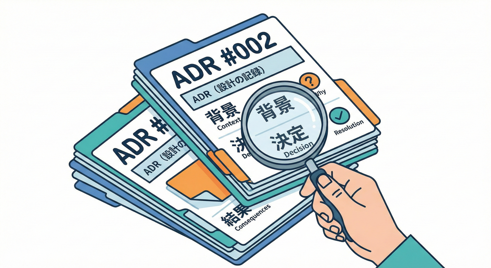
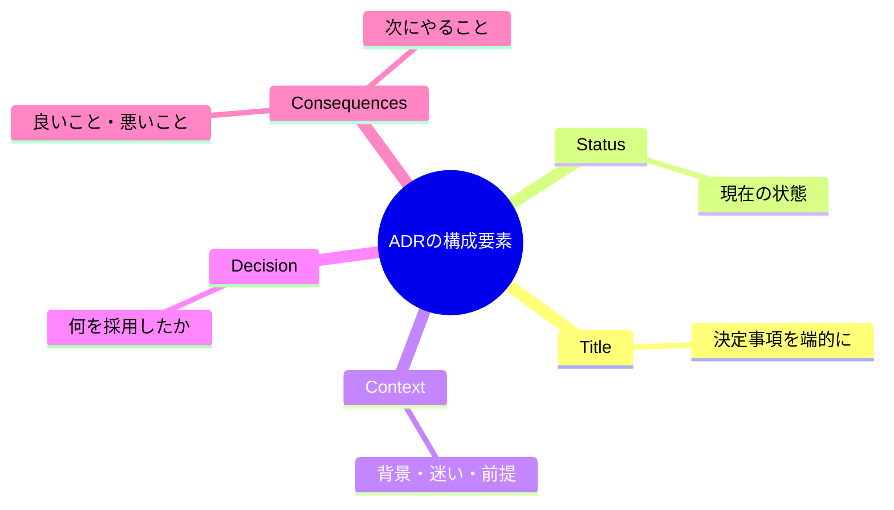
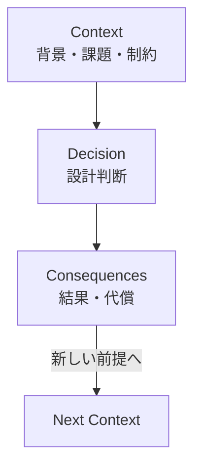
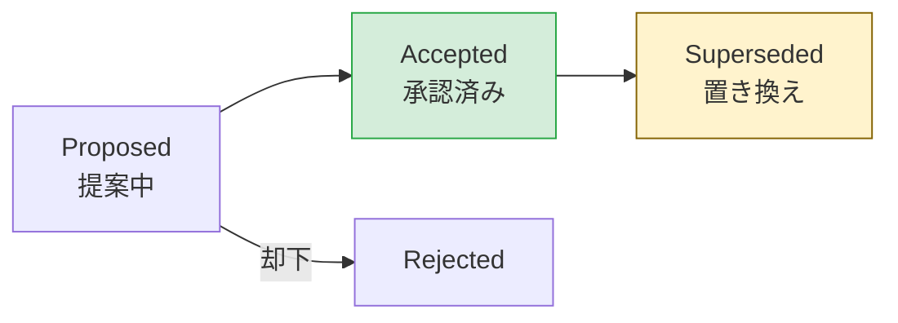

# 第22章 ADRミニ（設計判断のメモ）🧾🧠

## この章のゴール🎯✨

* 「ADRってなに？」を**説明できる**ようになる😊
* いま決めたBC（境界）の判断を、**未来の自分＆仲間が読んで迷子にならない形**で残せるようになる🧭📌
* 最終的に **ADRを1枚** 書き上げる📄✅

---

## ADRってなに？🧐📌



ADR（Architecture Decision Record）は、**重要な設計判断**を「背景（なぜ）＋決定（なに）＋結果（どうなる）」のセットで残すための短いメモだよ📝✨
1枚ごとに「1つの大事な決定」を書くのが基本！
特に有名な基本形は、**Title / Status / Context / Decision / Consequences** だよ📦✨ ([The GDS Way][1])



この形は Michael Nygard の提案が広く参照されてるよ📚 ([The GDS Way][1])

---

## なんでBC（境界）の学習でADRが効くの？🧱🗺️

BCって、テストの答えみたいに「唯一の正解」があることは少ないよね🤔💭
だからこそ、**どうしてその境界にしたのか**を残しておくと…

* 3ヶ月後の自分が「なんでこう切ったんだっけ？」って悩まない😇🧠
* チームが増えても「議論の前提」を共有できる🤝✨
* 変更が必要になっても「当時の前提」と比べて判断しやすい🔁📌（前提が変わったなら変えてOK！）

「決定の結果（Consequences）が、次の決定の背景（Context）になる」って考え方も超大事だよ🔗✨ ([Cognitect.com][2])



---

## 「ADRを書くべき決定」ってどれ？🧠⚖️

ADRはなんでも書くメモじゃないよ🙅‍♀️💦
**“プロジェクトの進み方に影響する大きめの決定”** を書くのがコツ！

たとえばBCだと👇

* 境界案A/B/Cのうち、**どれを採用するか**📦📦📦
* BC名（Listing/Trading/Shipping…）をこう決めた🏷️
* BC間のやりとりを「DTOで運ぶ」にする、など統合方針📦➡️📦
* 共有を避ける／共有するなら最小、みたいなルール🧬✂️

逆に、コミットログで足りるような細かい変更までADRにすると、読むのがツラくなるよ〜😵‍💫 ([Red Hat][3])

---

## ADRの置き場所（おすすめ）📁🧷

「コードと一緒に」置くのがやりやすい！
たとえば👇みたいに、リポジトリ内にフォルダを作るのが定番だよ📂✨

* `docs/adr/`
* `docs/decisions/`（MADR系の例でよく出る） ([GitHub][4])

「バージョン管理できる場所に置く」と、**誰がいつ何を変えたか**が追えるのが強い💪✨ ([The GDS Way][1])

---

## ADRの“最低限”フォーマット（ミニ）🧾✨

いきなり長文にしないで、まずはこの5つでOK！
（MADRでもこの考え方が基本だよ🧸） ([GitHub][4])

```md
## ADR-0001: （決定のタイトルを一言で）

- Status: Accepted | Proposed | Superseded
- Date: YYYY-MM-DD

## Context（背景）
- いま困っていること / 迷っていること
- 制約（時間・人・技術・運用）
- 重要な前提（変わりうる前提は特に！）

## Decision（決定）
- 私たちは「なに」を採用する
- 採用しない案（軽くでOK）

## Consequences（結果）
- 良いこと（メリット）
- 困ること（デメリット / 代償）
- 次に必要になること（宿題）
```

**Status** のおすすめ運用👇

* Proposed：まだ相談中（ドラフト）🌀
* Accepted：決まった✅
* Superseded：後で別のADRに置き換えた🔁（古いのは消さず残す） ([AWSドキュメント][5])



---

## 例：この教材の題材（学内フリマ🛍️）でADRを書いてみよう✍️😊

ここでは「境界案を採用した理由」を1枚にするよ📄✨

```md
## ADR-0001: BCを Listing / Trading / Shipping に分ける

- Status: Accepted
- Date: 2026-02-02

## Context（背景）
学内フリマには「出品」「取引」「発送」という流れがある。
最初に全部を1つのモデルにすると、同じ言葉（例: User, Status）が場面によって意味がズレて混乱しやすい。
また、変更の頻度が違うルールが混ざると、修正時に影響範囲が読みにくくなる。

境界案A: すべて1つのBC（Monolith Model）
境界案B: 出品と取引を分け、発送は取引に含める
境界案C: 出品 / 取引 / 発送 を分ける

## Decision（決定）
境界案Cを採用し、以下の3つのBCに分ける。

- Listing（出品）
  - 出品物の登録・更新・公開/非公開、出品中の管理
- Trading（取引）
  - 購入、支払い確認、取引状態、キャンセル/返金ルール
- Shipping（発送）
  - 発送依頼、発送状況、受取確認（配送の都合に寄る部分を隔離）

採用しない案
- 案A（全部1つ）は「同じ言葉の衝突」と「変更影響の拡大」が大きいので避ける
- 案B は Shipping が Trading に引っ張られて、配送都合の変更が取引モデルを汚しやすい

## Consequences（結果）
メリット
- 各BCの言葉の意味が固定され、モデルが整理される
- Shipping の都合（住所表記・配送会社・ステータスなど）が Trading を汚しにくい
- 後で Shipping を外部サービス連携にしても境界が保てる

デメリット / 代償
- BC間連携が必要になり、DTOなどの“運搬用の形”が増える
- 境界を越えるデータ同期の設計が必要になる（整合性の考えが増える）

次に必要なこと
- 各BCの「目的・責務・非目的」を明文化する
- 用語集をBCごとに作る（同名でも意味が違う可能性を潰す）
```

ポイントはこれ👇✨

* 「**決めた**」だけじゃなくて、「**なぜその案を捨てたか**」が少し入ってる✅
* “代償（デメリット）” が書けてる（ここがないADRはだいたい弱い😵‍💫）
* “次に必要なこと” が宿題になって、次の章に繋がる🔗✨ ([Cognitect.com][2])

---

## ADRを“読みやすくする”3つのコツ👀💡

1. **タイトルは「問題」じゃなく「決定」**を書く🎯
   　例：「境界が難しい」❌ →「BCをListing/Trading/Shippingに分ける」✅

2. **1枚1決定**にする📄
   　でっかい決定を分割して、読む側の負担を減らす🧸✨ ([Cognitect.com][2])

3. **古いADRは消さない**🗃️
   　新しい決定で置き換えたら、StatusをSupersededにして残す🔁
   　「その時はそれが正しかった」っていう歴史が大事だよ🕰️✨ ([AWSドキュメント][5])

---

## AI相棒と書くときの“うまいやり方”🤖💞

GitHub Copilot や OpenAI Codex系の相棒がいると、ADRはかなり楽になるよ✍️✨
ただし！AIは「それっぽい理由」を作るのが得意なので、**最後は必ず自分の言葉で整える**のが大事😊🧠

### 使えるプロンプト例（コピペOK）📋✨

```text
次の設計判断についてADRの下書きを作って。
MADR風で、Context/Decision/Consequences（メリット・デメリット）を短く。
決定の代替案も2つ入れて。
題材: 学内フリマ
決定: BCを Listing / Trading / Shipping に分ける
制約: 初学者が理解できる粒度、あとで実装に落とす
```

```text
このADRの「弱い点」をレビューして。
特に「前提が抜けてないか」「デメリットが甘くないか」「代替案が適切か」をチェックして、
修正案を箇条書きで出して。
```

```text
このDecisionのConsequencesとして、将来起こりうる“困りごと”を5個挙げて。
（例：BC間連携、データの二重管理、テストの難しさ、など）
それぞれに対して“軽い対策案”も添えて。
```

---

## ミニ演習🎓🧸（15〜25分）

### 演習1：ADRを1枚書こう✍️✨

1. 境界案A/B/Cのうち「採用した案」を1つ選ぶ✅
2. 採用しなかった案を2つ書く（短く）📝
3. Consequences に **デメリットを最低2つ** 入れる⚠️
4. “次に必要なこと” を3つ書く（次章への橋渡し）🌉

### 演習2：セルフ採点チェック✅👀

* タイトルが「決定」になってる？🎯
* Contextに「制約」か「前提」が入ってる？🧷
* デメリットが“痛みとしてリアル”？😵‍💫
* 次の行動が見える？🚶‍♀️✨

---

## まとめ🌸📌

* ADRは「設計判断のメモ」🧾✨（背景→決定→結果） ([The GDS Way][1])
* BCは正解が1つじゃないから、**なぜその境界にしたか**を残すと強い🧱🗺️
* まずは **1枚1決定＋短く** が勝ち💪😊
* 置き換えたら **Supersededで歴史を残す**🔁🗃️ ([AWSドキュメント][5])

（補足：本日時点でTypeScriptは npm 上の latest が 5.9.3 だよ🧸💻） ([npmjs.com][6])

[1]: https://gds-way.digital.cabinet-office.gov.uk/standards/architecture-decisions.html "Documenting architecture decisions - The GDS Way"
[2]: https://www.cognitect.com/blog/2011/11/15/documenting-architecture-decisions "
    
    Documenting Architecture Decisions
    
  "
[3]: https://www.redhat.com/ja/blog/architecture-decision-records?utm_source=chatgpt.com "Why you should be using architecture decision records to ..."
[4]: https://github.com/adr/madr "GitHub - adr/madr: Markdown Architectural Decision Records"
[5]: https://docs.aws.amazon.com/prescriptive-guidance/latest/architectural-decision-records/best-practices.html "Best practices - AWS Prescriptive Guidance"
[6]: https://www.npmjs.com/package/typescript?utm_source=chatgpt.com "TypeScript"
