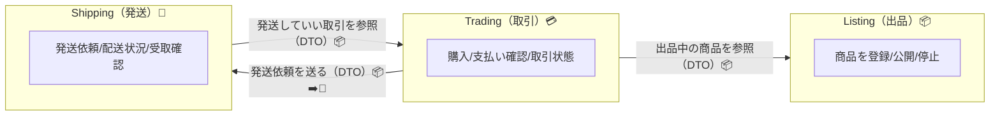

# 第23章 Context Mapとは？（関係図）🗺️✨

## この章のゴール🎯💖

この章が終わったら、あなたは👇ができるようになります😊✨

* Context Map（コンテキストマップ）を **「なにか」説明できる** 🗣️✨
* 自分のBC（境界）を **箱と矢印で“見える化”** できる 🧱➡️🧱
* 「BC同士、どこで・何を・どうやって渡す？」を **ざっくり決められる** 📦🔁

---

# まず前章（第22章）のつながり🔗🧾

前章では、重要な設計判断を **ADR（短い設計メモ）** として
「背景（なぜ）＋決定（なに）＋結果（どうなる）」で残しましたよね😊✨ 

そしてADRには、BCの決めごとだけじゃなくて
**「BC間のやり取り方針（DTOで運ぶ等）」みたいな“統合の方針”も書くと良い**…って話が出てました📦➡️📦 

👉 つまりこの第23章は、まさにその続き！
**「BC同士の関係を“地図”にして見える化」** する章だよ〜🗺️✨

---

# Context Mapってなに？🗺️👀

Context Mapは一言でいうと…

> **BC（箱）と、BC同士のつながり（矢印）を描いた“関係図”** 🧱➡️🧱

です😊✨
“地図”って名前の通り、迷子防止アイテム🧭💕

---

# なんでContext Mapが必要なの？🎁✨

BCを分けただけだと、次にこうなることが多いの👇

* 「え、取引BCって出品BCのどこ見ていいの？😵」
* 「ShippingってTradingに何を渡すの？📦」
* 「“User”って結局どっちの意味？😇」

Context Mapがあると…✨

* どのBCが、どのBCに依存してるか見える👀
* 境界を越えるときに **“運搬用の形（DTOとか）”が必要**って気づける📦
* 後からチームが増えても説明がラク🤝✨
* 「この矢印ヤバくない？（依存が強すぎる）」が早めに分かる⚠️😳

---

# 第23章では「超ミニ記法」でOK👌✨

この章はまだ **第24〜28章の“関係パターン”の前**です🙂
だから、いきなり難しい言葉でガチガチにしません🙅‍♀️💦

今日はこれだけ覚えればOK👇

## ✅ Context Mapの最小パーツ

* **箱（BC）**：名前（＋一言説明があると最高）🏷️✨
* **矢印（関係）**：どっちがどっちに関わる？➡️
* **矢印ラベル**：何をやりとり？（例：出品一覧を参照、発送依頼を送る）📝

---

# 学内フリマ例🛍️（超わかりやすい関係）

仮にBCがこうだとして👇

* Listing（出品）📦
* Trading（取引）💳
* Shipping（発送）🚚

よくある関係は、まずこのくらいから始まるよ😊✨

* Trading は「出品中の商品」を知りたい → Listing を参照したい👀
* Shipping は「発送していい取引」を知りたい → Trading を参照したい👀
* Trading が成立したら「発送お願い！」って Shipping に依頼したい📦➡️🚚

この “関係の方向” をちゃんと描くのが Context Map の第一歩だよ🗺️✨

---

# VS CodeでContext Mapを作ろう💻✨（Windows前提🪟）

## ① ファイルを作る📄

プロジェクトにこんな感じで置くのがおすすめ！

* `docs/context-map.md` 🗺️✨
* （ADRがあるなら）`docs/adr/` 🧾✨ 

## ② “箱（BC）”を並べる🧱

まずはBC名をそのまま箱にするだけでOK😊
（第19〜21章で決めた名前・責務・用語集がここで効いてくるよ📚✨）

## ③ “矢印”を入れる➡️

次の質問に答えると、矢印が自然に出ます👇

* **誰が誰を使う？**（依存の方向）🤝
* **境界を越えるとき何が必要？**（渡すデータ）📦
* **それは“参照”？“依頼”？“通知”？** 🔁📣

---

# Mermaidで描く（コピペOK）🧸✨

VS CodeでMarkdownを書くなら、Mermaidで図が作れて便利だよ😊
（プレビューできる環境なら最高！できなくてもOK！）



## ここでのポイント💡✨

* 矢印は「気持ち」でOK！まず描くのが大事😊
* ラベルに **DTO** って書いておくと、後の章（統合）につながる📦✨
* 「内部モデルを直で渡さない」意識が芽生える🌱🛡️

---

# “地図”が良い地図になってるかチェック✅👀

初心者さん向けのチェックリストだよ🧸✨

* [ ] 箱（BC）の名前がハッキリしてる？🏷️
* [ ] 矢印の向きが「依存の向き」になってる？➡️
* [ ] 矢印ラベルに「何を渡すか」が書いてある？📝
* [ ] 境界を越えるものを「DTO（運搬用）」って意識できてる？📦
* [ ] 矢印が増えすぎてない？（増えたら危険信号かも⚠️）

---

# ミニ演習🎓✨（20〜30分）

## 演習1：Context Map v0 を作ろう🗺️✨

1. BCを3つ書く（箱だけ）📦📦📦
2. 矢印を **最低3本** 引く➡️➡️➡️
3. 各矢印に「何を渡す？」を一言で書く📝
4. 最後に、図の下に「この図で分かったこと」を3行で書く✍️💕

## 演習2：未来の自分に優しくする🎁

Context Map の下に、これを追記してね👇

* 「いまの前提」
* 「まだ決めてないこと」
* 「次の章で詰めること」

ADRが “判断のメモ” なら、Context Mapは “関係の地図” 🧾🗺️
セットで持つと超つよいよ💪✨ 

---

# AI相棒（Copilot / Codex等）で爆速にする🤖💞

AIに任せるときのコツは
**「まず雑に出させて、あなたが削って整える」** だよ✂️😊

### 使えるプロンプト（コピペOK）📋✨

```text
学内フリマのBounded Contextが Listing / Trading / Shipping の3つあります。
Context Mapの“超ミニ版”を作りたいです。
箱（BC）と矢印（依存）を提案して、矢印ラベルに「何を渡すか」を短く書いてください。
難しいパターン名（Customer/Supplierなど）はまだ使わず、まずはシンプルに。
```

```text
このContext Map案の「依存が強すぎる点」「矢印が多すぎる点」を指摘して、
減らすためのアイデアを3つ提案して。
```

```text
BC間で渡しているデータをDTOにするとき、フィールド候補を提案して。
ただし「必要最低限」にして、削れそうなものも指摘して。
```

---

# まとめ🌸✨

* Context Mapは **BC同士の関係を描く“地図”** 🗺️
* 第23章はまず **箱＋矢印＋ラベル** の超ミニでOK👌✨
* 前章のADRで「境界を決めた理由」を残したなら、
  今章のContext Mapで「境界のつながり」を残そう🧾🗺️ 

---

# 次章への予告🎀

次の第24章からは、いよいよ
「その矢印、どっちが主導権？」みたいな **関係の型（パターン）** を学んで、
Context Mapをもっと“使える地図”に育てていくよ〜🗺️✨🤝

必要なら、あなたの今のBC案（名前だけでもOK！）をもとに、
この章の「Context Map v0」を一緒に作るところまで手伝えるよ😊🛍️✨
