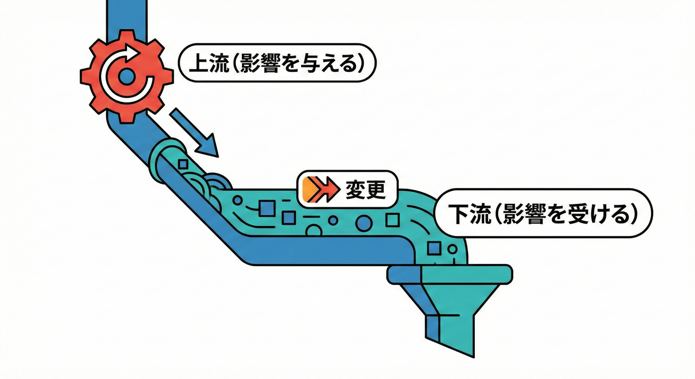
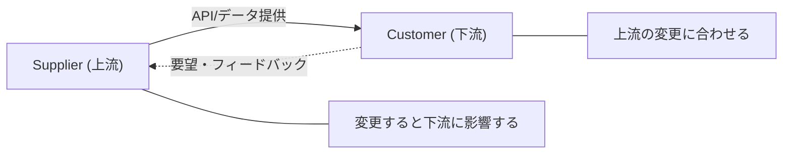
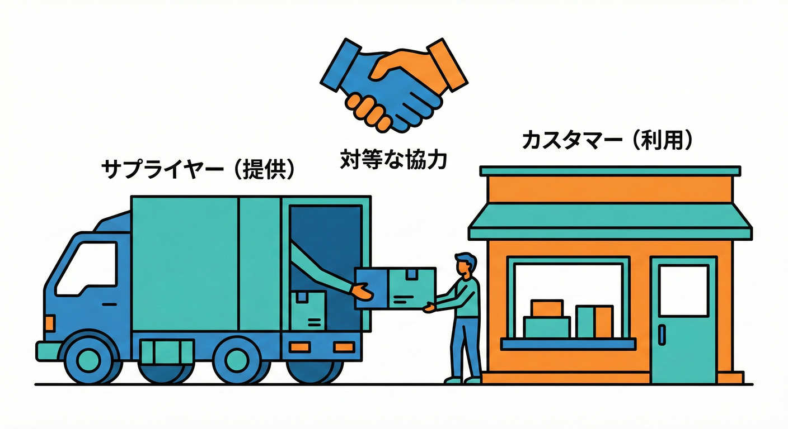
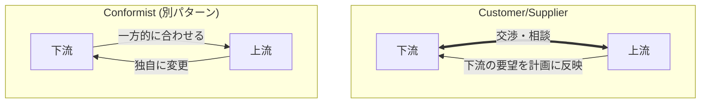
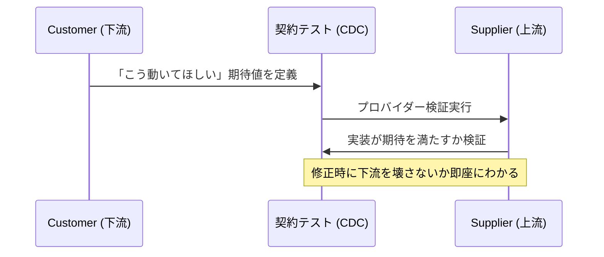

# 第24章 Customer/Supplier（主導権がある関係）🤝👑

## この章でわかるようになること🎯✨

* 「上流（Supplier）/ 下流（Customer）」の向きを迷わず決められる👀➡️
* “どっちが仕様を握る？” を言語化できる🗣️💡
* 境界をまたぐときの **約束ごと（契約）** を作れる📜✅
* 変更に強い関係（リリース運用・テスト）をイメージできる🧪🛡️

---

## 1. Customer/Supplier ってなに？🧸📌





これ、ひとことで言うと **「片方が変わったら、もう片方も影響を受ける（合わせなきゃいけない）関係」** だよ🤝


Customer/Supplier は、Bounded Context 同士が **上流（Supplier）→下流（Customer）** につながるときの関係パターンの1つだよ🗺️✨
ポイントはこれ👇

* **Supplier（上流）**：サービスやデータを提供する側🏭📦
* **Customer（下流）**：それを使って自分の仕事を成立させたい側🛍️💳

そして Customer/Supplier は、ただの「上流/下流」より一歩進んでいて、

> 下流（Customer）の優先度が、上流（Supplier）の計画にちゃんと影響する関係

…っていう “取り決め” があるんだよ🤝✨ ([Context Mapper][1])

---

## 2. まず大前提：上流/下流の向き🧭➡️

向きは超シンプル👇

* **上流（Upstream）**：変更すると **下流に影響** が出る側⚠️
* **下流（Downstream）**：上流の変更の影響を **食らいやすい** 側😵

つまり「影響を与える側が上流」だよ🧠✨ ([InfoQ][2])

---

## 3. 学内フリマ例で理解しよ🛍️🏫

ここでは例として、こんなBCを置くね👇

* **Trading（取引）BC**：購入・支払い確定・取引ステータス管理💳📦
* **Shipping（配送）BC**：配送方法・送料・追跡番号・配達状況🚚📮

Trading は「発送してね！」が必要。Shipping は「送料これね」「追跡番号これね」を返す。
だから関係はこう👇

```text
[Shipping（Supplier / 上流）]  --->  [Trading（Customer / 下流）]
   送料計算・追跡番号発行               取引を成立させたい
```

Shipping 側のAPIが変わると Trading は困る（＝下流）😵‍💫
この向きがまず “上流/下流” だよ🧭✨ ([InfoQ][2])

---

## 4. “Customer/Supplier” になる条件👑🤝

上流/下流なだけなら、単なる Upstream/Downstream。
Customer/Supplier になるのは、ここが成立してるとき👇

## ✅ 条件A：下流の要望が、上流の計画に入る📅✨

* 「このフィールド欲しい！」「この期限までに欲しい！」
* それを上流が **計画に織り込む**（優先度が影響する） ([DevIQ][3])

## ✅ 条件B：“交渉できる” 空気がある🗣️🤝

Conformist みたいに「合わせるしかない…」じゃなくて、
* 「相談して、落としどころを作る」関係だよ😊✨ ([microsoftpressstore.com][4])



---

## 5. Customer/Supplier の「リアルな痛み」😇➡️😱

Customer/Supplier をちゃんと決めないと、こうなる👇

## ① 仕様が勝手に変わって、下流が炎上🔥

* 「送料の計算が変わったよ」
* 「追跡番号の形式が変わったよ」
  → 下流が壊れる💥

## ② 下流が “上流の内部” に依存し始める🕸️

* 上流の内部DTOを直接import
* 上流DBを直参照
  → 境界が消滅😵‍💫

## ③ “誰が面倒を見る？” が曖昧で放置される🫠

「それ、そっちの都合でしょ？」が増えると、関係が崩れる…😢

---

## 6. じゃあどう運用する？5ステップで固める🧱✨

## Step1：まず矢印を引く✍️➡️

* 「どっちが、どっちの変更に影響される？」を決める🧭

## Step2：Customer を明文化する👑

* 「下流の要望が、上流の計画に入る」って宣言する📣 ([Context Mapper][1])

## Step3：契約（Integration Contract）を作る📜✅

* “使っていい入口” を決める（公開API）🚪✨
* ここから先は触らない！をはっきりさせる🛡️

## Step4：変更の出し方を決める🔁🗓️

* 互換性のある変更：基本OK🙆‍♀️
* 壊れる変更：バージョン分け or 移行期間を置く⏳
  （※この考え方は、上流が下流への影響をコントロールするために大事だよ）

## Step5：テストで “約束” を固定する🧪🧷

下流が「こう動いてほしい」をテストにして、
上流がそのテストを満たす形で進化する、ってやり方があるよ✨
いわゆる Consumer-Driven Contract（CDC）という考え方🧪🤝 ([axoniq.io][5])

---

## 7. TypeScriptミニ演習：契約（公開API）を作ってみよ📦✨

## 7.1 Supplier（Shipping）側：公開APIだけを定義する🚪📄

```ts
// contexts/shipping/public.ts
export type ShippingZone = "campus" | "tokyo" | "other";

export type QuoteRequest = {
  zone: ShippingZone;
  weightGram: number;
};

export type QuoteResult = {
  feeYen: number;          // 送料
  estimatedDays: number;   // 到着目安
};

export interface ShippingServiceV1 {
  quote(req: QuoteRequest): Promise<QuoteResult>;
}
```

ここが “契約” だよ📜✨
下流（Trading）は **この型だけ** を頼りにする🛡️

---

## 7.2 Customer（Trading）側：上流の “中身” に触れない🧼✨

```ts
// contexts/trading/shippingClient.ts
import type { ShippingServiceV1, QuoteRequest } from "../shipping/public";

export class ShippingClient {
  constructor(private readonly shipping: ShippingServiceV1) {}

  async getFeeYen(req: QuoteRequest): Promise<number> {
    const result = await this.shipping.quote(req);
    return result.feeYen;
  }
}
```

✅ これで Trading は Shipping の内部実装を知らなくてOK🙆‍♀️✨
境界が守られるよ📁🔒

---

## 8. ミニ演習：Customer/Supplier を “文章化” してみよ📝💗

学内フリマの Trading ↔ Shipping を想定して、空欄を埋めてね👇

## ワーク①：主導権メモ👑

* 下流（Customer）は **（　　　　）** を優先してほしい
* 上流（Supplier）は **（　　　　）** を提供する
* 壊れる変更が必要なときは **（　　　　）** をする（例：バージョン分け、移行期間）

## ワーク②：契約に入れる “最低限の情報” を決める📦

* 送料計算に必要な入力：

  * zone ✅ / weight ✅ / （　　　　）
* 返すべき結果：

  * feeYen ✅ / estimatedDays ✅ / （　　　　）

---

## 9. さらに安全にする：契約テスト（超ミニ）🧪✨

「下流が期待する動き」をテストとして書いて、上流が満たす。
この発想が CDC だよ🧪🤝 ([martinfowler.com][6])



## 9.1 下流が “期待” をテストにする📝🧪

```ts
// contracts/shipping.v1.contract.ts
import { expect, test } from "vitest";
import type { ShippingServiceV1 } from "../contexts/shipping/public";

export function shippingV1Contract(make: () => ShippingServiceV1) {
  test("campus + 500g の送料は 0円以上", async () => {
    const svc = make();
    const res = await svc.quote({ zone: "campus", weightGram: 500 });
    expect(res.feeYen).toBeGreaterThanOrEqual(0);
  });

  test("estimatedDays は 1以上", async () => {
    const svc = make();
    const res = await svc.quote({ zone: "tokyo", weightGram: 300 });
    expect(res.estimatedDays).toBeGreaterThanOrEqual(1);
  });
}
```

## 9.2 上流がそのテストを “自分のCIで” 回す🛠️✅

```ts
// contexts/shipping/contract.test.ts
import { shippingV1Contract } from "../../contracts/shipping.v1.contract";
import { RealShippingService } from "./realShippingService";

shippingV1Contract(() => new RealShippingService());
```

これで上流が変更しても、**契約を破った瞬間に検知**できるよ🧯✨

---

## 10. AI相棒に聞くテンプレ🤖💬

## テンプレ①：主導権の判定👑

* 「Trading と Shipping の関係で、上流/下流はどっち？その理由を “影響” の観点で説明して」

## テンプレ②：契約の最小化✂️

* 「ShippingService の公開APIを最小にしたい。QuoteRequest/QuoteResult に入れるべき項目と、入れない方がいい項目を理由つきで出して」

## テンプレ③：壊れる変更の設計🔁

* 「この変更は破壊的？非破壊的？分類して、移行手順（バージョン/互換性/期限）案を出して」

---

## まとめ🎀✨

* Customer/Supplier は **上流/下流** の “特別な形” で、下流の優先度が上流の計画に影響する関係だよ🤝👑 ([Context Mapper][1])
* まずは **矢印の向き**（影響の向き）を決めるのが最優先🧭✨ ([InfoQ][2])
* 次に **契約（公開API）** を作って、境界をコードで守る🛡️📦
* さらに **契約テスト（CDC的発想）** で、変更に強くできる🧪✨ ([martinfowler.com][6])

[1]: https://contextmapper.org/docs/customer-supplier/?utm_source=chatgpt.com "Customer/Supplier"
[2]: https://www.infoq.com/articles/ddd-contextmapping/?utm_source=chatgpt.com "Strategic Domain Driven Design with Context Mapping"
[3]: https://deviq.com/domain-driven-design/context-mapping?utm_source=chatgpt.com "Context Mapping"
[4]: https://www.microsoftpressstore.com/articles/article.aspx?p=3192407&seqNum=4&utm_source=chatgpt.com "The ultimate gist of DDD"
[5]: https://www.axoniq.io/blog/bounded-contexts-with-axon?utm_source=chatgpt.com "Bounded contexts with Axon"
[6]: https://martinfowler.com/articles/consumerDrivenContracts.html?utm_source=chatgpt.com "Consumer-Driven Contracts: A Service Evolution Pattern"
