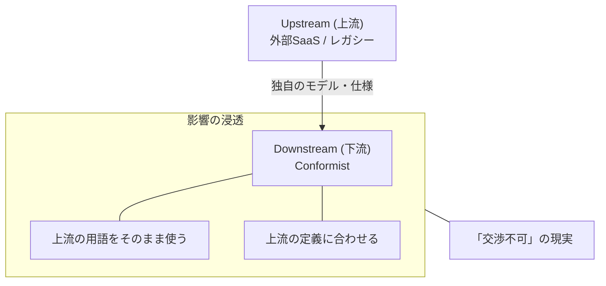
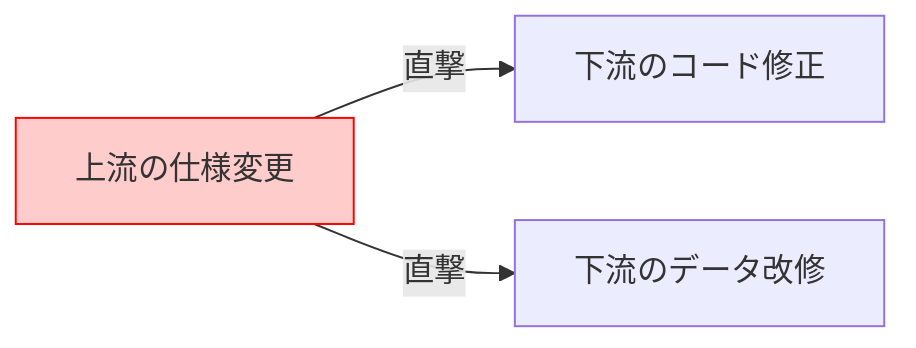
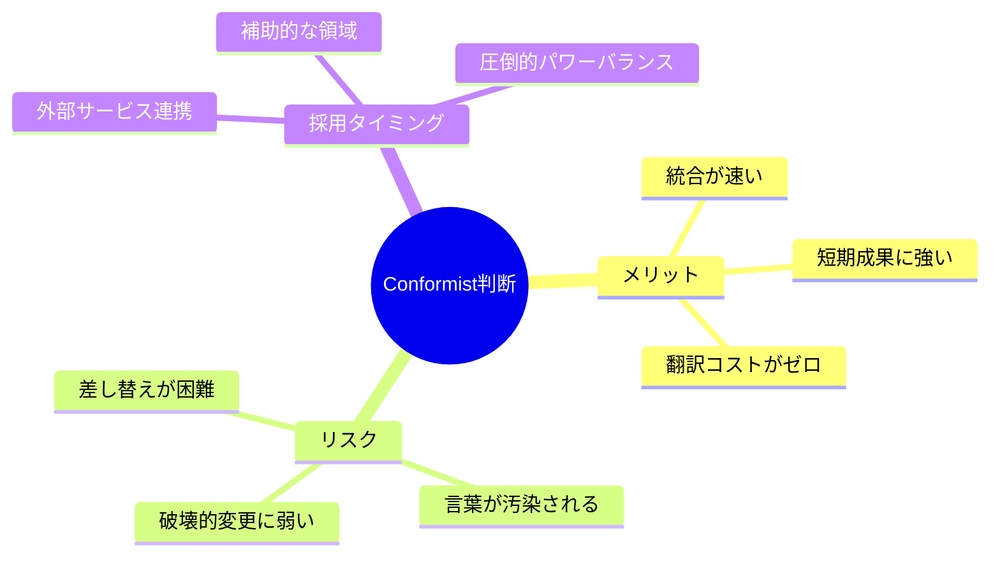

# 第25章 Conformist（合わせるしかない）😌🌧️

## この章のゴール🎯✨

* Context Map の関係パターン **Conformist** を、言葉で説明できるようになる🗣️💡
* 「どんなときに Conformist を選ぶのか／避けるのか」を判断できるようになる⚖️👀
* 例題（学内フリマ🛍️）で「合わせる対象」と「影響範囲」をメモに落とせる📝✨

---

## 1) Conformistってなに？😌📌




**Conformist** は、2つの境界づけられたコンテキスト（BC）の関係で、
**下流（downstream）が上流（upstream）のモデルや都合に “そのまま合わせる”** 形だよ🌧️➡️🌊

* 上流が仕様を動かす側（影響を与える側）
* 下流は影響を受ける側
* 下流には「それは困るから変えて〜🥺」って交渉の余地がほぼない…って感じ😌

この “交渉できない” がポイント！
上流で破壊的変更が起きたら、下流は追従するしかない🥲 ([microsoftpressstore.com][1])



---

## 2) なぜわざわざ「合わせる」の？🤔💭

結論：**翻訳（変換）を作らない（薄くする）ことで、統合コストを下げる**ためだよ✂️✨

上流のモデルに合わせると、理想の設計からはちょっと遠ざかることもあるけど、
**統合がシンプルになる**し、上流との会話もスムーズになりがち📞😊
（上流が “運転席” にいるから、上流に合わせるとラクになる…って話） ([Domain Language][2])

---

## 3) どんな場面で起きやすい？🌍⚙️

## ありがちな Conformist 例あるある🍞

* **外部サービス（公開API / SaaS）** が相手で、こちらが仕様に口出しできない☁️🔌
* **レガシーシステム** が相手で、相手の形式が絶対📜😵
* 組織的に「このコンテキストが最優先だから、他は全部合わせてね」みたいな強い力学がある👑😌

こういうときに Conformist が起きやすいよ〜、って整理がされてるよ ([microsoftpressstore.com][1])

---

## 4) 図でつかむ🗺️👀（文章での図）

例：学内フリマ🛍️で「決済」を外部サービスに頼るケースを想像してみよ💳✨

* 上流：外部決済サービス（仕様変更は向こう都合）
* 下流：Trading（取引）BC（支払い状態を使って取引を進める）

```text
          （上流 / Upstream）
   ┌──────────────────┐
   │ External Payment  │  ← 仕様の主導権は向こう😌
   └──────────────────┘
               │ 影響（変更）が流れてくる🌧️
               ▼
   ┌──────────────────┐
   │ Trading Context   │  ←（下流 / Downstream）
   │   Conformist (CF) │     合わせるしかない😌
   └──────────────────┘
```

Context Map では「下流が Conformist」って関係として表せるよ🗺️✨
（DSL等では “CF” みたいに表記されることもあるよ） ([Context Mapper][3])

---

## 5) Conformist の “うれしいところ” 🎁✨

* **統合が速い**：変換レイヤーを設計・実装する手間が減る🏃‍♀️💨
* **迷いが減る**：「向こうがこう言ってるなら、こう使う」で決まる🧭
* **短期の成果が出やすい**：締切が近いときに助かることがある⌛🔥

---

## 6) Conformist の “こわいところ” 😱⚠️（ここ超大事）

## こわさ①：破壊的変更が直撃する💥

上流が変わったら、下流は合わせるしかない。
「交渉できない」関係だと、変更耐性は弱くなるよ🥲 ([microsoftpressstore.com][1])

## こわさ②：上流の言葉が、ドメインの中心に侵食する🧼🧽

外部の用語・状態・クセが、そのまま自分のコード中核に入りやすい😵
結果、モデルが “外部都合の形” に寄っていくことがあるよ🌧️ ([Domain Language][2])

## こわさ③：差し替えがつらくなる🔁😵‍💫

「外部Aの言葉」でシステムが固まると、外部Bに変えるのが地獄になりやすい🔥

---

## 7) じゃあ Conformist はダメ？🙅‍♀️➡️🙆‍♀️

ダメじゃないよ🙂✨
**“どこで Conformist を許すか” を決める**のが設計だよ🧠🧩

ポイントはこれ👇

* **コア（差別化の中心）** に外部都合を入れたくない
* でも、**全部に翻訳層を作るのもコスト**
* だから、**Conformist を許す場所を小さくする**のが現実的✨

この「外部のクセから自分のモデルを守る」発想は、次の章で出てくる **ACL（腐敗防止層）** に繋がるよ🧼🛡️
（ACLは “合わせないための仕組み” になりやすい） ([Domain Language][2])

---

## 8) ミニ演習（TypeScript）🧪💻

## お題：Trading BC が外部決済の “状態” に合わせる😌💳

外部決済が返す状態が、こういう “外部の言葉” だとするよ👇

```ts
// external-payment.ts（外部の仕様に合わせた型：Conformist）
export type PaymentStatus =
  | "requires_payment_method"
  | "requires_confirmation"
  | "processing"
  | "succeeded"
  | "canceled";

export type PaymentIntent = {
  id: string;
  amount: number; // 最小通貨単位（例: 円なら円、ドルならセント等…外部都合）
  status: PaymentStatus;
};
```

Trading 側が、そのまま使う（＝合わせる）👇

```ts
// trading/payment.ts（Trading が外部モデルに寄せる：Conformist）
import type { PaymentIntent } from "../external/external-payment";

export function canShip(payment: PaymentIntent): boolean {
  // 外部の status 名に依存しちゃう😌
  return payment.status === "succeeded";
}
```

## ✅チェックしてみよ👀✅

* `PaymentStatus` の文字列が変わったらどうなる？💥
  → `canShip` が全部影響を受けるよね😵
* 「合わせる」って、こういう依存を受け入れることなんだ🌧️

---

## 9) “Conformist にするか” 判断チェック✅🧠

次の質問に **YES が多いほど Conformist 寄り**だよ😌

* 相手（上流）は外部サービス/レガシーで、こちらは仕様に口出しできない？☁️📜 ([microsoftpressstore.com][1])
* 統合を最短で進めたい（締切が近い）？⌛💨
* その統合は “コア領域” ではなく、周辺（補助）っぽい？🧩
* 多少モデルが美しくなくても、まず動くが大事？🏁
* 上流の変更追従を、運用で回せる（監視・リリース調整できる）？🔔🚦

逆に、**コア領域を汚したくない／差し替えしたい**なら、Conformist を小さくする方向を考えたくなるよ🧼🛡️ ([Domain Language][2])



---

## 10) この章の成果物📝✨（これを書けば勝ち🏆）

次の2つを、例題（学内フリマ🛍️）で埋めてみてね😊

## ① 合わせる対象リスト（Conformist 先）😌

* 例：外部決済サービス
* 例：配送ラベル生成サービス
* 例：学内認証（既存システム）

## ② 影響範囲メモ（どのBCが巻き込まれる？）🌧️

* Trading が支払い状態に依存
* Shipping が配送ラベル形式に依存
* （できれば）依存が “どのファイル/どの入口” に集まってるかもメモ📌

---

## 11) AIへの質問テンプレ🤖💬（コピペOK✨）

## 用語と状態を洗い出す🃏

```text
外部サービス（決済/配送など）のレスポンスに出てくる「状態」「用語」「フィールド名」を、
学内フリマの文脈に当てはめて一覧にしてください。
Conformistとして「そのまま採用する場合の注意点」も3つください。
```

## 影響範囲を見える化する🗺️

```text
Conformist関係を1つ選び、上流の破壊的変更が起きたときに影響を受ける箇所を
「どのBC」「どの責務」「どの関数/型」単位で箇条書きにしてください。
```

## Conformistを小さくする配置案🧱

```text
Conformistを採用するとしても、影響が広がらないように
コード配置（フォルダ/モジュール/入口）をどう切るとよいか案を3つください。
```

---

## まとめ🌸✨

* Conformist は **下流が上流に合わせる関係**😌🌧️ ([microsoftpressstore.com][1])
* 統合がシンプルになる反面、**変更の直撃・言葉の侵食・差し替え困難**が起きやすい😱⚠️ ([Domain Language][2])
* だから「採用するなら、影響範囲を小さく」🧼🛡️（次の ACL に繋がるよ） ([Domain Language][2])

[1]: https://www.microsoftpressstore.com/articles/article.aspx?p=3192407&seqNum=4 "The ultimate gist of DDD | Microsoft Press Store"
[2]: https://www.domainlanguage.com/wp-content/uploads/2016/05/DDD_Reference_2015-03.pdf "Microsoft Word - pdf version of final doc - Mar 2015.docx"
[3]: https://contextmapper.org/docs/conformist/?utm_source=chatgpt.com "Conformist"
