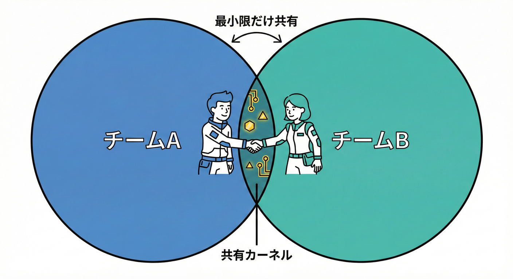
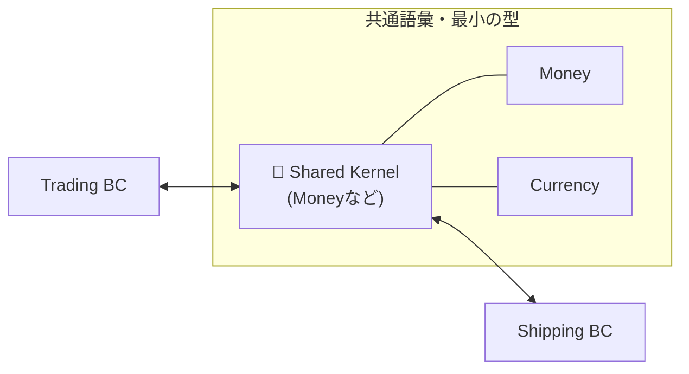
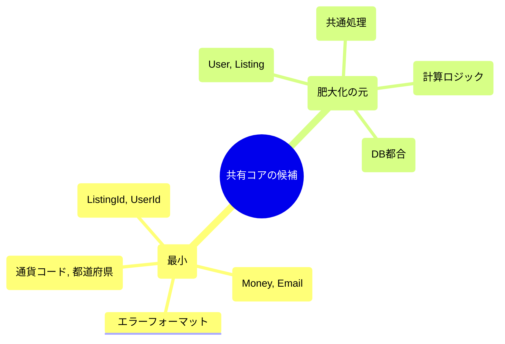
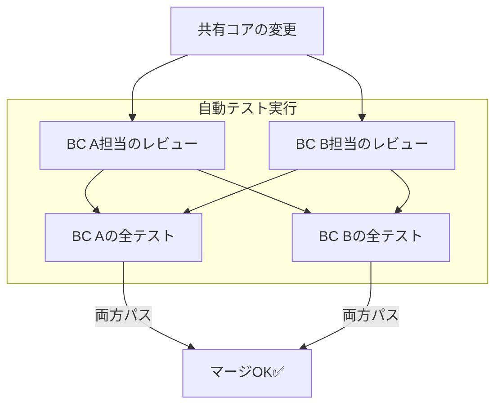
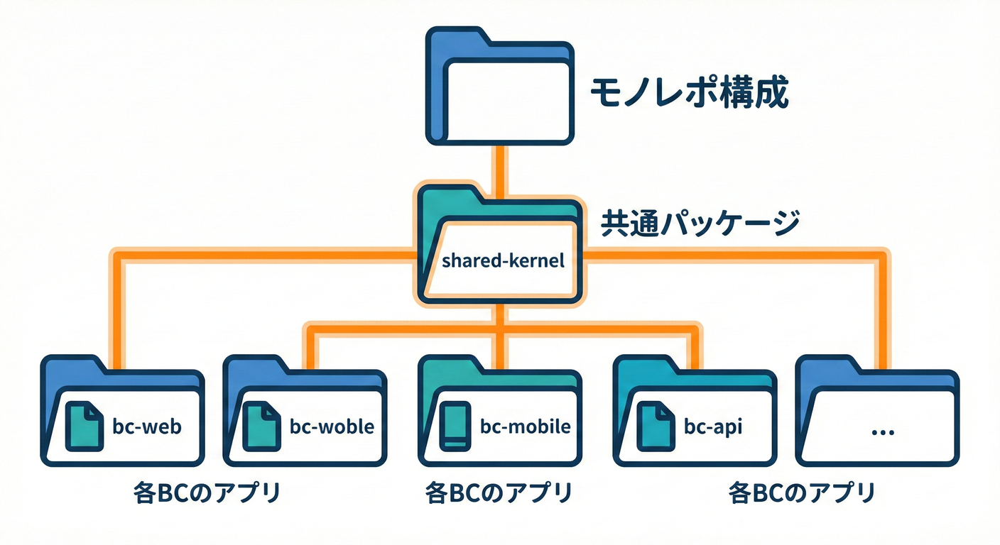

# 第26章 Shared Kernel（共有コア）🧬⚠️

## 26.0 この章のゴール🎯✨

この章が終わったら、次の3つができるようになります😊💪

* **Shared Kernel が「どんな関係」か**を説明できる🗣️✨
* **使っていい条件 / ダメな条件**を見分けられる👀⚖️
* **“最小の共有” をTypeScriptで形にする方法**がわかる📦🧩

---

## 26.1 Shared Kernelってなに？🧬🤝



Shared Kernel（共有コア）は、**2つの境界づけられたコンテキスト（BC）が、ほんの一部のモデルやコードを「共同で」共有する**関係です🧩✨
ポイントは「共有してるのに、BCは別のまま」というところ！

* **片方が決めて片方が従う**（Customer/Supplier）ではなくて、
* **両方が“同じ共有物”を一緒にメンテする**（対等）感じです🤝💞

Context Map のパターンとしても、Shared Kernel は代表的なものとして扱われます🗺️✨（BCは“相互関係を明示する”のが大事、という話にもつながるよ）([martinfowler.com][1])

---

## 26.2 文章でイメージ図🖍️📦➡️📦

たとえば「取引（Trading）」と「配送（Shipping）」があって、**お金（Money）や通貨（Currency）の表現だけ**は同じにしたい…みたいなとき👇

* Trading と Shipping は別BC（別ルール・別責務）
* でも「Money の形（通貨 + 金額）」だけは共通にしたい

こんな関係図になります😊

* 📦 Trading BC  ↔️  🧬 Shared Kernel（Moneyなど最小）  ↔️  📦 Shipping BC



**共有物は“超ミニ”**じゃないと、後で地獄になります😇➡️😱
「小さく保て」「CIと自動テストが重要」みたいな注意点も、Shared Kernel の典型としてよく言われます。([vaadin.com][2])

---

## 26.3 どうして危ないの？（Shared Kernelの“副作用”）😵‍💫💥

Shared Kernel は便利に見えるけど、**結合（coupling）を増やす**ので危険です⚠️

### 起きがちな事故あるある🚑

* 共有物を変えるたびに「相手のBCが壊れる」💣
* 「この変更いつマージする？」で調整会議が増える📅😇
* 共有が増殖して、いつの間にか**“巨大共有モデル”**になる🌀
* 結果：BCが別れてる意味が薄れて、**実質ひとつの巨大BC**みたいになる😵

だから、Shared Kernel は「いつでも使う万能技」じゃなくて、**“レア技”**と思ってね🧸✨

---

## 26.4 使っていい条件 / ダメな条件✅❌

### ✅ 使っていい条件（だいたいこの4つ）

1. **共有したいものが“本当に小さい”**（例：ID型、Money、通貨、日付範囲）✂️
2. **両方のチーム（または担当）が共同所有できる**🤝（勝手に変えない運用がある）
3. **自動テスト＋CIが整ってる**🧪🚦（壊したらすぐ気づける）
4. **用語が安定してる**📚（「同じ言葉の意味」がブレにくい）

### ❌ やめた方がいい条件（危険サイン🚨）

* 共有したいのが **Entityや業務ルール**（＝ドメインの中心）😱
* 片方が外部ベンダー/外部サービスで、共同所有が無理🌧️
* リリース周期が合わず、調整コストが高い🗓️💥
* 共有物に「便利だから」機能が増え続けそう…🧟‍♀️

> 対等関係（Shared Kernel）に、ACLやPublished Languageなど“非対称前提のパターン”を混ぜると定義が矛盾しやすいよ、という整理もあります🧠🧩([Context Mapper][3])

---

## 26.5 「最小共有」って具体的に何を共有するの？✂️🧬



結論：**“語彙”と“値の表現”を共有して、業務ルールは共有しない**が安全です😊🛡️

### 共有しやすい（✅おすすめ）

* **IDの型**（例：`ListingId`, `UserId` みたいな“識別子”）🏷️
* **Value Object（値オブジェクト）**（例：Money、Email、DateRange）💎
* **ごく小さいenum**（例：通貨コード、都道府県コードなど）🔤
* **“お約束”のエラーフォーマット**（必要なら）🧾

### 共有しにくい（❌危険）

* **Entity**（例：User, Product）👤📦
* **ユースケース（アプリ層）**🎮
* **RepositoryやDB都合のモデル**🗄️
* **APIのDTO**（BC間の運搬用はむしろ別にしたいことが多い）📦➡️📦

---

## 26.6 共有物の運用ルール（ここが本体）📜🤝🧪

Shared Kernel は「コード」より「運用」が超大事です🧸✨
最小限、これだけは決めよう👇

### ルール1：共同所有（勝手に変えない）🤝

* 共有物の変更は **両BCのレビューを必須**にする👀✅
* 小さな変更でも「影響範囲」を一言で書く📝



### ルール2：テストが先（CI必須）🧪🚦

* Shared Kernel には **単体テスト**を置く
* 変更したら **両BCのテストが必ず走る**ようにする
  「自動テストとCIがないShared Kernelは危険」って話は定番です💥([vaadin.com][2])

### ルール3：ADRで“なぜ共有？”を残す🧾✨

* 「なぜShared Kernelにしたの？」「なぜここまで小さいの？」を短く記録📌
  あとで“増殖”を止める武器になります⚔️

### ルール4：バージョン方針（SemVer）を決める🔢📦

* 共有パッケージは **破壊的変更（breaking）**を強く意識する
* “一緒に直せるからOK”って油断すると、突然全体が燃えます🔥😇

---

## 26.7 TypeScriptでの実装イメージ（モノレポ寄り）📁🧩



もしモノレポ（1つのプロジェクトの中に全BCが入ってる形）なら、

ここでは「共有を小さく保つ」ために、Shared Kernel を **独立パッケージ**として作るよ😊
（モノレポ運用の代表例として、workspace構成を使うイメージ！）

### Step 1：フォルダ構成を作る📁✨

```text
repo/
  packages/
    shared-kernel/
    trading/
    shipping/
```

### Step 2：shared-kernel に“共有していいものだけ”置く✂️🧬

例：Money（通貨 + 金額）だけ共有する💰

```ts
// packages/shared-kernel/src/money.ts
export type Currency = "JPY" | "USD";

export class Money {
  private constructor(
    public readonly amount: number,
    public readonly currency: Currency
  ) {}

  static of(amount: number, currency: Currency): Money {
    if (!Number.isFinite(amount)) throw new Error("amount must be finite");
    if (amount < 0) throw new Error("amount must be >= 0");
    return new Money(amount, currency);
  }

  add(other: Money): Money {
    if (this.currency !== other.currency) {
      throw new Error("currency mismatch");
    }
    return Money.of(this.amount + other.amount, this.currency);
  }
}
```

✅ ここでの狙い：

* “お金の表現”は共通でOK
* でも「手数料計算」や「割引ルール」は共有しない（各BCのルール）🙅‍♀️

### Step 3：Trading / Shipping 側で使う📦➡️💰

```ts
// packages/trading/src/checkout.ts
import { Money } from "@repo/shared-kernel/money";

export function calcTotal(): Money {
  const item = Money.of(1200, "JPY");
  const fee = Money.of(200, "JPY");
  return item.add(fee);
}
```

### Step 4：共有を増殖させない“禁止ルール”を文章化🛡️📜

PRテンプレやチェックリストに入れると最強💪✨
例：

* Shared Kernel に **Entityを追加しない**
* Shared Kernel に **ユースケースを追加しない**
* “便利関数”を生やしたくなったら、まず **各BCに置けないか**考える

---

## 26.8 AI相棒に聞くテンプレ🤖💬（コピペOK）

### ① 共有候補を“最小”に絞る🧠✂️

* 「Trading と Shipping の間で共有したい概念を列挙して。次に“Shared Kernelに入れてよい/ダメ”を分類して。基準も説明して。」

### ② “増殖リスク”をレビューしてもらう🧟‍♀️🚫

* 「このshared-kernelに追加しようとしている型/関数が、境界を壊すリスクを指摘して。代替案（各BC側に置く、DTOにする等）も出して。」

### ③ 破壊的変更チェック🔍💥

* 「この変更は breaking change？ 影響を受ける側の修正点を具体的にリスト化して。」

---

## 26.9 最終チェックリスト✅🧾（Shared Kernelを守る呪文🪄）

* [ ] 共有してるのは **値の表現（VO/ID）中心**？💎
* [ ] 共有物は **小さく保ててる**？（“便利だから追加”が増えてない？）✂️
* [ ] 変更は **両BCレビュー必須**になってる？👀
* [ ] CIで **両BCのテスト**が走る？🧪🚦
* [ ] “なぜ共有？”が **ADRで残ってる**？🧾
* [ ] 共有が増えすぎたら、**BC統合/別パターン（ACL等）**を検討する準備ある？🧠

---

## 26.10 ミニ補足：TypeScriptの最近（2026/02/02時点）🧸💻

* TypeScript の安定版ラインは **5.9.3 が latest**として配布されています。([npm][4])
* 5.9 では `--module node20` のような安定オプションも整理されていて、設定の“ふらつき”を減らす方向が見えます。([TypeScript][5])
* さらに高速化の流れとして **ネイティブプレビュー（`@typescript/native-preview`）**が提供されていて、エディタ統合も進捗が出ています🚀([Microsoft for Developers][6])

（Shared Kernel は「共有物のCIが重くなる」と破綻しやすいので、ビルド/型チェック高速化の流れは相性がいいよ😊⚡）

---

[1]: https://www.martinfowler.com/bliki/BoundedContext.html?utm_source=chatgpt.com "Bounded Context"
[2]: https://vaadin.com/blog/ddd-part-1-strategic-domain-driven-design?utm_source=chatgpt.com "DDD Part 1: Strategic Domain-Driven Design"
[3]: https://contextmapper.org/docs/language-model/?utm_source=chatgpt.com "Language Semantics"
[4]: https://www.npmjs.com/package/typescript?utm_source=chatgpt.com "TypeScript"
[5]: https://www.typescriptlang.org/docs/handbook/release-notes/typescript-5-9.html?utm_source=chatgpt.com "Documentation - TypeScript 5.9"
[6]: https://devblogs.microsoft.com/typescript/announcing-typescript-native-previews/?utm_source=chatgpt.com "Announcing TypeScript Native Previews"
