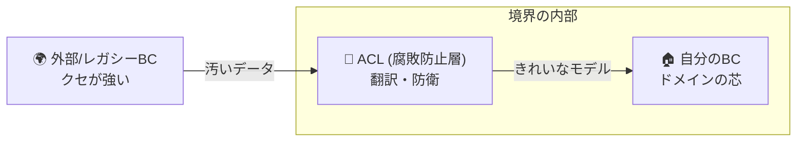
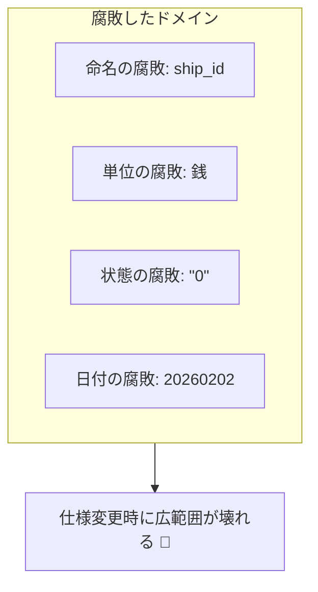
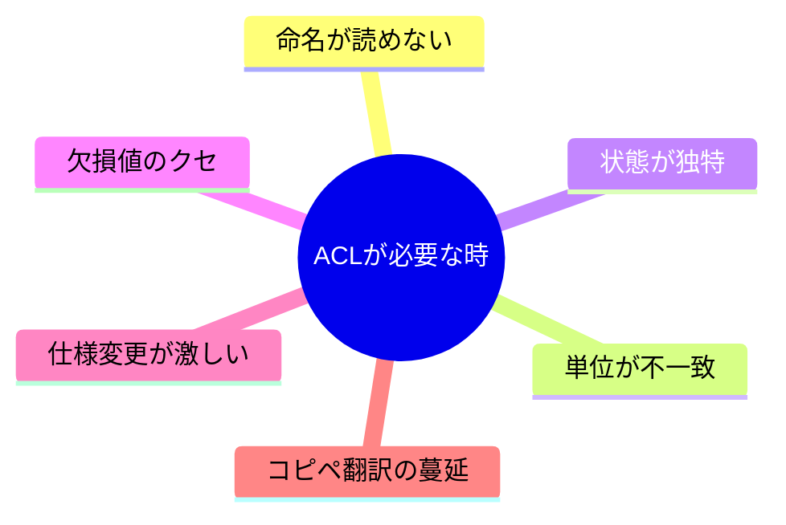

# 第27章 ACL（腐敗防止層）導入：痛い例を見る😇➡️😱🧼

([Past chat][1])([Past chat][2])([Past chat][3])

## この章でできるようになること🎯✨

* 「外部のクセがドメインを汚す（腐敗する）」ってどういうことか、具体例で説明できる😊
* 「ACL（Anti-Corruption Layer）」が必要になる“サイン”を見つけられる👀⚠️
* 外部データと内部モデルの**差分リスト（翻訳が必要な点）**を作れる📝✨

> ACL（Anti-Corruption Layer）は、外部システムと自分たちのシステムの間に置く「翻訳＆防波堤」だよ🧱🛡️
> “翻訳”してから中に入れることで、中心モデルが汚れにくくなる✨ ([Microsoft Learn][4])

---

## 1. まず「痛い統合」を見てみよ〜😇➡️😱




学内フリマの例でいくね🛍️✨
ここでは「配送」を外部サービス（または学内の既存システム）にお願いしてる想定📦🚚

外部から返ってくるレスポンスが、こんな感じだったとするよ👇😱

* 命名がバラバラ（`snake_case`、省略、意味不明コード）
* 金額の単位が違う（円じゃなくて**銭**とか、税込み/税抜き混在）
* 状態が独特（`0/1/2` とか `"A" "B"` とか）
* 欠損値の表現が独特（`""` / `null` / `0` の区別がない）
* 日付が独特（`YYYYMMDD`、タイムゾーン不明、文字列固定）
* “謎のルール”が混ざってる（例：重量が文字列、負数が来る…）😵‍💫

---

## 2. 「そのまま使う」と何が起きる？💥

ありがちな “やっちゃう例” をあえて出すね😇（※危険⚠️）

```ts
// 外部配送サービスのレスポンス（例）
type ExternalShipRes = {
  ship_id: string;          // "SHP-001"
  st: "0" | "1" | "2";      // 0:準備中 1:配送中 2:完了（文字列！）
  fee: number;              // 送料（単位が「銭」だった…😱）
  addr1: string;            // 住所1（空文字が来ることがある）
  ymd: string;              // "20260202" みたいな形式
};

// そのまま中のドメインに入れてしまう例（最悪パターン）
function updateShippingDomain(ex: ExternalShipRes) {
  // ドメイン側に「st」「fee」「ymd」みたいなクセが侵入…🧟‍♀️
  const status = ex.st;        // "0"/"1"/"2" が中に入る
  const shippingFee = ex.fee;  // いつのまにか「銭」基準で計算が始まる
  const shippedAt = ex.ymd;    // 文字列日付が中に定着する
}
```

### これ、何が“痛い”の？😱🩹

* **用語が腐る**：`st` がドメイン用語として定着しちゃう（誰も意味わからん…）🌀
* **単位が腐る**：送料の単位が「銭」なのに「円」と思い込んでバグる💸💥
* **状態が腐る**：`"1"` って何？状態遷移のルールがコードのあちこちに散る😵‍💫
* **例外が腐る**：欠損値や変な値の例外処理が、いろんな場所にコピーされる📎📎📎
* **将来が腐る**：外部の仕様変更が起きた瞬間、内部が広範囲に壊れる🧨

これが「外部のクセがドメインを汚す（腐敗する）」ってことだよ🧼⚠️



---

## 3. ACL（腐敗防止層）って何者？🧼🛡️

ACLは **外部と内部の間の“通訳さん”** だよ🎧✨
中では「自分たちの言葉・単位・状態」を守って、外は外の流儀で話す。

イメージはこれ👇

* 内部（学内フリマ）🏠：自分たちのモデル・用語（きれい✨）
* 外部（配送サービス）🌍：相手のモデル・用語（クセ強😇）
* 間に ACL 🧱：翻訳・変換・吸収！

> 「ACLには2つのモデル間を翻訳するロジックを置く」って説明されることが多いよ。 ([Microsoft Learn][4])
> もともとDDDでは Domain-Driven Design（著：Eric Evans）の中で、外部の複雑さから中を守る考え方として語られてるよ📘🛡️ ([fabiofumarola.github.io][5])

---

## 4. “ACLが必要なサイン” チェックリスト✅👀



次のどれかが当てはまったら、ACLの出番の可能性が高いよ🚨

* 命名が読めない・意味がズレる（`st`, `flg`, `kbn`…）🌀
* 単位が違う（円/銭、kg/g、税込/税抜、UTC/ローカル）🔁
* 状態が違う（内部は `ShippingStatus.Shipping`、外部は `"1"`）🚦
* 欠損や例外の表現が違う（`""` と `null` と `0` が混ざる）🕳️
* 仕様が頻繁に変わる or 変わりそう（外部SaaSあるある）🌀
* “変換”があちこちにコピペされ始めた📎😱

---

## 5. ここが本題：「翻訳が必要な差分リスト」を作ろう📝✨

この章のゴールはこれ！🎯
**外部→内部で “何を翻訳しないとヤバいか” を言語化する**よ💪😊

### 差分リストのテンプレ（これを埋めるだけで強い！）🧾✨

* **命名差**：外部 `ship_id` → 内部 `shipmentId`
* **状態差**：外部 `st: "0"|"1"|"2"` → 内部 `ShippingStatus`（列挙）
* **単位差**：外部 `fee`（銭）→ 内部 `feeYen`（円）
* **欠損差**：外部 `addr1: ""` → 内部 `addressLine1?: string`（or バリデーションで弾く）
* **日付差**：外部 `ymd: "20260202"` → 内部 `Date` or `YYYY-MM-DD`
* **例外差**：外部が返すエラー形式 → 内部の例外/結果型

---

## 6. ミニ演習：差分リストを作ってみよう🧸✍️

次の外部レスポンスを見て、**差分リストを最低6個**書いてね📝✨

```ts
type ExternalShipRes = {
  ship_id: string;             // "SHP-001"
  st: "0" | "1" | "2";         // 0:準備中 1:配送中 2:完了（文字列）
  fee: number;                 // 送料（銭）
  weight_g: string;            // "250" みたいに文字列
  addr1: string;               // "" が来ることがある
  ymd: string;                 // "20260202"
  note: string | null;         // null の時もある
};
```

### ヒント💡（差分ポイントの探し方）

* 「これ、ドメインでこのまま使いたい？」って自問する🤔
* “型のまま”じゃなくて “意味” を見る🧠✨
* 単位・状態・欠損・日付は、ほぼ必ず地雷💣

---

## 7. TypeScriptの小ネタ：差分を“型”で見つけやすくする🧠🔍

TypeScriptの強みは「型で違和感を浮かび上がらせる」こと✨
たとえば、内部ではこういう“自分たちの言葉”を持ちたいよね😊

```ts
type ShipmentId = string;

type ShippingStatus = "Preparing" | "Shipping" | "Delivered";

type MoneyYen = number;

type Shipment = {
  shipmentId: ShipmentId;
  status: ShippingStatus;
  feeYen: MoneyYen;
  weightGram: number;
  addressLine1?: string;
  shippedAt: string; // "2026-02-02" みたいに統一したい
  note?: string;
};
```

この“きれいな形”を守るために、間にACLを置いて翻訳するんだよ🧼🛡️（実装は次章でがっつり！）

ちなみにTypeScriptは本日時点だと安定版ラインで 5.9.x、npm上のLatestが 5.9.3 と確認できるよ🧸💻 ([NPM][6])
TypeScript 5.9 の新機能（例：`import defer` など）も公式リリースノートにまとまってるよ📚✨ ([TypeScript][7])

---

## 8. AI相棒🤖に投げる質問テンプレ（そのままコピペOK✨）

### ① 差分リストを増やしてもらう📝

* 「この外部DTOから内部モデルに変換するとき、翻訳が必要な差分をできるだけ多く列挙して。命名/単位/欠損/状態/日付/エラー形式の観点で！」

### ② “腐敗”が起きるポイントをレビューしてもらう👀⚠️

* 「外部レスポンスをそのままドメインで使うと、どんな設計上の事故が起きやすい？具体例で教えて！」

### ③ 翻訳ルールの方針だけ先に作る🧭

* 「ACLを作る前提で、変換ルール（状態・単位・欠損・日付）を文章で短くまとめて。将来の仕様変更に強い方針で！」

---

## 9. まとめ🎁✨

* 外部のデータをそのまま入れると、**命名・単位・状態・欠損・日付**がドメインに定着して腐る😱🌀
* ACLは、外部と内部の間の **翻訳＆防波堤** 🧼🛡️（定義としても「翻訳ロジックをまとめる層」って説明されるよ） ([Microsoft Learn][4])
* この章で作った **差分リスト** が、次章（ACL設計）でそのまま設計図になるよ🗺️✨

次章は、いよいよ「何をどう翻訳する？」を具体的に設計していくよ🌍➡️🏠🛡️

[1]: https://chatgpt.com/c/697e8d43-3614-83a8-b83a-77b955df2340 "状態遷移手書き演習"
[2]: https://chatgpt.com/c/6974c16d-8980-8320-8b63-3de7f11650c9 "設計の優先度と体系"
[3]: https://chatgpt.com/c/69723641-e098-8323-ac05-182cd9b3e88a "設計教材の整理方法"
[4]: https://learn.microsoft.com/en-us/azure/architecture/patterns/anti-corruption-layer?utm_source=chatgpt.com "Anti-corruption Layer pattern - Azure Architecture Center"
[5]: https://fabiofumarola.github.io/nosql/readingMaterial/Evans03.pdf?utm_source=chatgpt.com "Domain-driven design: Tackling complexity in the heart of ..."
[6]: https://www.npmjs.com/package/typescript?utm_source=chatgpt.com "TypeScript"
[7]: https://www.typescriptlang.org/docs/handbook/release-notes/typescript-5-9.html?utm_source=chatgpt.com "Documentation - TypeScript 5.9"
