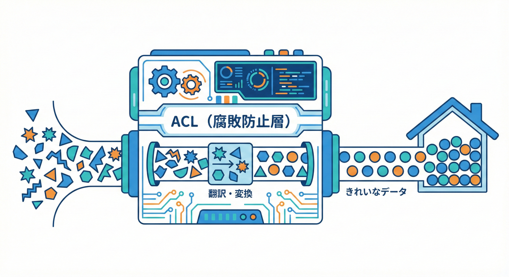
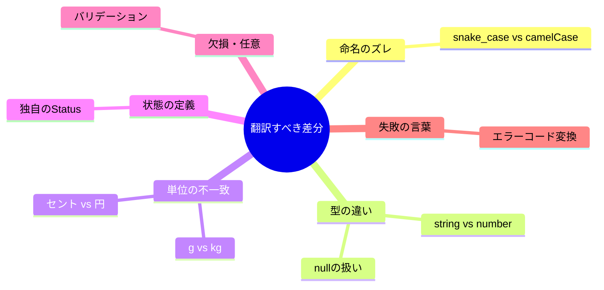
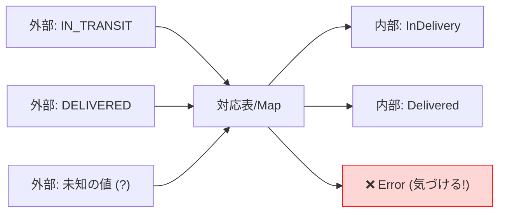
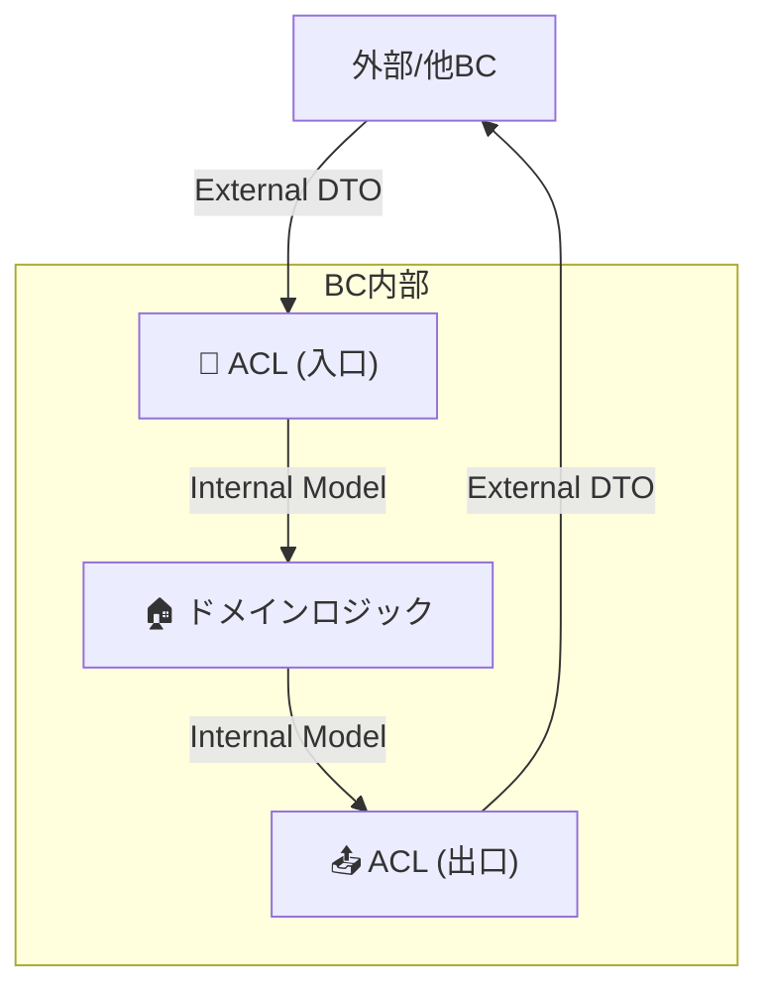

# 第28章 ACL設計：何をどう翻訳する？🌍➡️🏠🛡️



## 0. この章のゴール🎯✨

ACL（Anti-Corruption Layer）を **「変換の置き場」**として設計できるようになるのが目標だよ😊🧼

この章のゴールは3つ👇

* 外部のデータ（DTO）を **内側のモデルに“翻訳”**できる🗣️➡️📦
* “翻訳ルール”を **文章で残して**、迷子にならない🧾🧭
* ACLが壊れないように **テストで守る**🧪🛡️

成果物イメージ🎁

* ✅ 差分リスト（何が違う？）
* ✅ 変換ルール表（どう変える？）
* ✅ 変換コード（DTO→内部モデル / 内部→DTO）
* ✅ 変換テスト（固定したいルールが落ちない）

---

## 1. ACLは「翻訳の玄関」🚪🧼

ACLはひとことで言うと、**外部の世界のクセが、内側（自分のドメイン）に入り込むのを防ぐ“翻訳ゾーン”**だよ🧱✨
外部のモデルをそのまま中に持ち込むと、気づかないうちに **言葉・単位・状態・エラー**まで全部引きずられて、内側が汚れていく😇➡️😱

だからACLは、

* 外の言葉 → **内の言葉**に変える🗣️➡️🏠
* 外の都合 → **内のルール**に合わせる📏➡️📐
* 外の失敗*   **(ドメインの言葉)** 🏠：価格、ステータス、商品ID


これを変換する流れを見ていこう👇
（「新しいモデルを守るために翻訳層を作る」がACLの中心）([microservices.io][1])
また、ACLは Eric Evans のDDD本で紹介されたパターンとして触れられることが多いよ📚([martinfowler.com][2])

---

## 2. まずは「差分」を棚卸ししよう📋👀



ACL設計は、いきなりコードを書かないでOK🙆‍♀️
最初にやるのは **差分の棚卸し**（外と内、どこがズレてる？）だよ🧠✨

### 2-1. 名前の差分（命名）🏷️🌀

* `shipment_id` ↔ `shipmentId`
* `user_type` ↔ `role`
* “user”が外では「会員」だけど内では「購入者/出品者」も含む…みたいなズレ🫠

👉 ルール：**内側は内側の言葉を優先**（外に合わせない）🏠🛡️

### 2-2. 型の差分（表現）🔢🧩

* 外：数値が文字列 `"1200"` で来る
* 外：`null` が普通に混ざる
* 外：配列が空か`null`か未定義かがバラバラ😵

👉 ルール：**内側は「意味が明確な型」に寄せる**（`undefined`/`null`の扱いも決める）✨

### 2-3. 単位の差分（通貨・重量・時間）💴⚖️🕰️

* 外：`fee_cents`（セント）
* 内：`Money { amount, currency }`（通貨と金額）
* 外：`weight_grams`
* 内：`weightKg`（kgで統一）

👉 ルール：**内側で単位を統一**（外の単位は入口で変換）🔁

### 2-4. 状態の差分（ステータス）🚦🧨

* 外：`IN_TRANSIT / DELIVERED / CANCELLED`
* 内：`ShippingStatus.InDelivery / Delivered / Cancelled`（名前も粒度も違うことがある）

👉 ルール：**内側の状態遷移が正**（外の状態は“対応表”で吸収）📌



### 2-5. 欠損の差分（必須/任意）🕳️🧷

* 外：たまに `address` がない
* 内：住所は必須（配送できない）

👉 ルール：**欠損は「デフォルト」or「エラー」or「保留」**のどれにするか決める✅

### 2-6. エラーの差分（失敗の種類）🚨🧯

* 外：HTTP 429（レート制限）
* 外：409（競合）
* 外：タイムアウト
* 内：ユースケースが扱うのは「再試行していい」「ユーザー入力が悪い」「一時的障害」など

👉 ルール：**外のエラーを“内の分類”に翻訳**する🧸

---

## 3. 「内側の正しい形」を先に決める🏠✨

ACLで大事なのは、**内側を“外に引きずられない形”にしておくこと**だよ🛡️

内側のモデル設計のコツ👇

* ドメインで意味が強い値は、できれば **Value Objectっぽく**する（例：Money）🪙
* 状態は **内側の言葉で enum化**しておく🚦
* 欠損を許すかは **入口で決める**（中では曖昧にしない）🔒

---

## 4. 変換ルール表を作ろう🧾✍️（これがACLの設計図）

ACLは「変換のルールが命」💓
だからコードの前に、まず **変換ルール表**を作るのが強いよ💪✨

テンプレ👇（これを埋めるだけで設計が進む！）

* 外部フィールド：
* 内部フィールド：
* 変換ルール：
* バリデーション：
* 欠損時：デフォルト / エラー / 保留
* 例外時：どの内側エラーにする？
* 備考：将来の変更（バージョン差など）

---

## 5. 「どこで翻訳する？」置き場所の原則📍🧭

ACLの置き場所は、基本こう考えると迷いにくいよ👇

* **外部DTOを読む場所＝ACL**（入口で翻訳）🚪
* **内側モデルを外へ出す場所＝ACL**（出口で翻訳）📤
* 内側のドメイン層は、外部DTOを **絶対に知らない**🙅‍♀️



フォルダ例（イメージ）📁✨

* `contexts/shipping/`

  * `domain/`（内側モデル）
  * `application/`（ユースケース）
  * `integration/`

    * `externalCarrier/`

      * `externalDto.ts`（外部の型）
      * `translator.ts`（翻訳）
      * `client.ts`（通信）

---

## 6. ミニ例題：外部配送APIを翻訳する🚚📦🧼

### 6-1. 外部DTO（例）🌍

外部はこういう形で返してくるとするね👇（snake_case、単位が違う、nullableあり…など“外部っぽさ”満載😇）

```ts
// externalDto.ts
export type ExternalShipmentStatus = "IN_TRANSIT" | "DELIVERED" | "CANCELLED";

export interface ExternalShipmentDto {
  shipment_id: string;
  status: ExternalShipmentStatus;
  shipping_fee_cents: number;
  weight_grams?: number | null;
  delivered_at?: string | null; // ISO文字列のつもり
}
```

### 6-2. 内側モデル（例）🏠

内側は「意味がわかりやすい形」に寄せたい😊✨

```ts
// domain.ts
export type Currency = "JPY";

export type Money = {
  amount: number;     // 例: 1200
  currency: Currency; // 例: "JPY"
};

export enum ShippingStatus {
  InDelivery = "InDelivery",
  Delivered = "Delivered",
  Cancelled = "Cancelled",
}

export type Shipment = {
  id: string;
  status: ShippingStatus;
  fee: Money;
  weightKg?: number;         // 任意（ないこともある）
  deliveredAt?: Date;        // 任意（未配達ならない）
};
```

### 6-3. 変換ルール（この章の主役！）🧾🔥

* `shipment_id` → `id`（名前変換）
* `status` → `ShippingStatus`（対応表で変換）
* `shipping_fee_cents` → `fee.amount`（通貨は固定JPYとして扱う）
* `weight_grams` → `weightKg`（`/1000`、なければ`undefined`）
* `delivered_at` → `deliveredAt`（ISO文字列→Date、失敗したらエラー）

### 6-4. 翻訳コード（DTO → 内側）🧼➡️🏠

初心者でも扱いやすいように、Result型っぽい形にしてみるよ😊

```ts
// translator.ts
import { ShippingStatus, type Shipment, type Money } from "../domain/domain";
import type { ExternalShipmentDto } from "./externalDto";

type Ok<T> = { ok: true; value: T };
type Err = { ok: false; reason: string };
type Result<T> = Ok<T> | Err;

function centsToMoneyJPY(cents: number): Money {
  // 外の単位（cents）を内の形へ
  return { amount: Math.round(cents), currency: "JPY" };
}

function gramsToKg(grams: number): number {
  return grams / 1000;
}

function mapStatus(s: ExternalShipmentDto["status"]): Result<ShippingStatus> {
  switch (s) {
    case "IN_TRANSIT":
      return { ok: true, value: ShippingStatus.InDelivery };
    case "DELIVERED":
      return { ok: true, value: ShippingStatus.Delivered };
    case "CANCELLED":
      return { ok: true, value: ShippingStatus.Cancelled };
    default:
      // ここに来たら「外が増えた」可能性が高い
      return { ok: false, reason: `Unknown external status: ${String(s)}` };
  }
}

export function toDomainShipment(dto: ExternalShipmentDto): Result<Shipment> {
  if (!dto.shipment_id) return { ok: false, reason: "shipment_id is required" };

  const statusR = mapStatus(dto.status);
  if (!statusR.ok) return statusR;

  let deliveredAt: Date | undefined;
  if (dto.delivered_at) {
    const d = new Date(dto.delivered_at);
    if (Number.isNaN(d.getTime())) {
      return { ok: false, reason: "delivered_at is invalid ISO date string" };
    }
    deliveredAt = d;
  }

  const weightKg =
    dto.weight_grams == null ? undefined : gramsToKg(dto.weight_grams);

  return {
    ok: true,
    value: {
      id: dto.shipment_id,
      status: statusR.value,
      fee: centsToMoneyJPY(dto.shipping_fee_cents),
      weightKg,
      deliveredAt,
    },
  };
}
```

ポイント🌟

* **外部の増分（status追加）**は、`default`で検出して落とす（気づける！）👀
* 単位変換は **必ずACLで**（内側で散らばらない）🧼
* 日付は **パース失敗を握りつぶさない**（地獄のバグになる😱）

---

## 7. エラー翻訳：外の失敗を内側の言葉にする🚨➡️🧸

ACLはデータだけじゃなく、**失敗の翻訳**も大事だよ🛡️
たとえば外部HTTPエラーを、内側でこう分類できると扱いやすい👇

* 入力が悪い：`BadRequest`（直して再実行）✍️
* 認証/認可：`Unauthorized`（設定や権限の問題）🔑
* 一時的：`TemporaryUnavailable`（リトライ候補）⏳
* 競合：`Conflict`（状態がズレてる）🧩
* レート制限：`RateLimited`（待ってから）🐢

例（超ざっくり）👇

```ts
export type DomainError =
  | { type: "BadRequest"; message: string }
  | { type: "Unauthorized"; message: string }
  | { type: "RateLimited"; retryAfterSec?: number }
  | { type: "TemporaryUnavailable"; message: string }
  | { type: "Conflict"; message: string };

export function mapHttpToDomainError(status: number): DomainError {
  if (status === 400) return { type: "BadRequest", message: "invalid request" };
  if (status === 401 || status === 403) return { type: "Unauthorized", message: "auth failed" };
  if (status === 409) return { type: "Conflict", message: "state conflict" };
  if (status === 429) return { type: "RateLimited" };
  if (status >= 500) return { type: "TemporaryUnavailable", message: "external service down" };
  return { type: "TemporaryUnavailable", message: "unexpected error" };
}
```

---

## 8. テスト戦略：ACLは“テストが本体”🧪🛡️

ACLは「外の変更」が一番刺さる場所⚠️
だからテストの守りが超大事だよ😊

おすすめ3点セット👇

1. **変換テスト（mapperのユニットテスト）**：入力→出力が固定される✅
2. **フィクスチャ（実データ例）**：外部が変わったら差分が見える📸
3. **未知の値テスト**：`status`が増えたら落ちることを保証👀

コツ🌟

* “落ちて気づける”のは正義（静かに壊れる方が怖い）😱
* 変換テストは **境界の契約**だと思って大事にする🧾✨

---

## 9. よくある事故😇➡️😱（そして対策🛡️）

### 事故1：外部DTOを内側で使い回す🧟‍♀️

* 症状：ドメイン層が `ExternalShipmentDto` をimportし始める
* 結果：外部変更で内側が壊れる💥

✅ 対策：**外部DTOのimportはACL配下だけ**に縛る🔒

### 事故2：変換があちこちに散る🌀

* 症状：controllerで変換、usecaseで変換、repositoryで変換…
* 結果：ルールが一致しなくなる😵

✅ 対策：**変換はtranslatorに集約**📦

### 事故3：ステータスを“そのまま”通す🚦💣

* 症状：`"IN_TRANSIT"` をそのまま内部で持つ
* 結果：内側の言葉が外に支配される😇

✅ 対策：**対応表（map）で必ず変換**🧼

---

## 10. 演習💪📚（やって身につけよう✨）

### 演習A：差分リストを作る📝

外部APIのレスポンス例を1つ想像して、差分を10個書こう👇
（命名/型/単位/状態/欠損/エラー…から拾うとラク！）

### 演習B：変換ルール表を埋める🧾

テンプレ（外→内、欠損時、エラー時）を埋めてみよう😊

### 演習C：未知のstatusに強い変換を作る👀

`"RETURNED"` が突然来たらどうする？

* “落として気づく”
* “Unknownに落とす”
  どっちが良いか、理由も書こう✍️

### 演習D：変換テストを書く🧪

* 正常系：`DELIVERED` → `ShippingStatus.Delivered`
* 異常系：未知のstatusで `ok: false` になる

---

## 11. AI相棒に聞くプロンプト例🤖✨

そのまま貼って使えるやつ置いとくね😊💕

* 「この外部DTOを内側モデルに変換したい。差分（命名/単位/状態/欠損/エラー）を箇条書きで出して」
* 「status対応表を作って。未知の値が来たときの方針も2案出して」
* 「translator.tsのユニットテスト案を3ケース（正常/欠損/未知）で提案して」
* 「変換ルール表のテンプレを、このケースで埋めて」

---

## 12. まとめ🧾✨

* ACLは **外のクセを“翻訳”して、内側を守る壁**🧱🛡️([microservices.io][1])
* 設計は **差分の棚卸し → 変換ルール表 → 変換コード**の順が強い📋🧾💻
* 変換は散らばらせず **ACLに集約**📦✨
* ACLは外部変更が刺さるので **テストで守る**のが超大事🧪🛡️

---

## 補足：TypeScriptの足元（2026/02/02時点）🧸💻

サンプルの書き方はTypeScriptの安定版ライン（5.9系）で普通にOKだよ😊
npmの `typescript` は 5.9.3 が latest として表示されているよ。([NPM][3])
あと、TypeScriptのネイティブ実装プレビュー（@typescript/native-preview）や、TypeScript 7（ネイティブ化）の進捗も公式ブログで継続的に共有されてるよ🌱🚀([devblogs.microsoft.com][4])

[1]: https://microservices.io/patterns/refactoring/anti-corruption-layer.html?utm_source=chatgpt.com "Pattern: Anti-corruption layer"
[2]: https://martinfowler.com/articles/patterns-legacy-displacement/legacy-mimic.html?utm_source=chatgpt.com "Legacy Mimic"
[3]: https://www.npmjs.com/package/typescript?utm_source=chatgpt.com "TypeScript"
[4]: https://devblogs.microsoft.com/typescript/announcing-typescript-native-previews/?utm_source=chatgpt.com "Announcing TypeScript Native Previews"
