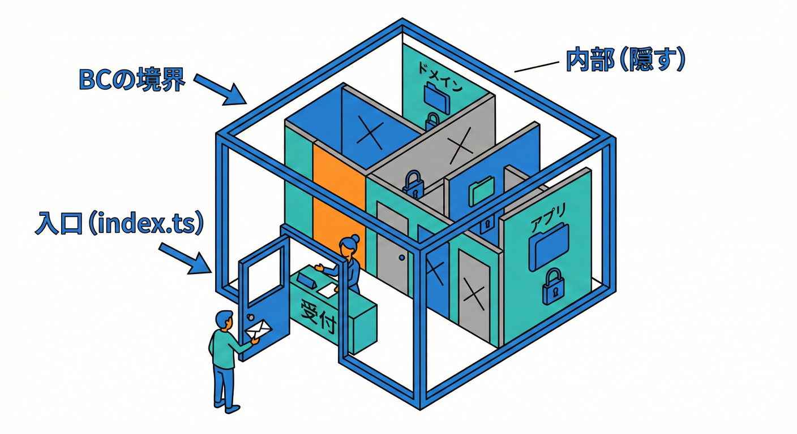
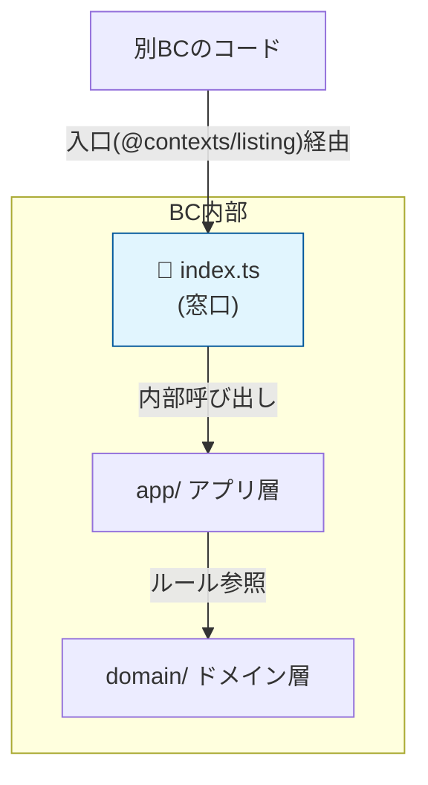
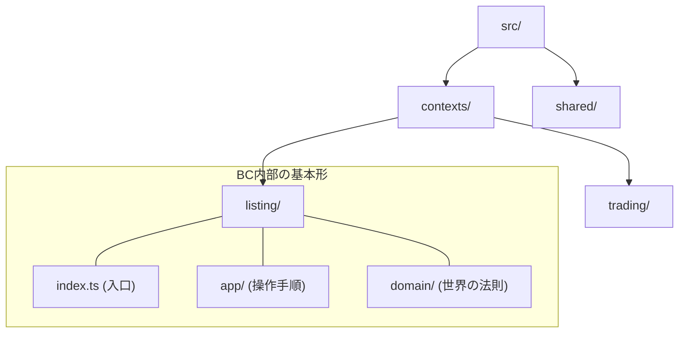
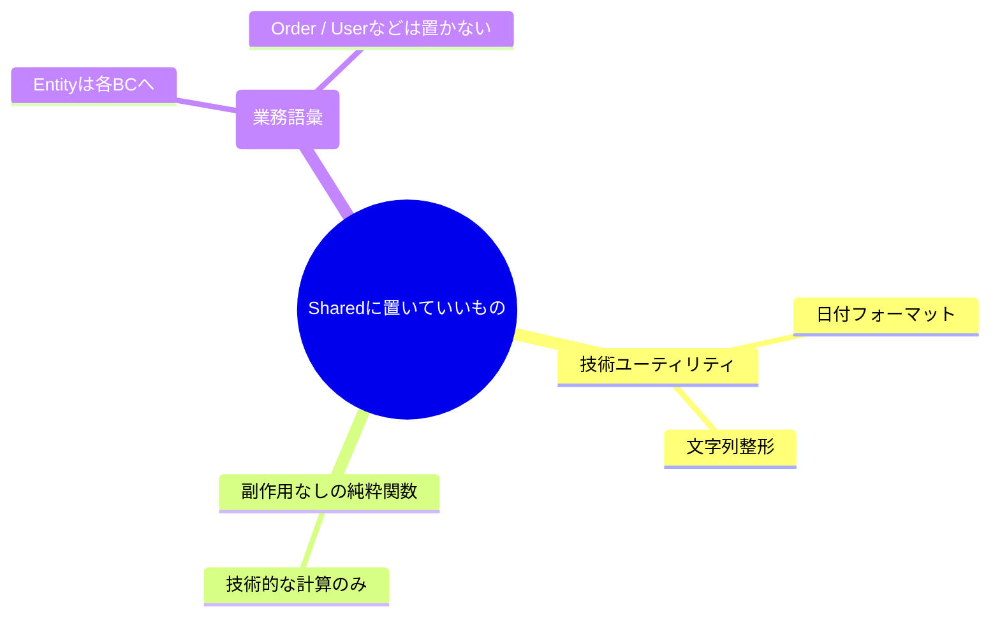

# 第29章 まずフォルダで分ける（物理境界）📁✂️

## この章でできるようになること🎯✨

* 「境界（Bounded Context）」を **フォルダ構成で“見える形”** にできる📦👀
* **他コンテキストの中身に勝手に触れない** import の癖をつけられる🛡️🔌
* 境界が崩れにくいプロジェクト骨格を作れる🧱💪

---

## 0. 2026/02/02 時点のミニメモ🗞️🧸

* TypeScript の安定版ラインは **5.9.3**（npm の “Latest” 表示）だよ🧩✨ ([NPM][1])
* 5.9 の公式リリースノートも公開されてる（※この章は“フォルダ境界”が主役なので、機能詳細は後回しでOK）📝🌱 ([TypeScript][2])

---

## 1. なんで「フォルダで分ける」が最初に効くの？💡📁





設計に慣れてない時ほど、**頭の中の境界**ってすぐ溶けちゃうのね🫠
だから最初にやるべきはこれ👇

* **物理的に分ける**（＝混ざりにくくする）🧱
* **入口を決める**（＝触っていい場所だけ触る）🚪✨

フォルダは、境界を守る **ガードレール** みたいなもの🏎️🛡️
「ここから先は別の世界〜！」って視覚で分かるだけで、事故が激減するよ🚑💦

---

## 2. “学内フリマ” のBCをフォルダに落とす🛍️🏫

例として、こんな3つに分けるよ（章の後半で増やしてもOK）🌸

* Listing（出品）🧾📦
* Trading（取引）💳🤝
* Shipping（配送）🚚📮

**ポイント**：BC名はフォルダ名にもなるから、短くて意味がズレにくい単語が◎🏷️✨

---

## 3. まずは最小の“境界フォルダ構成”を作る🧱📁

最初はこれで十分！「深くしすぎない」のがコツだよ🧸🌱

```text
src/
  contexts/
    listing/
      index.ts          ← 外に見せる入口（Public API）🚪✨
      app/              ← ユースケース（アプリ層）🎮
      domain/           ← ルールや型（ドメイン層）🧠
    trading/
      index.ts
      app/
      domain/
    shipping/
      index.ts
      app/
      domain/
  shared/               ← 共有は最小！増やしすぎ注意⚠️
    utils/


```

## “domain” と “app” の雑な理解でOK🙆‍♀️✨

* **domain**：ルール・型・不変条件・状態…（気持ち「世界の法則」）🧠📜
* **app**：やりたいこと（ユースケース）を並べる場所（気持ち「操作手順」）🎮🧾

---

## 4. 入口ファイル `index.ts` を “窓口” にする🚪📮

BCの外からは **必ずここ経由** にするよ✅
すると「外から触っていいもの」が自然に揃う✨

例：`src/contexts/listing/index.ts`

```ts
export { createListing } from "./app/createListing";
export type { ListingId, ListingItem } from "./domain/types";
```

✅ 良いimport（外の人は入口だけ見る）

```ts
import { createListing } from "@contexts/listing";
```

❌ ダメimport（中身を覗きに行く＝境界破壊）

```ts
import { ListingItem } from "../contexts/listing/domain/types"; // だめ〜😭
```

---

## 5. “入口import” を楽にする（tsconfig の paths）🧭✨

相対パス地獄（`../../../`）は、境界を壊す温床だよ😵‍💫
だから **入口専用のimport名** を作ってあげるのが最強💪

TypeScript は `baseUrl` と `paths` で import の解決ルールを作れるよ📌 ([TypeScript][3])

`tsconfig.json` の一例👇

```json
{
  "compilerOptions": {
    "baseUrl": ".",
    "paths": {
      "@contexts/listing": ["src/contexts/listing/index.ts"],
      "@contexts/trading": ["src/contexts/trading/index.ts"],
      "@contexts/shipping": ["src/contexts/shipping/index.ts"]
    }
  }
}
```

これで **「入口しかimportできない空気」** が作れるよ🌿✨

---

## 6. “共有(shared)” は最小にしようね⚠️🧬

共有フォルダって便利なんだけど…増え始めると一気にこうなる👇

* なんでも shared に置く
* 全コンテキストが shared に依存する
* 結局「大きな一枚岩」に逆戻り😇➡️😱

shared に入れていいのは、だいたいこの3種類だけに絞るのがおすすめ🍙✨

* **技術的ユーティリティ**（日付フォーマット、文字列整形など）🔧
* **ドメインじゃない純粋関数**（副作用なし）🧼
* **超安定な型**（増えるなら“別のBCにすべき”のサインかも）🚨



---

## 7. 章のゴール：フォルダ境界を“崩れにくくするルール”🧾✅

この章では、まず文章でOK！コードより先にルールを置くよ📌😊

## 境界ルール（最小セット）🛡️

1. **他BCの `domain/` や `app/` を直接importしない** 🙅‍♀️
2. **importは `@contexts/<name>`（入口）からだけ** 🚪✨
3. **shared に “業務の言葉” を置かない**（置きたくなったらBC再検討）🧠⚠️

---

## 8. ミニ演習：境界フォルダを実際に作る🧪📁

## 演習A：フォルダを掘る🕳️✨

1. `src/contexts/` を作る
2. `listing / trading / shipping` を作る
3. それぞれに `domain/ app/ index.ts` を作る

## 演習B：まず1個だけ通す（Listing）🛍️✅

`src/contexts/listing/domain/types.ts`

```ts
export type ListingId = string;

export type ListingItem = {
  id: ListingId;
  title: string;
  priceYen: number;
};
```

`src/contexts/listing/app/createListing.ts`

```ts
import type { ListingItem } from "../domain/types";

export function createListing(input: Omit<ListingItem, "id">): ListingItem {
  return { id: crypto.randomUUID(), ...input };
}
```

`src/contexts/listing/index.ts`

```ts
export { createListing } from "./app/createListing";
export type { ListingId, ListingItem } from "./domain/types";
```

最後に、どこかの呼び出し側（例：`src/main.ts`）で入口importして動かす🧸✨

```ts
import { createListing } from "@contexts/listing";

const item = createListing({ title: "教科書セット📚", priceYen: 1200 });
console.log(item);
```

---

## 9. AI相棒に頼むときの質問テンプレ🤖💬

## テンプレ1：フォルダ移動の手順を出してもらう📦

* 「いま `src/` 直下に散らばってる○○ファイルを、`contexts/listing` に移したい。移動先とimport修正方針を手順で出して」🗺️✨

## テンプレ2：入口(index.ts)の公開物を絞る✂️

* 「`contexts/listing` の外に公開すべき関数・型だけを `index.ts` に集めて。公開しない候補も理由つきで出して」🚪✅

## テンプレ3：sharedに入れていいか判定させる⚖️

* 「この `Money` 型を shared に置くべき？それとも特定BCに置くべき？判断基準と、分けるなら代案も出して」🧠💡

---

## 10. 仕上げチェックリスト✅👀

* `src/contexts/<name>/index.ts` がある？🚪
* 他BCからのimportが **入口経由** になってる？🧭
* `../../..` の相対パスが増えてない？😵‍💫
* shared に業務語彙（例：Order, User, Trade）が増えてない？⚠️

---

## 次章の予告📮✨

次は「各BCの公開API（入口）をもっと綺麗に決める」よ🚪✨（第30章）

[1]: https://www.npmjs.com/package/typescript?utm_source=chatgpt.com "TypeScript"
[2]: https://www.typescriptlang.org/docs/handbook/release-notes/typescript-5-9.html?utm_source=chatgpt.com "Documentation - TypeScript 5.9"
[3]: https://www.typescriptlang.org/tsconfig/baseUrl.html?utm_source=chatgpt.com "TSConfig Option: baseUrl"
