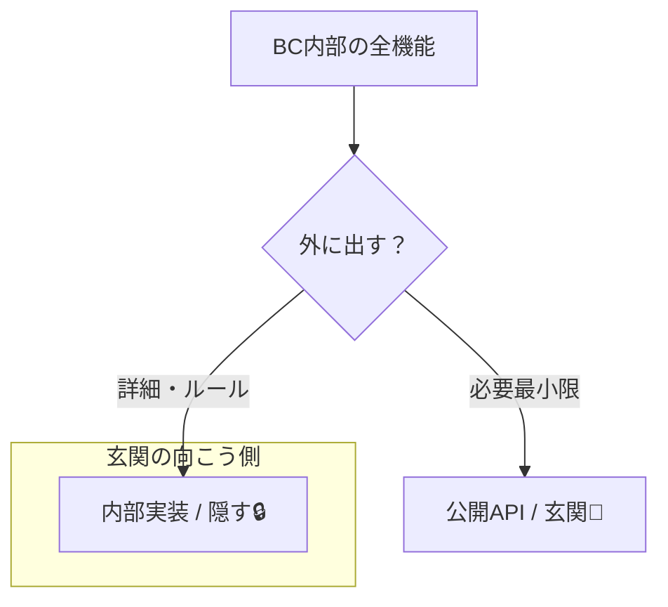
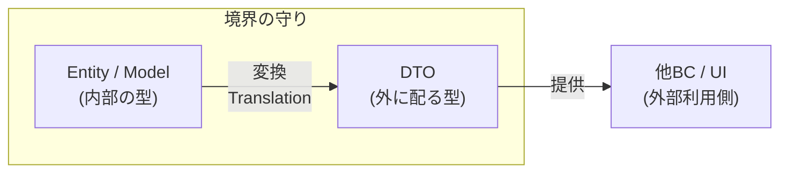
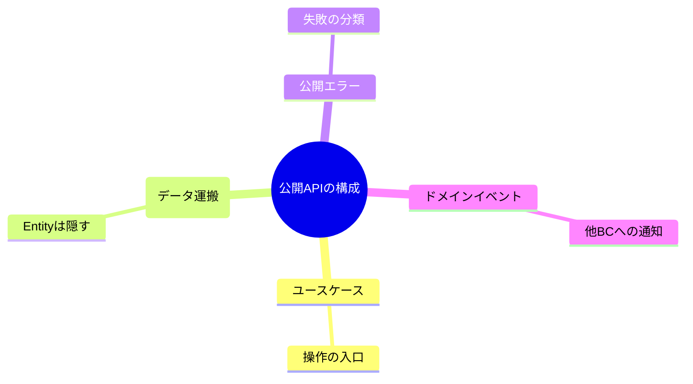

# 第30章 各BCの“公開API”を決める🚪✨

## ねらい🎯

* **境界の外から触っていい“入口（窓口）”を最小にする**🚪🛡️
* 「他BCから触っていいのはココだけ！」を**コードで固定**する📌🔒
* 後から人が増えても、機能が増えても、**境界が崩れにくい形**にする🏗️✨

> ちなみに本日時点のTypeScript安定版ラインは **5.9系（npmのlatestは 5.9.3）**だよ🐣💻 ([NPM][1])
> “ネイティブ版プレビュー”も公開されていて、将来もっと速くなる流れも進んでるよ🚀🌱 ([Microsoft for Developers][2])

---

## 0. 公開APIってなに？🧸💡（たとえで覚える）


Bounded Context（BC）を「お部屋🏠」だとすると…

* **公開API**：玄関🚪（来客が入っていい場所）
* **内部実装**：台所・寝室・押入れ🧺（家族しか入らない場所）

玄関が広すぎると…
「勝手に冷蔵庫あけられる🥶」「寝室に入られる😱」みたいな事故が起きるよね。

だから **“外に見せる面”を設計する**のが公開APIの仕事だよ🧼✨

---

## 1. 第29章のフォルダ分けから、次にやること📁➡️🚪

前章で「BCごとにフォルダを分けた」だけだと、まだこういう事故が起きがち👇😵

* `contexts/trading/domain/...` を他BCが直接importしちゃう😱
* Entity（内部モデル）が外に漏れて、依存が絡まる🕸️
* 仕様変更で一気に影響範囲が広がる💥

そこでこの章では、**“どこから外が入れるか”を固定**するよ🔒✨

---

## 2. 公開APIに入れてOKなもの／ダメなもの✅❌

まずは超ざっくり基準👇（迷ったらコレでOK🧭）



### ✅ 入れてOK（外が使うために必要）

* **ユースケース（アプリ層）の関数**：例）`purchaseItem()`🛒、`createListing()`🛍️
* **境界を越えるDTO（運搬用の型）**：例）`ListingSummaryDto`📦
* **公開用エラー**：例）`NotFoundError`、`ValidationError`⚠️
* **公開イベント（あれば）**：例）`TradingCompleted`🎉（「他BCに通知していい情報」だけ）

### ❌ できるだけ出さない（内部を守る）

* Entity / Value Object（BC内の“意味の中心”）💎🧱
* Repository実装やDB型、ORMの型🗄️
* “つい便利だから”の内部ヘルパー関数🔧
* 内部の状態マシンやドメインサービスの詳細🚦

ポイントはこれ👇
**「外にとって“必要”か？」より、「外に出すと“縛られる”か？」**で判断すると失敗しにくいよ🪢😌

---

## 3. 公開APIの形は「1つの入口ファイル」にまとめる📮✨

おすすめは、各BCに **`public`（または `index.ts`）を1つ置く**やり方だよ📄

例：`Listing`（出品）BCの構成イメージ👇

```txt
src/
  contexts/
    listing/
      application/
        createListing.ts
        getListingSummary.ts
      domain/
        Listing.ts
        ListingId.ts
        Money.ts
      infra/
        ListingRepositoryInMemory.ts
      public/
        index.ts          ← ★ここが公開API（玄関🚪）
        dtos.ts
        errors.ts
```

### ねらい🧠

* 外部は **`contexts/listing/public` だけ**見ればいい👀✨
* 内部ファイルを直接importしなくて済む🙅‍♀️
* 何を公開してるかが一目で分かる🔍

---

## 4. 実装してみよう🛠️✨（Listing BCの公開APIサンプル）

ここから「学内フリマ🛍️」例で、最小の公開APIを作るよ〜😊

### 4-1) DTO（外に渡す型）を作る📦

「ドメインの中心（Entity）」を外に出す代わりに、**運搬用の型**を用意するよ🚚✨

```ts
// src/contexts/listing/public/dtos.ts

export type ListingId = string;

export type ListingSummaryDto = {
  id: ListingId;
  title: string;
  priceYen: number;
  sellerDisplayName: string;
  status: "draft" | "published" | "sold";
};

export type CreateListingCommand = {
  title: string;
  priceYen: number;
  sellerId: string;
};
```

コツ💡

* `status`みたいな文字列ユニオンは **外に見せても安全**なことが多いよ🙂
* 内部の `Money` などのValue Objectは外に出さない（DTOに変換）🪙➡️🔢



---

### 4-2) 公開エラーを作る⚠️

公開APIは「失敗の形」も決めると親切だよ🧸✨

```ts
// src/contexts/listing/public/errors.ts

export class ValidationError extends Error {
  constructor(message: string) {
    super(message);
    this.name = "ValidationError";
  }
}

export class NotFoundError extends Error {
  constructor(message: string) {
    super(message);
    this.name = "NotFoundError";
  }
}
```

---

### 4-3) ユースケース（アプリ層）を公開する🎮✨

外が呼びたいのはだいたいココ！
「出品を作る」「一覧に出す」「概要を取得」みたいな入口だよ📮

```ts
// src/contexts/listing/application/createListing.ts
import { ValidationError } from "../public/errors";
import type { CreateListingCommand, ListingId } from "../public/dtos";

export async function createListing(cmd: CreateListingCommand): Promise<ListingId> {
  if (!cmd.title || cmd.title.length < 3) {
    throw new ValidationError("title は3文字以上にしてね📝");
  }
  if (cmd.priceYen <= 0) {
    throw new ValidationError("priceYen は1円以上にしてね💰");
  }

  // ここで domain を組み立てたり repository に保存したりする（詳細は内部）
  const newId = crypto.randomUUID();
  return newId;
}
```

ここで大事なのは👇

* 引数も戻り値も **DTO（またはプリミティブ）中心**🧼
* `domain/Listing.ts` を外に見せない🛡️

---

### 4-4) 公開API（玄関🚪）を1ファイルに集約する📄✨

最後に“入口ファイル”を作るよ！

```ts
// src/contexts/listing/public/index.ts
export type { ListingId, ListingSummaryDto, CreateListingCommand } from "./dtos";
export { ValidationError, NotFoundError } from "./errors";

export { createListing } from "../application/createListing";
// export { getListingSummary } from "../application/getListingSummary"; みたいに増やしていく✨
```

これで外部はこう呼べる👇😊

```ts
import { createListing, type CreateListingCommand } from "./contexts/listing/public";

const cmd: CreateListingCommand = {
  title: "使わなくなった参考書📚",
  priceYen: 800,
  sellerId: "user-123",
};

const id = await createListing(cmd);
console.log(id);
```

---

## 5. 公開APIを設計するときの“よくある失敗”あるある😇➡️😱

### 失敗①：Entityをそのままexportしちゃう🧱💥

* 便利だけど、外がEntityに依存してしまう
* 仕様変更（プロパティ追加/削除）で外が壊れる

👉 対策：**外はDTO、内部はドメイン**（翻訳して渡す）📦🛡️

### 失敗②：公開APIが増えすぎる🌀

* 小さいヘルパーまで公開して「何が正規ルート？」って迷子になる🧭😵

👉 対策：公開APIは **ユースケース中心**にする🎮✨
（CRUDの“便利関数”を公開しすぎない🙅‍♀️）

### 失敗③：外が内部フォルダを直接importする📁🚫

* 「一瞬だけ…」が積み重なって境界が溶ける🫠

👉 対策：次の章（依存ルール）で強めに縛るよ📏🔒
（この章では“玄関を作る”ところまで！）

---

## 6. もっと強く守りたい人向け：package.jsonのexportsで“入口しか出さない”📦🔒

もしBCを「パッケージっぽく」扱うなら、**`package.json` の `exports`**で公開入口を絞れるよ🚪✨
Node.jsでは `"main"` と `"exports"` がエントリポイントを定義できるんだ📌 ([Node.js][3])

（ここはやや上級🔰➡️🧠なので、最初は ESLintルール運用でもOKだよ🙆‍♀️）

---

## 7. ミニ演習✏️✨（10〜15分）

### 演習A：公開APIを“3つだけ”選ぶ🎯

次のBCを想定して、それぞれ「外に公開する関数を3つだけ」決めてね👇

* Listing（出品）🛍️
* Trading（取引）🧾
* Shipping（配送）📦

ヒント💡

* 「画面から呼ばれそう」「他BCが必要そう」なユースケースが候補だよ🎮✨

---

### 演習B：DTOを2つ作る📦

Trading BCで、境界越えのDTOを2つ考えてみよう🙂

例）

* `StartTradeCommand`（取引開始）
* `TradeSummaryDto`（取引の概要）

「何を隠したいか」を意識すると上手くいくよ🧼🛡️

---

## 8. AI相棒🤖に頼むときの“質問テンプレ”🎀

### 公開APIのたたき台を作る📝

* 「`Listing` BCの公開APIとして、ユースケース関数を3つ提案して。引数/戻り値はDTO中心で、Entityを外に出さない方針で！」

### 余計な公開がないかチェック👀

* 「この `public/index.ts` の export は多すぎる？“外に縛られる”観点で危険なものがあれば指摘して！」

### DTOのフィールド整理✂️

* 「`ListingSummaryDto` のフィールド、将来の変更に弱いものがあれば減らす案を出して！」

---

## 9. この章のまとめ🧾✨

* 公開APIは **BCの玄関🚪**。入口を絞るほど境界が守られる🛡️
* 外に出すのは基本 **ユースケース + DTO + 公開エラー**🎮📦⚠️
* **`public/index.ts` に集約**すると、見通しが良くなる👀✨
* 内部（domain/infra）を直接触らせないのが勝ち筋🏆🧼



[1]: https://www.npmjs.com/package/typescript?utm_source=chatgpt.com "TypeScript"
[2]: https://devblogs.microsoft.com/typescript/announcing-typescript-native-previews/?utm_source=chatgpt.com "Announcing TypeScript Native Previews"
[3]: https://nodejs.org/api/packages.html?utm_source=chatgpt.com "Modules: Packages | Node.js v25.5.0 Documentation"
