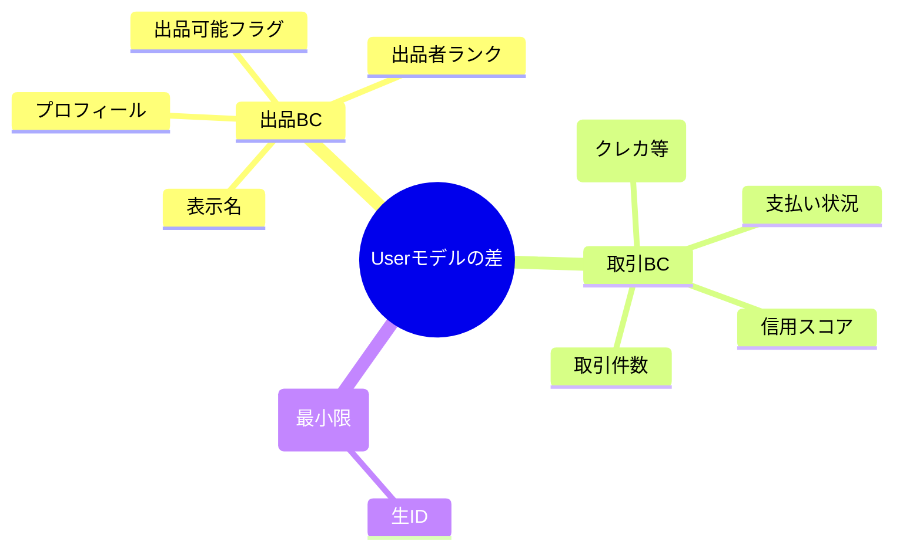
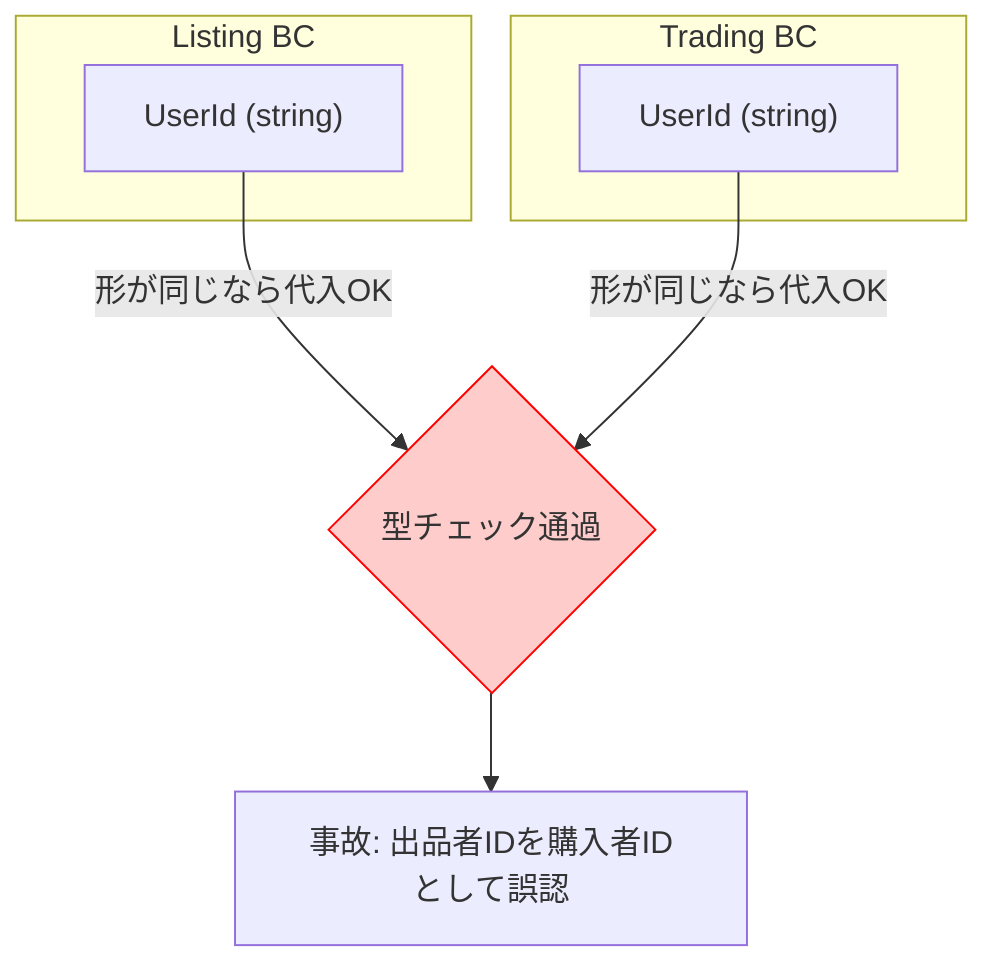
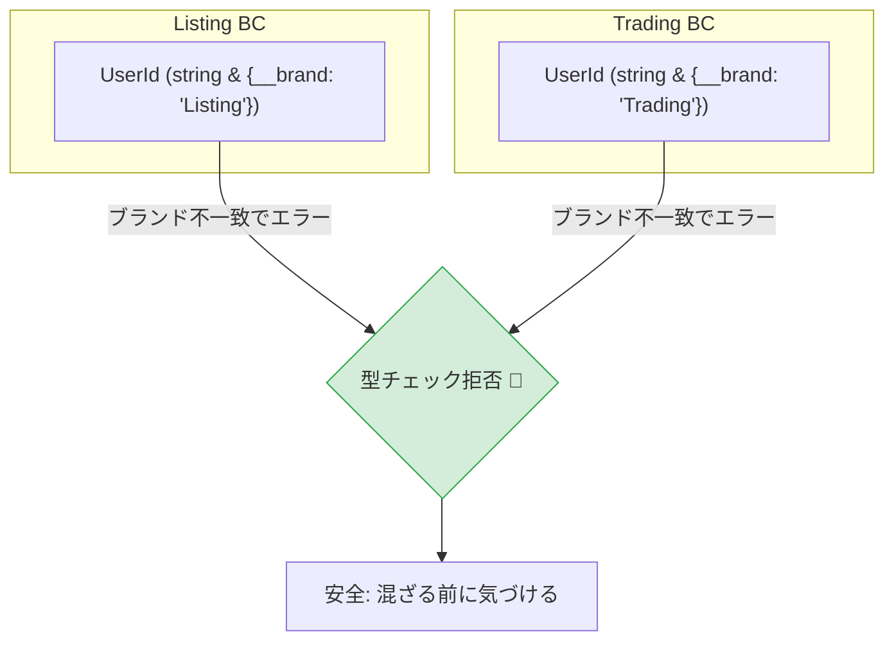
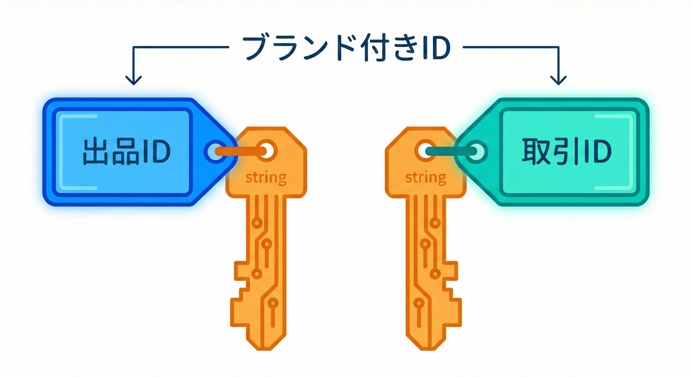

# 第31章 同名でもOK：BCごとに型を持つ🧩🙂

## この章でできるようになること🎯✨

* 「同じ User って言葉でも、BCが違えば “別の型” で持っていい」って説明できる🗣️💡
* うっかり **別BCのUserを混ぜた事故**を、TypeScriptの型で止められるようになる🛑🧠
* 「共有型ファイルに逃げない」設計のクセがつく📁🚫

---

## まずはイメージ🍓🛍️（学内フリマ例）


同じ「User」でも、BCが違うと意味がズレることがあるよ〜🙂

* **Listing（出品）BCのUser**

  * 出品に必要：表示名、出品者プロフィール、出品可能フラグ、出品制限…🧾
* **Trading（取引）BCのUser**

  * 取引に必要：購入可否、支払い状態、取引の信用情報…💳📦

つまり、「User」という **単語は同じ**でも、**欲しい情報もルールも違う**んだよね🌀
だから **BCごとに User 型を持つ**のが自然だよ🙆‍♀️✨



---

## TypeScript的に超重要ポイント⚠️🧠

TypeScriptの型は、基本的に **“名前” じゃなく “形（プロパティ）” で互換性が決まる**よ📦
これを **構造的型付け（structural typing）**って呼ぶよ。([TypeScript][1])

なので、もし ListingUser と TradingUser が “たまたま同じ形” だと…
**別の名前でも代入できちゃう**ことがある😇💥



👉 だからこの章のコツはこれ！

* **BCごとに型を分ける**（まず大事）✅
* さらに **混ざったら困るもの（IDなど）には “タグ（ブランド）” を付ける**🧷✅



---

## 1) まずは「BCごとに User 型を置く」📁✨

おすすめの置き場所（例）👇

* `contexts/listing/domain/user.ts`
* `contexts/trading/domain/user.ts`

## Listing 側：`contexts/listing/domain/user.ts`🛍️

```ts
// contexts/listing/domain/user.ts

export type UserId = string & { readonly __brand: "ListingUserId" };

export type User = Readonly<{
  id: UserId;
  displayName: string;
  sellerLevel: "beginner" | "regular" | "pro";
  canList: boolean;
}>;

// 生の string から Listing 用の UserId を作る入口（タグ付け係）🧷
export const toUserId = (raw: string): UserId => raw as UserId;
```

## Trading 側：`contexts/trading/domain/user.ts`💳

```ts
// contexts/trading/domain/user.ts

export type UserId = string & { readonly __brand: "TradingUserId" };

export type User = Readonly<{
  id: UserId;
  displayName: string;
  canBuy: boolean;
  riskScore: number; // 例：信用スコア
}>;

export const toUserId = (raw: string): UserId => raw as UserId;
```

ポイントはこれだよ🧸✨

* 各BCの中では **あえて型名は User のまま**でOK（読みやすい）🙂
* 外から import するときに **別名（alias）**を付けて区別するのがキレイ🏷️

---

## 2) import するときは alias ＋ “type-only import” 🧼📦

型だけを読み込みたい時は `import type` が便利だよ〜！
実行時の依存を増やしにくいし、境界も守りやすい🛡️✨ ([TypeScript][2])

```ts
import type { User as ListingUser, UserId as ListingUserId } from "../contexts/listing/domain/user";
import type { User as TradingUser, UserId as TradingUserId } from "../contexts/trading/domain/user";
```

---

## 3) 「混ぜたら困る」をコンパイルで止める🛑💥（ミニ実験）

たとえば取引BCの関数が「取引UserId」だけを受け付けるようにしてみるね👇

```ts
// contexts/trading/application/authorizePurchase.ts
import type { UserId as TradingUserId } from "../domain/user";

export const authorizePurchase = (buyerId: TradingUserId) => {
  // 購入許可のチェック…みたいな想定🙂
};
```

Listing 側の UserId を渡すと…？

```ts
import { toUserId as toListingUserId } from "../contexts/listing/domain/user";
import { authorizePurchase } from "../contexts/trading/application/authorizePurchase";

const sellerId = toListingUserId("u-123");

// ✅ ここで止まってほしい！
// sellerId は ListingUserId なので TradingUserId に渡せない🛑
authorizePurchase(sellerId);
```

この「止まる」が超うれしい🥹🛡️
BCを跨いで混ざると、あとからバグが爆発しやすいからね💣💥

---

## 4) “User本体” も混ざりうる？ → そのときの考え方🧠🧩

TypeScriptは構造的だから、もし両方のUserがたまたま同じ形なら **混ざる可能性**があるよ😇 ([TypeScript][1])

でも初心者段階では、まずはこれでOK🙆‍♀️✨

* **混ざるとヤバいのは特に ID / 状態 / ルールが乗るもの**
* だから **IDにブランド**を付けるだけでも防御力がグッと上がる🛡️✨

（本体までガチガチに “名義型” にしたいのは、もう少し後でも大丈夫だよ😊）

---

## 5) 「境界を越える形」は Domain型じゃなく DTO にしよ📦🚚

BCを跨いで何か渡したいとき、やりがち事故👇😱

* 「ListingのUser型をそのまま Trading に渡す」

代わりにおすすめは👇✨

* 境界を越えるときは **運搬用の形（DTO）**にする📦
* DTO → 受け取った側の Domain 型、に “変換” する🧼

DTOの型チェックに `satisfies` が便利だよ🙂
「DTOとして必要条件は満たすけど、リテラル推論は残したい」みたいなときに強い🧠✨ ([TypeScript][3])

```ts
type TradingUserSummaryDto = {
  id: string;        // 境界越えはまず string でもOK（受け取った側で変換）
  displayName: string;
};

const dto = {
  id: "u-123",
  displayName: "Mika",
} satisfies TradingUserSummaryDto;
```

---

## 6) 実践ミニ演習🎮📝（手を動かすやつ！）

## 演習A：2つの UserId を作って、混ぜたら止まるのを確認🧷🛑

1. Listing と Trading にそれぞれ `UserId` を作る（上の例でOK）
2. Trading 側の関数に Listing の `UserId` を渡してみる
3. エラーが出たら成功🎉

## 演習B：`// @ts-expect-error` で “事故の再発防止テスト” を作る🧪✨

```ts
// @ts-expect-error ListingUserId は TradingUserId に渡せないはず！
authorizePurchase(sellerId);
```

これを書いておくと、将来うっかり型がゆるくなって事故が復活したときに気づけるよ👀⚠️

---

## 31.5 型で「中身」をブランド化する（Branded Types）🏷️✨



「中身は string だけど、ListingId と TradingId は別物として扱いたい！」

---

## 7) AI相棒🤖💬（コピペ用プロンプト）

* 「学内フリマの Listing BC と Trading BC の “User が意味的に違う” 点を箇条書きで10個出して。各BCで必要な属性も提案して。」
* 「ListingUserId と TradingUserId が混ざらないように、TypeScriptでブランド型を作って。初心者でも運用しやすい形にして。」
* 「境界を越えるDTOを設計して。DTOの最小フィールド案と、受け取り側でDomain型へ変換する関数案も。」

---

## 8) よくある事故あるある😵‍💫🧯

## 事故1：`shared/types/User.ts` を作って全部そこに集める📦😇

* いったん楽だけど、BCの意味が溶けて **“でっかいUser”** になりがち🫠
* 対策：**UserはBC内に置く**。共有したくなったら「DTO」か「別の概念名」へ🧼📦

## 事故2：他BCの domain を直 import して使いまくる🕸️

* 境界が崩れて、変更が連鎖しやすい😱
* 対策：型だけでも `import type` を基本にして、**公開API（窓口）経由**を意識👀✨ ([TypeScript][2])

---

## まとめ🎀✨

* **同じ単語でも、BCが違えば別の型でOK**🙆‍♀️🧩
* TypeScriptは **構造的**だから、ただ名前を変えただけだと混ざることがあるよ⚠️ ([TypeScript][1])
* まずは **BCごとに User を置く**📁✨
* 特に **IDはブランド型**で「混ぜたら止まる」を作るのが初心者にめっちゃ効く🧷🛑
* 境界を越えるなら **Domain型じゃなくDTO**📦🚚（`satisfies` も便利）🧠✨ ([TypeScript][3])

---

[1]: https://www.typescriptlang.org/docs/handbook/type-compatibility.html?utm_source=chatgpt.com "Documentation - Type Compatibility"
[2]: https://www.typescriptlang.org/docs/handbook/release-notes/typescript-3-8.html?utm_source=chatgpt.com "Documentation - TypeScript 3.8"
[3]: https://www.typescriptlang.org/docs/handbook/release-notes/typescript-4-9.html?utm_source=chatgpt.com "Documentation - TypeScript 4.9"
