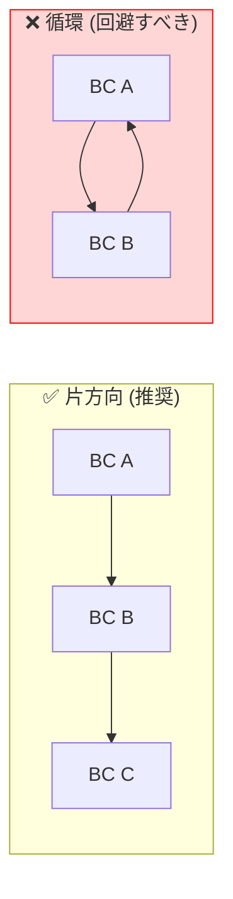
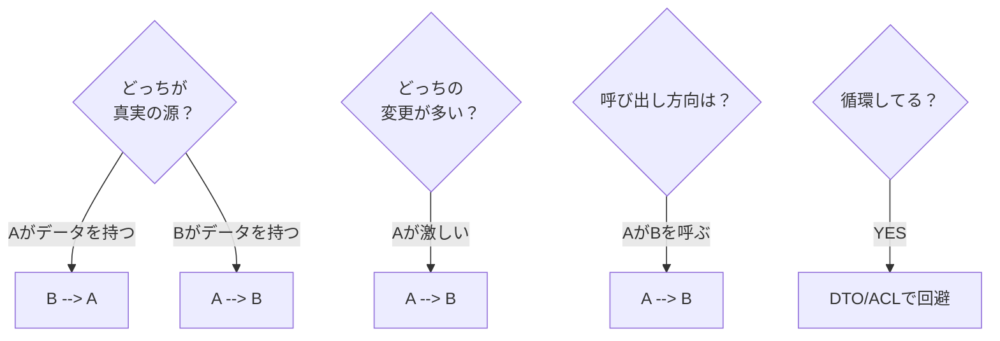
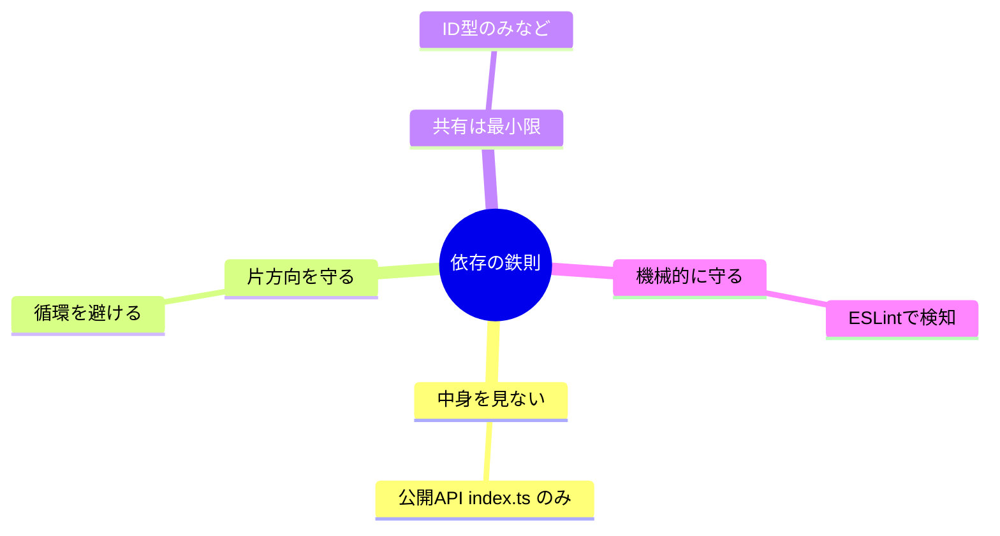
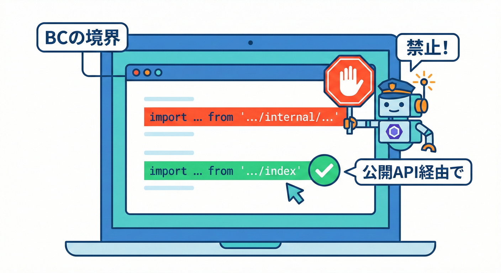

# 第32章 依存の向きを決める（依存関係ルール）➡️📏

## この章でできるようになること🎯✨

* 「どっちがどっちに依存していいか」を **言葉で説明** できる😊🗣️
* Bounded Context（BC）同士の **依存の向き（矢印）** を決められる🧭➡️
* ルールを **コードで破れない仕組み**（ESLint）にできる👮‍♀️🚨
* PRレビューで「境界が崩れてる！」を **すぐ見抜ける観点**が持てる👀✅

---

## 32.1 そもそも「依存の向き」ってなに？🧠➡️


BCを箱📦だとすると、依存は矢印➡️です。

* A➡️B：AがBを使う（AはBがないと困る）
* 依存の向きがぐちゃぐちゃになると…

  * 変更が連鎖して止まらない😵‍💫💥
  * 同じ言葉が混ざってモデルが汚れる🧼➡️🧟
  * 境界が「ただのフォルダ分け」になって崩壊😇📁

BCの境界を守るには、「矢印のルール」を先に決めるのが超大事です🧱✨

---

## 32.2 依存関係ルールの基本セット（まずはこれだけ）📜✨

ここでは、初心者でも運用しやすい“最小ルール”でいきます😊🧸

### ルールA：他BCの「中身（internal）」を直接見ない🙈🚫

* OK：相手BCの **公開口（Public API）** だけを使う🚪✨
* NG：相手BCの domain / application / internal フォルダを直接 import する📦🔓➡️😱

### ルールB：依存の矢印は「片道」を基本にする➡️➡️



* なるべく循環（A➡️B➡️A）を作らない🔁🚫
* どうしても循環っぽくなるなら、**受け渡しの形（DTO）** や **ACL** に逃がす🛡️📦

### ルールC：「共有」は最小にして、増えそうなら止める✂️🧬

* 共有が増える＝調整が増える＝速度が死ぬ😵‍💫⛔
* 共有するなら「本当にブレないもの」だけ（例：IDの型など）🧊✨

---

## 32.3 例題（学内フリマ🛍️）で矢印を決めてみよう🗺️➡️

たとえばBCがこんな感じだとします👇

* Listing（出品）📦
* Trading（取引）🤝
* Shipping（配送）🚚

よくある“自然な”依存はこう👇

* Trading ➡️ Listing

  * 取引は「どの商品が出品されてる？」を知りたい
  * 出品は「取引がどうなってる？」を知らなくていい
* Shipping ➡️ Trading

  * 配送は「取引が成立した？」を知りたい
  * 取引は「配送会社の都合」を知らなくていい

つまり、

* Listing ⬅️ Trading ⬅️ Shipping

みたいな **片方向チェーン** になりやすいです😊➡️➡️

> ポイント💡
> 「どっちが“元データの持ち主（真実の源）”か？」で決めるとブレにくいよ🧠✨

---

## 32.4 依存の向きを決める4つの質問🤔🧭



矢印に迷ったら、この4問でだいたい決まります✅✨

1. **どっちが真実の源（Source of Truth）？** 🏛️

   * “持ってる側”に依存しがち

2. **どっちの変更が多い？** 🔥

   * 変更が多い側が、少ない側に依存すると事故りやすい😇💥

3. **問い合わせるのはどっち？（呼び出し方向）** 📞

   * 「知りたいから呼ぶ」側が依存する➡️

4. **循環（A➡️B➡️A）になってない？** 🔁

   * なってたら黄色信号⚠️
   * DTO/ACL/イベントなど、境界越えの形を見直す🧼🛡️

---

## 32.5 依存ルールを「1枚」にするテンプレ📝✨

決めたら、短くていいので文章化します（ここ超大事）📌😊
例👇（そのまま貼って使えるよ🧸✨）

* 依存の基本：BC間の依存は片方向を基本とする➡️
* 禁止：他BCの内部フォルダを直接 import しない🙈🚫
* 許可：他BCは公開口（各BCの入口）だけ import してよい🚪✨
* 例外：どうしても必要な場合はDTO/ACLで受け渡しし、例外理由を短く残す🛡️📦
* 守り方：ESLintで機械的に検出してPRで止める👮‍♀️🚨



---

## 4. ルールをコードで守る（ESLint）👮‍♀️🚨



依存ルールを「気合い」で守るのは不可能です😇
だから、フォルダで“破りにくく”します💪📁

例（イメージ）👇

```txt
src/
  contexts/
    listing/
      index.ts            // ✅ 公開口（Public API）
      domain/
      application/
      infrastructure/
      internal/           // ✅ ここは外から触らせない想定
    trading/
      index.ts
      domain/
      application/
      infrastructure/
      internal/
```

ここでの狙い🎯

* 他BCからは「contexts/◯◯/index.ts」だけ触れればOKにする🚪✨
* 「internal/」配下を触ろうとしたら、機械的に怒られるようにする👮‍♀️💢

---

## 32.7 ESLintで「破ったら即エラー」にする👮‍♀️🚨

今どきESLintは **Flat Config**（設定ファイル形式）が標準です📄✨（設定ファイル名も決まってるよ）([ESLint][1])
さらにESLint v9ではFlat Configがデフォルトになった流れが整理されています。([ESLint][2])
そして、ESLint v10は2026年1月にRC（リリース候補）が出ています。([ESLint][3])

### ① まず導入（必要パッケージ）📦✨

typescript-eslint のクイックスタートでは、Flat Config前提で「ESLint + TypeScript + typescript-eslint」を入れて設定する流れが案内されています。([TypeScript ESLint][4])

（例）

```bash
npm install --save-dev eslint @eslint/js typescript typescript-eslint
```

### ② eslint.config.mjs を作る📄✨

typescript-eslintの推奨構成は、defineConfigと recommended を組み合わせる形です。([TypeScript ESLint][4])

```js
// eslint.config.mjs
// @ts-check

import eslint from "@eslint/js";
import { defineConfig } from "eslint/config";
import tseslint from "typescript-eslint";

export default defineConfig(
  eslint.configs.recommended,
  tseslint.configs.recommended,

  // ここから「境界を守るルール」を追加していくよ👮‍♀️✨
);
```

### ③ “境界違反import” を禁止する（最小構成）🚫➡️

ここで使うのが「特定のimportを禁止できる」ルールです。([ESLint][5])
TypeScriptでは type import などもあるので、typescript-eslint版（拡張ルール）を使うのが安全です🧷✨（ベースルールをoffにする注意も書かれています）([TypeScript ESLint][6])

例：他BCの internal を触ったらアウト🙅‍♀️

```js
// eslint.config.mjs（さっきの続き）
import eslint from "@eslint/js";
import { defineConfig } from "eslint/config";
import tseslint from "typescript-eslint";

export default defineConfig(
  eslint.configs.recommended,
  tseslint.configs.recommended,

  {
    files: ["src/**/*.ts"],
    rules: {
      // TypeScriptでは拡張ルールを使うのが安心🧸
      "no-restricted-imports": "off",
      "@typescript-eslint/no-restricted-imports": [
        "error",
        {
          // patterns で “禁止するパスの型” を指定できるよ🧩
          // （patterns/group などのオプションがある）:contentReference[oaicite:7]{index=7}
          patterns: [
            {
              group: ["src/contexts/*/internal/**"],
              message:
                "他BCの internal は触らないでね🛡️ 公開口（各BCの index.ts）経由で使おう✨",
            },
            {
              group: ["src/contexts/*/domain/**", "src/contexts/*/application/**", "src/contexts/*/infrastructure/**"],
              message:
                "他BCの中身は直接import禁止🙈 公開口（index.ts）だけにしよう🚪✨",
            },
          ],
        },
      ],
    },
  }
);
```

これで、誰かがうっかり
「contexts/listing/domain/…」を import した瞬間に、VS Code上で赤く怒られます💢🔴（最高）✨

---

## 32.8 もっと強く守りたい人向け：境界専用プラグイン🧱🔍（任意）

「禁止パターン」だけでも十分強いけど、
“大きい構成”になると **境界ルール専用プラグイン** が便利です😊✨

たとえば ESLint Plugin Boundaries は「アーキテクチャ境界を強制する」系のプラグインとして紹介されています。([GitHub][7])

> ここは発展枠🎓✨
> まずは 32.7 の禁止パターンで“事故を止める”だけでも合格です💮😊

---

## 32.9 ミニ演習🎮✨（破って学ぶのが最速！）

### 演習1：わざと境界違反してみよう😈➡️👮‍♀️

1. trading 側のどこかで、listing の domain を直接 import してみる
2. ESLintに怒られるのを確認する🔴💢
3. 「listing/index.ts」に必要な公開関数を出して、そっち経由に直す🚪✨

✅ ゴール：**“直し方が毎回同じ”** になったら勝ち🎉

### 演習2：依存の矢印を図にする🗺️✏️

* Listing / Trading / Shipping の箱を書いて
* 依存する方向に矢印を書くだけ➡️➡️
* 循環があったら、DTO/ACLで逃がす案を1つ書く🛡️📦

---

## 32.10 AI相棒🤖✨：そのまま使える質問テンプレ

### テンプレA：依存の向きをレビューしてもらう🧠➡️

* 「Listing / Trading / Shipping がある。今の依存はこう。循環が出ない矢印に直して。理由も一言で。」

### テンプレB：ESLintルールの“抜け”を探してもらう👮‍♀️🔍

* 「この eslint.config.mjs で境界を守ってる。抜け道（すり抜けimport）がありそうなら指摘して、塞ぐ案を出して。」

### テンプレC：公開口の設計を手伝ってもらう🚪✨

* 「このBCの外に出すべき関数/型を“最小”で提案して。外に出しちゃダメなものも列挙して。」

---

## 32.11 よくある失敗あるある集😵‍💫⚠️

* 「とりあえず使えたから…」で他BCの domain を直importし始める🙈
* index.ts が薄すぎて、みんな中身を覗きに行く👀💥
* 共有フォルダに便利関数が増殖して、実質“第2のBC”になる🧟📦

全部、ルールとESLintで止めればOKです👮‍♀️✨

---

## 32.12 おまけ：最近の開発安全メモ🔐📦

npm周りでは、人気パッケージが乗っ取られて悪性バージョンが出た事例が報じられています（例：eslint-config-prettier など）。([TechRadar][8])
なので、最低限これだけはやっておくと安心度が上がるよ🧸🛡️

* lockfile（package-lock など）はコミット📌
* 依存更新はまとめてやらず、小さく刻む✂️
* 怪しい時はリリースノートや差分を見る👀

---

## まとめ🎁✨

* 依存の向きは「真実の源」「呼び出し方向」「循環チェック」で決める🧭
* ルールは文章化して1枚にする📝
* 気合いで守らず、ESLintで“破ったら即エラー”にする👮‍♀️🚨
* まずは「他BCの中身をimport禁止」だけでも境界が一気に強くなる🧱✨

[1]: https://eslint.org/docs/latest/use/configure/configuration-files "Configuration Files - ESLint - Pluggable JavaScript Linter"
[2]: https://eslint.org/blog/2025/05/eslint-v9.0.0-retrospective/ "ESLint v9.0.0: A retrospective - ESLint - Pluggable JavaScript Linter"
[3]: https://eslint.org/blog/2025/03/eslint-v9.23.0-released/ "ESLint v9.23.0 released - ESLint - Pluggable JavaScript Linter"
[4]: https://typescript-eslint.io/getting-started/ "Getting Started | typescript-eslint"
[5]: https://eslint.org/docs/latest/rules/no-restricted-imports "no-restricted-imports - ESLint - Pluggable JavaScript Linter"
[6]: https://typescript-eslint.io/rules/no-restricted-imports "no-restricted-imports | typescript-eslint"
[7]: https://github.com/javierbrea/eslint-plugin-boundaries?utm_source=chatgpt.com "javierbrea/eslint-plugin-boundaries"
[8]: https://www.techradar.com/pro/security/more-popular-npm-packages-hijacked-to-spread-malware?utm_source=chatgpt.com "More popular npm packages hijacked to spread malware"
