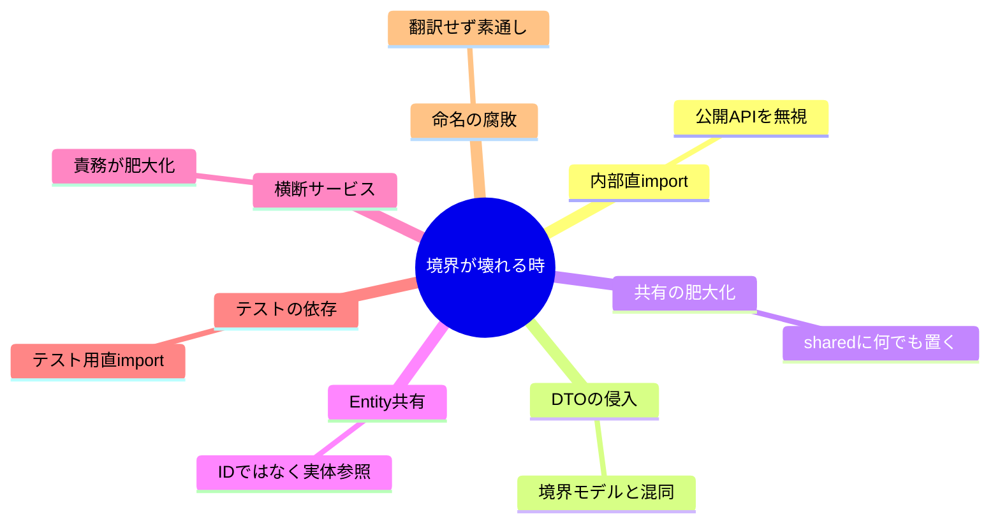

# 第33章 境界を守る運用（レビュー観点）👀✅

## 33.1 境界は「作って終わり」じゃない🧱💦

Bounded Context（BC）は、最初はキレイに分かれてても…
日々の追加機能で、じわじわ **境界が溶けがち** です😇➡️😱

特に TypeScript はエディタの自動importが強くて、うっかり **別BCの内部をimport** しやすいのが罠🪤
なので、**運用（レビュー＋自動チェック）** で「崩れを止める仕組み」を作ります🛡️✨

---

## 33.2 境界を守る「3点セット」🛡️🧰


BCを守るコツは、1つの強い武器じゃなくて **3つの弱い武器を重ねる** こと💪💕

1. **文章のルール（短く！）**📜
2. **自動チェック（機械で止める）**🤖
3. **レビュー観点（人間の目）**👀✅

自動チェックの例：

* ESLintの no-restricted-imports で「そこimportしないで！」を禁止できるよ🚫📦 ([ESLint][1])
* ESLint Plugin Boundaries みたいに “境界ルールそのもの” を書ける系もあるよ🧱✨ ([NPM][2])
* dependency-cruiser は依存関係のルールをグラフで判定できるよ🕸️🚧 ([GitHub][3])

---

## 33.3 PRで見る「境界チェックリスト」🧾✅

PRレビューで毎回ここを見るよ👀✨（コピペでOK！）

### A. import（境界の入口）🚪

* [ ] **別BCの internal / domain / infra を直接importしてない？**（内部直参照はアウト🚫）
* [ ] 別BCから触るのは **そのBCの公開API（入口ファイル）だけ** になってる？
* [ ] パスが深すぎない？（例：contexts/trading/**internal**/... みたいなのは危険⚠️）

### B. 型・DTO（混ぜると一気に崩れる）🧩

* [ ] **別BCのDTOをそのまま使ってない？**（DTOは運搬用📦、BC内モデルとは別物）
* [ ] 「同じ名前の型」を共有してない？（Shared Kernel 増殖の芽🌱を早めに摘む✂️）

### C. ルールの置き場所（ドメインの純度）🫧

* [ ] UI都合 / DB都合がドメインに入り込んでない？😵‍💫
* [ ] “変換” が必要なのに、変換せず素通ししてない？（翻訳が必要な差分はACLへ🧼）

### D. 依存の向き（戻れないやつ）➡️

* [ ] 依存ルール（第32章で決めたやつ）に違反してない？
* [ ] 「とりあえず便利だから」で逆方向依存を作ってない？🫠

---

## 33.4 よくある崩れ方7選 😇➡️😱（見つけたら即ストップ✋）



### ① 内部フォルダ直import（最頻出）🚨

✅ **症状**：別BCの “内部実装” を勝手に使い始める

```ts
// ❌ ダメ：他BCの internal を直参照
import { calcFeeInternal } from "../contexts/trading/internal/fee";
```

```ts
// ✅ 良い：公開APIだけを見る（入口ファイル）
import { calcFee } from "../contexts/trading/public-api";
```


---

### ② DTOを“ドメイン型”として使う📦➡️🧠（危険）

✅ **症状**：境界越えの形が、BC内に侵入して定着する

```ts
// ❌ ダメ：Shipping の DTO を Trading の中でそのまま保持
type ShippingStatusDto = { code: string; updatedAt: string };
```

```ts
// ✅ 良い：BC内は自分の言葉・自分の型、境界で変換
type TradingShipmentStatus = "requested" | "in_transit" | "delivered";
```

---

### ③ “共通化フォルダ” が巨大化する🧟‍♀️

✅ **症状**：便利関数・型がなんでも shared に集まり、境界が消える

* shared に入れていいのは **言葉の意味がブレないものだけ**（例：Dateの扱いユーティリティ等、超限定）✂️
* ドメイン用語（User / Order など）は **BCごとに持つ** のが基本🙆‍♀️

---

### ④ 別BCの「Entity」を参照し始める🧨

✅ **症状**：IDで繋ぐべきなのに、オブジェクト参照で絡まる

* 基本は **ID（またはDTO）で受け渡し**
* 「同一のEntityを共有」は Shared Kernel に近づく⚠️

---

### ⑤ 便利な“横断サービス”が生まれる🌀

✅ **症状**：どのBCにも依存する Service が中心に鎮座する

* 横断が必要なら、**アプリ層（ユースケース）** に寄せる
* それでも辛いなら、**統合のルール（DTO/ACL）** を明文化🧾

---

### ⑥ テストが別BCの内部に依存する🧪💥

✅ **症状**：テストのために内部をimport → 境界が壊れる

* テストも **公開API** から叩く（テストこそ境界の守り神🧙‍♀️✨）

---

### ⑦ “名前のズレ” をコードで吸収しない🗣️💦

✅ **症状**：外部・別BCの命名がそのまま侵入（腐敗）

* 差分は **変換（翻訳）** して閉じ込める（ACLの出番🧼）

---

## 33.5 自動で止める①：ESLintで「内部直参照」を禁止🚫🧯

ESLintの no-restricted-imports は「このimportはダメ」を設定できるルールだよ🚫 ([ESLint][1])

例：contexts/**/internal と contexts/**/domain を **外からimport禁止** にする（最小構成）

```json
{
  "rules": {
    "no-restricted-imports": [
      "error",
      {
        "patterns": [
          {
            "group": ["**/contexts/**/internal/**", "**/contexts/**/domain/**", "**/contexts/**/infra/**"],
            "message": "他BCの internal/domain/infra は直import禁止だよ🛡️ 公開API（public-api）だけ使ってね✅"
          }
        ]
      }
    ]
  }
}
```

💡ポイント

* “internal/domain/infra” みたいなフォルダ名は **境界の柵** になる🐾
* まずは雑でもOK！**止める場所がある** のが大事✨

---

## 33.6 自動で止める②：Boundaries系で「許可された依存」だけ通す🧱✨

eslint-plugin-boundaries（JS Boundaries）は、コードを “要素タイプ” に分けて「どれがどれをimportしていいか」をルール化できるよ🧱✨ ([NPM][2])

* “contexts/listing は contexts/trading の public だけOK”
* “contexts/**/internal へは同じcontexts内からだけOK”
  みたいなルールを書いて、境界違反を機械で弾ける🎯

（プロジェクト規模が大きくなってきたら導入が効くタイプ💪）

---

## 33.7 自動で止める③：dependency-cruiserで「依存の形」を監視🕸️🚧

dependency-cruiserは「importの依存グラフ」を作って、ルール違反を検出できるツールだよ🕸️ ([GitHub][3])
ESLintより **構造チェックが得意**（“境界設計の監視カメラ” みたいな感じ📸）

例：別BCの internal 参照禁止（ざっくり）

```js
// .dependency-cruiser.js（例）
module.exports = {
  forbidden: [
    {
      name: "no-cross-context-internal",
      severity: "error",
      comment: "他BCの internal は参照禁止🛡️",
      from: { path: "^src/contexts/([^/]+)/" },
      to:   { path: "^src/contexts/(?!\\1/)([^/]+)/internal/" }
    }
  ]
};
```

---

## 33.8 PRテンプレで「見る場所」を固定📄🧷

PRは「人が疲れてる日でも守れる仕組み」にするのが勝ち🏆✨
テンプレ例（.github/pull_request_template.md）：

```md
## 変更内容🛠️
- 

## 境界チェック🧱✅
- [ ] 他BCの internal/domain/infra を直importしていない
- [ ] 他BCとやりとりするデータは DTO / 変換 を経由している
- [ ] 共有（shared）にドメイン用語の型を追加していない
- [ ] 依存ルール（第32章）に違反していない

## スクショ / 動作確認📸
- 
```

---

## 33.9 レビューコメント例（そのまま使える）💬✨

* 「ここ、別BCの internal を直importしてるから、公開API経由にしよ〜🛡️」
* 「このDTO、BC内モデルとして使ってるっぽい！境界で変換して閉じ込めたい📦➡️🏠」
* 「shared に User 系の型を足すと、言葉の意味が混ざりそう…！BCごとに持とう🧩」
* 「依存の向きが逆転してるかも？将来の分割がしんどくなるやつ⚠️」

---

## 33.10 AI相棒🤖に頼むテンプレ（レビューが爆速になる）⚡

コピペで使える質問集だよ🧸✨

1. 「このPR、BC境界違反になりそうなimportを全部列挙して、修正案も出して🙏」
2. 「DTOがBC内に侵入してる箇所ある？あったら変換ポイントを提案して📦」
3. 「shared に入れるべきでない型や関数が増えてないかレビューして✂️」
4. 「依存の向き（第32章ルール）に違反してる箇所ある？理由もつけて✅」
5. 「レビューコメント案を3つ、やさしめ口調で作って💬😊」
6. 「境界を守るためのESLintルール（no-restricted-imports）をこの構成に合わせて整えて🧯」
7. 「dependency-cruiser の禁止ルールを、contextsごとの構造に合わせて提案して🕸️」
8. 「このPRの変更は、どのBCの責務を増やしてる？責務がはみ出してない？🎯」

---

## 33.11 ミニ演習🧪（やると一気に身につく！）

### 演習1：わざと境界違反して、機械に怒らせる😈➡️🤖

1. 別BCの internal を直importする1行を入れる
2. ESLintでエラーが出るのを確認
3. 公開API経由に直して、エラーが消えるのを確認✅

### 演習2：PRテンプレで“人間チェック”を固定する📄

1. pull_request_template.md を追加
2. PR作成時にチェック欄が出るのを確認👀

### 演習3：AI相棒にレビューしてもらう🤖✨

1. 演習1の差分を貼って「境界違反ポイント＋修正案」を出させる
2. 出てきた指摘を “チェックリストの項目” に分類してみる🧾✅

---

## 33.12 まとめ🎀

* 境界は **運用で守る**（文章＋自動チェック＋レビュー）🛡️
* レビューは **import / DTO / shared / 依存の向き** を見る👀
* 機械で止めるなら、まずは **ESLintの no-restricted-imports** が手軽🚫 ([ESLint][1])
* 境界ルールを本気で守るなら **Boundaries系** や **dependency-cruiser** が効く🧱🕸️ ([jsboundaries.dev][4])

[1]: https://eslint.org/docs/latest/rules/no-restricted-imports?utm_source=chatgpt.com "no-restricted-imports - ESLint - Pluggable JavaScript Linter"
[2]: https://www.npmjs.com/package/eslint-plugin-boundaries?utm_source=chatgpt.com "eslint-plugin-boundaries"
[3]: https://github.com/sverweij/dependency-cruiser/blob/main/doc/rules-reference.md?utm_source=chatgpt.com "dependency-cruiser/doc/rules-reference.md at main"
[4]: https://www.jsboundaries.dev/docs/rules/?utm_source=chatgpt.com "Rules Overview - JS Boundaries"
