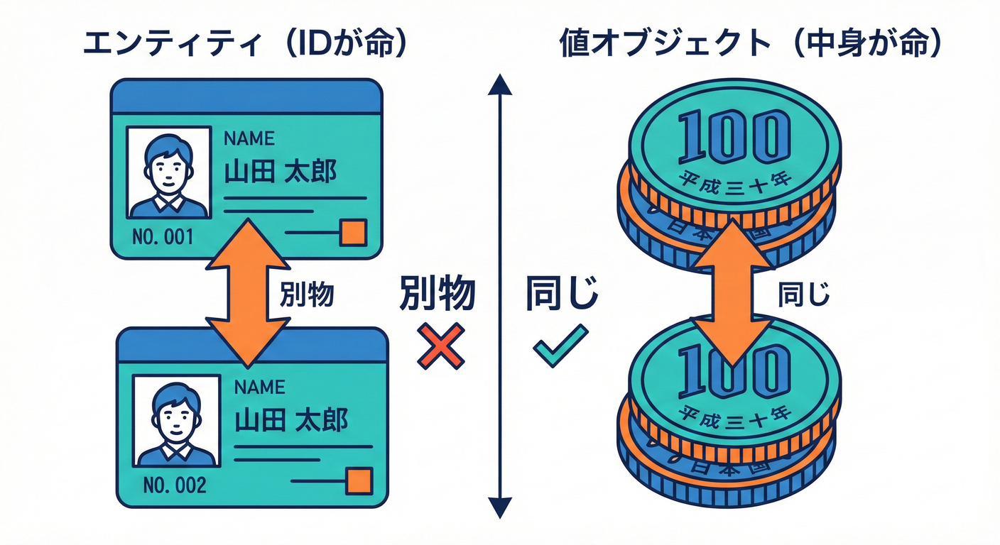
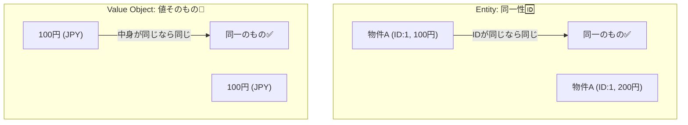
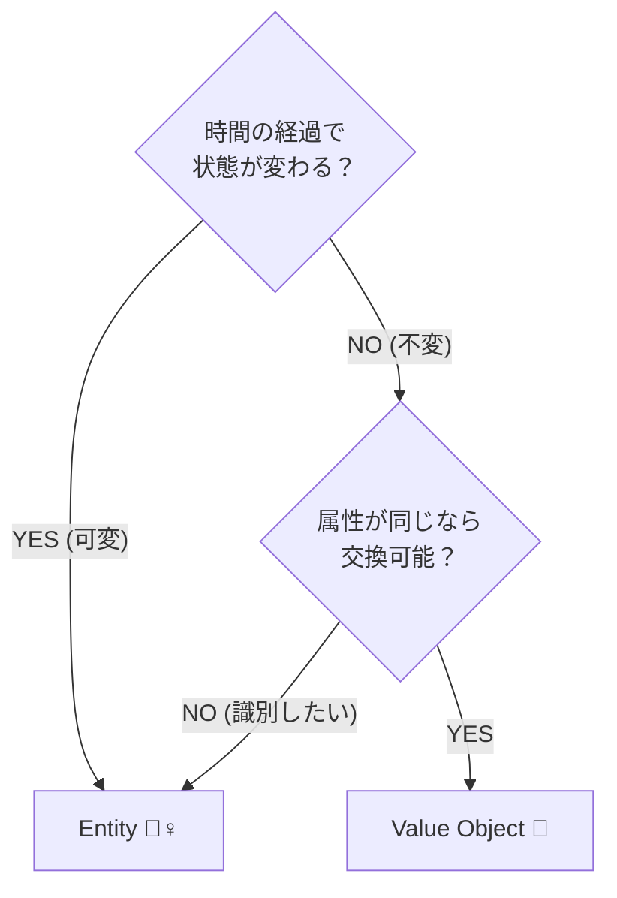
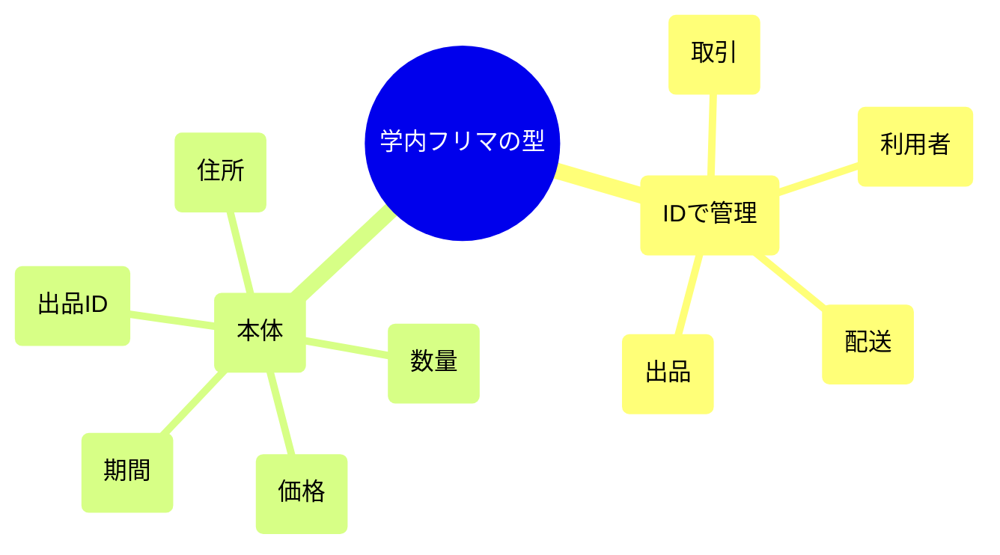

# 第34章 Entity / Value Object 入門（BC内の型づくり）💎🧱

## 34.1 今日のゴール🎯✨

この章が終わったら、こんなことができるようになるよ😊💖

* **Entity（エンティティ）** と **Value Object（値オブジェクト）** の違いを説明できる🧠💡
* 学内フリマ🛍️の例で「どれがEntity？どれがVO？」を見分けられる👀✨
* TypeScriptで **“プリミティブ地獄（string/numberだらけ）”** を減らす型を作れる🧯🔥
* まずは **作りすぎず**、でも **壊れにくい** 型にできる💪🌸

※ 2026/02/02 時点の TypeScript 安定版ラインは **5.9 系（npm latest は 5.9.3）** が確認できるよ。([npm][1])

---

## 34.2 まず結論：Entity と Value Object の見分け方📌🙂





### Entity（エンティティ）🧍‍♀️🧾

**「同一性（ID）で追いかけるもの」**だよ✨
状態（属性）が変わっても、**同じIDなら“同じもの”**。

* 例：出品（Listing）🛍️、取引（Trade）🤝、発送（Shipment）📦
* 同じ出品でも、**価格変更**や**状態遷移**（下書き→公開→終了）するよね🔁🚦
* 「同じかどうか」は **IDで決める**（中身が同じでも別IDなら別物）🆔✨

### Value Object（値オブジェクト）💎

**「値そのものが意味」**のものだよ✨
**中身（値）が同じなら“同じもの”**。

* 例：お金（Money）🪙、メールアドレス（Email）📧、期間（Period）📅、数量（Quantity）🔢
* できれば **不変（immutable）** にする（作ったら変えない）🧊✨
* 「同じかどうか」は **値の一致で決める**✅

---

## 34.3 1分でわかる「判定クイズ」🎮🧠



次の質問に **YES** が多い方で決めると迷いにくいよ😊✨

### Entityっぽい？🧍‍♀️

* これ、**時間が経つと状態が変わる**？⏳
* **履歴**が大事？（いつ価格変更した、いつ発送した…）📝
* 「同じもの」を **IDで追いたい**？🆔
  → YESが多いなら **Entity**！

### Value Objectっぽい？💎

* **値の組**が意味？（金額＋通貨、開始日＋終了日 など）🧩
* **値が同じなら同じ扱い**でOK？✅
* 変更するより **作り直す**ほうが自然？🔁
  → YESが多いなら **Value Object**！

---

## 34.4 学内フリマ🛍️で、Entity/VO を仕分けしてみよう📦✨



### Entity候補（IDで追う）🧍‍♀️🆔

* Listing（出品）🛍️
* Trade（取引）🤝
* Shipment（発送）📦
* User（※このBCの意味でのユーザー）👤

  * ただし「User」はBCごとに意味が違うから、**“このBCでのUser”**だけ考えるよ🙂✨

### Value Object候補（値が意味）💎

* Money（価格）🪙
* ListingId / TradeId / ShipmentId（IDそのものを “型” にする）🆔✨
* Quantity（数量）🔢
* Title（出品タイトル）🏷️
* Period（募集期間/発送可能期間）📅
* Address（住所）🏠（Shipping BCに閉じ込めるのが気持ちいいやつ💖）

> ポイント💡：**「ID」もVOにしてOK**だよ！
> “ただのstring” にすると、別のIDを間違って入れても気づけないからね😇🧯

---

## 34.5 TypeScriptでの作り方：まずは“軽い”やつから🍃✨

ここでは **3パターン**を紹介するよ😊
初心者ほど、①→②の順がおすすめ💕

---

## パターン①：VOを「type + 工場関数」で作る（かんたん）🧁✨

## ✅ Money（値オブジェクト）🪙

```ts
// money.ts
export type Currency = "JPY";

export type Money = Readonly<{
  amount: number;     // 例: 1200
  currency: Currency; // 例: "JPY"
}>;

export function Money(amount: number, currency: Currency = "JPY"): Money {
  if (!Number.isFinite(amount)) throw new Error("Money: amount must be finite");
  if (amount < 0) throw new Error("Money: amount must be >= 0");
  // JPYなら小数は使わない想定（例として丸めルールを固定）
  const normalized = Math.trunc(amount);
  return Object.freeze({ amount: normalized, currency });
}

export function moneyEquals(a: Money, b: Money): boolean {
  return a.amount === b.amount && a.currency === b.currency;
}

export function addMoney(a: Money, b: Money): Money {
  if (a.currency !== b.currency) throw new Error("Money: currency mismatch");
  return Money(a.amount + b.amount, a.currency);
}
```

💡 ここでやってること：

* **不正な値を入口で弾く**（NaN/無限/マイナス）🚫
* いったん作ったら **変更できない**（Readonly + freeze）🧊
* Money同士の計算は **Moneyの世界で完結**🪙✨

---

## パターン②：IDを「ブランド型」で作る（混ぜない）🆔🧷

「stringでもいいじゃん？」って思うけど、混ざると事故るよ😇⚠️
**ListingId と TradeId を取り違える**みたいなミスが、型で防げる✨

```ts
// id.ts
type Brand<T, B extends string> = T & { readonly __brand: B };

export type ListingId = Brand<string, "ListingId">;
export type TradeId   = Brand<string, "TradeId">;

export function ListingId(value: string): ListingId {
  if (!value) throw new Error("ListingId: empty");
  return value as ListingId;
}

export function TradeId(value: string): TradeId {
  if (!value) throw new Error("TradeId: empty");
  return value as TradeId;
}
```

💖 これだけで、

* `ListingId` を要求する関数に `TradeId` を渡せない
  が実現できるよ✨（地味に強い💪）

---

## パターン③：Entityを「状態 + ふるまい」で作る（入門版）🧍‍♀️🛍️

ここでは **Listing（出品）** を Entity として作ってみよう😊
Entityは **IDで同一性を持つ**のがポイント🆔✨

```ts
// listing.ts
import { ListingId } from "./id";
import { Money } from "./money";

export type ListingStatus = "draft" | "published" | "closed";

export type Listing = Readonly<{
  id: ListingId;          // 同一性🆔
  title: string;          // まずはstringでOK（後でVOにできるよ）
  price: Money;           // VO🪙
  status: ListingStatus;  // 状態🚦
}>;

export function createListing(params: {
  id: ListingId;
  title: string;
  price: Money;
}): Listing {
  if (!params.title.trim()) throw new Error("Listing: title required");
  return Object.freeze({
    id: params.id,
    title: params.title.trim(),
    price: params.price,
    status: "draft",
  });
}

// Entityは「変更」がある（ただし immutable に作り直すスタイルでもOK）
export function changePrice(listing: Listing, newPrice: Money): Listing {
  if (listing.status !== "draft") {
    throw new Error("Listing: price can be changed only in draft");
  }
  return Object.freeze({ ...listing, price: newPrice });
}

export function publish(listing: Listing): Listing {
  if (listing.status !== "draft") throw new Error("Listing: must be draft");
  return Object.freeze({ ...listing, status: "published" });
}

export function close(listing: Listing): Listing {
  if (listing.status === "closed") return listing;
  return Object.freeze({ ...listing, status: "closed" });
}

export function listingEquals(a: Listing, b: Listing): boolean {
  // Entityの同一性はIDで決める✨
  return a.id === b.id;
}
```

💡 ここでの“設計のコツ”：

* **Entityの equals は “中身” じゃなく “ID”**🆔✨
* VO（Money）を使うと、金額の扱いが「Moneyの流儀」に統一される🪙
* 状態遷移（draft→published→closed）は Entityで扱うと自然🚦🔁

---

## 34.6 ありがちな失敗パターン😇⚠️（そして回避法💖）

### 失敗①：全部 string / number で持つ🧟‍♀️

* `price: number` だと、**通貨**や**丸め**や**マイナス禁止**が散らばる💥
  ✅ 回避：Money VOに閉じ込める🪙✨

### 失敗②：Entityの同一性を「全フィールド一致」で判断する🌀

* priceが変わったら別物扱い…？ってなる😵
  ✅ 回避：Entityは **IDでequals**🆔

### 失敗③：VOを“なんでもかんでも”作りすぎる📦📦📦

* `Title`, `Description`, `Note`, `Memo`…増えすぎて疲れる😇
  ✅ 回避：**痛みが出たところからVO化**でOK（まずMoney/IDが鉄板）💪

---

## 34.7 ミニ演習（手を動かす）🧪✨

### 演習1：Money を拡張しよう🪙💖

* `subtractMoney(a, b)` を作ってみよう

  * 結果がマイナスになるときはエラーにする🚫
* `formatMoney(m)` を作って `"¥1,200"` みたいに表示（ざっくりでOK）💴✨

### 演習2：Listing に “タイトル変更” を追加しよう🏷️✍️

* `renameListing(listing, newTitle)` を追加
* ルール：

  * 空文字NG🚫
  * `published` 以降は変更NG🚫（例として）

### 演習3：「VOっぽいもの」を3つ選ぼう💎📝

学内フリマ🛍️の中から、VO候補を3つ決めて、

* 名前
* 中身（何の値の組？）
* 入口チェック（どんな不正値を弾く？）
  を書いてみよう😊✨

---

## 34.8 AI相棒🤖💖（Copilot/Codex向け）質問テンプレ

そのまま貼って使えるよ🧸✨

```text
学内フリマの Listing（出品）ドメインで、Value Object にすると事故が減りそうな概念を10個提案して。
それぞれ「中身のフィールド案」「入口で弾くべき不正値」「よくあるバグ例」も添えて。
```

```text
Money(Value Object) を TypeScript で実装したい。
条件：JPY、マイナス禁止、有限数のみ、加算/減算、equals、JSON化（toJSON）を用意。
最小構成でコードを書いて。
```

```text
Listing(Entity) の状態遷移(draft->published->closed) を壊しにくくしたい。
関数型スタイル（immutableに作り直す）で、ユースケース層から使いやすいAPI案を3つ出して。
```

---

## 34.9 まとめ🎀✨

* **Entity**＝IDで追うもの（同一性はID）🆔🧍‍♀️
* **Value Object**＝値が意味（同一性は値）💎✅
* まずは **Money** と **ID** をVO化すると、事故が一気に減る🪙🧷
* TypeScriptは 5.9 系でツール体験も改善されてる（`tsc --init`が整理される等）から、学習も進めやすいよ😊✨ ([devblogs.microsoft.com][2])

[1]: https://www.npmjs.com/package/typescript?utm_source=chatgpt.com "TypeScript"
[2]: https://devblogs.microsoft.com/typescript/announcing-typescript-5-9/?utm_source=chatgpt.com "Announcing TypeScript 5.9"
