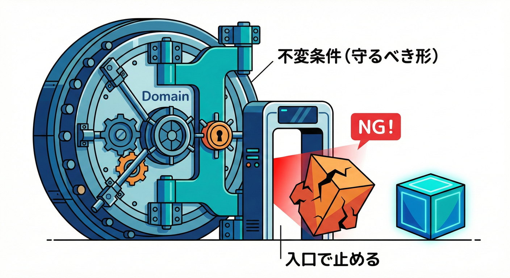
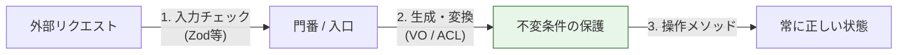
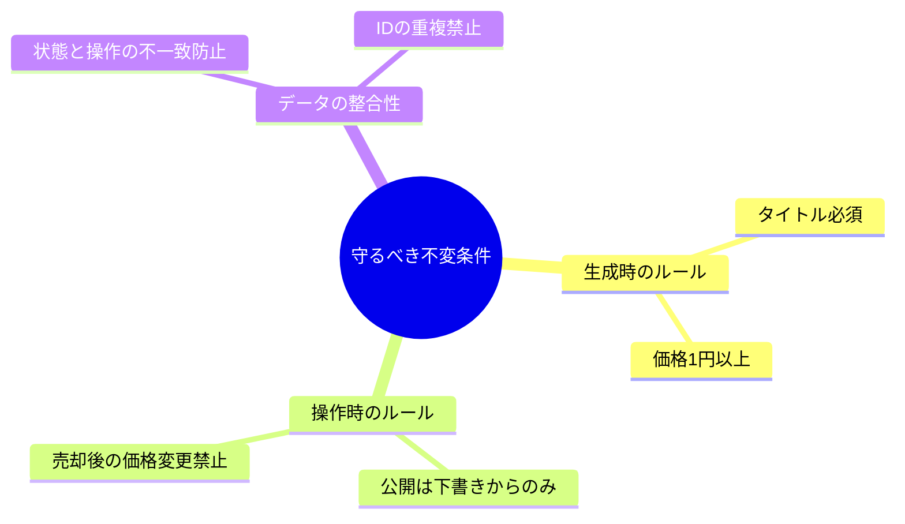
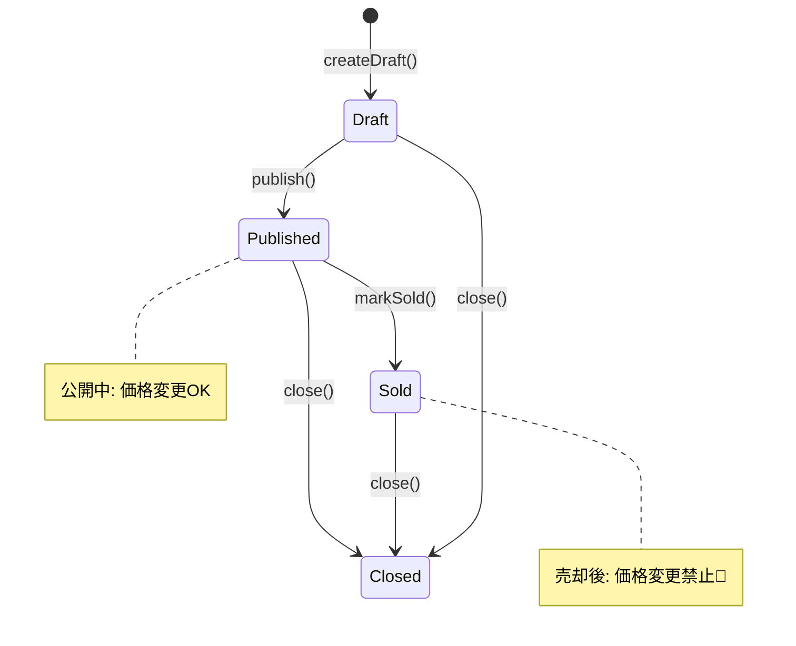

# 第35章 不変条件（Invariants）を入口で守る🔒🚪

## 0. 今日のゴール🎯✨

この章が終わったら、これができるようになるよ😊💡

* 「不変条件（Invariants）」が何か説明できる🧠✨
* 「入口（エントリポイント）」を意識して、壊れた状態を作らない設計にできる🚪🛡️
* 例題（学内フリマ🛍️）のBCで「守りたいルール」をコードに落とせる✍️💻
* AI相棒🤖にレビューさせて、抜け漏れを減らせる✅✨

---

## 1. 不変条件ってなに？🧱🔒



**不変条件（Invariant）**は、かんたんに言うと👇

> 「このBCの中では、いつでも必ず成り立っていてほしいルール」🛡️✨

たとえば学内フリマ🛍️の **出品（Listing）BC** なら…

* 価格は **0円以下にならない** 💰🚫
* タイトルは **空じゃない** 🏷️🚫
* 出品が「売却済み」なら **もう価格変更できない** 🔁🚫
* 「公開」するなら **必要な情報が揃っている** ✅📦

こういうのが「不変条件」だよ😊✨
ポイントは **“モデルの中を常に正しい状態に保つ”** ってこと🧼🧠

---

## 2. 「入力チェック」と不変条件は、似てるけど別もの🧪🆚🧱

混ざりやすいので、ここ超大事💡

### 入力チェック（バリデーション）🧪

* 画面入力やAPIリクエストみたいな **未知のデータ** を弾く🚫
* ここではスキーマバリデータ（例：Zod / Valibot）を使うことが多いよ📦✨

  * Zod 4 は「安定版」として公開されてるよ📌 ([Zod][1])
  * Valibot はTypeScript向けのスキーマライブラリとして案内されてるよ📌 ([valibot.dev][2])

### 不変条件（Invariants）🧱

* “モデルが存在する限り” ずっと守りたいルール🔒
* 入力チェックをすり抜けても、**モデル内部で絶対に壊れない** ようにする🛡️

つまり…

* 入力チェック：入口の「門番」🧍‍♀️🚪
* 不変条件：中に入ってからも「秩序を保つ法律」⚖️🏛️

両方いるよ😊✨

---

## 3. 「入口」ってどこ？🚪👀

不変条件は **“入口で守る”** のがコツだよ🔒✨


入口っていうのは、ざっくりこういう場所👇

* **生成の入口**：`create()` / `from()` / `new` 相当の場所🧸
* **更新の入口**：`changePrice()` / `publish()` みたいな「操作メソッド」🎮
* **ユースケースの入口**：`CreateListingUseCase` みたいなアプリ層の処理📩
* **境界の入口**：外部から来たDTOを内部モデルに変換する場所（ACL/変換）📦🧼

この章の合言葉はこれ👇

> 「壊れた状態を “作れない/入れない” ようにする」🔒🚫

---

## 4. よくある事故😱💥（これ、めっちゃ起きる）

### 事故パターンA：コンストラクタが自由すぎる🌀

* どこからでも `new Listing(...)` できる
* つまり、どこからでも壊せる😱

### 事故パターンB：プロパティが書き換え放題✏️💣

* `listing.price = -100;` みたいなのが通る
* “壊れた出品” がBC内に存在しちゃう😵

### 事故パターンC：「とりあえず any」🫠

* 一瞬ラクだけど、後で地獄👹
* 不変条件が崩壊しても気づけない…

---

## 5. 入口で守るための基本セット🧰✨

初心者〜中級なら、まずこの3点セットが強いよ💪😊

1. **Value Objectで小さく守る** 💎
2. **Entity/Aggregateのメソッドで守る** 🧱
3. **Result型で失敗を安全に返す** 🧾

このあと、ミニ実装で全部使うよ〜🛍️✨

---

## 6. ミニ実装：出品（Listing）BCで「壊れた出品」を封印する🛡️📦

### 6-1. Result型（成功/失敗を安全に表現）🧾✨

```ts
export type Result<T, E> =
  | { ok: true; value: T }
  | { ok: false; error: E };

export const ok = <T>(value: T): Result<T, never> => ({ ok: true, value });
export const err = <E>(error: E): Result<never, E> => ({ ok: false, error });
```

---

### 6-2. ドメインエラー（何がダメかを言えるように）🧯💬

```ts
export type DomainError =
  | { type: "invalid_title"; reason: string }
  | { type: "invalid_price"; reason: string }
  | { type: "invalid_status_transition"; reason: string }
  | { type: "invalid_operation"; reason: string };
```

---

### 6-3. Value Object：Title（タイトルは空NG＆長さ制限）🏷️🔒

```ts
import { Result, ok, err } from "./result";
import { DomainError } from "./errors";

export class Title {
  private constructor(private readonly value: string) {}

  static create(raw: string): Result<Title, DomainError> {
    const trimmed = raw.trim();
    if (trimmed.length === 0) {
      return err({ type: "invalid_title", reason: "タイトルが空っぽだよ🥺" });
    }
    if (trimmed.length > 80) {
      return err({ type: "invalid_title", reason: "タイトルは80文字までだよ📏" });
    }
    return ok(new Title(trimmed));
  }

  toString(): string {
    return this.value;
  }
}
```

---

### 6-4. Value Object：Money（価格は正の整数だけ）💰🔒

```ts
import { Result, ok, err } from "./result";
import { DomainError } from "./errors";

export class Money {
  private constructor(private readonly amount: number) {}

  static yen(amount: number): Result<Money, DomainError> {
    if (!Number.isInteger(amount)) {
      return err({ type: "invalid_price", reason: "価格は整数がいいよ🔢" });
    }
    if (amount <= 0) {
      return err({ type: "invalid_price", reason: "価格は1円以上だよ💴" });
    }
    if (amount > 1_000_000) {
      return err({ type: "invalid_price", reason: "高すぎるかも…上限を決めよう💦" });
    }
    return ok(new Money(amount));
  }

  get value(): number {
    return this.amount;
  }
}
```

---

### 6-5. Entity：Listing（状態と操作で不変条件を守る）🚦🧱

ここが「入口で守る」の本体だよ🔒✨

```ts
import { Result, ok, err } from "./result";
import { DomainError } from "./errors";
import { Title } from "./title";
import { Money } from "./money";

type ListingStatus = "draft" | "published" | "sold" | "closed";

export class Listing {
  private constructor(
    private readonly id: string,
    private title: Title,
    private price: Money,
    private status: ListingStatus
  ) {}

  // ✅ 生成の入口（ここ以外で new しない）
  static createDraft(params: {
    id: string;
    title: Title;
    price: Money;
  }): Listing {
    return new Listing(params.id, params.title, params.price, "draft");
  }

  // ✅ 更新の入口（メソッドでしか変えられない）
  changePrice(newPrice: Money): Result<void, DomainError> {
    if (this.status !== "draft" && this.status !== "published") {
      return err({
        type: "invalid_operation",
        reason: "売却済み/終了後は価格変更できないよ🚫",
      });
    }
    this.price = newPrice;
    return ok(undefined);
  }

  publish(): Result<void, DomainError> {
    if (this.status !== "draft") {
      return err({
        type: "invalid_status_transition",
        reason: "下書き以外は公開にできないよ🚦",
      });
    }
    // 👇 ここで「公開に必要な条件」を集中管理できる✨
    // （例：タイトル/価格がすでにVOで守られてるので安心）
    this.status = "published";
    return ok(undefined);
  }

  markSold(): Result<void, DomainError> {
    if (this.status !== "published") {
      return err({
        type: "invalid_status_transition",
        reason: "公開中だけが売却済みにできるよ🛍️➡️💳",
      });
    }
    this.status = "sold";
    return ok(undefined);
  }

  close(): Result<void, DomainError> {
    if (this.status === "closed") {
      return ok(undefined); // もう閉じてたらOK扱いでも良い（冪等っぽく）😊
    }
    if (this.status === "draft") {
      return err({
        type: "invalid_status_transition",
        reason: "下書きは閉じる前に公開するルールにしよう🚪",
      });
    }
    this.status = "closed";
    return ok(undefined);
  }

  snapshot() {
    return {
      id: this.id,
      title: this.title.toString(),
      priceYen: this.price.value,
      status: this.status,
    };
  }
}
```

ここで大事なのは👇✨

* **VOが入力の形を守る**（Title/Money）💎
* **Entityのメソッドが状態のルールを守る**（publish/markSoldなど）🚦
* 結果は **Resultで返す**（呼び出し側が安全に扱える）🧾✅

---

## 7. 演習：不変条件を5つ作って、入口に置こう✍️🧠✨

### ステップ1：ルール候補を出す📝

例（出品BC）👇



* タイトルは空NG
* 価格は1円以上
* 公開は下書きからだけ
* 売却済み後は価格変更NG
* 終了後は何も変更できない（または一部だけ）

### ステップ2：「いつでも必ず守りたい？」でふるい分け🧺

* **いつでも必ず守りたい** → 不変条件✅
* **画面だけの都合** → 入力チェック側🧪
* **他BCの事情** → ここに混ぜない（必要ならACL/統合側）🧼🔗

### ステップ3：どの入口で守るか決める🚪

* 生成時にしか決まらない → `create...()`
* 操作で変わる → `change...()` / `publish()`
* 外部入力の形 → DTO→VO変換やスキーマチェック

---

## 8. AI相棒🤖に頼むと強いプロンプト例✨

### 不変条件の洗い出し🧠📝

* 「出品（Listing）BCの不変条件を10個提案して。初心者向けに、理由も1行ずつつけて」🤖✨

### 抜け漏れレビュー👀✅

* 「このEntityのメソッドで破れる不変条件がないか探して。破れるなら再現手順も書いて」🕵️‍♀️🤖

### テスト生成🧪

* 「publish / markSold / changePrice の正常系・異常系テストを作って。Resultのエラー型も確認して」✅🧪🤖

---

## 9. チェックリスト✅✨（提出前にこれ見ると事故が減るよ）

* [ ] `new` を外から呼べない（生成の入口が1つ）🔒
* [ ] プロパティ直書き換えができない（更新はメソッドだけ）✏️🚫
* [ ] “壊れた状態” を表す値が型/VOで作れない💎
* [ ] 状態遷移（draft→published→sold…）がコードに明文化されてる🚦


* [ ] 失敗がResult/エラーで説明できる（黙って壊れない）🧾
など、AIと一緒に考えながら「守備範囲」を広げていこうね😊🧤


---

## 10. まとめ🎁✨

* 不変条件は「BCの中ではずっと守りたいルール」🔒🧱
* 入口（生成・更新・ユースケース・境界変換）で守ると強い🚪🛡️
* VO＋Entityメソッド＋Result型の3点セットが初心者に超おすすめ💎🧱🧾
* スキーマバリデーション（Zod/Valibot等）は「未知データの門番」として相性◎🧪🚪 ([Zod][1])
* TypeScriptの最新安定版ラインは npm 上で 5.9.3 が最新として掲載されているよ📌 ([npmjs.com][3])

[1]: https://zod.dev/v4?utm_source=chatgpt.com "Release notes"
[2]: https://valibot.dev/?utm_source=chatgpt.com "Valibot: The modular and type safe schema library"
[3]: https://www.npmjs.com/package/typescript?utm_source=chatgpt.com "TypeScript"
