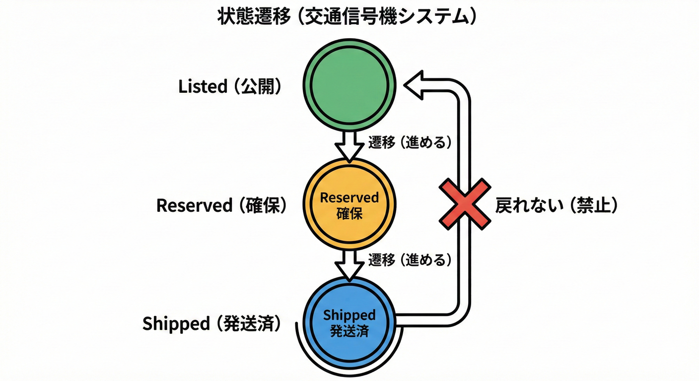
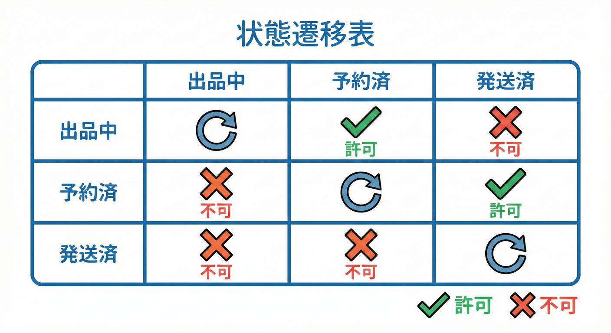
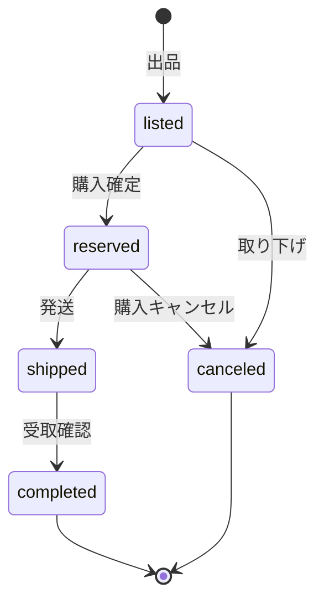
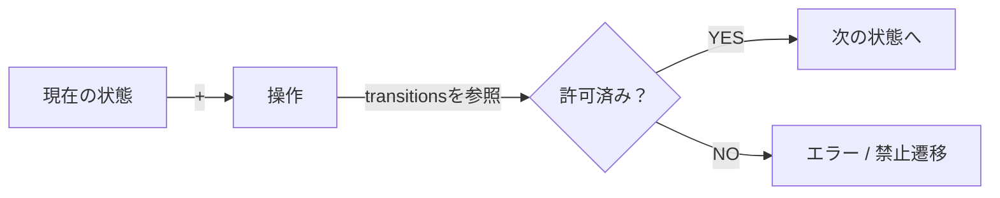
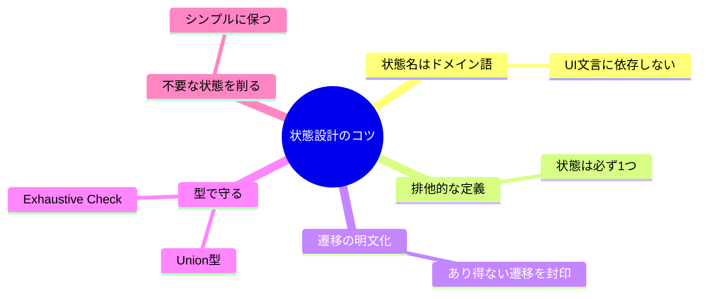

# 第36章 状態（ステータス）と遷移を明文化する🚦🔁

## 36.1 まず結論：状態と遷移を書けると、バグが激減する🛡️✨

アプリが壊れやすい原因の上位に「**いま何の状態なのか曖昧**」があります😵‍💫
たとえば「取引が完了したのに、まだ発送できちゃう」みたいな事故…あるあるだよね💥

そこでこの章は、**状態（status）** と **遷移（transition）** を先に“文字で”固定します📝
そのうえで **TypeScriptで破れにくくする**（= 間違った遷移を書きにくくする）ところまでやるよ🚀
※TypeScript公式でも「Union（合併型）」「絞り込み」「網羅チェック」みたいな考え方が、こういう“漏れ防止”に効くよって説明されてるよ📚✨ ([typescriptlang.org][1])

---



## 36.2 題材：取引（Trading）の状態を作ろう🛍️🤝

学内フリマの「取引」を、ざっくりこういう流れにするよ🌸

* 出品された📌
* 購入が確定した🧾
* 発送した📦
* 受け取り確認して完了🎉
  （途中キャンセルもある😢）

---

## 36.3 状態一覧を“短い単語”で決める🏷️✨

まずは状態（ステータス）の候補を並べるよ🧠💡
ここではシンプルにこの5つにするね👇

* `listed`：出品中📌
* `reserved`：購入者確保（取引中）🧾
* `shipped`：発送済み📦
* `completed`：取引完了🎉
* `canceled`：キャンセル😢

ポイントはこれ👇

* **状態名は「UIの文言」じゃなく「ドメインの意味」**に寄せる🧠
* **状態は“互いに排他的”**（同時に2つはダメ🙅‍♀️）

---

## 36.4 遷移表を作る📋🚦（これが最強の設計メモ）



次に「どの状態から、どの操作で、どこへ行けるか」を表にするよ📝✨
（この表があると、実装・テスト・レビューが一気にラクになる💪）

### ✅ 遷移表（例）

* `listed`

  * `reserve`（購入確定）→ `reserved`
  * `cancel`（出品取り下げ）→ `canceled`
* `reserved`

  * `ship`（発送）→ `shipped`
  * `cancel`（購入キャンセル）→ `canceled`
* `shipped`

  * `complete`（受け取り確認）→ `completed`
* `completed`

  * （何もできない）🧘‍♀️
* `canceled`

  * （何もできない）🧊

💡よくある“決め忘れ”チェック

* `shipped` から `cancel` できる？（返送・返金を扱うなら別状態が要るかも）
* `reserved` のまま放置されたら？（期限切れ→`listed`に戻す？別に`expired`作る？）⏳

> この章では「戻らない」設計でいくよ（初心者向けに事故を減らすため）🧸✨

---

## 36.5 状態遷移図（文字でOK）🗺️📌

手描きでも、文字でもOK🙆‍♀️
最小はこれで十分だよ👇

```text
listed ── reserve ──▶ reserved ── ship ──▶ shipped ── complete ──▶ completed
   │                      │
   └── cancel ───────────▶└── cancel ───────────────▶ canceled
```



---

## 36.6 TypeScriptで「間違った遷移」を書きにくくする🧩🔒

### 方式A：まずは“statusだけ”を守る（最小で強い）💪

状態を **文字列Union** にして、遷移を **表（map）** で固定するよ🗂️✨
（このやり方、初心者でも扱いやすい😊）

```ts
// 1) 状態（status）をUnionで固定する
export type TradeStatus =
  | "listed"
  | "reserved"
  | "shipped"
  | "completed"
  | "canceled";

// 2) コマンド（操作）も固定する
export type TradeCommandType =
  | "reserve"
  | "ship"
  | "complete"
  | "cancel";

// 3) 遷移表を「データ」として固定する（ルールが見える！）
export const transitions = {
  listed:   { reserve: "reserved", cancel: "canceled" },
  reserved: { ship: "shipped",     cancel: "canceled" },
  shipped:  { complete: "completed" },
  completed:{},
  canceled: {},
} as const;
```



ここでさらに一段強くするなら、`satisfies` を使って
「変なキーを書いたらエラー」にできるよ🧠✨（TypeScript公式でも紹介されてる書き方だよ） ([typescriptlang.org][2])

```ts
type TransitionTable = {
  [S in TradeStatus]: Partial<Record<TradeCommandType, TradeStatus>>;
};

export const transitions2 = {
  listed:   { reserve: "reserved", cancel: "canceled" },
  reserved: { ship: "shipped",     cancel: "canceled" },
  shipped:  { complete: "completed" },
  completed:{},
  canceled: {},
} as const satisfies TransitionTable;
```

`satisfies` の良いところ👇

* 「型チェックはする」
* でも「値の型（狭い型）」はなるべく保つ✨
  この性質が“設定表”みたいなデータにめちゃくちゃ相性いいよ🧸💖 ([typescriptlang.org][2])

---

### 方式B：状態ごとに型を分けて「あり得ないデータ」を持てなくする🧠🧱

次は一段レベルアップ🌈
状態によって「持っていい情報」が変わるなら、**状態ごとに型を分ける**のが強いよ💪✨

例：`reserved` だけが `buyerId` を持つ、みたいな感じ👇

```ts
type TradeId = string;
type UserId = string;

type ListedTrade = {
  id: TradeId;
  status: "listed";
  itemId: string;
};

type ReservedTrade = {
  id: TradeId;
  status: "reserved";
  itemId: string;
  buyerId: UserId;       // ★ reserved になったら必須
  reservedAt: Date;      // ★ reserved になったら必須
};

type ShippedTrade = {
  id: TradeId;
  status: "shipped";
  itemId: string;
  buyerId: UserId;
  shippedAt: Date;       // ★ shipped になったら必須
};

type CompletedTrade = {
  id: TradeId;
  status: "completed";
  itemId: string;
  buyerId: UserId;
  completedAt: Date;
};

type CanceledTrade = {
  id: TradeId;
  status: "canceled";
  itemId: string;
  canceledAt: Date;
  reason?: string;
};

export type Trade =
  | ListedTrade
  | ReservedTrade
  | ShippedTrade
  | CompletedTrade
  | CanceledTrade;
```

この形にすると嬉しいこと👇🎁

* `listed` のときに `buyerId` をうっかり参照…ができなくなる🙅‍♀️
* 「今この状態なら必ずある」は **型で保証**できる✅
* “状態ごとのバリデーション”も書きやすい✨

---

## 36.7 網羅チェック（exhaustive check）で「処理漏れ」を潰す✅💥

状態やコマンドが増えたときに怖いのが「switchの書き忘れ」😱
そこで **`never` を使った網羅チェック**が効くよ🧯✨
TypeScript公式Handbookでも、`assertNever` 的なやり方が紹介されてるよ📚 ([typescriptlang.org][3])

```ts
function assertNever(x: never): never {
  throw new Error("Unexpected value: " + x);
}

type Status = "listed" | "reserved" | "shipped";

function label(status: Status): string {
  switch (status) {
    case "listed":
      return "出品中";
    case "reserved":
      return "取引中";
    case "shipped":
      return "発送済み";
    default:
      return assertNever(status); // ★ ここが漏れ検知ポイント
  }
}
```

もし `Status` に `"completed"` を追加したのに `switch` に書かなかったら、ここでコンパイルエラーになって助かるよ🧸✨

---

## 36.8 ありがちな落とし穴トップ5😵‍💫⚠️

5. **例外を握りつぶす**（禁止遷移はログに残して気づけるようにする📌）



---

## 36.9 ミニ演習🎮✍️（15〜25分）

### 演習1：状態を1つ増やしてみよう➕🧩

`reserved` の放置対策で `expired`（期限切れ）を追加したい！⏳
次をやってね👇

* 状態一覧に `expired` を追加
* 遷移表に「`reserved` → `expired`」を追加（操作名は `expire`）
* `expired` からは何もできない（今回は固定🧊）

✅ゴール：**“型と遷移表”がズレない状態**でコンパイルが通ること✨

---

### 演習2：状態ごとに「持つべき情報」を増やす🧺✨

`shipped` になったら `trackingNumber`（追跡番号）を必須にしたい📦🔎
方式Bの型分けで、`ShippedTrade` に `trackingNumber: string` を追加してみよう！

✅ゴール：`trackingNumber` が無い `shipped` を作れないようにする🛡️

---

## 36.10 AIに頼るときの質問テンプレ🤖💬

（そのまま貼ってOKだよ✨）

1. 遷移表づくり

* 「この状態一覧と操作一覧から、禁止遷移が起きにくい遷移表を提案して。例外ケースも3つ挙げて。」

2. TypeScript型の生成

* 「この遷移表をもとに、discriminated unionで `Trade` 型（状態ごとの必須プロパティ付き）を提案して。」

3. 網羅チェックの確認

* 「この `switch` 文に網羅チェック（never）を入れて、漏れたときにコンパイルエラーになる形に直して。」

---

## 36.11 まとめ🎁✨

* **状態（status）** は「いま何のフェーズか」🚦
* **遷移（transition）** は「どの操作で、どこへ進めるか」🔁
* まずは **状態一覧 → 遷移表 → 遷移図（文字）** の順に固める📝
* TypeScriptでは **Union・絞り込み・網羅チェック（never）** が“漏れ防止”に効く💪✨ ([typescriptlang.org][1])

[1]: https://www.typescriptlang.org/docs/handbook/2/narrowing.html?utm_source=chatgpt.com "Documentation - Narrowing"
[2]: https://www.typescriptlang.org/docs/handbook/release-notes/typescript-4-9.html?utm_source=chatgpt.com "Documentation - TypeScript 4.9"
[3]: https://www.typescriptlang.org/docs/handbook/unions-and-intersections.html?utm_source=chatgpt.com "Handbook - Unions and Intersection Types"
