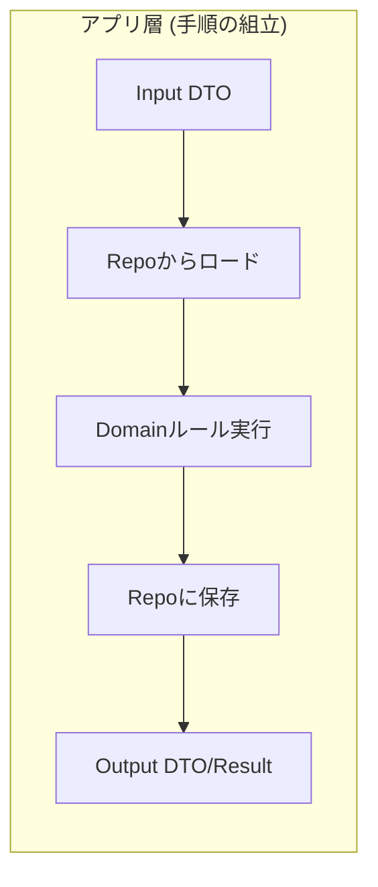
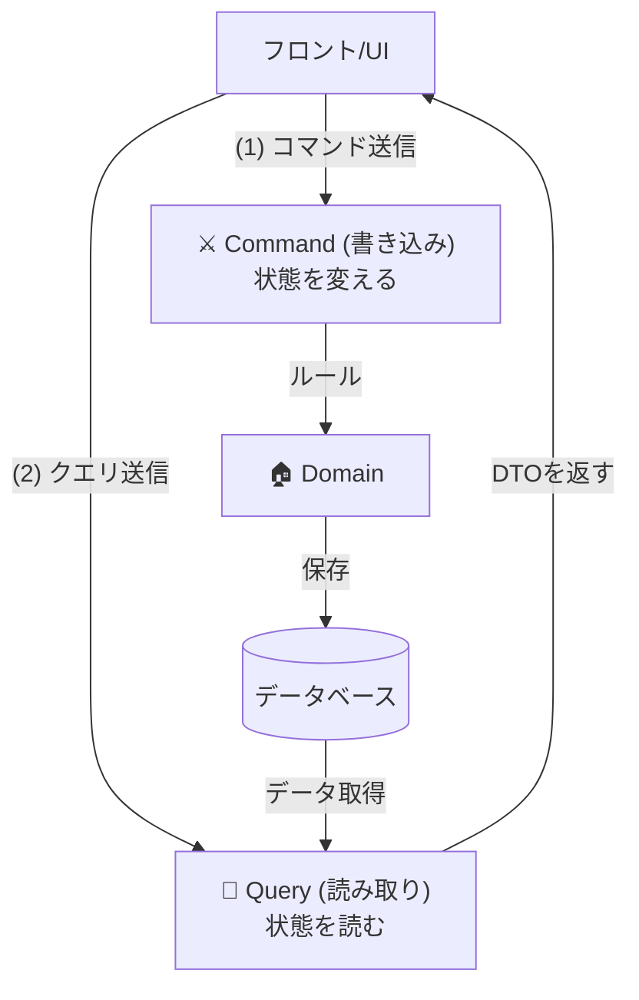
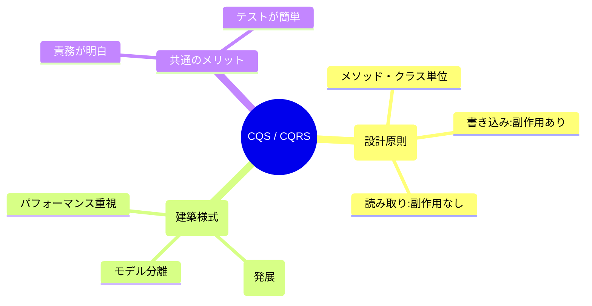

# 第37章 ユースケース（アプリ層）とCQS（読み/書き）🎮📚

## この章でできるようになること🎯✨

* 「ユースケース（アプリ層）」って何？を、コードの置き場所までイメージできる🧠📁
* “読み取り” と “書き込み” を分ける **CQS** を、迷わず使えるようになる🔎✍️
* ミニアプリ（学内フリマ🛍️）の例で、**出品する / 購入する** ユースケースを作れるようになる🚀

---


## 37.1 ユースケース（アプリ層）ってなに？🧩🏗️

ユースケースは、ざっくり言うと **「アプリがユーザーに提供する“操作メニュー”」** だよ🍔✨
たとえば学内フリマなら…

* 出品する🛍️
* 購入する🧾
* 取引状況を確認する👀
* 配送先を登録する📦

こういう “やりたいこと” を **1つずつ形にする場所** がユースケース（アプリ層）だよ😊

## アプリ層がやること（超重要🌟）

アプリ層は、ドメイン（BC内のルール）を使って **手続きを組み立てる** 係だよ🧑‍🍳

* 入力を受け取る（画面/APIなどから）🧾
* 必要なデータを取りに行く（Repositoryなど）📦
* ドメインのルールを実行する（Entity/VOのメソッドを呼ぶ）💎
* 保存する💾
* 結果を返す（DTO/Result）🎁

✅ **アプリ層の合言葉**：
**「ルールはドメイン、手順はユースケース」** 🫶✨



---

## 37.2 CQS（Command-Query Separation）ってなに？🌓✨

CQSは **“読み取り” と “書き込み” を分けようね** っていう設計ルールだよ📏😊
**Command（コマンド）** と **Query（クエリ）** を分けるのがポイント！



* **Command**：状態を変える（書き込み）✍️🔥

  * 例：購入する / 出品する / キャンセルする
* **Query**：状態を読むだけ（読み取り）🔎📚

  * 例：取引一覧を見る / 出品詳細を見る

CQSの定義として「1つのメソッドは“更新”か“参照”のどちらかにしよう」が有名だよ。([martinfowler.com][1])

## なんで分けるの？（嬉しいこと3つ🎁）

1. **読むコードが安心**：Queryは読んでも状態が変わらないから怖くない😌📖
2. **テストが楽**：Commandは「変化した？」、Queryは「返り値合ってる？」で分かれる🧪✨
3. **設計がスッキリ**：「この処理どっち？」って迷いが減る🧠🧼

---

## 37.3 CQS と CQRS の違い（混乱しがち⚠️）🌀

* **CQS**：メソッド/ユースケースを「読み・書き」に分ける **設計ルール** 🧩
* **CQRS**：読みモデル・書きモデルを分けてスケールさせる **アーキテクチャ寄り** 🏢

この章は **CQS** をまず丁寧にやるよ😊（CQRSは“やろうと思えば後で拡張できる”くらいの距離感でOK）([arnaudlanglade.com][2])



---

## 37.4 “ユースケース” を CQS で切るコツ✂️🧠

## ① まず「動詞」でユースケース名を作る📝✨

* ✅ 出品する
* ✅ 購入する
* ✅ 取引をキャンセルする
* ✅ 取引状況を取得する（←これは Query）

動詞が入ると、役割がハッキリするよ😊

## ② Command は「〜する」、Query は「〜を取得する/一覧を出す」💡

名前だけで **読み/書きが一発で分かる** のが理想🎯

## ③ Command は “結果” を返すとしても最小限🎁

CQSの原理は「Commandは値を返さない」が基本だけど、実務では

* 「作ったID」
* 「成功/失敗」
  くらいは返してOKにすると使いやすいよ🙆‍♀️✨
  （返す内容は **“観測用の最小セット”** にしよう🧸）

---

## 37.5 フォルダ構成（CQSが迷子にならない形📁🧭）

例：Trading（取引）BC の中を、アプリ層で CQS 分離するイメージ👇

```text
src/
  contexts/
    trading/
      domain/
        Trade.ts
        TradeStatus.ts
        errors.ts
      application/
        commands/
          PurchaseItem.ts
        queries/
          GetTradeSummary.ts
      infra/
        InMemoryTradeRepository.ts
      index.ts   // 公開API（前の章の入口🚪）
```

* `domain/`：ルールの中心（Entity/VO/状態遷移）💎
* `application/commands/`：状態を変えるユースケース✍️
* `application/queries/`：読むだけのユースケース🔎
* `infra/`：保存や外部I/O（ここでは仮実装）📦

---

## 37.6 実装してみよう：購入する（Command）🛒✍️✨

ここからは **「購入する」** を Command として作るよ😊
※コードは “教材用にシンプル” にしてあるよ🧸

## 37.6.1 domain：状態とルール（超ミニ版🚦）

```ts
// file: src/contexts/trading/domain/TradeStatus.ts
export type TradeStatus = "draft" | "purchased" | "cancelled";
```

```ts
// file: src/contexts/trading/domain/errors.ts
export class DomainError extends Error {}

export class AlreadyPurchasedError extends DomainError {
  constructor() {
    super("すでに購入済みだよ😵‍💫");
  }
}

export class CancelledTradeError extends DomainError {
  constructor() {
    super("キャンセル済みの取引は変更できないよ🙅‍♀️");
  }
}
```

```ts
// file: src/contexts/trading/domain/Trade.ts
import { TradeStatus } from "./TradeStatus";
import { AlreadyPurchasedError, CancelledTradeError } from "./errors";

export type TradeId = string;

export class Trade {
  private constructor(
    public readonly id: TradeId,
    public readonly listingId: string,
    public readonly buyerId: string | null,
    public readonly status: TradeStatus,
  ) {}

  static startDraft(id: TradeId, listingId: string): Trade {
    return new Trade(id, listingId, null, "draft");
  }

  purchase(buyerId: string): Trade {
    if (this.status === "purchased") throw new AlreadyPurchasedError();
    if (this.status === "cancelled") throw new CancelledTradeError();

    // ここに「購入者は出品者と同一禁止」などの不変条件が来るイメージ🔒
    return new Trade(this.id, this.listingId, buyerId, "purchased");
  }
}
```

ポイント🌟

* `purchase()` は **状態を変える**（＝Command向き）
* ルール違反は domain が止める🛡️

---

## 37.6.2 application：Command（PurchaseItem）を書く✍️

Commandは「入力→ロード→ドメイン実行→保存」って流れになりやすいよ🧑‍🍳✨

```ts
// file: src/contexts/trading/application/commands/PurchaseItem.ts
import { Trade, TradeId } from "../../domain/Trade";

export type PurchaseItemCommand = {
  tradeId: TradeId;
  listingId: string;
  buyerId: string;
};

export type PurchaseItemResult =
  | { ok: true; tradeId: TradeId }
  | { ok: false; reason: string };

export interface TradeRepository {
  findById(id: TradeId): Promise<Trade | null>;
  save(trade: Trade): Promise<void>;
}

export class PurchaseItemHandler {
  constructor(private readonly repo: TradeRepository) {}

  async handle(cmd: PurchaseItemCommand): Promise<PurchaseItemResult> {
    // 1) 取引をロード（無ければ下書きから開始）🧾
    const existing = await this.repo.findById(cmd.tradeId);
    const trade = existing ?? Trade.startDraft(cmd.tradeId, cmd.listingId);

    // 2) ドメインルール実行（状態変更）🚦
    try {
      const purchased = trade.purchase(cmd.buyerId);

      // 3) 保存💾
      await this.repo.save(purchased);

      // 4) 最小限の結果を返す🎁
      return { ok: true, tradeId: purchased.id };
    } catch (e) {
      if (e instanceof Error) return { ok: false, reason: e.message };
      return { ok: false, reason: "不明なエラーだよ🥲" };
    }
  }
}
```

✅ ここで CQS が効いてるところ

* `handle()` は **書き込みユースケース**（Command）
* 「取引の要約を返す」みたいな **読み取り責務は持たない** 🙅‍♀️

---

## 37.6.3 infra：Repositoryの仮実装（インメモリ🧸）

```ts
// file: src/contexts/trading/infra/InMemoryTradeRepository.ts
import { Trade, TradeId } from "../domain/Trade";
import { TradeRepository } from "../application/commands/PurchaseItem";

export class InMemoryTradeRepository implements TradeRepository {
  private store = new Map<TradeId, Trade>();

  async findById(id: TradeId): Promise<Trade | null> {
    return this.store.get(id) ?? null;
  }

  async save(trade: Trade): Promise<void> {
    this.store.set(trade.id, trade);
  }
}
```

---

## 37.7 実装してみよう：取引状況を取得する（Query）🔎📚✨

次は Query！
**読むだけ** だから、状態変更メソッド（`purchase()`とか）は呼ばないよ🙅‍♀️

```ts
// file: src/contexts/trading/application/queries/GetTradeSummary.ts
import { Trade, TradeId } from "../../domain/Trade";

export type GetTradeSummaryQuery = {
  tradeId: TradeId;
};

export type TradeSummaryDto = {
  tradeId: TradeId;
  listingId: string;
  buyerId: string | null;
  status: string;
};

export interface TradeReadRepository {
  findById(id: TradeId): Promise<Trade | null>;
}

export class GetTradeSummaryHandler {
  constructor(private readonly repo: TradeReadRepository) {}

  async handle(q: GetTradeSummaryQuery): Promise<TradeSummaryDto | null> {
    const trade = await this.repo.findById(q.tradeId);
    if (!trade) return null;

    // DTOにして返す（読み取り専用の運搬用📦）
    return {
      tradeId: trade.id,
      listingId: trade.listingId,
      buyerId: trade.buyerId,
      status: trade.status,
    };
  }
}
```

✅ Query は “観測だけ” 👀

* Query側で `purchase()` を呼ぶのはNG（読み取りなのに状態が変わるから）❌
* 返り値は **DTO（ただのオブジェクト）** が扱いやすいよ📦✨

---

## 37.8 動かしてみるミニ実験🧪🎉

```ts
// file: src/contexts/trading/demo.ts
import { InMemoryTradeRepository } from "./infra/InMemoryTradeRepository";
import { PurchaseItemHandler } from "./application/commands/PurchaseItem";
import { GetTradeSummaryHandler } from "./application/queries/GetTradeSummary";

async function main() {
  const repo = new InMemoryTradeRepository();

  const purchase = new PurchaseItemHandler(repo);
  const getSummary = new GetTradeSummaryHandler(repo);

  const tradeId = "T-001";
  const listingId = "L-777";
  const buyerId = "U-123";

  console.log(await getSummary.handle({ tradeId })); // null（まだ無い）👀

  console.log(await purchase.handle({ tradeId, listingId, buyerId })); // 購入✍️

  console.log(await getSummary.handle({ tradeId })); // purchased ✅
}

main().catch(console.error);
```

---

## 37.9 よくあるミス集（ここで事故る🚑💥）

## ミス1：Commandで “ついでに一覧も返す” 🌀

* 例：「購入する」の結果で、取引の詳細DTOも全部返しちゃう
  → 便利そうだけど、**責務が肥大化** しやすいよ😵‍💫
  ✅ まずは「tradeId返す」で我慢が安全🍵

## ミス2：Queryで domain の状態変更メソッドを呼ぶ😱

* Queryは「見たいだけ」なのに、いつの間にか状態が変わってバグる💥
  ✅ Queryは **DTOを作るだけ** を意識しよう🧸

## ミス3：アプリ層にルールを書き始める🧨

* `if (status !== "draft") throw ...` がアプリ層に増殖
  ✅ ルールは domain に寄せる（第35〜36章の流れだね🔒🚦）

---

## 37.10 ミニ演習（手を動かすよ💪✨）📝

## 演習A：キャンセルする（Command）❌✍️

* `Trade.cancel()` を domain に追加（状態遷移は第36章の考え方で！🚦）
* `CancelTradeHandler` を `application/commands/` に作る
* 成功したら `{ ok: true }` くらいの最小で返す🎁

## 演習B：自分の購入一覧を出す（Query）📚🔎

* `ListMyPurchasesHandler` を `application/queries/` に作る
* 返り値は `PurchaseListItemDto[]`（DTO配列）にする📦✨

## 演習C：テストの形を揃える🧪

* Commandは「状態が変わった？」を見る
* Queryは「返り値が合ってる？」を見る
  （テストが自然に分かれるのがCQSの気持ちよさだよ😊）

---

## 37.11 AI相棒への質問テンプレ🤖💬（コピペOK✨）

* 「この処理、CommandとQueryどっち？理由も1行で！」🌓
* 「今のCommandがやりすぎてる点を3つ指摘して、分割案を出して！」✂️
* 「Queryで副作用が起きないように、危険ポイントをレビューして！」👀⚠️
* 「DTOのフィールド候補を出して。不要そうなものも一緒に挙げて！」📦✂️

---

## 37.12 まとめチェック✅✨

* [ ] ユースケースは「手順」を持つ（ルールはdomain）🧑‍🍳💎
* [ ] Command（書く）と Query（読む）を分けた🌓
* [ ] Queryが状態を変えてない（副作用なし）🔎🚫
* [ ] 返り値はDTO/Resultでスッキリ📦🎁

---

## 参考（最新のバージョン感の確認用📌）

TypeScript の npm 上の最新版表示や、公式のインストール案内では 5.9 系が “latest / currently” として扱われているよ。([npm][3])
TypeScript 5.9 の変更点は公式リリースノートにもまとまってるよ。([typescriptlang.org][4])

[1]: https://martinfowler.com/bliki/CommandQuerySeparation.html?utm_source=chatgpt.com "Command Query Separation"
[2]: https://www.arnaudlanglade.com/difference-between-cqs-and-cqrs-patterns/?utm_source=chatgpt.com "What is the difference between CQS and CQRS patterns?"
[3]: https://www.npmjs.com/package/typescript?utm_source=chatgpt.com "TypeScript"
[4]: https://www.typescriptlang.org/docs/handbook/release-notes/typescript-5-9.html?utm_source=chatgpt.com "Documentation - TypeScript 5.9"
