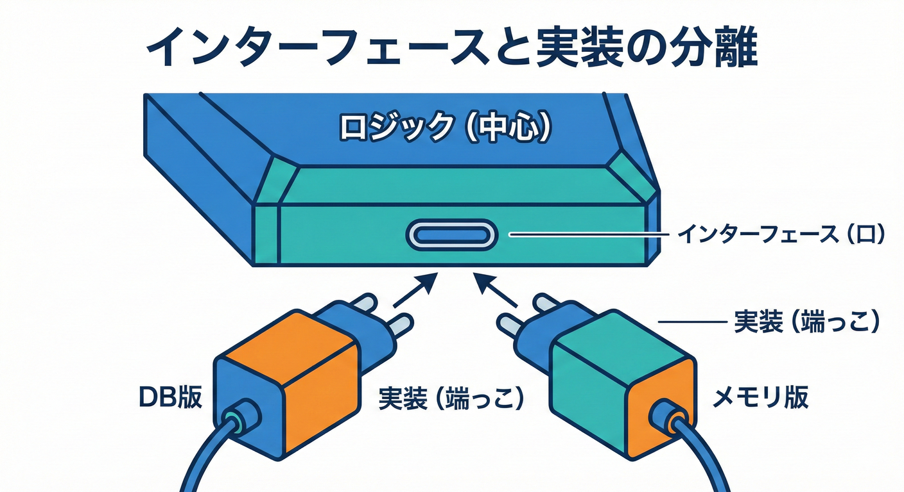
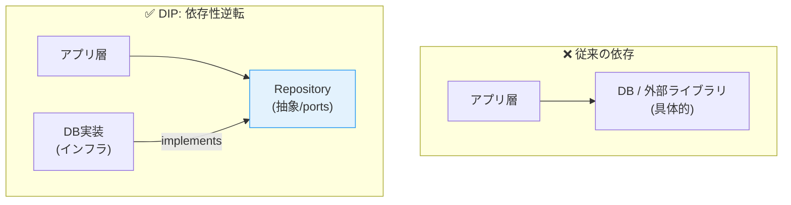
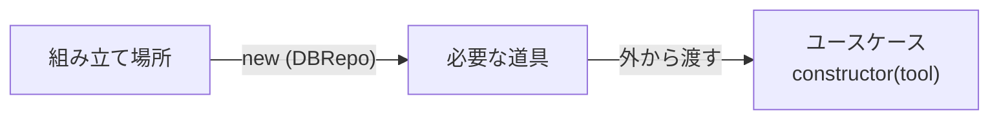
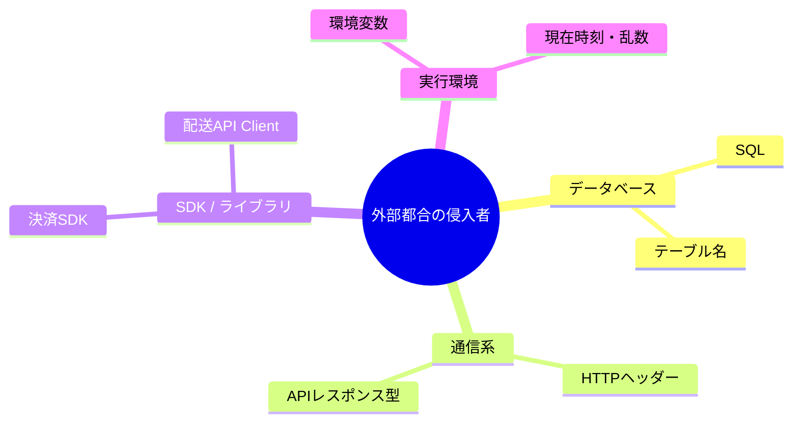
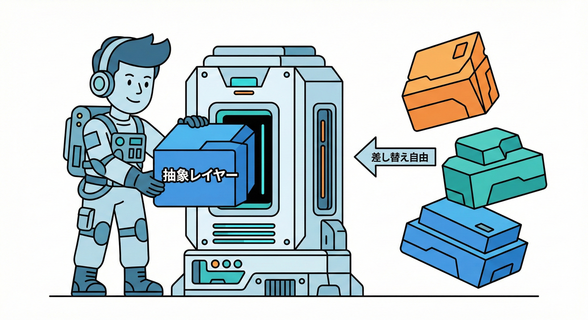

# 第38章 DIP/DIの超ミニ：外部都合をBCに入れない🛡️🔌

## 0. この章でできるようになること🎯✨

* 「BCの中にDB/HTTPの都合を混ぜない」ってどういうことか、感覚で説明できる😊
* Repositoryなどの“口（インターフェース）”を作って、BCを守れる🧱🚪
* DI（依存性注入）で、実装（DB版/メモリ版）を差し替えできるようになる🔁🧪

---

## 1. まず超ざっくり：DIPとDIってなに？🧸💡



### DIP（依存性逆転の原則）➡️🔄

**結論：大事なロジック（アプリの中心）が、細かい実装（DBやHTTP）に引きずられないようにするルール**だよ🛡️✨

* 🙆‍♀️OK例：ユースケースは「保存できる何か（Repository）」にだけ頼る
  → 実際に保存するのがDBでもメモリでも後から選べる🎁✨



### DI（依存性注入）💉🔌

**結論：ユースケースが必要な“道具（依存物）”を外から渡してあげるやり方**だよ😊

* 代表は「コンストラクタで渡す」やつ（超よく使う！）🧩



---

## 2. “外部都合”ってどれ？（BCに入れたくないやつ）🚫🌪️

BCの中心（モデル/ユースケース）に混ざりやすい外部都合は、だいたいこれ👇

* DB（SQL/ORM/接続/テーブル名）🗄️
* HTTP（URL/ヘッダー/ステータスコード）🌐
* 外部サービスSDK（決済SDK、配送APIのクセ）📦
* 環境変数、時刻、乱数、ファイルI/O ⏰🎲📁

こういうのは **“端っこ（インフラ層）”** に寄せて、中心はきれいに保つ🧼✨
そのために使うのが **DIP/DI** だよ🛡️🔌



---

## 3. ミニ例題：Trading BCで「取引を確定する」🛍️💳📦

ここでは Trading（取引）BC に、こんなユースケースがあるとするね👇

* 購入者が購入ボタンを押す🖱️
* 取引を「確定」状態にする✅
* 取引を保存する💾

このとき、BCの中心が「DBに保存する方法」を知らなくてOKにしたい🙆‍♀️
だから **Repository（保存口）を“抽象”として置く**よ📦✨

---

## 4. 形の全体像（図：文章で）🗺️➡️

イメージはこれ👇

* ユースケース（中心）🎯
  ↓ 依存するのは **Repositoryという“約束”** だけ📜
* Repositoryの実装（端っこ）🧰

  * DB版🗄️
  * メモリ版🧪

つまり、

> 中心 👉「保存してね（お願い）」
> 端っこ 👉「了解！（DBに保存 / メモリに保存）」

って分担になるよ😊✨



---

## 5. 実装してみよう：最小のDIP/DIセット🧩🔧

### 5-1. フォルダの置き方（例）📁✨

（※これは“よくある置き方”の一例だよ）

* contexts/trading/

  * domain/（エンティティやVO）💎
  * application/（ユースケース）🎮
  * ports/（外部にお願いする“口”＝抽象）🚪
  * infra/（DBやHTTPなどの実装）🧰

---

### 5-2. domain：取引エンティティ（超ミニ）🧱🛍️

```ts
// contexts/trading/domain/trade.ts
export type TradeId = string;

export type TradeStatus = "pending" | "confirmed";

export type Trade = Readonly<{
  id: TradeId;
  itemId: string;
  buyerId: string;
  status: TradeStatus;
}>;

export function confirmTrade(trade: Trade): Trade {
  if (trade.status === "confirmed") return trade;
  return { ...trade, status: "confirmed" };
}
```

---

### 5-3. ports：Repositoryという“約束”を作る📜🚪

ここがポイント！
**BCの中心が欲しいのは「どう保存するか」じゃなくて「保存できること」**😊✨

```ts
// contexts/trading/ports/tradeRepository.ts
import type { Trade, TradeId } from "../domain/trade";

export interface TradeRepository {
  findById(id: TradeId): Promise<Trade | null>;
  save(trade: Trade): Promise<void>;
}
```

* interface（約束）を **BCの中（ports）** に置くのがコツ🧠✨
* こうするとユースケースは infra を知らなくて済む🛡️

---

### 5-4. application：ユースケースは“約束”だけ見て書く🎮✅

```ts
// contexts/trading/application/confirmTradeUseCase.ts
import { confirmTrade } from "../domain/trade";
import type { TradeId } from "../domain/trade";
import type { TradeRepository } from "../ports/tradeRepository";

export class ConfirmTradeUseCase {
  constructor(private readonly repo: TradeRepository) {}

  async execute(tradeId: TradeId): Promise<void> {
    const trade = await this.repo.findById(tradeId);
    if (!trade) throw new Error("取引が見つからないよ😢");

    const confirmed = confirmTrade(trade);
    await this.repo.save(confirmed);
  }
}
```

✅ ここにはDBの話が一切出てこない！
これが「外部都合をBCに入れない」ってことだよ🧼✨

---

### 5-5. infra：実装は“端っこ”で作る🧰🗄️

まずは分かりやすい **メモリ版**（テストにも便利）🧪💖

```ts
// contexts/trading/infra/inMemoryTradeRepository.ts
import type { TradeRepository } from "../ports/tradeRepository";
import type { Trade, TradeId } from "../domain/trade";

export class InMemoryTradeRepository implements TradeRepository {
  private readonly map = new Map<TradeId, Trade>();

  constructor(seed: Trade[] = []) {
    for (const t of seed) this.map.set(t.id, t);
  }

  async findById(id: TradeId): Promise<Trade | null> {
    return this.map.get(id) ?? null;
  }

  async save(trade: Trade): Promise<void> {
    this.map.set(trade.id, trade);
  }
}
```

---

### 5-6. 合体する場所（Composition Root）🧩🔌

最後に「どの実装を使うか」を決めるのは **“組み立て場所”** だよ🔧✨
（ここでDIしてる！）

```ts
// src/main.ts（例：アプリ起動時の組み立て）
import { ConfirmTradeUseCase } from "./contexts/trading/application/confirmTradeUseCase";
import { InMemoryTradeRepository } from "./contexts/trading/infra/inMemoryTradeRepository";

const repo = new InMemoryTradeRepository([
  { id: "t-1", itemId: "item-9", buyerId: "user-2", status: "pending" },
]);

const useCase = new ConfirmTradeUseCase(repo);

await useCase.execute("t-1");
console.log("確定できたよ〜✅🎉");
```

ここを差し替えれば、将来DB版に変更もできる🔁✨
ユースケース本体はそのまま！🎁

---

## 6. ミニ演習（手を動かす）✍️🔥

### 演習A：Repositoryをもう1つ増やす📦✨

* 「ShippingClient」みたいな外部口を作ってみよう📮

  * 例：`requestShipment(tradeId: string): Promise<void>`

### 演習B：ユースケースを拡張する🚀

* 取引確定のあとに `shippingClient.requestShipment()` を呼ぶ📦💨
* でもユースケース内にはHTTPの話を書かない（portsに置く）🧼✨

### 演習C：Fake実装で“テストっぽい確認”🧪

* `FakeShippingClient` を作って「呼ばれた回数」を数える🔢
* 取引確定で1回呼ばれたらOK✅

### 演習D：境界チェック👀✅

* application/ が infra/ を import してない？
* domain/ が ports/ や infra/ を知らない？
* ports/ に外部SDK型が漏れてない？（例：AxiosResponseとか）🚫

---

## 7. AI相棒に投げる質問テンプレ🤖💬

（そのままコピペでOK✨）

* 「TradeRepositoryのメソッド名、DDDっぽく自然？ 代案を3つ出して📝」
* 「ConfirmTradeUseCaseが外部都合を持ち込んでないかレビューして👀✅」
* 「InMemoryTradeRepositoryを“テストで使いやすくする改善案”を提案して🧪✨」
* 「portsに置くべき抽象と、infraに置くべき実装の境界をチェックして🧼🛡️」

---

## 8. よくある落とし穴（ここ注意〜！）⚠️😵‍💫

### 落とし穴1：interface作りすぎ祭り🎆

* なんでもかんでも抽象にすると逆に読みにくい😂
* **“外部都合が絡むところだけ”** 抽象化が基本だよ🎯✨

### 落とし穴2：portsに外部SDKの型が混ざる🧪➡️💥

* portsは「BCの言葉」で書くのがコツ🗣️
* SDKの型（HTTPレスポンスとか）は infra 側で変換しよ🧼✨

### 落とし穴3：組み立て場所が散らばる🌀

* `new UseCase(...)` があちこちに散ると管理つらい😵
* なるべく「起動時に一箇所で組み立て」がおすすめ🧩✨

---

## 9. ちょい補足：最近のTypeScript事情（迷子防止）🧭🧸

* TypeScript の安定版ラインは 5.9 系で、npm の latest は 5.9.3 だよ📦✨ ([npm][1])
* 5.9 では `--module node20` みたいに「Node.js v20 をモデル化した安定オプション」が用意されて、設定の“ブレ”が減らせるよ🧷✨（`--target es2023` を暗黙指定する点もポイント） ([TypeScript][2])
* さらに将来に向けて、ネイティブ移植のプレビュー（`@typescript/native-preview`）も公開されていて、エディタ機能も含めて継続的に進捗が出てるよ🚀🌱 ([Microsoft for Developers][3])

（この章のDIP/DIは、TypeScriptが速くなっても一生使える“設計の守り方”だから安心してOK🛡️✨）

[1]: https://www.npmjs.com/package/typescript?utm_source=chatgpt.com "TypeScript"
[2]: https://www.typescriptlang.org/docs/handbook/release-notes/typescript-5-9.html?utm_source=chatgpt.com "Documentation - TypeScript 5.9"
[3]: https://devblogs.microsoft.com/typescript/announcing-typescript-native-previews/?utm_source=chatgpt.com "Announcing TypeScript Native Previews"
