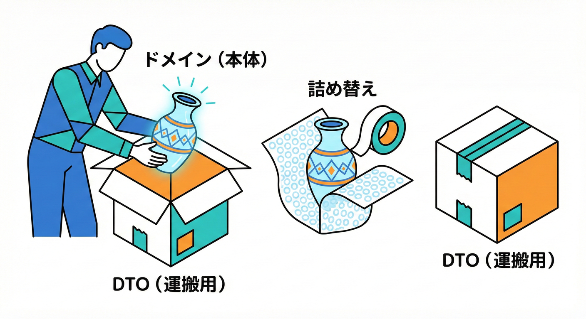
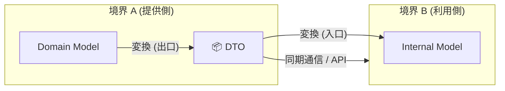
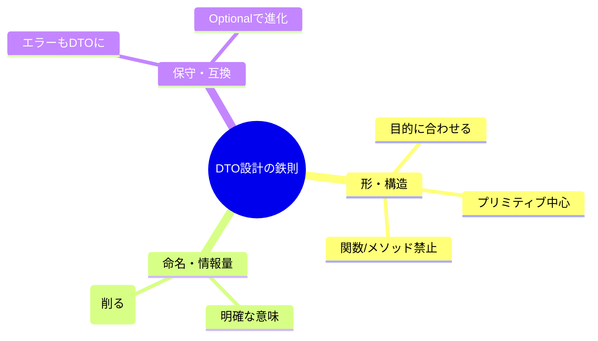
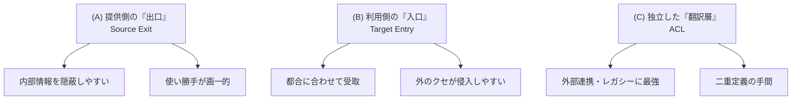

# 第39章 統合①：同期API + DTO（まず王道）📡📦

## 39-0 この章でできるようになること🎯✨

この章のゴールはこれだよ〜😊🫶

* 境界（BC）をまたぐときに「DTOで運ぶ」理由が説明できる📦✨
* 「同期APIでつなぐ」パターンを、事故らずに設計できる📡🛡️
* **どこでDTOに変換するか**（入口？出口？ACL？）を迷わず決められる🧭✨
* TypeScriptで「公開API」「DTO」「変換（マッピング）」をコードに落とせる🧩💻

---





境界を越えるときの合言葉はこれ👇

* **同期API**：呼び出したら、その場で結果が返ってくる（関数呼び出し/HTTPなど）📞➡️📩
* **DTO（Data Transfer Object）**：境界をまたぐ“運搬専用の箱”📦✨（ドメインの本体じゃない！）

イメージは「引っ越し」だよ🏠📦
家の中の家具（ドメインモデル）をそのまま道路に引きずり出すと壊れる😱
だから **段ボール（DTO）に詰めて運ぶ** のが安全🛡️✨


---

## 39-2 ちいさい例題：Trading が Listing に問い合わせる☎️🛍️

学内フリマの想定でいくね🛍️🏫

* **Listing（出品）BC**：出品情報を管理する（価格、在庫、公開状態など）🏷️
* **Trading（取引）BC**：購入〜取引成立を管理する（購入可否、取引開始など）🤝

「購入する」ボタンを押したとき、Tradingはこう聞きたい👇

* その商品、まだ売っていい？
* 価格はいくら？
* 公開中？停止中？

でもここで事故りやすいのがこれ😵‍💫
TradingがListingの**内部Entity**を直接importして使い始めると、境界が崩壊する💥

だから👇
✅ Trading → Listing へは **同期API**
✅ 受け渡しは **DTO**（運搬用）
✅ 変換は **境界の入口/出口でやる**

---

## 39-3 最初に決める3つのこと🧭✨

### ① どっちが呼ぶ？（主導権）👑

まず「呼ぶ側」を決めるよ📞
今回の例は Trading が Listing を呼ぶ（購入前チェック）✅

### ② 同期でいい？（待てる？）⏱️

同期は「その場で必要な情報」に強い😊

* 購入ボタン押下 → 在庫/価格チェック → すぐ結果が欲しい ✅

逆に、時間がかかる・リトライ地獄になりそうなら非同期（イベント）も検討だけど、この章はまず王道の同期でいくよ🧸✨

### ③ “公開API” を入口にする🚪✨

BCの外から触っていいのは「窓口」だけ😊

* `contexts/listing/public.ts` みたいな “入口ファイル” を作る（第30章のやつ）🚪📄
* 外部（他BC）は **public だけ** 見て呼ぶ👀

---

## 39-4 DTO設計のコツ7つ📦🧩

DTOは「壊れにくい箱」だから、ルールがあるよ😊🛡️



1. **ユースケース形（Use-case shaped）にする**🎮

   * “ListingItemEntity” みたいなドメインの形をそのまま運ばない🙅‍♀️
   * “購入前チェック結果” みたいに **目的の形** にする✅

2. **プリミティブ中心にする**🧱

   * `string / number / boolean / array / object` で構成
   * class やメソッドを持ち込まない（運搬専用だから）📦

3. **意味が伝わる名前にする**🏷️

   * `itemId`, `isPurchasable`, `priceAmount`, `currency` みたいに明確に✨
   * “User” みたいな曖昧ワードは避けがち（BC跨ぐとズレる）🌀

4. **“不足”より“過剰”が危険**⚠️

   * 未来のために情報を盛ると漏洩&依存が増える😱
   * まず最小でOK✂️✨

5. **Optionalで前方互換を作る**🧷

   * 後からフィールド追加しやすいように `?` を使う場面を意識👀
   * ただし “必須なのにoptional” はバグるので注意😵‍💫

6. **エラーもDTOにする**🚑📦

   * 例：`NOT_FOUND`, `NOT_FOR_SALE`, `PRICE_CHANGED`
   * 例外（throw）を境界越えさせないほうが安全🛡️

7. **DTOはバージョンを意識する**🔢

   * 同期APIは破壊的変更が起きやすいから、互換性ルールを持つ（後でやるよ）📜✨

---

## 39-5 “どこでDTOに変換する？”問題🧭📦



だいたい選択肢は3つ😊

### A) 呼ばれる側の「出口」でDTOにする（おすすめ）🚪📦

Listingが外に出す瞬間に、内部モデル → DTOへ変換

* 内部を外に漏らしにくい🛡️
* “公開の形” が1箇所で管理できる✨

### B) 呼ぶ側の「入口」でDTOにする（あり）📥📦

Tradingが受け取ったら、DTO → Trading内モデルに変換

* Trading内部の都合で整形できる🧩
* ただし「外のクセ」が入りやすいので注意🌀

### C) ACLで翻訳する（“外部サービス相手”で超強い）🧼🌍➡️🏠

この章は BC同士の同期だから、まずは A/B を中心にするよ😊
ACLは次の統合パターン（翻訳層）で本領発揮🛡️✨

---

## 39-6 TypeScript実装例：公開API + DTO + 変換💻📁

ここからコードで固めよう😊✨
（例は “同一リポジトリ内のモジュール呼び出し” を想定。HTTPでも設計思想は同じだよ📡）

### フォルダの気持ち📁

* `contexts/listing/` … 出品BC
* `contexts/trading/` … 取引BC
* 他BCは **listingの内部をimportしない**（第32章の依存ルール）➡️📏

---

### 1) Listing側：公開DTOと公開APIを用意する📦🚪

```ts
// contexts/listing/public.ts

// ✅ これが「境界を越える箱」DTO
export type GetPurchasableInfoRequestDto = {
  itemId: string;
};

export type GetPurchasableInfoResponseDto =
  | {
      ok: true;
      itemId: string;
      isPurchasable: true;
      priceAmount: number;
      currency: "JPY";
      title: string;
    }
  | {
      ok: true;
      itemId: string;
      isPurchasable: false;
      reason: "NOT_FOR_SALE" | "OUT_OF_STOCK" | "SUSPENDED";
    }
  | {
      ok: false;
      error: "NOT_FOUND" | "VALIDATION_ERROR";
      message?: string;
    };

// ✅ これが「公開API」（同期）
export interface ListingPublicApi {
  getPurchasableInfo(
    req: GetPurchasableInfoRequestDto
  ): Promise<GetPurchasableInfoResponseDto>;
}
```

ポイント😊🫶

* **Responseを“成功だけ”にしない**（見つからない等も普通に起こる）
* “買える/買えない” をDTOに含めて、呼ぶ側が分岐しやすいようにする🌿

---

### 2) Listing側：内部モデル→DTOの変換を“出口”でやる🚪✨

```ts
// contexts/listing/impl/listingPublicApiImpl.ts
import type {
  ListingPublicApi,
  GetPurchasableInfoRequestDto,
  GetPurchasableInfoResponseDto,
} from "../public";

// ここは例なので、DBの代わりに in-memory
type ListingItem = {
  id: string;
  title: string;
  priceAmount: number;
  status: "PUBLISHED" | "SUSPENDED";
  stock: number;
};

export class ListingPublicApiImpl implements ListingPublicApi {
  constructor(private readonly items: Map<string, ListingItem>) {}

  async getPurchasableInfo(
    req: GetPurchasableInfoRequestDto
  ): Promise<GetPurchasableInfoResponseDto> {
    // 最低限のバリデーション（境界の入口）
    if (!req.itemId || req.itemId.trim().length === 0) {
      return { ok: false, error: "VALIDATION_ERROR", message: "itemId is required" };
    }

    const item = this.items.get(req.itemId);
    if (!item) return { ok: false, error: "NOT_FOUND" };

    // ✅ 内部モデル（ListingItem）から、外向けDTOへ変換（出口）
    if (item.status !== "PUBLISHED") {
      return {
        ok: true,
        itemId: item.id,
        isPurchasable: false,
        reason: "SUSPENDED",
      };
    }

    if (item.stock <= 0) {
      return {
        ok: true,
        itemId: item.id,
        isPurchasable: false,
        reason: "OUT_OF_STOCK",
      };
    }

    return {
      ok: true,
      itemId: item.id,
      isPurchasable: true,
      priceAmount: item.priceAmount,
      currency: "JPY",
      title: item.title,
    };
  }
}
```

ここで超大事なのは👇
✅ Tradingに「ListingItem」を見せてないこと🛡️
✅ “公開する形” を **public.ts** と実装の出口で固定できてること📦✨

---

### 3) Trading側：Listing公開APIだけを使う📞✨

```ts
// contexts/trading/usecases/purchaseItem.ts
import type { ListingPublicApi } from "../../listing/public";

export type PurchaseCommand = {
  buyerId: string;
  itemId: string;
};

export type PurchaseResult =
  | { ok: true; tradingId: string }
  | { ok: false; reason: "NOT_PURCHASABLE" | "NOT_FOUND" | "FAILED_PRECHECK" };

export async function purchaseItem(
  cmd: PurchaseCommand,
  listingApi: ListingPublicApi
): Promise<PurchaseResult> {
  const info = await listingApi.getPurchasableInfo({ itemId: cmd.itemId });

  if (!info.ok) {
    if (info.error === "NOT_FOUND") return { ok: false, reason: "NOT_FOUND" };
    return { ok: false, reason: "FAILED_PRECHECK" };
  }

  if (!info.isPurchasable) {
    return { ok: false, reason: "NOT_PURCHASABLE" };
  }

  // ✅ ここから先はTrading内部の世界（例）
  // - 価格の確定
  // - 取引の作成
  // - 期限などの設定
  const tradingId = `TRD-${crypto.randomUUID()}`;
  return { ok: true, tradingId };
}
```

Tradingが知ってるのは👇

* `ListingPublicApi` と DTO だけ📦
  Listing内部の都合（statusの種類、itemの構造）は知らない🧸✨
  これが境界が守れてる状態だよ🛡️✅

---

## 39-7 境界を越えると「型だけじゃ足りない」問題😵‍💫🧪

TypeScriptの型はランタイムには存在しないよね🫠
だから **境界を越えるデータ** は、できればランタイム検証があると安心🛡️✨

* 同一リポジトリ内の関数呼び出しでも
  「別BCから来たデータ」は **“外から来た” 扱い** にすると安全度アップ🔒
* HTTP経由なら、なおさら必須級📡⚠️

例：Zodなどで `req` を検証する（ここでは雰囲気だけ）🧪✨

```ts
// 擬似コード（雰囲気）
const schema = z.object({ itemId: z.string().min(1) });
const parsed = schema.safeParse(req);
if (!parsed.success) return { ok: false, error: "VALIDATION_ERROR" };
```

---

## 39-8 DTO互換性ルール（壊さず進化させる）🌱🔧

同期APIは、相手が“その場で”動かないと困るから
破壊的変更に弱い😱💦

### 互換性の基本ルール（まずこれだけ覚える）📌

* ✅ **フィールド追加は基本OK**（ただし受け手が無視できる形に）
* ✅ enum（文字列 union）の追加は注意（受け手がswitchで死ぬ）⚠️
* ✅ フィールド削除・名前変更はほぼ破壊💥
* ✅ 意味変更（同じフィールドに別の意味）も破壊💥

なので、変更するときは👇

* `reason` を増やすなら、受け手は `default` を用意しておく👀
* “新しいレスポンス形” を別DTOとして切るのもあり✂️

---

## 39-9 よくある事故ベスト6🚑💥

1. **EntityをDTOとして渡しちゃう**

   * “運搬箱” のはずが “本体” を渡して依存爆発😱

2. **他BCの内部型をimportして使う**

   * 境界が消える🫠（依存ルール違反）

3. **DTOに未来のための情報を盛りすぎる**

   * 依存・漏洩・変更コストが増える📈💥

4. **エラーがthrowで境界越え**

   * 例外の種類やメッセージに依存が生まれる😵‍💫

5. **DTOに“内部の都合名”が出る**

   * 例：`dbStatus`, `internalFlag` みたいなの…外は困る🌀

6. **同期APIを増やしすぎてチャット地獄**

   * 1ユースケースで何回も呼ぶと遅い＆壊れやすい📞📞📞
   * → “必要な情報を1回で返すDTO” を考えるのがコツ✨

---

## 39-10 ミニ演習（手を動かす✋💻）🎀

### 演習A：DTOを設計してみよう📦📝

「購入前チェック」を、DTOとして設計してね😊
次の質問に答える形で書くとラクだよ🧸✨

* Requestに最低限必要な項目は？（例：itemId）
* ResponseでTradingが欲しい情報は？（例：買える？価格？タイトル？）
* “買えない理由” はどんな種類がある？
* “見つからない” はどう返す？

✅ 目標：`RequestDto` と `ResponseDto` を型で書けたらOK🎉

---

### 演習B：変換の置き場所を決めよう🧭

次のどこで変換する？理由も1行で😊

* Listingの出口で内部モデル→DTO
* Tradingの入口でDTO→Trading内部モデル
* ACLで翻訳（今回はBC同士だけど、あえて考えてみる）

---

### 演習C：Trading側の分岐を“読みやすく”整える🌿

`purchaseItem()` の分岐が増えたら、読みづらくなりがち😵‍💫

* `mapListingInfoToPrecheckResult()` みたいな関数を作って、分岐を整理してみてね✨

---

## 39-11 AI相棒に頼むときの質問テンプレ🤖💬

（コピペで使える形にしておくね😊✨）

### ① DTOフィールドの洗い出し📦

* 「取引BCが出品BCに問い合わせる“購入前チェック”のDTOを最小で設計したい。ユースケースは◯◯。Request/Responseのフィールド候補を出して。過剰な項目は“不要理由”も添えて削って。」

### ② 互換性のチェック🔧

* 「このResponse DTOにフィールド（or reason）を追加した。受け手が壊れないための受け手側の実装方針（switchのdefaultなど）を提案して。」

### ③ 変換関数の作成🧩

* 「内部モデル（この型）から公開DTO（この型）へのマッピング関数を書いて。境界で漏らしてはいけない情報が混ざってないかもチェックして。」

### ④ テスト観点の列挙🧪

* 「このAPI（購入前チェック）に必要なテスト観点をGiven/When/Thenで10個出して。境界越えの入力検証も含めて。」

---

## 39-12 まとめ✨📌

* 境界を越えるときは **同期API + DTO** がまず王道📡📦
* DTOは “運搬用の箱” だから、**最小・目的形・プリミティブ中心** が安全🛡️✨
* 変換は **出口（公開API）** に寄せると、内部が漏れにくい🚪
* 同期は互換性に弱いから、DTOの変更ルール（追加はOK、削除/変更は危険）を意識する🌱🔧
* そしてTypeScriptの最新安定版ラインは npm の `typescript` で 5.9.3 が latest として表示されているよ。([npm][1])
* “ネイティブ移行” は進んでいて、TypeScript 7（Go実装）の進捗アップデートが出ている（2025年12月の進捗記事）。([Microsoft for Developers][2])
* ネイティブ版のプレビューは npm での提供やエディタ拡張のプレビューも案内されているよ。([Microsoft for Developers][3])

[1]: https://www.npmjs.com/package/typescript?utm_source=chatgpt.com "TypeScript"
[2]: https://devblogs.microsoft.com/typescript/progress-on-typescript-7-december-2025/?utm_source=chatgpt.com "Progress on TypeScript 7 - December 2025"
[3]: https://devblogs.microsoft.com/typescript/announcing-typescript-native-previews/?utm_source=chatgpt.com "Announcing TypeScript Native Previews"
