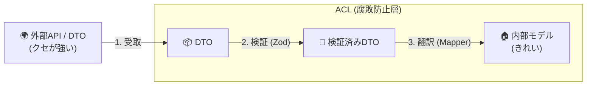
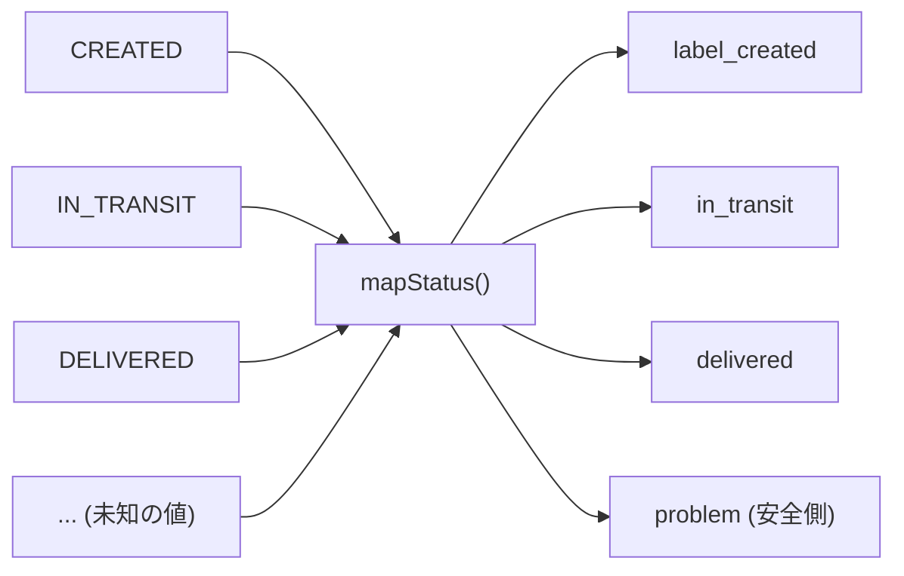
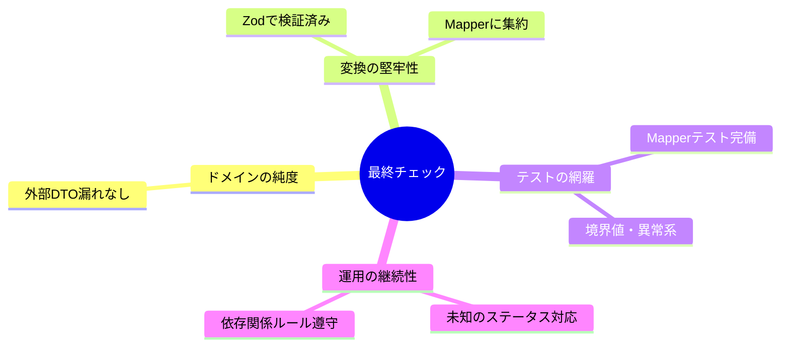

# 第40章 統合②：ACL実装 + まとめ発表会🎉🛡️

## この章のゴール🎯✨

この章が終わると、こんな状態になれるよ😊

* **ACL（腐敗防止層）**を、TypeScriptでちゃんと実装できる🧼🧩
* 外部のクセ（命名・単位・欠損・状態）を**翻訳ルールとして固定**できる📦➡️🏠
* 「なぜACLが必要？」を**3分で説明**できる🎤✨

---

## 0. ACLって結局なに？（1分で復習）🧼




ACLはひとことで言うと…

> **外の世界の“クセ”を、内側（ドメイン）に持ち込ませないための翻訳係**🛡️🌍➡️🏠

外部APIって、だいたいこういう“クセ”があるよね😇

* フィールド名が `snake_case` 🐍
* 数値の単位がバラバラ（g / kg、秒 / ms、税抜 / 税込）📏
* 状態がやたら多い or 逆に雑（`UNKNOWN` 多すぎ問題）😵‍💫
* 欠損値や null の意味が不明（`null` = 未設定？エラー？）🌀

この“クセ”が**境界を越えてドメインに入る**と、ドメインがどんどん汚れていく…😱
だから、**境界のところで翻訳して止める**のがACLだよ🧼✨

---

## 1. 今日作るACLの題材🛍️📦

学内フリマの例で、こんな統合を想像するよ🙂

* **Shipping（配送）BC**が、外部の配送会社API（例：ShipFast）を叩く📡
* でもShippingの中では、外部APIの型や命名を**一切使わない**🚫
* 外部APIのレスポンスは、**ACLが受け取って**、Shippingの言葉に翻訳する🧾✨

図でいうとこう👇

```txt
[Trading BC] ──(依頼)──▶ [Shipping BC] ──▶ (Port) ──▶ [ACL] ──▶ [外部配送API]
                         ▲                 ▼
                   (Domain Model)    (External DTO)
```

---

## 2. “良いACL”の設計ルール5つ🧠✅

ACLは雰囲気で書くと壊れやすいから、ルールで守ろう🛡️✨

1. **外部DTOをドメインに入れない**（絶対）🚫
2. **翻訳は「変換関数」に閉じ込める**（散らさない）📦
3. **変換ルールはテストで固定**（仕様になる）🧪
4. **外部の失敗は“内側のエラー型”に変換**する⚠️
5. **境界でValidation（実行時検証）**する（信用しない）🔍

実行時検証には `zod` みたいなライブラリが便利だよ（最新 v4.3.6）🧸✨ ([npm][1])

---

## 3. フォルダ構成（ACLの居場所）📁🧱

Shipping BC の中に、ACLを “翻訳専用ゾーン” として置くよ🧼

```txt
src/
  contexts/
    shipping/
      domain/
        money.ts
        shipment.ts
        shippingStatus.ts
      application/
        createShipment.ts
      ports/
        shippingProvider.ts     // 外部に求める能力（抽象）
      acl/
        shipfast/
          shipfastSchemas.ts    // 外部DTOの検証
          shipfastMapper.ts     // 外部DTO -> 内部モデル変換
          shipfastClient.ts     // fetch等（外部通信）
          shipfastProvider.ts   // Portを実装して、applicationに渡す
      public-api.ts
```

ポイント✨

* `ports/`：Shippingが外部に要求する「能力の形」🔌
* `acl/`：外部DTOを受け取って**翻訳**するゾーン🧼
* `domain/`：**清潔な中心**（外部都合禁止）🏠✨

---

## 4. 内側（Shipping）のモデルを先に決める🏠🧱

まず「内側の言葉」を作るよ。外の都合は忘れてOK🙆‍♀️

### 4.1 Value Object：Money💰

「金額」は雑に number で持つと事故るから、最低限の形にしよう🧯

```ts
// src/contexts/shipping/domain/money.ts
export type Currency = "JPY";

export class Money {
  private constructor(
    public readonly amount: number, // JPYは整数で持つ想定
    public readonly currency: Currency
  ) {}

  static jpy(amount: number): Money {
    if (!Number.isInteger(amount)) throw new Error("JPYは整数で持ってね🙏");
    if (amount < 0) throw new Error("金額はマイナス禁止🙅‍♀️");
    return new Money(amount, "JPY");
  }
}
```

### 4.2 状態：ShippingStatus🚦

外部の状態がどうであれ、内側は内側の言葉で固定するよ🙂

```ts
// src/contexts/shipping/domain/shippingStatus.ts
export type ShippingStatus =
  | "label_created"     // 伝票作成
  | "in_transit"        // 輸送中
  | "delivered"         // 配達完了
  | "problem";          // 事故/不明
```

### 4.3 Entity：Shipment📦

```ts
// src/contexts/shipping/domain/shipment.ts
import { Money } from "./money";
import { ShippingStatus } from "./shippingStatus";

export type ShipmentId = string;

export type TrackingNumber = string;

export type Shipment = Readonly<{
  id: ShipmentId;
  trackingNumber: TrackingNumber;
  status: ShippingStatus;
  fee: Money;
}>;
```

---

## 5. Port（外部に求める能力）を定義する🔌✨

Shippingのアプリ層は「外部配送会社」ではなく「配送できる能力」に依存するよ🧠

```ts
// src/contexts/shipping/ports/shippingProvider.ts
import { Shipment } from "../domain/shipment";

export type CreateShipmentInput = Readonly<{
  orderId: string;      // Trading側の注文ID（文字列でOK）
  address: string;      // 例題なので雑でOK🙂
  weightGram: number;   // 内側はgで統一しちゃう
}>;

export interface ShippingProvider {
  createShipment(input: CreateShipmentInput): Promise<Shipment>;
}
```

---

## 6. 外部DTOを “信じない”：zodで検証する🔍🧸

外部APIのレスポンスは、**まずzodでValidation**してから触るよ🧼
（zodの最新はnpmで確認できるよ） ([npm][1])

### 6.1 外部配送API（ShipFast）のレスポンス例🌍

外部はこんなJSONを返す、という設定にするね🙂

```json
{
  "shipment_id": "sf_123",
  "tracking_no": "TRK-999",
  "status_code": "DELIVERED",
  "fee_minor": 500,
  "currency": "JPY"
}
```

### 6.2 zodスキーマ🧩

```ts
// src/contexts/shipping/acl/shipfast/shipfastSchemas.ts
import { z } from "zod";

export const shipFastCreateShipmentResponseSchema = z.object({
  shipment_id: z.string().min(1),
  tracking_no: z.string().min(1),
  status_code: z.string().min(1),
  fee_minor: z.number().int().nonnegative(),
  currency: z.string().min(1),
});

export type ShipFastCreateShipmentResponse = z.infer<
  typeof shipFastCreateShipmentResponseSchema
>;
```

---

## 7. いちばん大事：Mapper（翻訳ルール）🧼🧾

ここがACLの心臓🫀✨

* `snake_case` → **内側の命名**へ
* 外部状態 → **ShippingStatus**へ
* `fee_minor + currency` → **Money**へ
* 外部の変な値 → **problem** やエラーへ

```ts
// src/contexts/shipping/acl/shipfast/shipfastMapper.ts
import { Money } from "../../domain/money";
import { Shipment } from "../../domain/shipment";
import { ShippingStatus } from "../../domain/shippingStatus";
import { ShipFastCreateShipmentResponse } from "./shipfastSchemas";

function mapStatus(code: string): ShippingStatus {
  switch (code) {
    case "CREATED":
      return "label_created";
    case "IN_TRANSIT":
      return "in_transit";
    case "DELIVERED":
      return "delivered";
    case "LOST":
    case "DAMAGED":
      return "problem";
    default:
      // 外部が増やしてきた状態に備えて “安全側” に倒す🙂
      return "problem";
  }
}

function mapMoney(fee_minor: number, currency: string): Money {
  // 例題：JPYしか受け付けない（他通貨は内側に入れない）
  if (currency !== "JPY") throw new Error(`未対応通貨だよ😵: ${currency}`);
  // JPYのminorはここでは「円」とみなす（例題なので単純化）
  return Money.jpy(fee_minor);
}

export function toShipment(
  input: ShipFastCreateShipmentResponse
): Shipment {
  return {
    id: input.shipment_id,
    trackingNumber: input.tracking_no,
    status: mapStatus(input.status_code),
    fee: mapMoney(input.fee_minor, input.currency),
  };
}
```



### ✅ ミニ演習（5分）✍️🧸

`mapStatus` に外部状態 `RETURNED` が来たらどうする？

* A: `delivered` にする
* B: `problem` にする
* C: 新しく `returned` を内側に追加する

おすすめは **B or C**🙂

* 返品がShippingの責務なら C
* 返品がTradingの責務なら、Shippingは深追いせず B（境界の責務を守る）🛡️

---

## 8. 外部通信はClientに閉じ込める📡📦

fetchやURL、ヘッダ、リトライ等は “外側の都合” なのでClientへ🧊

```ts
// src/contexts/shipping/acl/shipfast/shipfastClient.ts
import {
  shipFastCreateShipmentResponseSchema,
  ShipFastCreateShipmentResponse,
} from "./shipfastSchemas";

export class ShipFastClient {
  constructor(
    private readonly baseUrl: string,
    private readonly apiKey: string
  ) {}

  async createShipment(request: {
    order_id: string;
    address: string;
    weight_gram: number;
  }): Promise<ShipFastCreateShipmentResponse> {
    const res = await fetch(`${this.baseUrl}/shipments`, {
      method: "POST",
      headers: {
        "content-type": "application/json",
        "authorization": `Bearer ${this.apiKey}`,
      },
      body: JSON.stringify(request),
    });

    if (!res.ok) {
      // 外部エラーはここで “外部っぽい形” のまま止める
      throw new Error(`ShipFast API error: ${res.status}`);
    }

    const json = await res.json();
    // ここで検証！信じない！🔍
    return shipFastCreateShipmentResponseSchema.parse(json);
  }
}
```

---

## 9. Provider（Port実装）で “ACLとして完成” させる🧩✅

アプリ層は `ShippingProvider` を呼ぶだけ。
外部の存在は知らない🙂

```ts
// src/contexts/shipping/acl/shipfast/shipfastProvider.ts
import { ShippingProvider, CreateShipmentInput } from "../../ports/shippingProvider";
import { Shipment } from "../../domain/shipment";
import { ShipFastClient } from "./shipfastClient";
import { toShipment } from "./shipfastMapper";

export class ShipFastProvider implements ShippingProvider {
  constructor(private readonly client: ShipFastClient) {}

  async createShipment(input: CreateShipmentInput): Promise<Shipment> {
    const external = await this.client.createShipment({
      order_id: input.orderId,
      address: input.address,
      weight_gram: input.weightGram,
    });

    return toShipment(external);
  }
}
```

---

## 10. アプリ層（UseCase）から見たらこう🎮✨

```ts
// src/contexts/shipping/application/createShipment.ts
import { ShippingProvider } from "../ports/shippingProvider";
import { Shipment } from "../domain/shipment";

export class CreateShipmentUseCase {
  constructor(private readonly provider: ShippingProvider) {}

  async execute(input: {
    orderId: string;
    address: string;
    weightGram: number;
  }): Promise<Shipment> {
    // ここにShippingの業務ルールが増えても、
    // 外部DTOとは無関係でいられる🛡️
    return this.provider.createShipment(input);
  }
}
```

---

## 11. 翻訳ルールを “仕様” にする：テスト🧪📌

ACLは**テストがないと、ただの変換コード**になって崩れるよ😵‍💫
ここはガチで固めよう💪✨

```ts
// src/contexts/shipping/acl/shipfast/shipfastMapper.test.ts
import { describe, it, expect } from "vitest";
import { toShipment } from "./shipfastMapper";

describe("ShipFast -> Shipment mapper", () => {
  it("DELIVERED は delivered に変換される📦✅", () => {
    const shipment = toShipment({
      shipment_id: "sf_1",
      tracking_no: "TRK-1",
      status_code: "DELIVERED",
      fee_minor: 500,
      currency: "JPY",
    });

    expect(shipment.status).toBe("delivered");
    expect(shipment.fee.amount).toBe(500);
    expect(shipment.trackingNumber).toBe("TRK-1");
  });

  it("未知の status_code は安全側に倒して problem になる😇", () => {
    const shipment = toShipment({
      shipment_id: "sf_2",
      tracking_no: "TRK-2",
      status_code: "NEW_UNKNOWN_STATUS",
      fee_minor: 0,
      currency: "JPY",
    });

    expect(shipment.status).toBe("problem");
  });
});
```

### ✅ ミニ演習（5分）🧸

次のケースのテストを追加してみよう💡

* `currency: "USD"` が来たらエラーになること💥
* `fee_minor: -1` が来たら zod が弾くこと🔍

---

## 12. ありがちな事故と、回避ワザ集🚑✨

### 事故①：外部DTOがドメインに漏れる😱

**症状**：`domain/` で `shipfastSchemas` を import してる
**対策**：`domain/` は外部import禁止ルール（第32章）を徹底📏➡️

### 事故②：mapperが散らばる🌀

**症状**：あちこちで `status_code === "DELIVERED"` とか書き始める
**対策**：変換は **shipfastMapper.ts に集約**📦✨

### 事故③：null地獄🫠

**症状**：外部が `null` を返してきて、内側にも `null` が侵入
**対策**：zodで **nullableを明示**し、内側では意味のある型に変換🙂

---

## 13. AI相棒に頼むテンプレ🤖💬（そのままコピペOK）

### 13.1 外部DTOの癖出し用🕵️‍♀️

「このAPIレスポンスの“クセ”を列挙して。命名・単位・欠損・状態・エラー形式の観点で！」

### 13.2 zodスキーマ生成用🧩

「このJSONのzodスキーマを作って。nullable/optionalの判断も書いて！」

### 13.3 mapperレビュー用👀✅

「このmapperの変換ルールに抜け漏れがないかチェックして。未知の状態・通貨・境界漏れの観点で！」

### 13.4 テスト増やす用🧪

「このmapperに対して、境界値・未知値・例外系のテストケースを10個出して！」

---

## 14. まとめ発表会🎤🎉（3分台本つき）

最後は「作れた」だけじゃなくて「説明できる」まで行こう😊✨

### 14.1 発表で見せるもの（完成セット🎁）

* Context Map（最終版）🗺️
* BCごとの責務・用語集📚
* ACLの翻訳ルール（今回の mapper とテスト）🧾
* 3分説明原稿🎤

### 14.2 3分説明テンプレ（そのまま読んでOK）🗣️✨

1. **課題（30秒）**
   「外部配送APIは、命名や状態や単位が独特で、そのまま入れるとShippingのモデルが汚れます🌀」

2. **解決（60秒）**
   「そこでACLを置きました🧼 外部DTOはACLでzod検証し、mapperでShippingの言葉に翻訳します。アプリ層はPort（ShippingProvider）だけを見ます🔌」

3. **効果（60秒）**
   「外部が仕様変更しても、影響はACLに閉じ込められます📦 ドメインは安定し、テストで翻訳ルールが仕様として固定されます🧪✨」

4. **締め（30秒）**
   「つまりACLは、境界を越える“汚れ”を止めるフィルターで、Shippingの中心を守る仕組みです🛡️」


---

* [ ] 未知の状態・欠損・通貨など “変な値” に安全に対応できる😇



---

## おさらい：最新まわりのメモ🧸💡

* TypeScript は npm の最新が **5.9.3**（安定版ライン）だよ📌 ([npm][2])
* Node.js は **v24 が Active LTS**、直近の更新も確認できるよ🟩 ([Node.js][3])
* zod は npm で **v4.3.6** が最新（検証ライブラリとして人気）🧩 ([npm][1])

[1]: https://www.npmjs.com/package/zod?utm_source=chatgpt.com "Zod"
[2]: https://www.npmjs.com/package/typescript?utm_source=chatgpt.com "TypeScript"
[3]: https://nodejs.org/en/about/previous-releases?utm_source=chatgpt.com "Node.js Releases"
