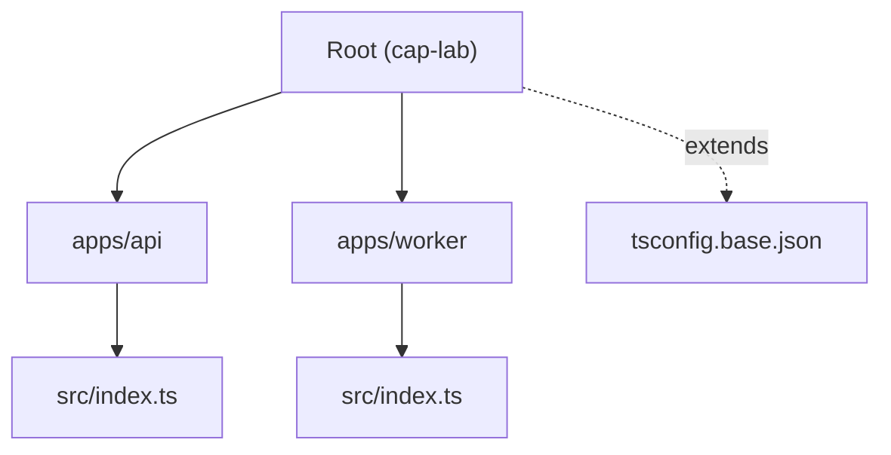

```mermaid
sequenceDiagram
    participant U as ユーザー
    participant S as scripts (root)
    participant A as apps/api
    participant W as apps/worker

    U->>S: npm run dev
    S->>A: tsx watch (Port 3000)
    S->>W: tsx watch
    Note over A,W: concurrently で同時並行起動
    A-->>U: http://localhost:3000/health
    W-->>U: console.log("[worker] tick=...")
```

# 第2章：Windows＋VS Codeで実験用プロジェクトを作る🧰✨

## 結論1行✨

**「API（HTTP）とWorker（裏方処理）」を分けた“2プロセスひな形”を作って、`npm run dev` だけで同時起動できる状態にするよ〜！🚀🧡**


---

## この章でできあがるもの🎯📦

### ✅ 完成フォルダ構成（最終形）

```text
cap-lab/
  apps/
    api/
      src/
        index.ts
      package.json
      tsconfig.json
    worker/
      src/
        index.ts
      package.json
      tsconfig.json
  .vscode/
    launch.json
    tasks.json
    settings.json
  package.json
  tsconfig.base.json
```



### ✅ できるようになること💪✨

* TypeScriptの**“迷わない型”**（設定・実行コマンド・構成）を固定できる🧠🧷
* `apps/api`（HTTPサーバ）と `apps/worker`（バックグラウンド処理）を**別プロセスで起動**できる🔁🧵
* 後の章（遅延⏳・失敗注入💥・リトライ🔁）を“同じ土台”で進められる📘✨

---

## 0) まずは Node.js（LTS）を用意しよう🟩🧰

この教材では **Node.js の LTS** を使うよ（2026/1 時点だと Node v24 が Active LTS）🧡
Node のリリース状況は公式が一番確実！ ([nodejs.org][1])

### ✅ インストール（コマンド一発）⚡

PowerShell でこれ👇（`winget` が使える前提）

```powershell
winget install -e --id OpenJS.NodeJS.LTS
```

この `OpenJS.NodeJS.LTS` は定番の入れ方として案内されてるよ〜！ ([Winget Run][2])

### ✅ バージョン確認👀

```powershell
node -v
npm -v
```

---

## 1) 新規プロジェクトを作る📁✨

好きな場所でOK！例としてデスクトップに作るね🧁

```powershell
cd $HOME\Desktop
mkdir cap-lab
cd cap-lab
```

（任意）Git も始めちゃうと気分いい🫶

```powershell
git init
```

---

## 2) ルート（全体）を “ワークスペース” にする🧩📦

### ✅ ルートの package.json を作る

```powershell
npm init -y
```

### ✅ ルート package.json（コピペOK）🧷✨

`cap-lab/package.json` をこうしてね👇
（ポイント：`workspaces` で `apps/*` を束ねる！）

```json
{
  "name": "cap-lab",
  "private": true,
  "workspaces": [
    "apps/*"
  ],
  "scripts": {
    "dev": "concurrently -n api,worker \"npm run dev -w @cap-lab/api\" \"npm run dev -w @cap-lab/worker\"",
    "typecheck": "npm run typecheck -w @cap-lab/api && npm run typecheck -w @cap-lab/worker",
    "build": "npm run build -w @cap-lab/api && npm run build -w @cap-lab/worker",
    "start": "npm run start -w @cap-lab/api && npm run start -w @cap-lab/worker"
  },
  "devDependencies": {
    "concurrently": "^9.0.0",
    "typescript": "^5.9.0",
    "tsx": "^4.21.0"
  }
}
```

* `npm workspaces` の考え方は npm 公式にあるよ📚 ([docs.npmjs.com][3])
* `tsx` は “TSをそのまま実行” できる定番ランナー。npm の配布ページにも説明があるよ⚡ ([npmjs.com][4])
* Node公式ドキュメントでも、TypeScriptの実行方法として `tsx` が例に出てくるよ📝 ([nodejs.org][5])
* TypeScript は 2026/1 時点で 5.9 系が公式に案内されてるよ（発表記事あり）📣 ([Microsoft for Developers][6])

---

## 3) TypeScript の “共通設定” を置く🧠🧱

ルートに `tsconfig.base.json` を作るよ📄✨
（この1枚が “迷わない型” になる！）

`cap-lab/tsconfig.base.json` 👇

```json
{
  "compilerOptions": {
    "target": "ES2022",
    "module": "NodeNext",
    "moduleResolution": "NodeNext",

    "strict": true,
    "skipLibCheck": true,

    "esModuleInterop": true,
    "forceConsistentCasingInFileNames": true,

    "sourceMap": true
  }
}
```

### ここだけ意味わかればOK🙆‍♀️✨

* `strict`: ミスを早めに見つける（初心者ほど助かる）🧷
* `module/moduleResolution: NodeNext`: “今どきの Node” と相性良くする⚙️
* `sourceMap`: デバッグが気持ちよくなる🕵️‍♀️

---

## 4) `apps/api` を作る（HTTPサーバ）🌐🧁

### ✅ フォルダ作成📁

```powershell
mkdir apps
mkdir apps\api
mkdir apps\api\src
```

### ✅ `apps/api/package.json`（コピペOK）📦

`apps/api/package.json` 👇

```json
{
  "name": "@cap-lab/api",
  "private": true,
  "type": "module",
  "scripts": {
    "dev": "tsx watch src/index.ts",
    "typecheck": "tsc -p tsconfig.json --noEmit",
    "build": "tsc -p tsconfig.json",
    "start": "node dist/index.js"
  },
  "dependencies": {
    "express": "^4.19.0"
  },
  "devDependencies": {
    "@types/express": "^4.17.0",
    "@types/node": "^24.0.0"
  }
}
```

### ✅ `apps/api/tsconfig.json`（extends で共通化）🧩

`apps/api/tsconfig.json` 👇

```json
{
  "extends": "../../tsconfig.base.json",
  "compilerOptions": {
    "rootDir": "src",
    "outDir": "dist"
  },
  "include": ["src"]
}
```

### ✅ `apps/api/src/index.ts`（最小で動くAPI）🍞✨

`apps/api/src/index.ts` 👇

```ts
import express from "express";

const app = express();
app.use(express.json());

app.get("/health", (_req, res) => {
  res.json({ ok: true, service: "api", time: new Date().toISOString() });
});

// 後の章で「遅延⏳」を体感するための、わざと遅いエンドポイント🐢
app.get("/slow", async (req, res) => {
  const ms = Number(req.query.ms ?? 1500);
  await new Promise((r) => setTimeout(r, ms));
  res.json({ ok: true, delayedMs: ms });
});

const port = Number(process.env.PORT ?? 3000);
app.listen(port, () => {
  console.log(`[api] listening on http://localhost:${port}`);
});
```

---

## 5) `apps/worker` を作る（裏方プロセス）🧹🔁

### ✅ フォルダ作成📁

```powershell
mkdir apps\worker
mkdir apps\worker\src
```

### ✅ `apps/worker/package.json`（コピペOK）📦

`apps/worker/package.json` 👇

```json
{
  "name": "@cap-lab/worker",
  "private": true,
  "type": "module",
  "scripts": {
    "dev": "tsx watch src/index.ts",
    "typecheck": "tsc -p tsconfig.json --noEmit",
    "build": "tsc -p tsconfig.json",
    "start": "node dist/index.js"
  },
  "devDependencies": {
    "@types/node": "^24.0.0"
  }
}
```

### ✅ `apps/worker/tsconfig.json`🧩

`apps/worker/tsconfig.json` 👇

```json
{
  "extends": "../../tsconfig.base.json",
  "compilerOptions": {
    "rootDir": "src",
    "outDir": "dist"
  },
  "include": ["src"]
}
```

### ✅ `apps/worker/src/index.ts`（最小で動くWorker）🧡

`apps/worker/src/index.ts` 👇

```ts
const sleep = (ms: number) => new Promise((r) => setTimeout(r, ms));

console.log("[worker] started!");

let tick = 0;
while (true) {
  tick += 1;
  console.log(`[worker] tick=${tick} time=${new Date().toISOString()}`);
  await sleep(1000);
}
```

---

## 6) 依存関係を一気に入れる📦⚡

ルート（`cap-lab/`）でこれだけ👇
（workspaces なので、全部まとめて入るよ〜！）

```powershell
npm install
```



---

## 7) 2プロセス同時起動してみよう🚀🧵

### ✅ 起動🔥

```powershell
npm run dev
```

### ✅ 動作チェック👀

* ブラウザで：`http://localhost:3000/health`
* 遅延確認：`http://localhost:3000/slow?ms=2000`（2秒待つ⏳🐢）

ターミナルにはこんな感じで出るはず👇

* `[api] listening on http://localhost:3000`
* `[worker] tick=1 ...` が毎秒出る

---

## 8) VS Code を “気持ちよくする” 最小セット🎛️✨

### ✅ `.vscode/settings.json`（保存時フォーマットなど）

`cap-lab/.vscode/settings.json` 👇

```json
{
  "editor.formatOnSave": true,
  "editor.codeActionsOnSave": {
    "source.organizeImports": "explicit"
  },
  "typescript.tsserver.experimental.enableProjectDiagnostics": true
}
```

### ✅ `.vscode/tasks.json`（ショートカットで dev 起動）

`cap-lab/.vscode/tasks.json` 👇

```json
{
  "version": "2.0.0",
  "tasks": [
    {
      "label": "dev (api + worker)",
      "type": "shell",
      "command": "npm run dev",
      "problemMatcher": [],
      "isBackground": true
    }
  ]
}
```

### ✅ `.vscode/launch.json`（デバッグ起動：まずは api だけでもOK）🕵️‍♀️

`cap-lab/.vscode/launch.json` 👇

```json
{
  "version": "0.2.0",
  "configurations": [
    {
      "name": "Debug API (tsx)",
      "type": "node",
      "request": "launch",
      "runtimeExecutable": "node",
      "runtimeArgs": ["./node_modules/tsx/dist/cli.mjs", "apps/api/src/index.ts"],
      "cwd": "${workspaceFolder}",
      "console": "integratedTerminal",
      "skipFiles": ["<node_internals>/**"]
    }
  ]
}
```

---

## 9) AI を “設定ファイル職人” にする🤖📝✨

### ✅ そのままコピペで使えるプロンプト例💬

* **tsconfig の意味を説明させる🧠**

  * 「この `tsconfig.base.json` の各項目が何をしてるか、初心者向けに説明して。変更していい所・ダメな所も教えて🥺」

* **package.json の scripts を点検させる🔍**

  * 「Windows で npm scripts が壊れやすい引用符の問題がないか、この scripts をチェックして。より安全な書き方があれば提案して🙏」

* **“2プロセス構成のログ設計” のたたき台🧵**

  * 「api と worker のログに相関IDを入れる前提で、今の段階で入れておくと良いログ項目テンプレを作って📋✨」

---

## 10) チェックリスト✅🌸

* [ ] `npm run dev` で **api と worker が同時に動く**
* [ ] `/health` が返る
* [ ] `/slow?ms=2000` が **ちゃんと遅れる**🐢
* [ ] `npm run typecheck` が通る（型エラーなし）🧷

---

## よくある詰まりポイント😵‍💫🧯

### ❓ `concurrently` が見つからない

👉 `npm install` をルートで実行した？（`cap-lab/` で！）📦

### ❓ ポート 3000 が使われてる

👉 すでに何かが使ってるかも！
`apps/api/src/index.ts` の `PORT` を変える（例：3001）🪄

### ❓ TypeScript を “そのまま Node で実行” できるって聞いたけど？

Node には `node --experimental-strip-types` みたいな実験的機能もあるよ🧪（ただし “実験” 扱い） ([nodejs.org][7])
この教材では、**迷いにくくて実績のある `tsx`** をベースに進めるよ〜⚡ ([nodejs.org][5])

[1]: https://nodejs.org/en/about/previous-releases?utm_source=chatgpt.com "Node.js Releases"
[2]: https://winget.run/pkg/OpenJS/NodeJS.LTS?utm_source=chatgpt.com "Download and install Node.js LTS with winget"
[3]: https://docs.npmjs.com/cli/v7/using-npm/workspaces/?utm_source=chatgpt.com "workspaces | npm Docs"
[4]: https://www.npmjs.com/package/tsx?utm_source=chatgpt.com "tsx"
[5]: https://nodejs.org/api/typescript.html?utm_source=chatgpt.com "Modules: TypeScript | Node.js v25.5.0 Documentation"
[6]: https://devblogs.microsoft.com/typescript/announcing-typescript-5-9/?utm_source=chatgpt.com "Announcing TypeScript 5.9"
[7]: https://nodejs.org/en/learn/typescript/run-natively?utm_source=chatgpt.com "Running TypeScript Natively"
