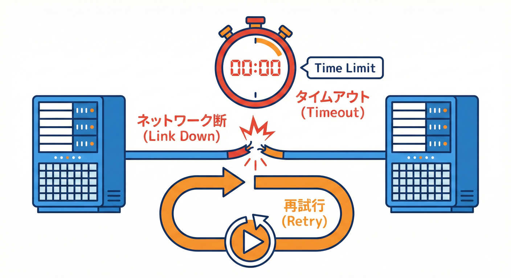
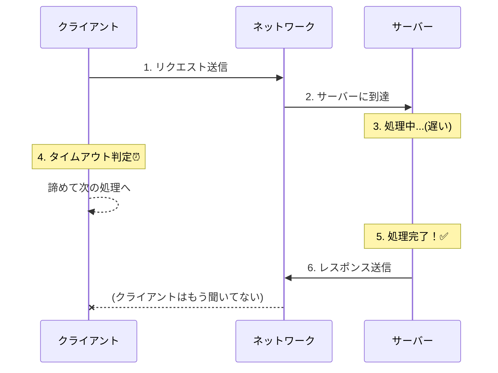
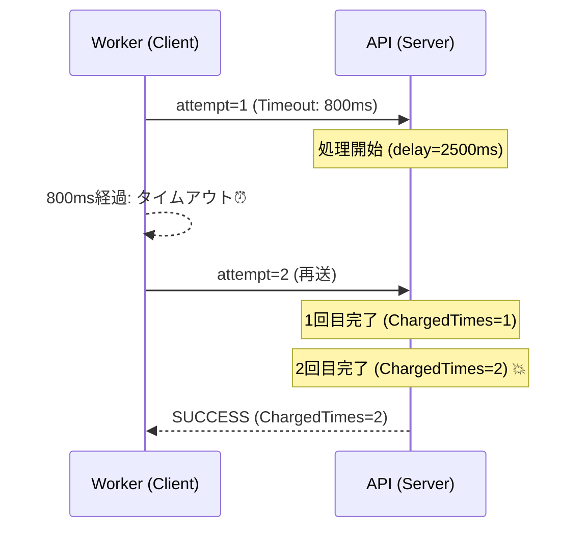

# 第4章：ネットワークの現実（タイムアウト・切断・再送）🔌📨

## この章のゴール 🎯✨

* タイムアウトは「失敗」じゃなくて「時間切れ判定」だと体に入れる⏳🧠
* 切断やエラーは“たまに”じゃなくて“普通に”起きる前提を作る📉⚡
* リトライ（再送）で**二重実行**が起きるのを、手を動かして体験する🔁😱
* 「じゃあ設計はどうする？」の入口（次章以降の伏線）を作る🧩🚪



---

## ネットワークって、どんなふうに壊れるの？🌍💥

ネットワーク越しの呼び出し（HTTPとか）は、だいたいこういう事件が起きます👇😵‍💫

* **遅い**：返事が来るまで数秒〜数十秒待つ🐢
* **途中で切れる**：相手は生きてるのに、線だけ切れる✂️
* **相手がエラーを返す**：500 / 503 / 429 など🧯
* **返事が来たけど中身がおかしい**：部分的に壊れたJSONとか📦💔
* **こっちが諦めたけど相手は処理してた**：これが地獄の入口👻

この章は最後のやつ（タイムアウト→リトライ→二重実行）を“わざと”起こして学びます🧪🎲
「Fault Injection（故障注入）」って呼ばれる考え方で、わざと失敗を混ぜて強くするやつだよ💪🧪 ([Microsoft GitHub][1])

---

## タイムアウトの正体 ⏳🧩

タイムアウトはざっくり言うとこう👇

> **「相手が失敗した」のではなく、こちらが“待つのをやめた”だけ** 😭

つまり、こっちがタイムアウトした瞬間に相手が止まるとは限りません⚠️
相手がそのまま処理を続けて、**あとで完了してしまう**ことが普通にあります（そして二重実行の温床）😱🔥



### クライアント側（呼ぶ側）のタイムアウト

Node.js の `fetch` は **デフォルトでタイムアウトしません**（待てるだけ待つ）ので、自分で“締切”をつけるのが大事だよ⏰
`AbortSignal.timeout(ms)` が使えるので、これで「○ms で諦める」を作れます🧷 ([nodejs.org][2])

ちなみに Node.js の `fetch` は Undici が中で動いてるよ（高速＆仕様準拠を頑張ってるやつ）🚀 ([nodejs.org][3])

### サーバー側（受ける側）のタイムアウト

サーバーも「いつまでも受け取り続けると危ない」ので、受信の締切を持てます。Node の `server.requestTimeout` は、期限が切れると 408 を返して接続を閉じる…みたいな挙動があります🛡️ ([nodejs.org][4])

---

## リトライ（再送）の罠：二重になる 😱🔁

タイムアウトすると、人はこう考えがち👇

* 「返事ない＝失敗したんだ！」
* 「もう一回送ろ！」

でも現実はこうかも👇👻

* 1回目：相手は**処理してた**（ただ返事が遅かっただけ）
* 2回目：もう一回来たから**もう一回処理した**
* 結果：**二重課金💸 / 二重注文🛒 / 二重在庫減📦**

じゃあ、実際に起こしてみよう🔥🔥🔥

---

## ハンズオン：ランダム失敗スイッチ（Fault Injection）を付ける🎛️🎲

### できあがるもの 🧱✨

* `apps/api`：不安定な `/charge` を持つ（遅延・500・切断をランダム発生）😈
* `apps/worker`：`/charge` を呼ぶ（短いタイムアウト＋リトライ付き）📨🔁
* 観察：**タイムアウト→リトライ→実は二重で処理されてた** をログで見る🕵️‍♀️

---

## 1) APIに「不安定な課金」エンドポイントを作る😈💳

`apps/api/src/server.ts` を作成（または置き換え）👇

```ts
import { createServer } from "node:http";
import type { IncomingMessage, ServerResponse } from "node:http";
import { randomUUID } from "node:crypto";

type ChargeRequest = {
  orderId: string;
  amount: number;
};

const chargeCountByOrderId = new Map<string, number>();

const sleep = (ms: number) => new Promise<void>((r) => setTimeout(r, ms));

function isFaultOn() {
  return process.env.FAULT === "1";
}

async function readJson<T>(req: IncomingMessage): Promise<T> {
  const chunks: Buffer[] = [];
  for await (const chunk of req) chunks.push(Buffer.from(chunk));
  const text = Buffer.concat(chunks).toString("utf-8");
  return JSON.parse(text) as T;
}

function writeJson(res: ServerResponse, statusCode: number, body: unknown) {
  res.statusCode = statusCode;
  res.setHeader("content-type", "application/json; charset=utf-8");
  res.end(JSON.stringify(body));
}

const server = createServer(async (req, res) => {
  const url = new URL(req.url ?? "/", "http://localhost");
  const method = req.method ?? "GET";

  // 追跡しやすいようにリクエストIDを付ける（無ければ作る）
  const requestId =
    (req.headers["x-request-id"]?.toString() ?? "").trim() || randomUUID();
  res.setHeader("x-request-id", requestId);

  if (method === "GET" && url.pathname === "/health") {
    return writeJson(res, 200, { ok: true });
  }

  if (method === "POST" && url.pathname === "/charge") {
    const startedAt = Date.now();

    // 故障注入パラメータ（ONのときだけランダム）
    const delayMs = isFaultOn()
      ? Math.random() < 0.45
        ? 1200 + Math.floor(Math.random() * 2500) // タイムアウトを誘発しがちな遅延
        : Math.floor(Math.random() * 150) // ほぼ即レス
      : 0;

    const will500 = isFaultOn() && Math.random() < 0.18; // たまに500
    const willDrop = isFaultOn() && Math.random() < 0.08; // たまに切断

    let body: ChargeRequest;
    try {
      body = await readJson<ChargeRequest>(req);
    } catch {
      return writeJson(res, 400, { error: "Invalid JSON", requestId });
    }

    // 「処理」は返事を返す前に進むことがある、を再現したいので…
    // 先に遅延して、その後に“課金カウント”を増やす（返事が返せなくても処理は進む想定）
    await sleep(delayMs);

    const prev = chargeCountByOrderId.get(body.orderId) ?? 0;
    const next = prev + 1;
    chargeCountByOrderId.set(body.orderId, next);

    const elapsed = Date.now() - startedAt;

    // ログは“事実”として残る（返事が返せなくても、処理した記録は残る感じ）
    console.log(
      JSON.stringify({
        at: new Date().toISOString(),
        requestId,
        orderId: body.orderId,
        amount: body.amount,
        delayMs,
        will500,
        willDrop,
        chargedTimes: next,
        elapsedMs: elapsed,
      })
    );

    if (willDrop) {
      // 返事の直前に線が切れた感じ
      req.socket.destroy();
      return;
    }

    if (will500) {
      return writeJson(res, 500, {
        error: "Temporary error (simulated)",
        requestId,
        orderId: body.orderId,
        chargedTimes: next, // 500でも処理は進んじゃってる最悪パターンを再現😱
      });
    }

    return writeJson(res, 200, {
      ok: true,
      requestId,
      orderId: body.orderId,
      chargedTimes: next,
      elapsedMs: elapsed,
    });
  }

  writeJson(res, 404, { error: "Not found" });
});

// サーバー側にも「受信の締切」を持てる（DoS対策にもなる）
// ここは学習用に短めにしておく（必要に応じて調整してね）
server.requestTimeout = 10_000;

server.listen(3001, () => {
  console.log("API listening on http://localhost:3001");
  console.log("Try: GET /health, POST /charge");
});
```

ポイント👀✨

* `FAULT=1` のときだけ、**遅延/500/切断**がランダムで混ざる🎛️🎲
* 一番イヤな再現として、`will500` でも **課金カウントが進む**ようにしてる😱

  * 現実でも「返事が失敗でも処理は通ってた」事故があるからね…（DB更新は済んでた等）💥

---

## 2) Workerに「短いタイムアウト＋リトライ」を作る📨⏳🔁

`apps/worker/src/run.ts` を作成（または置き換え）👇

```ts
import { randomUUID } from "node:crypto";

const sleep = (ms: number) => new Promise<void>((r) => setTimeout(r, ms));

function isAbortLike(err: unknown) {
  // Node/Fetch だと AbortError になることが多い
  return (
    err instanceof Error &&
    (err.name === "AbortError" || /aborted|timeout/i.test(err.message))
  );
}

async function chargeOnce(orderId: string, amount: number, timeoutMs: number) {
  const requestId = randomUUID();

  const res = await fetch("http://localhost:3001/charge", {
    method: "POST",
    headers: {
      "content-type": "application/json",
      "x-request-id": requestId, // サーバーのログと突き合わせる用🧵
    },
    body: JSON.stringify({ orderId, amount }),
    signal: AbortSignal.timeout(timeoutMs),
  });

  const text = await res.text();
  let json: any;
  try {
    json = JSON.parse(text);
  } catch {
    json = { raw: text };
  }

  if (!res.ok) {
    const e = new Error(`HTTP ${res.status}`);
    (e as any).details = json;
    throw e;
  }

  return json as {
    ok: true;
    requestId: string;
    orderId: string;
    chargedTimes: number;
    elapsedMs: number;
  };
}

async function chargeWithRetry(orderId: string, amount: number) {
  const maxAttempts = 3;
  const timeoutMs = 800; // わざと短くする⏳（遅延に負けやすい）

  for (let attempt = 1; attempt <= maxAttempts; attempt++) {
    try {
      console.log(`🧾 attempt=${attempt} orderId=${orderId} charging...`);

      const result = await chargeOnce(orderId, amount, timeoutMs);

      console.log(
        `✅ SUCCESS orderId=${result.orderId} chargedTimes=${result.chargedTimes} elapsedMs=${result.elapsedMs} (serverRequestId=${result.requestId})`
      );
      return result;
    } catch (err) {
      if (isAbortLike(err)) {
        console.log(`⏰ TIMEOUT! attempt=${attempt} → retry...`);
      } else if (err instanceof Error && err.message.startsWith("HTTP 5")) {
        console.log(`🧯 SERVER 5xx! attempt=${attempt} → retry...`);
      } else if (err instanceof Error) {
        console.log(`💥 OTHER ERROR: ${err.message} (no retry)`);
        throw err;
      }

      if (attempt === maxAttempts) {
        console.log("🧨 GIVE UP");
        throw err;
      }

      // 雑にすぐ再送（“二重”が起きやすい）😈
      await sleep(150);
    }
  }

  throw new Error("unreachable");
}

async function main() {
  // “同じ注文ID”で呼ぶのがポイント（＝二重が見えやすい）🧷
  const orderId = "order-0001";
  const amount = 1200;

  console.log("🚀 start worker");
  const result = await chargeWithRetry(orderId, amount);

  console.log("🎉 done", result);
}

main().catch((e) => {
  console.error("❌ worker crashed", e);
  process.exitCode = 1;
});
```

---

## 3) 動かす（ここが一番おもしろい）🤣🔥

### APIを起動（故障注入ON）🎛️

PowerShell ならこんな感じ👇

* API側ターミナル：

  * `FAULT=1` を入れて起動（方法はプロジェクトのスクリプトに合わせてOK）
  * 例：`$env:FAULT="1"` を付けて起動

APIログに、`delayMs` や `willDrop` が出れば成功だよ✅✨

### Workerを起動（別ターミナル）📨

Workerを実行すると、たまにこうなる👇

* `⏰ TIMEOUT! → retry...`
* `✅ SUCCESS ... chargedTimes=2`  ← **え？ 2？？？😱**

この `chargedTimes=2` が見えたら勝ち🏆✨
「タイムアウトしたから失敗」じゃなくて、「返事を待てなかっただけで処理は進んでた」が体験できたってこと🎉

---

## 観察ポイント（ログで“真実”を見る）🕵️‍♀️🧵

APIのログはこういうJSONが出るはず👇

* `requestId`：各リクエストの識別子🪪
* `delayMs`：遅延がどれくらい入ったか🐢
* `chargedTimes`：同じ `orderId` が何回処理されたか😱

ここでよく起きるのがこの流れ👇

1. Workerが `attempt=1` を送る📨
2. APIが `delayMs=2500` とかで遅い🐢
3. Workerは `timeoutMs=800` なのでタイムアウト⏰
4. Workerが `attempt=2` を送る🔁
5. 実は `attempt=1` も遅れて処理完了してた👻
6. `chargedTimes=2`（二重）💥💸



---

## 今日の超重要まとめ（3行）✍️✨

* タイムアウトは「失敗」じゃなくて**締切判断**⏳
* リトライは**新しいリクエスト**だから、普通に二重になる🔁😱
* だから副作用のある処理は、後で学ぶ **冪等性（Idempotency）** が必要になる🧷✅

---

## 💡ミニおまけ：二重を減らす“超・簡易版”の考え方（チラ見せ）👀🧷

本格的には後の章でやるけど、発想だけ先に言うね👇

* リクエストに `Idempotency-Key` を付ける🗝️
* サーバーはそのキーを記録して、同じキーが来たら**同じ結果を返す**（二回処理しない）🧷✅

この章の実験が「だから必要なんだ…！」って腹落ちするための布石だよ🧠✨

---

## AIでの学びを加速するコーナー🤖💡

### その1：故障注入アイデアを出してもらう🎲

プロンプト例👇

* 「HTTPサーバーに fault injection を入れたい。遅延/500/切断/遅いレスポンス/壊れたJSON のアイデアを10個出して」🤖💭

### その2：リトライ戦略をレビューしてもらう🔁

* 「このリトライ実装の危険点を列挙して。二重実行・雪崩リトライ・負荷増大の観点で」🧯🤖

### その3：ログの見方を教えてもらう🕵️‍♀️

* 「requestId と orderId で、二重実行が起きた流れを説明して」🧵🤖

---

## チェック問題（サクッと）📝✨

1. タイムアウトは「相手が失敗した」って意味？それとも…？⏳
2. 1回目がタイムアウトしても、相手が処理してる可能性があるのはなぜ？👻
3. リトライで二重が起きると困る具体例を3つ言える？💸📦🛒
4. `chargedTimes=2` が出たとき、何が起きたと推理できる？🕵️‍♀️
5. 二重を防ぐ方向性（発想）として、どんなキーを使う？🗝️

---

## 参考メモ（2026-01-30時点）📌

* Node.js は **v25系が Current**、**v24系が Active LTS**（安定運用はLTSを選ぶことが多いよ）🟢 ([nodejs.org][5])
* Node の `fetch` は Undici ベース 🚀 ([nodejs.org][3])
* `AbortSignal.timeout()` でタイムアウトを作れる⏰ ([nodejs.org][2])
* Node の `server.requestTimeout` は受信の締切（408で閉じる等）🛡️ ([nodejs.org][4])

[1]: https://microsoft.github.io/code-with-engineering-playbook/automated-testing/fault-injection-testing/?utm_source=chatgpt.com "Fault Injection Testing - Engineering Fundamentals Playbook"
[2]: https://nodejs.org/api/globals.html "Global objects | Node.js v25.5.0 Documentation"
[3]: https://nodejs.org/en/learn/getting-started/fetch "Node.js — Node.js Fetch"
[4]: https://nodejs.org/api/http.html "HTTP | Node.js v25.5.0 Documentation"
[5]: https://nodejs.org/en/about/previous-releases "Node.js — Node.js Releases"
