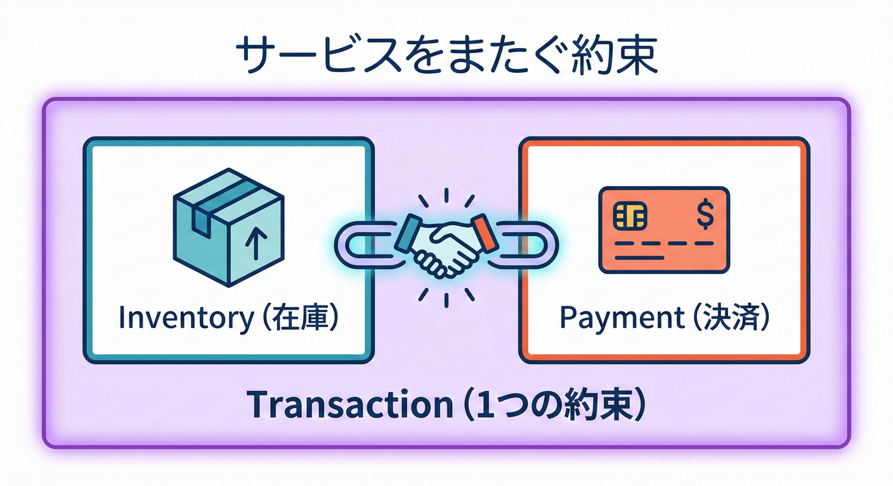
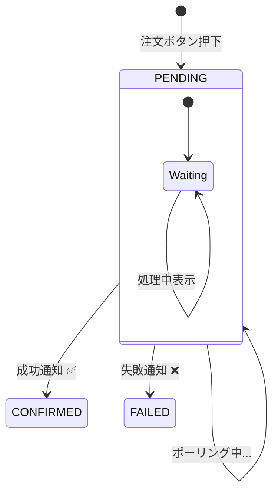

# 第10章：最終的整合性＝“UXで支える設計”🎨⏳

## この章でやること 🧭✨

最終的整合性（eventual consistency）って、**システム内部で「あとから一致する」**世界だよね🌀
この章では、その“遅れ”をユーザーに押し付けずに、**画面（UX）で安心して待てる形**にするコツを学ぶよ😊🫶

* 「今なにが起きてる？」が分かる表示 👀
* 「受け付けたよ」→「あとで確定するよ」の見せ方 📨
* 失敗したときの“戻し”と“リカバリ” 😵‍💫➡️😌
* そしてミニ実装：注文→「反映待ち」→確定/失敗を体験 🧪🛒

---

## 10.1 最終的整合性って、結局なに？🧠💡

最終的整合性は、ひとことで言うとこう👇

* ✅ **受け付け（受付完了）**はすぐ返せる
* ⏳ でも **確定（反映・整合）**は少し遅れてくる
* 🔁 その間、DB/画面/他サービスの状態が一時的にズレることがある



この章のポイントはここ👇
**“ズレる”こと自体は仕様としてOK。でも“ズレが見えない”のがNG** 😵‍💫💥

---

## 10.2 UXで支えないと起きる事故あるある 😱📉


“遅れて確定”をUXで支えないと、こうなるよ👇

### 事故①：二重注文（連打）🖱️🖱️🖱️

「押したのに反応ない…」→もう1回押す → 2回注文😇

### 事故②：不安で問い合わせ爆増📞💬

「注文できてますか？」が大量に来る
→ サポートもユーザーもつらい🥲

### 事故③：画面が嘘をつく（信用を失う）😵

「注文完了！」って出たのに、あとで失敗してた…
→ これ、信用が削れるやつ😇🪓

---

## 10.3 “UXで支える”ための3点セット 🧰✨


最終的整合性をやるなら、だいたいこの3つをセットで考えるよ👇

### ① 状態（ステータス）を作る 🏷️

「今どの段階？」を **機械にも人にも分かる**ようにする

### ② 状態を見せる（安心できる表示）👀🫶

処理中・反映待ち・確定・失敗を、ちゃんと見せる

### ③ 失敗したときの戻し（リカバリ）🧯

* 自動で戻す（取り消し・返金など）
* ユーザーに次の行動を提示（再試行ボタン等）

---

## 10.4 ステータス設計：まずは最小でOK 🧩✅


いきなり細かい状態を作ると、画面も実装も大変になるよ〜😵‍💫
まずは最小セットがおすすめ👇

* `PENDING`（反映待ち）⏳
* `CONFIRMED`（確定）✅
* `FAILED`（失敗）❌

状態遷移のイメージはこれ👇

```text
PENDING  ──→  CONFIRMED
   │
   └────→  FAILED
```



> 💡“処理中”と“反映待ち”は、初心者のうちは同じ扱いでOKだよ😊

---

## 10.5 文言（コピー）のコツ：嘘をつかずに安心させる 💬🫶


最終的整合性のUXで最重要なのは **言い方**🥺✨
ポイントはこれ👇

### ✅ NG例（やりがち）🙅‍♀️

* 「注文完了しました！」（まだ確定してないのに言っちゃう）
* 「すぐ反映されます」（実際は遅れるかも）

### ✅ OK例（安心＆誠実）🙆‍♀️

* 「注文を受け付けました。確定まで少し時間がかかることがあります。」⏳
* 「反映待ちです。画面を閉じても処理は続きます。」📌
* 「確定したら表示が更新されます。」🔄

### さらに効くやつ✨

* **追跡できるID**を出す（注文ID）🪪
  → 「この番号があれば追える」って安心する😊

---

## 10.6 ハンズオン：注文後に「反映待ち」ステータスを入れる 🛒⏳✅


ここから手を動かすよ〜🧪✨
狙いはこれ👇

* 注文APIは **即レス**（`PENDING`で返す）⚡
* Workerがあとで処理して `CONFIRMED` or `FAILED` に更新 🔧
* 画面は **ポーリング**で状態を追いかけて表示更新 👀🔄

### いまの“2026っぽい”前提メモ（最新）🆕

* TypeScript は 5.9 系の情報が公開されているよ📘✨ ([typescriptlang.org][1])
* Node.js は v24 が Active LTS（2026-01-12更新）になってるよ🟢 ([nodejs.org][2])
* Express は v5 が npm の最新系で進んでて、express は 5.2.1 が公開されてるよ🚀 ([Npm][3])
* tsx は 4.21.0 が @latest だよ（TS実行がラク）🏃‍♀️💨 ([Npm][4])

---

### 10.6.1 追加するファイル（最小セット）📁✨

この章で追加・変更するのはだいたいこれ👇

* `data/orders.json`（簡易DB）🗃️
* `apps/shared/src/types.ts`（型）🧷
* `apps/shared/src/orderStore.ts`（JSON読み書き）🧰
* `apps/api/src/index.ts`（API + 静的配信）🌐
* `apps/worker/src/index.ts`（遅延処理）🔧
* `apps/api/public/index.html`（画面）🖥️
* `apps/api/public/app.js`（画面ロジック）🔄

> 💡本物の現場だとDBやキューを使うけど、ここは“体感”のために **JSONファイル**でいくよ😊🧪

---

## 10.6.2 まず型：Order と Status 🧷📘

`apps/shared/src/types.ts`

```ts
export type OrderStatus = "PENDING" | "CONFIRMED" | "FAILED";

export type Order = {
  id: string;
  status: OrderStatus;
  createdAt: string;
  updatedAt: string;
  message?: string; // 画面に出す安心メッセージ用 💬
};
```

---

## 10.6.3 簡易ストア：orders.json を読み書きする 🗃️🔄

`apps/shared/src/orderStore.ts`

```ts
import { promises as fs } from "node:fs";
import path from "node:path";
import { Order, OrderStatus } from "./types";

const dataFile = path.resolve(process.cwd(), "data", "orders.json");

async function ensureDataFile() {
  const dir = path.dirname(dataFile);
  await fs.mkdir(dir, { recursive: true });
  try {
    await fs.access(dataFile);
  } catch {
    await fs.writeFile(dataFile, JSON.stringify([], null, 2), "utf-8");
  }
}

async function readAll(): Promise<Order[]> {
  await ensureDataFile();
  const text = await fs.readFile(dataFile, "utf-8");
  return JSON.parse(text) as Order[];
}

async function writeAll(orders: Order[]): Promise<void> {
  await ensureDataFile();
  const tmp = dataFile + ".tmp";
  await fs.writeFile(tmp, JSON.stringify(orders, null, 2), "utf-8");
  await fs.rename(tmp, dataFile);
}

export async function createOrder(id: string): Promise<Order> {
  const now = new Date().toISOString();
  const order: Order = { id, status: "PENDING", createdAt: now, updatedAt: now };
  const orders = await readAll();
  orders.unshift(order);
  await writeAll(orders);
  return order;
}

export async function getOrder(id: string): Promise<Order | undefined> {
  const orders = await readAll();
  return orders.find((o) => o.id === id);
}

export async function listOrders(limit = 20): Promise<Order[]> {
  const orders = await readAll();
  return orders.slice(0, limit);
}

export async function updateOrderStatus(
  id: string,
  status: OrderStatus,
  message?: string,
): Promise<Order | undefined> {
  const orders = await readAll();
  const target = orders.find((o) => o.id === id);
  if (!target) return undefined;

  target.status = status;
  target.updatedAt = new Date().toISOString();
  target.message = message;

  await writeAll(orders);
  return target;
}
```

---

## 10.6.4 API：注文はすぐ受け付けて PENDING を返す ⚡📨

`apps/api/src/index.ts`

```ts
import express from "express";
import path from "node:path";
import crypto from "node:crypto";
import { createOrder, getOrder, listOrders } from "../../shared/src/orderStore";

const app = express();
app.use(express.json());

// 画面を配信（public を静的配信）🖥️
const publicDir = path.resolve(process.cwd(), "apps", "api", "public");
app.use(express.static(publicDir));

// 注文作成：即レスで PENDING を返す 📨⏳
app.post("/api/orders", async (_req, res) => {
  const id = crypto.randomUUID();
  const order = await createOrder(id);

  res.status(202).json({
    orderId: order.id,
    status: order.status,
    message: "注文を受け付けたよ！確定まで少し待ってね😊⏳",
  });
});

// 注文取得：画面がポーリングで叩く 👀🔄
app.get("/api/orders/:id", async (req, res) => {
  const order = await getOrder(req.params.id);
  if (!order) {
    res.status(404).json({ message: "見つからなかったよ🥲" });
    return;
  }
  res.json(order);
});

// デバッグ用：一覧（最新20件）🧪
app.get("/api/orders", async (_req, res) => {
  const orders = await listOrders(20);
  res.json(orders);
});

const port = 3000;
app.listen(port, () => {
  console.log(`API listening on http://localhost:${port} 🚀`);
});
```

> 💡ここで大事なのは `202 Accepted` を使ってるところ！
> 「確定じゃないけど、受け付けたよ」って意味をHTTPでも表現できてえらい👏✨

---

## 10.6.5 Worker：あとから確定 or 失敗にする 🔧🎲

`apps/worker/src/index.ts`

```ts
import { listOrders, updateOrderStatus } from "../../shared/src/orderStore";

function sleep(ms: number) {
  return new Promise((r) => setTimeout(r, ms));
}

async function processLoop() {
  const orders = await listOrders(50);
  const pendings = orders.filter((o) => o.status === "PENDING");

  for (const o of pendings) {
    // 作成直後は少し待ってから処理する（“反映待ち”を体感するため）⏳
    const ageMs = Date.now() - new Date(o.createdAt).getTime();
    if (ageMs < 1500) continue;

    // “処理中”っぽい遅延を作る 🐢
    await sleep(800 + Math.floor(Math.random() * 1200));

    // たまに失敗させる（リアルっぽさ）😵‍💫
    const fail = Math.random() < 0.2;

    if (fail) {
      await updateOrderStatus(
        o.id,
        "FAILED",
        "ごめんね…在庫確認で止まっちゃった！もう一回試してね🥺🔁",
      );
      console.log(`FAILED  ${o.id}`);
    } else {
      await updateOrderStatus(o.id, "CONFIRMED", "確定したよ！ありがとう😊✅");
      console.log(`CONFIRMED ${o.id}`);
    }
  }
}

console.log("Worker started 🔧");

setInterval(() => {
  processLoop().catch((e) => console.error(e));
}, 800);
```

---

## 10.6.6 画面：反映待ち→確定/失敗を“見える化”する 🖥️👀

`apps/api/public/index.html`

```html
<!doctype html>
<html lang="ja">
  <head>
    <meta charset="UTF-8" />
    <meta name="viewport" content="width=device-width, initial-scale=1.0" />
    <title>反映待ちデモ</title>
    <style>
      body { font-family: system-ui, sans-serif; margin: 24px; }
      .card { border: 1px solid #ddd; border-radius: 12px; padding: 16px; max-width: 640px; }
      .row { display: flex; gap: 12px; align-items: center; flex-wrap: wrap; }
      button { padding: 10px 14px; border-radius: 10px; border: 1px solid #ccc; cursor: pointer; }
      .badge { padding: 4px 10px; border-radius: 999px; border: 1px solid #ddd; }
      .muted { color: #666; }
      pre { background: #f7f7f7; padding: 12px; border-radius: 12px; overflow: auto; }
    </style>
  </head>
  <body>
    <div class="card">
      <h1>最終的整合性：反映待ちデモ 🎨⏳</h1>

      <div class="row">
        <button id="orderBtn">注文する 🛒</button>
        <span class="badge" id="statusBadge">-</span>
      </div>

      <p id="message" class="muted">まだ注文してないよ😊</p>
      <p class="muted">注文ID: <span id="orderId">-</span></p>

      <details>
        <summary>デバッグ（レスポンス）🧪</summary>
        <pre id="debug">{}</pre>
      </details>
    </div>

    <script type="module" src="./app.js"></script>
  </body>
</html>
```

`apps/api/public/app.js`

```js
const orderBtn = document.getElementById("orderBtn");
const statusBadge = document.getElementById("statusBadge");
const messageEl = document.getElementById("message");
const orderIdEl = document.getElementById("orderId");
const debugEl = document.getElementById("debug");

let currentOrderId = null;
let pollingTimer = null;

function setUI({ status, message, orderId, debug }) {
  statusBadge.textContent = status ?? "-";
  messageEl.textContent = message ?? "";
  orderIdEl.textContent = orderId ?? "-";
  debugEl.textContent = JSON.stringify(debug ?? {}, null, 2);
}

async function createOrder() {
  orderBtn.disabled = true; // 連打防止（UXで事故を減らす）🧷
  setUI({
    status: "PENDING",
    message: "注文を送ってるよ…📨",
    orderId: "-",
    debug: {},
  });

  const res = await fetch("/api/orders", { method: "POST" });
  const data = await res.json();

  currentOrderId = data.orderId;
  setUI({
    status: data.status,
    message: data.message + "（この画面は自動で更新するよ🔄）",
    orderId: data.orderId,
    debug: data,
  });

  startPolling(currentOrderId);
}

function startPolling(orderId) {
  if (pollingTimer) clearInterval(pollingTimer);

  pollingTimer = setInterval(async () => {
    const res = await fetch(`/api/orders/${orderId}`);
    const data = await res.json();

    // ステータスに応じて“見せ方”を変える 🎨
    if (data.status === "PENDING") {
      setUI({
        status: "PENDING",
        message: data.message ?? "反映待ちだよ⏳（画面を閉じても処理は続くよ😊）",
        orderId: data.id,
        debug: data,
      });
      return;
    }

    if (data.status === "CONFIRMED") {
      setUI({
        status: "CONFIRMED ✅",
        message: data.message ?? "確定したよ！😊✅",
        orderId: data.id,
        debug: data,
      });
      orderBtn.disabled = false;
      clearInterval(pollingTimer);
      pollingTimer = null;
      return;
    }

    if (data.status === "FAILED") {
      setUI({
        status: "FAILED ❌",
        message: (data.message ?? "失敗しちゃった🥲") + "（もう一回注文してみてね🔁）",
        orderId: data.id,
        debug: data,
      });
      orderBtn.disabled = false;
      clearInterval(pollingTimer);
      pollingTimer = null;
      return;
    }
  }, 800);
}

orderBtn.addEventListener("click", () => {
  createOrder().catch((e) => {
    console.error(e);
    orderBtn.disabled = false;
    setUI({ status: "ERROR", message: "エラーだよ🥲", orderId: "-", debug: { error: String(e) } });
  });
});
```

---

## 10.6.7 動かし方（最小）▶️🧪

> ここはプロジェクトの scripts に合わせてOKだよ😊
> もしTS実行に `tsx` を使うなら、最近は 4.21.0 が @latest だよ🏃‍♀️💨 ([Npm][4])

例（ざっくり）👇

```bash
# API
npx tsx apps/api/src/index.ts

# 別ターミナルで Worker
npx tsx apps/worker/src/index.ts
```

ブラウザで `http://localhost:3000` を開いて、注文ボタンを押してね🛒✨
**PENDING → CONFIRMED/FAILED** が見えたら成功〜😊🎉

---

## 10.7 ここが“UXで支えてる”ポイントだよ ✅🎨

このデモ、地味だけど大事なことをしてるよ👇

* **即レス**：押したらすぐ「受け付けたよ」って返す ⚡
* **状態の見える化**：PENDING を画面に出す 👀
* **連打防止**：ボタンを無効化 🧷
* **失敗時の次の行動**：「もう一回試してね」って誘導 🔁
* **追跡ID**：注文IDを出して安心材料にする 🪪

---

## 10.8 よくある落とし穴（初心者が踏みがち）🕳️😵‍💫


### 落とし穴①：PENDINGなのに「完了」って言っちゃう 🙅‍♀️

→ UXの嘘は信用を削る🪓🥲

### 落とし穴②：ずっとPENDINGで詰む ♾️⏳

→ タイムアウト方針が必要
例：「3分超えたら“状況確認中”に切り替え」など🧭

### 落とし穴③：更新方法がない（リロードしたら行方不明）🫥

→ 注文IDで再表示できる導線があると強い💪✨

---

## 10.9 AI活用：画面文言を“安心する日本語”にする 💬🤖✨


この章のAIは、**実装よりも“言い方”づくり**が最強だよ🥺🫶

### プロンプト例①：PENDING文言を量産して選ぶ 🏭💬

```text
ECの注文処理で「反映待ち(PENDING)」中に出す文言を20個ください。
条件:
- ユーザーが不安にならない
- “完了”とは言わない
- 画面を閉じても処理が続くことを示せる
- 砕けすぎない丁寧さ
```

### プロンプト例②：FAILED時の“次の行動”を作る 🧯🔁

```text
注文失敗(FAILED)時の画面文言を10案ください。
条件:
- 謝る
- 原因をぼかしすぎない（例: 在庫確認/決済など）
- 次にできる行動（再試行/問い合わせ/注文履歴確認）を必ず1つ入れる
```

### プロンプト例③：UXレビュー（ダメ出し役）👀🧠

```text
以下のUI文言と状態設計をレビューして、事故りそうな点を10個指摘して。
特に二重注文・不安・問い合わせ増の観点で見て。
（ここにPENDING/CONFIRMED/FAILEDの文言を貼る）
```

---

## まとめ ✍️😊🎀

* 最終的整合性は **“遅れて一致する”世界** ⏳
* だから設計は「データ」だけじゃなくて、**UX（見せ方）も設計の一部**🎨
* 最小の状態（`PENDING/CONFIRMED/FAILED`）でも、安心は作れる🫶
* 「受け付け」と「確定」を分けて、嘘をつかない文言にするのがコツ💬✅

（参考：Node.js のリリースラインやLTS状況は Node.js公式のリリース表で更新されてるよ🗓️ ([nodejs.org][2])）

[1]: https://www.typescriptlang.org/docs/handbook/release-notes/typescript-5-9.html?utm_source=chatgpt.com "Documentation - TypeScript 5.9"
[2]: https://nodejs.org/en/about/previous-releases?utm_source=chatgpt.com "Node.js Releases"
[3]: https://www.npmjs.com/package/express?utm_source=chatgpt.com "Express"
[4]: https://www.npmjs.com/package/tsx?utm_source=chatgpt.com "tsx"
