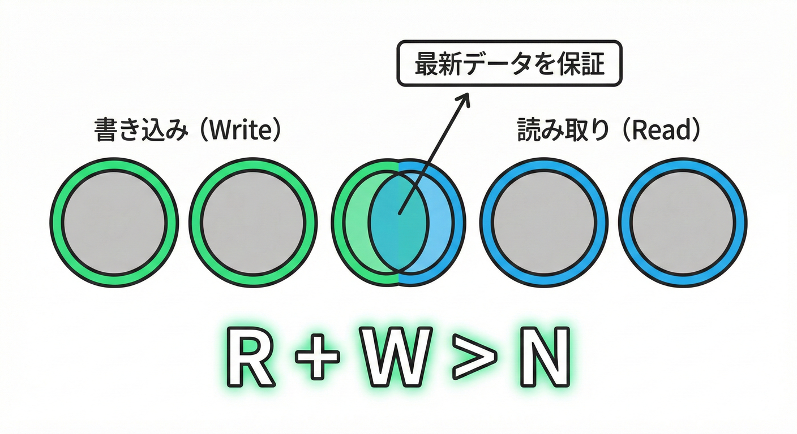
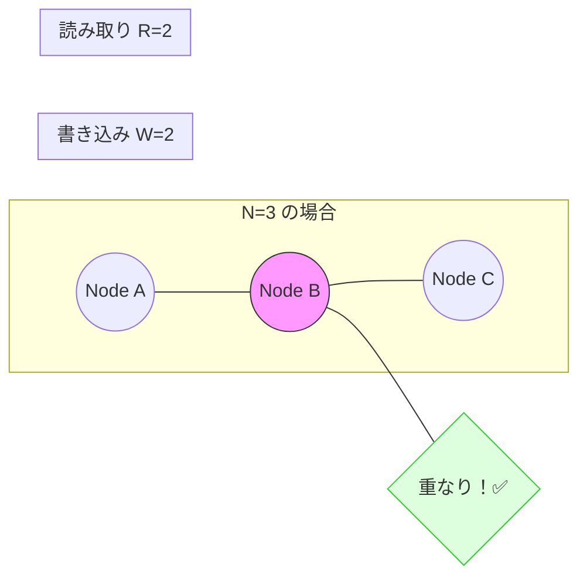

# 第16章：クォーラムの直感（多数決）🗳️✨

**結論1行**：**「N個に複製したデータ」を“何票集まったらOK？”で運用すると、速さ⚡と一致✅のバランスを選べるよ（それがクォーラム）**😊✨

---

## 16.1 クォーラムってなに？（超ざっくり）🧠💡


分散では、同じデータを複数のノードにコピー（レプリケーション）します📦📦📦
でもコピーは“同時ピッタリ”には揃わないことがあるんだったね…⏳😵‍💫

そこで登場するのが **クォーラム（quorum）＝「何票集まったら成功にする？」** という考え方🗳️✨

* **書き込み**：何台が「書けたよ！」って返したら成功にする？✍️✅
* **読み取り**：何台から返事が来たら「これで決める！」にする？👀✅

この「票数」を変えると、**速いけどズレやすい**⚡🌀／**遅いけど揃いやすい**🐢✅ を調整できるのがポイント！

---

## 16.2 N / W / R って何？🔤📌


クォーラムはだいたいこの3つで話します👇

* **N**：同じデータを置くコピー数（複製数）＝レプリカ数
* **W**：書き込み成功に必要な「OK票」の数
* **R**：読み取りで集める「回答票」の数

Cassandraのドキュメントでも、Dynamo系の考え方として **R / W / N と `R + W > N`** が説明されています📘✨ ([Apache Cassandra][1])

---

## 16.3 いちばん大事：`R + W > N` の直感 🤝✨

**`R + W > N` だと、読み取り側と書き込み側の“投票メンバー”が必ず重なる**（少なくとも1台は共通になる）
→ **「書き込みでOKした最新データ」を、読み取りで拾える可能性が高くなる** という直感😊

この“重なり”がクォーラムのキモで、解説としてもよく **「読み取り集合と書き込み集合が交差する」** と説明されます🧩 ([System Overflow][2])





---

## 16.4 3ノードでイメージしよう（N=3）🧑‍🤝‍🧑🧑‍🤝‍🧑🧑‍🤝‍🧑


```text
ノード A / B / C の3台にコピー（N=3）

書き込み W=2（2票で成功）
読み取り R=2（2票集めて決める）

書き込みのOK票：AとB だったとする
読み取りの回答票：BとC だったとする

→ B が “かぶってる”！
→ だから、読み取りは「最新を知ってるノード」に当たりやすい✨
```

### よく使う定番（過半数）🗳️✨

* **QUORUM / majority** は「だいたい過半数」
* たとえばレプリカ3台なら **2台** がクォーラム（過半数）
  （Cassandraでは QUORUM の計算式例も明記されてるよ）([DataStax Documentation][3])

---

## 16.5 ハンズオン：3ノード擬似クラスターで「2票取れたらOK」を体験🧪✨

ここでは「分散DBっぽい雰囲気」を **TypeScriptのミニ実験**で体験するよ😊
（本物のDBは使わず、メモリ上で “レプリカ3台” を真似するだけ！）

### ① 依存の追加（tsxでTSをそのまま実行）⚙️

```bash
npm i -D tsx
```

### ② ファイル作成📄✨

`apps/sim/quorum.ts` を作って、次を貼り付けてね👇

```ts
type Value = { version: number; data: string };

class Replica {
  public store: Value = { version: 0, data: "(init)" };

  constructor(
    public readonly name: string,
    public isUp = true,
    public dropWrites = false,        // 擬似的な分断：このノードだけ書き込みが届かない
    public latencyMs = 50             // 擬似遅延
  ) {}

  async write(v: Value): Promise<void> {
    if (!this.isUp) throw new Error(`${this.name} is down`);
    if (this.dropWrites) throw new Error(`${this.name} dropped write (partition)`);

    await sleep(this.latencyMs);
    if (v.version >= this.store.version) {
      this.store = v;
    }
  }

  async read(): Promise<Value> {
    if (!this.isUp) throw new Error(`${this.name} is down`);
    await sleep(this.latencyMs);
    return this.store;
  }
}

class Coordinator {
  private version = 0;

  constructor(
    private readonly replicas: Replica[],
    private readonly N: number,
    private readonly W: number,
    private readonly R: number
  ) {}

  async write(data: string): Promise<void> {
    const v: Value = { version: ++this.version, data };

    const tasks = this.replicas.map(async (r) => {
      await r.write(v);
      return r.name;
    });

    const ok = await settleUntil(tasks, this.W);
    console.log(`✍️ write "${data}" v=${v.version} ✅ acks=${ok.join(", ")}`);
  }

  async read(): Promise<Value> {
    // “最初に返ってきたR件”だけで決める（CL=ONEみたいな雰囲気）
    const tasks = this.replicas.map(async (r) => {
      const val = await r.read();
      return { from: r.name, val };
    });

    const got = await settleUntil(tasks, this.R);
    const picked = got
      .map((x) => x.val)
      .reduce((a, b) => (a.version >= b.version ? a : b));

    console.log(
      `👀 read (R=${this.R}) got=[${got.map((x) => `${x.from}:v${x.val.version}`).join(", ")}] -> pick v${picked.version}`
    );

    return picked;
  }
}

async function sleep(ms: number) {
  return new Promise<void>((res) => setTimeout(res, ms));
}

// Promise配列から「成功がk件集まるまで」待つ（失敗は無視）
// k件集まらなければ失敗
async function settleUntil<T>(promises: Promise<T>[], k: number): Promise<T[]> {
  return new Promise<T[]>((resolve, reject) => {
    const results: T[] = [];
    let done = 0;
    let failed = 0;

    promises.forEach((p) => {
      p.then((v) => {
        results.push(v);
        done++;
        if (results.length >= k) resolve(results);
      }).catch(() => {
        failed++;
        done++;
        if (done === promises.length && results.length < k) {
          reject(new Error(`Not enough successes: need ${k}, got ${results.length}`));
        }
      });
    });
  });
}

async function main() {
  // ✅ Case A: “多数決でOK” (N=3, W=2, R=2)
  console.log("\n=== Case A: N=3 W=2 R=2 (quorum) ===");
  {
    const A = new Replica("A", true, false, 30);
    const B = new Replica("B", true, false, 40);
    const C = new Replica("C", true, false, 200); // ちょい遅い
    const coord = new Coordinator([A, B, C], 3, 2, 2);

    await coord.write("apple");
    await coord.read();
  }

  // ⚡ Case B: “速いけどズレやすい” (N=3, W=1, R=1)
  console.log("\n=== Case B: N=3 W=1 R=1 (fast but stale risk) ===");
  {
    const A = new Replica("A", true, true, 20);   // Aだけ分断：書き込み届かない
    const B = new Replica("B", true, false, 40);
    const C = new Replica("C", true, false, 200);

    const coord = new Coordinator([A, B, C], 3, 1, 1);

    await coord.write("banana");
    // Aが最速で返事すると「古い値」を返しやすい
    await coord.read();
  }

  // 💥 Case C: “強いけど落ちやすい” (N=3, W=3, R=1)
  console.log("\n=== Case C: N=3 W=3 R=1 (very strict write) ===");
  {
    const A = new Replica("A", true, false, 30);
    const B = new Replica("B", true, false, 40);
    const C = new Replica("C", false, false, 50); // Cダウン
    const coord = new Coordinator([A, B, C], 3, 3, 1);

    try {
      await coord.write("choco");
    } catch (e) {
      console.log("😱 write failed because W=3 needs all replicas");
    }
  }
}

main().catch((e) => console.error(e));
```

### ③ 実行する🚀

```bash
npx tsx apps/sim/quorum.ts
```

---

## 16.6 何が“体感”できた？👀✨（ログの読み方）

### ✅ Case A（W=2, R=2）＝「多数決で一致を取りに行く」🗳️✅


* 書き込みは **2台のOK**が必要 → ちょい遅くなる🐢
* 読み取りも **2台の回答**が必要 → ちょい遅くなる🐢
* でも、**読み書き集合が重なる**ので、最新に当たりやすい🤝✨ ([System Overflow][2])

### ⚡ Case B（W=1, R=1）＝「速さ優先」⚡😆


* 書き込みが **1台OK**で成功 → めちゃ速い⚡
* 読み取りも **1台だけ**で決める → めちゃ速い⚡
* でも **その1台が古い/分断中**だと、**古い値を読む**ことがある😵‍💫🌀
  （Cassandraでも “ONEは古い読み取りの確率が高いが可用性が高い” という趣旨で説明されるよ）([DataStax Documentation][3])

### 💥 Case C（W=3）＝「全員一致」🧱😇


* 1台でも落ちたら **書き込み失敗**しやすい😱
* 強いけど **可用性が落ちやすい**（CAPの肌感覚ポイント！）⚖️💥

---

## 16.7 「多数決」って、現場ではどんな形で出てくる？🏢🧩

### Cassandra系：`R + W > N` を“調整可能”にする発想🛠️✨

Cassandraの考え方として、**RとWを設定して `R + W > N` を狙う**という説明が公式にあるよ📘 ([Apache Cassandra][1])

さらに QUORUM の計算（過半数）も具体的に書かれてる🗳️ ([DataStax Documentation][3])

### MongoDB系：「majority（過半数）」で“確定したものだけ返す”🧷✅

MongoDBの read concern `"majority"` は、**過半数で確認済みのデータだけ返す**趣旨で説明されてるよ🧾 ([MongoDB][4])
（つまり「多数決で“確定”したもの」って感覚に近い😊）

---

## 16.8 ありがちな勘違い＆注意点⚠️😵

### 勘違い①：クォーラム＝「必ず最新が見える魔法」ではない🪄❌


`R + W > N` は “直感の強い道具” だけど、現実には

* 遅延⏳
* 分断🔌
* 同時更新⚔️
  が絡むので、**競合解決（LWWとかドメインルールとか）**も必要になるよ（この教材の後半でやるやつ！）🎛️🧠

### 勘違い②：「多数決」＝「合意アルゴリズム（Raft/Paxos）」だと思う🤯

クォーラムはここでは **“複製の読み書き票数”** の話。
「1つに決める合意」そのものとは別物だよ（混ぜないの大事）🧠✨

### 勘違い③：過半数にすると“絶対に速い”わけでもない🐢

**遅いノードが混じると、WやRが満たせなくて全体が引っ張られる**ことがあるよ😵‍💫
（だから「どこでクォーラムを使うか」を選ぶのが設計！）

---

## 16.9 練習問題（N/R/Wの組み合わせ）✍️🤖✨

### 問1：N=3 のとき、「`R + W > N` を満たす」組み合わせを3つ言ってね🧩

ヒント：`R + W` が **4以上**ならOK😊

**答え例**：

* R=2, W=2 ✅
* R=1, W=3 ✅
* R=3, W=1 ✅

---

### 問2：N=5 のとき、「過半数（majority）」はいくつ？🗳️

**答え**：3（だいたい `floor(5/2)+1`）✅
“過半数”の雰囲気は Cassandra の QUORUM 計算例でも見れるよ📘 ([DataStax Documentation][3])

---

### 問3：「読み取りを速くしたい」けど「古い読み取りは減らしたい」🥺💭

N=3なら、まず試すならどれ？（1つ選ぶ）

* A) R=1, W=1
* B) R=2, W=2
* C) R=3, W=3

**おすすめ**：B ✅
速さは落ちるけど、**多数決の交差**で「古い読み取り」を減らしやすい🤝✨ ([System Overflow][2])

---

## 16.10 AIの使い方（練習問題を量産）🤖📚✨

AIには「答えつきの小テスト」を作らせるのが超便利だよ😊
例👇

```text
N/R/Wのクォーラム練習問題を10問作って。
条件：
- N=3,5,7 を混ぜる
- 「R+W>N を満たすか？」だけじゃなく、
  「可用性が落ちやすいのはどれ？」も混ぜる
- 各問に“なぜそうなるか”を一言で解説して
```

---

## まとめ📝✨

* クォーラムは **「何票集まったら成功？」** で分散の読み書きを設計する道具🗳️
* **`R + W > N`** は「読み取り集合と書き込み集合が重なる」直感の式🤝✨ ([Apache Cassandra][1])
* 過半数（QUORUM / majority）は定番で、実DBでも普通に出てくるよ📘🧾 ([DataStax Documentation][3])

[1]: https://cassandra.apache.org/doc/latest/cassandra/architecture/dynamo.html "Dynamo | Apache Cassandra Documentation"
[2]: https://www.systemoverflow.com/learn/replication-consistency/consistency-models/quorum-based-tunable-consistency-the-rwn-formula "Quorum Based Tunable Consistency: The R+W>N Formula | Consistency Models - System Overflow"
[3]: https://docs.datastax.com/en/cassandra-oss/3.0/cassandra/dml/dmlConfigConsistency.html "How is the consistency level configured?"
[4]: https://www.mongodb.com/ja-jp/docs/manual/reference/read-concern-majority/ "読み取り保証 (read concern) \"過半数\" - データベース マニュアル - MongoDB Docs"
