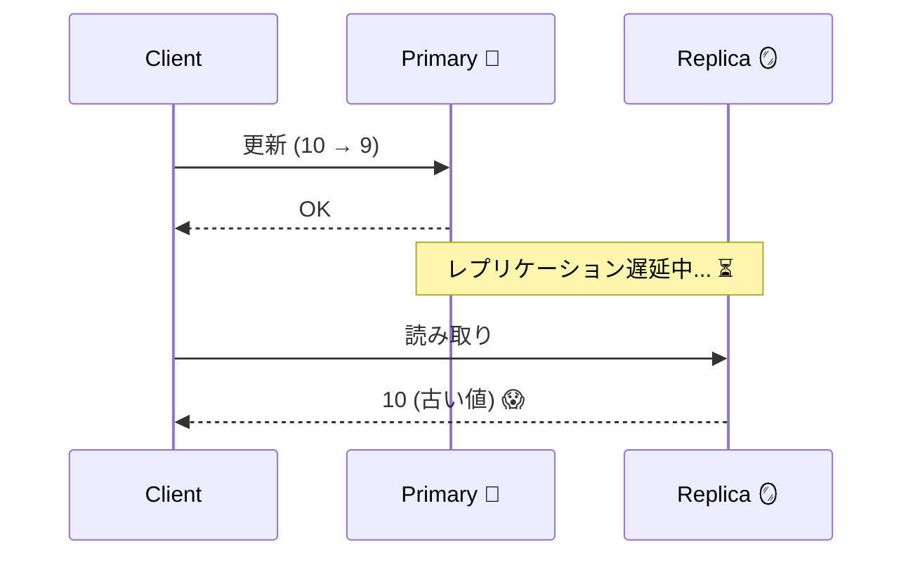
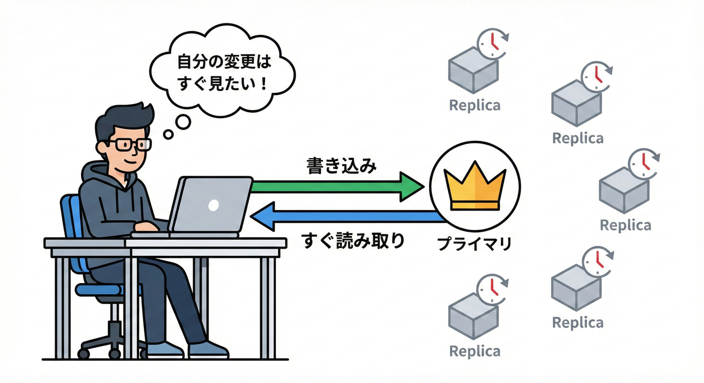

# 第17章：古い読み取りを減らす工夫（超入門）🧹📚

**結論：**「更新直後だけ“新しいほう（Primary/Leader）”を読む」ルールを入れるだけで、ユーザー体験の“ズレ感”が一気に減るよ✨😊

---

## 17.1 「古い読み取り」ってなに？😵‍💫📖


分散っぽい構成（Primary と Replica がある、キャッシュがある、非同期で反映する…）になると、

* **書いた直後に読んだのに、古い値が返る**😱
* **画面を更新したら戻ったみたいに見える**🔄💦
* **「保存できてない？」って不安になる**🥺

みたいなことが起きるよ。

たとえば在庫：

* いま在庫を **10 → 9** に減らした（Primary には反映済み）
* でも Replica はまだ追いついてなくて **10のまま**（ラグ中）⏳

この状態で Replica を読んじゃうと「10」が返ってきて、**“あれ？減ってない”**って見えるわけ😵‍💫



---

## 17.2 どうして起きるの？（超ざっくり）🧠🔍


原因はだいたいこのどれか：

1. **レプリケーション遅延（replication lag）** 🪞⏳
   Primary の更新が Replica に届くまで時間がかかる

2. **読む場所が分散してる** 🧭
   速いから Replica / Cache を読んだら古かった

3. **“同じユーザーの連続操作”を考えてない** 👤
   ユーザーは「いま自分が押した結果」をすぐ見たいのに、設計がそこに寄り添ってない

---

## 17.3 古い読み取りを減らす“地味テク”一覧🧰✨

ここからが本題！「強整合にする」みたいな大工事の前に、**小技でズレを減らす**のがこの章だよ😊

### ✅ テク1：更新直後だけ Primary を読む（いちばん効く）👑📌


* **狙い：**「自分が今した操作」だけは新しく見せる
* **コスト：**小（ルール1個でいける）
* **効果：**大（体感が激変）✨

### ✅ テク2：Read-your-writes（自分の書き込みは見える）👤✅

* **狙い：**「私が保存したんだから、次の読み取りで見せて！」を守る
* **やり方：**“同じセッション/同じユーザー”は一定条件で新しい系へ
* 「Read-your-writes」はセッション保証の代表例だよ🧠 ([GeeksforGeeks][1])



### ✅ テク3：Read Repair（読んだついでに古いReplicaを直す）🩹📚


* **狙い：**古い Replica を少しずつ減らして、全体を“じわじわ”良くする
* **イメージ：**読んだ瞬間に「古っ！じゃあ更新しとくね」って修理する感じ🔧
* 「read repair」は、読み取り時に不整合を検知して古い複製を更新する考え方だよ🧠 ([Stack Overflow][2])

### ✅ テク4：少し待ってから読む（“待てる範囲”で新しさを買う）⏳🛒

* **狙い：**Replica が追いつくまで **最大◯msだけ待つ**
* DBによっては“読み取り整合性レベル”を調整できるものもあるよ（例：セッションの変更が見えるまで待つ）🧠 ([AWS ドキュメント][3])

---

## 17.4 ハンズオン：更新直後だけ Primary を読むルールを入れよう🧪👑

ここでは、わざと **Replica が遅れる**状況を作って、
そのうえで **「更新直後だけ Primary」** を入れて改善するよ😊✨

---

### 17.4.1 まずは“遅いReplica”を用意する🐢🪞


今回の簡易ルール：

* Primary：`data/primary.json`
* Replica：`data/replica.json`
* イベントログ：`data/events.log`（JSON Lines）
* Worker：イベントログを読み、**わざと遅れて** replica.json を更新する

> こうすると「更新したのに古い読み取りが出る」を確実に再現できるよ😈🧪

---

### 17.4.2 `apps/api/src/server.ts`（API）🛠️📮

```ts
import { createServer } from "node:http";
import { mkdir, readFile, writeFile, rename, rm, appendFile } from "node:fs/promises";
import { randomUUID } from "node:crypto";
import { URL } from "node:url";

type Item = {
  id: string;
  stock: number;
  version: number;     // 競合や新旧判定のためのバージョン
  updatedAt: string;   // ISO文字列
};

const DATA_DIR = "data";
const PRIMARY_PATH = `${DATA_DIR}/primary.json`;
const REPLICA_PATH = `${DATA_DIR}/replica.json`;
const EVENTS_PATH = `${DATA_DIR}/events.log`;

// 「更新直後はPrimary読む」ためのメモ（itemId -> 期限）
const forcePrimaryUntil = new Map<string, number>();

async function ensureDataFiles() {
  await mkdir(DATA_DIR, { recursive: true });

  // 初期ファイルがなければ作る（超簡易）
  await safeInitJson(PRIMARY_PATH, {});
  await safeInitJson(REPLICA_PATH, {});
  await safeInitText(EVENTS_PATH, "");
}

async function safeInitJson(path: string, initial: unknown) {
  try {
    await readFile(path, "utf8");
  } catch {
    await writeJsonAtomic(path, initial);
  }
}
async function safeInitText(path: string, initial: string) {
  try {
    await readFile(path, "utf8");
  } catch {
    await writeFile(path, initial, "utf8");
  }
}

async function readJson<T>(path: string, fallback: T): Promise<T> {
  try {
    const txt = await readFile(path, "utf8");
    return (txt.trim() ? JSON.parse(txt) : fallback) as T;
  } catch {
    return fallback;
  }
}

async function writeJsonAtomic(path: string, data: unknown) {
  const tmp = `${path}.${randomUUID()}.tmp`;
  await writeFile(tmp, JSON.stringify(data, null, 2), "utf8");
  // Windowsで上書きrenameが失敗しやすいので、先に消す
  await rm(path, { force: true });
  await rename(tmp, path);
}

function jsonResponse(res: any, status: number, body: unknown, headers: Record<string, string> = {}) {
  const payload = JSON.stringify(body);
  res.writeHead(status, { "content-type": "application/json; charset=utf-8", ...headers });
  res.end(payload);
}

async function readBody(req: any): Promise<any> {
  const chunks: Buffer[] = [];
  for await (const c of req) chunks.push(c);
  const text = Buffer.concat(chunks).toString("utf8").trim();
  if (!text) return null;
  return JSON.parse(text);
}

function parsePath(pathname: string) {
  // /items/:id
  const m = pathname.match(/^\/items\/([^/]+)$/);
  if (!m) return null;
  return { id: decodeURIComponent(m[1]) };
}

async function appendEvent(event: unknown) {
  await appendFile(EVENTS_PATH, JSON.stringify(event) + "\n", "utf8");
}

async function main() {
  await ensureDataFiles();

  const server = createServer(async (req, res) => {
    const url = new URL(req.url ?? "/", "http://localhost");
    const route = parsePath(url.pathname);

    // 超ミニ：ヘルス
    if (url.pathname === "/health") {
      return jsonResponse(res, 200, { ok: true });
    }

    if (!route) {
      return jsonResponse(res, 404, { error: "not found" });
    }

    const readMode = (url.searchParams.get("read") ?? "auto") as "auto" | "primary" | "replica";
    const doRepair = url.searchParams.get("repair") === "1";

    // 1) 取得
    if (req.method === "GET") {
      const { id } = route;

      // autoのとき：更新直後だけprimary
      let chosen: "primary" | "replica";
      if (readMode === "primary" || readMode === "replica") {
        chosen = readMode;
      } else {
        const until = forcePrimaryUntil.get(id) ?? 0;
        chosen = Date.now() < until ? "primary" : "replica";
      }

      const primary = await readJson<Record<string, Item>>(PRIMARY_PATH, {});
      const replica = await readJson<Record<string, Item>>(REPLICA_PATH, {});

      const item = (chosen === "primary" ? primary[id] : replica[id]) ?? null;

      // read repair（超ミニ）
      if (doRepair && item) {
        const p = primary[id];
        const r = replica[id];
        if (p && (!r || r.version < p.version)) {
          // 「読んだついでに修理してね」イベントを投げる
          await appendEvent({ type: "repair", id, item: p, at: new Date().toISOString() });
        }
      }

      return jsonResponse(
        res,
        200,
        { item, readFrom: chosen },
        { "x-read-from": chosen }
      );
    }

    // 2) 更新（在庫をセット）
    if (req.method === "POST") {
      const { id } = route;
      const body = await readBody(req);
      const stock = Number(body?.stock);

      if (!Number.isFinite(stock) || stock < 0) {
        return jsonResponse(res, 400, { error: "stock must be a number >= 0" });
      }

      const primary = await readJson<Record<string, Item>>(PRIMARY_PATH, {});
      const prev = primary[id];

      const next: Item = {
        id,
        stock,
        version: (prev?.version ?? 0) + 1,
        updatedAt: new Date().toISOString(),
      };

      primary[id] = next;
      await writeJsonAtomic(PRIMARY_PATH, primary);

      // ここが本題：更新直後は一定時間primaryへ誘導
      forcePrimaryUntil.set(id, Date.now() + 5_000); // 5秒だけ！

      // レプリカ用イベント（Workerが遅れて反映する）
      await appendEvent({ type: "update", id, item: next, at: new Date().toISOString() });

      return jsonResponse(res, 200, { ok: true, updated: next, forcePrimaryForMs: 5000 });
    }

    return jsonResponse(res, 405, { error: "method not allowed" });
  });

  server.listen(3000, () => {
    console.log("API listening on http://localhost:3000");
    console.log("Try: GET /items/apple?read=replica or read=primary or read=auto");
  });
}

main().catch((e) => {
  console.error(e);
  process.exit(1);
});
```

---

### 17.4.3 `apps/worker/src/replicator.ts`（Worker）🧰🐢

Worker は `events.log` を読んで、**わざと遅れて** `replica.json` を更新するよ。

```ts
import { mkdir, readFile, writeFile, rename, rm } from "node:fs/promises";
import { randomUUID } from "node:crypto";

type Item = {
  id: string;
  stock: number;
  version: number;
  updatedAt: string;
};

const DATA_DIR = "data";
const REPLICA_PATH = `${DATA_DIR}/replica.json`;
const EVENTS_PATH = `${DATA_DIR}/events.log`;
const OFFSET_PATH = `${DATA_DIR}/worker.offset.txt`;

async function ensure() {
  await mkdir(DATA_DIR, { recursive: true });
  await safeInitJson(REPLICA_PATH, {});
  await safeInitText(OFFSET_PATH, "0");
  await safeInitText(EVENTS_PATH, "");
}

async function safeInitJson(path: string, initial: unknown) {
  try { await readFile(path, "utf8"); } catch { await writeJsonAtomic(path, initial); }
}
async function safeInitText(path: string, initial: string) {
  try { await readFile(path, "utf8"); } catch { await writeFile(path, initial, "utf8"); }
}

async function readJson<T>(path: string, fallback: T): Promise<T> {
  try {
    const txt = await readFile(path, "utf8");
    return (txt.trim() ? JSON.parse(txt) : fallback) as T;
  } catch {
    return fallback;
  }
}

async function writeJsonAtomic(path: string, data: unknown) {
  const tmp = `${path}.${randomUUID()}.tmp`;
  await writeFile(tmp, JSON.stringify(data, null, 2), "utf8");
  await rm(path, { force: true });
  await rename(tmp, path);
}

function sleep(ms: number) {
  return new Promise((r) => setTimeout(r, ms));
}

function randomLagMs() {
  // 0.5〜3秒くらい遅らせる（分散っぽいラグ）
  return 500 + Math.floor(Math.random() * 2500);
}

async function main() {
  await ensure();

  console.log("Worker started. Replicating with random lag... 🐢");

  while (true) {
    const offset = Number((await readFile(OFFSET_PATH, "utf8")).trim() || "0");
    const content = await readFile(EVENTS_PATH, "utf8");
    const lines = content.split("\n");

    // offsetは「行番号」扱い（超簡易）
    const newLines = lines.slice(offset).filter((l) => l.trim().length > 0);

    if (newLines.length === 0) {
      await sleep(200);
      continue;
    }

    const replica = await readJson<Record<string, Item>>(REPLICA_PATH, {});

    for (const line of newLines) {
      const ev = JSON.parse(line) as { type: string; id: string; item: Item; at: string };

      const lag = randomLagMs();
      await sleep(lag);

      const current = replica[ev.id];

      // update / repair：新しいversionなら採用
      if (!current || current.version < ev.item.version) {
        replica[ev.id] = ev.item;
        console.log(`Applied ${ev.type} for ${ev.id} v${ev.item.version} after ${lag}ms`);
      } else {
        console.log(`Skipped ${ev.type} for ${ev.id} (replica already newer/equal)`);
      }
    }

    await writeJsonAtomic(REPLICA_PATH, replica);

    // offset更新
    const nextOffset = offset + newLines.length;
    await writeFile(OFFSET_PATH, String(nextOffset), "utf8");
  }
}

main().catch((e) => {
  console.error(e);
  process.exit(1);
});
```

---

### 17.4.4 起動（2つのターミナル）🚀🪟

* API 起動（例）：`apps/api` で `node --watch src/server.ts`
* Worker 起動（例）：`apps/worker` で `node --watch src/replicator.ts`

> Node は TypeScript を“型を消して実行する”形でネイティブ実行できるようになってきてるよ（条件あり）🧠 ([nodejs.org][4])
> なのでこの章のコードは「enumとかの“消せないTS機能”を避ける」方向にしてあるよ😊

---

## 17.5 体験：ズレる！→ ルールで改善！😈➡️😊

### 17.5.1 まずズレを見よう（Replica読みに固定）🪞💥

1. 在庫を 10 に更新

```bash
curl -X POST http://localhost:3000/items/apple ^
  -H "content-type: application/json" ^
  -d "{\"stock\":10}"
```

2. すぐ Replica を読む（遅れてると古い/空が返ることがある）

```bash
curl "http://localhost:3000/items/apple?read=replica"
```

「あれ？反映されてない…」が出たら成功！🎉😈

---

### 17.5.2 次に改善を体験（autoにする）👑✨


更新してすぐに `read=auto` で読む：

```bash
curl "http://localhost:3000/items/apple?read=auto"
```

レスポンスに `readFrom: "primary"` が出たら、**更新直後は Primary を読めてる**合図だよ😊✨

5秒くらい待ってからまた `read=auto`：

```bash
curl "http://localhost:3000/items/apple?read=auto"
```

今度は `readFrom: "replica"` が増えてくるはず。
でもその頃には Replica も追いついてきて、ズレが減ってるよ🪞✅

---

## 17.6 おまけ：Read Repair も入れてみよう🩹📚

GET をこうする：

```bash
curl "http://localhost:3000/items/apple?read=auto&repair=1"
```

これで、もし Primary が新しくて Replica が古かったら、Worker に **repairイベント**を投げるよ🩹
「読まれたデータから順に、古いReplicaを直していく」っていうのが Read Repair の雰囲気！ ([Stack Overflow][2])

---

## 17.7 いつこの手を使う？（適用条件まとめ）🤖✅


### ✅ 「更新した本人が、すぐ結果を見る」系は超おすすめ👤✨

* プロフィール更新後の表示
* 住所変更後の確認画面
* 注文直後の注文詳細
* 在庫変更直後の管理画面

➡️ **“更新直後だけPrimary”** が効く！

### ✅ 「一覧・検索・フィード」系は Replica / Cache でもOKになりがち📚⚡

* 多少古くてもユーザーは困りにくい
* “速い”が正義になりやすい

➡️ そのかわり **「更新直後の本人だけPrimary」** にすると気持ちいい😊

---

## 17.8 よくある落とし穴（初心者が踏みがち）🕳️😵‍💫

### 落とし穴1：Primaryに寄せすぎて重くなる👑💦

* 5秒を60秒にしちゃう、とか
  ➡️ 最初は **短め（数秒）** が無難！

### 落とし穴2：ユーザー単位にしないで全員Primaryにしちゃう👥💥

* 「更新直後だけPrimary」は、基本 **更新した本人**に効かせたい
  ➡️ できれば **ユーザー×対象（itemId）** で絞ると上品✨

### 落とし穴3：キャッシュが別で古さを固定してる🧊😱

* Primary読んでるのに、さらに手前のキャッシュが古い…
  ➡️ 次章（キャッシュ整合性）で“だいたいここで沼る”よ🧊⚡

---

## 17.9 AI（Copilot/Codex）活用メモ🤖📝

### 🔥 そのまま投げて使えるプロンプト例

* 「`forcePrimaryUntil` を **ユーザーID×itemId** で管理する形にして、実装案と注意点を出して」
* 「このAPIに **簡単な負荷テスト**（更新→即読）を付けて、ズレが出る割合を計測して」
* 「read repair を **“同期修理”と“非同期修理”** の2種類で実装したら何が違う？」

AIに“案”を出させたら、最後は **自分の言葉で理由を言える**ように整えるのが勝ちだよ😊🏆

---

## 17.10 まとめ（この章の持ち帰り）🎁✨

* 古い読み取りは「レプリカ遅延＋読む場所分散」で普通に起きる😵‍💫
* いちばん効く地味テクは **「更新直後だけPrimary」** 👑✨
* さらに余裕があれば **Read Repair** でジワジワ改善🩹📚 ([Stack Overflow][2])
* 「待てる読み取り」みたいに、仕組み側で整合性を調整できる世界もあるよ⏳🧠 ([AWS ドキュメント][3])

[1]: https://www.geeksforgeeks.org/system-design/read-your-writes-consistency-in-system-design/?utm_source=chatgpt.com "Read-your-Writes Consistency in System Design"
[2]: https://stackoverflow.com/questions/1160705/what-does-the-term-read-repair-mean-when-applied-to-databases?utm_source=chatgpt.com "What does the term read-repair mean when applied to ..."
[3]: https://docs.aws.amazon.com/AmazonRDS/latest/AuroraUserGuide/aurora-mysql-write-forwarding-consistency.html?utm_source=chatgpt.com "Read consistency for write forwarding - Amazon Aurora"
[4]: https://nodejs.org/en/learn/typescript/run-natively?utm_source=chatgpt.com "Running TypeScript Natively"
