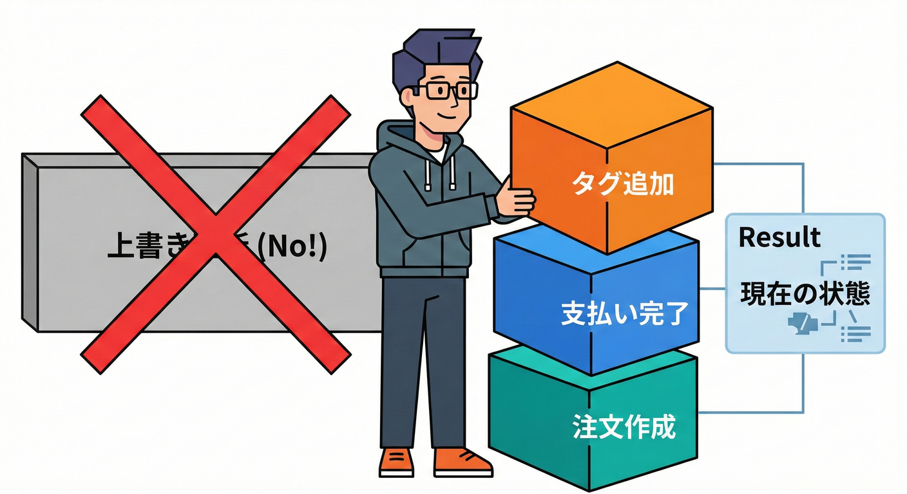
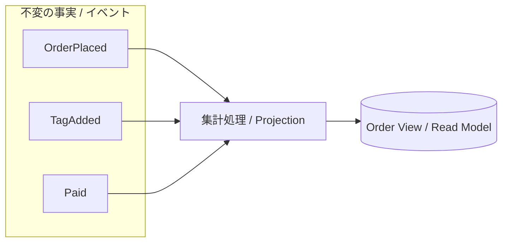

# 第20章：マージしやすいデータ設計②（集合/履歴/イベント）📚🧩

## 20.1 この章のゴール🎯✨

この章が終わると、こんな感覚が身につきます👇🥰

* 「上書き」しない表現（＝あとから合体しやすい表現）を選べる🧠💡
* **集合（Set）**・**履歴（History）**・**イベント（Event）**の使い分けができる🧩
* **操作ログ → 集計（表示用の形に変換）**の流れを手で作れる🛠️✨

---

## 20.2 なんで「上書き」が地雷なの？💣😱

分散っぽい世界では、**同じデータに複数の更新が同時に起きる**のが普通です😵‍💫
そこで「上書き」モデルだと起きやすい事故がこれ👇

### 事故①：片方の変更が消える（Lost Update）🫥💥


たとえば「注文に付くタグ」を、配列まるごと上書きで持ってるとします。

* Aさんが「SALE」を追加🏷️
* Bさんが「GIFT」を追加🎁
* たまたま最後に保存したほうだけが残る（もう片方が消える）😱

つまり、**上書きは“合体（マージ）”が苦手**なんです。

---

## 20.3 合体しやすい3兄弟：集合・履歴・イベント👭✨


上書きしない世界では、だいたいこの3つが主役です👇

### A) 集合（Set）🧺✨

「ある／ない」を表すやつ。
例：タグ、いいねしたユーザー集合、ブロックしたユーザー集合、既読ID集合📚

* 追加：`add("SALE")`
* 削除：`remove("SALE")`
* マージ：**基本は union（和集合）**で合体しやすい🤝

---

### B) 履歴（History）📜✨

「順番に積み上がる記録」。
例：ステータス遷移履歴、価格変更履歴、配送履歴🚚、チャット履歴💬

* 書き込みは **追記（append）**が中心✍️
* マージは「**履歴の合体 + 重複排除**」がしやすい🧹

---

### C) イベント（Event）📣✨

「起きた事実」を**絶対に変えない形で残す**やつ。
例：`OrderPlaced`（注文が作られた） / `PaymentAuthorized`（支払いOKになった）など💳📦

* “状態”じゃなくて “事実” を保存する📌
* 表示したい状態は、**イベントを集計して作る（プロジェクション）**🧮✨





> TypeScript周りは、現時点の安定版が 5.9.3 で公開されています。([npmjs.com][1])
> そして TypeScript 6.0→7.0（ネイティブ移行）に向けた動きが進んでいます。([Microsoft for Developers][2])

---

## 20.4 使い分けの超ざっくりルール🧠🧩

* 「あとから合体したい」なら **上書きしない**🧷
* “いまの値”だけじゃなくて
  **「どう変えたか」**（操作）を残すと強い💪✨

よくある選び方👇

* タグ/既読/お気に入り → **集合（Set）**🏷️📚
* 状態遷移/配送の進み → **履歴（History）**🚚📜
* 注文・支払い・在庫の出来事 → **イベント（Event）**📣🛒

---

## 20.5 ハンズオン：操作ログ → 集計で画面表示を作る🛠️🖥️✨

ここから手を動かします✋😊
やることはこう👇

1. **イベント（操作ログ）**を追記して保存する📝
2. ログを読んで、**表示用の状態（Read Model）**を作る🧮
3. 「上書きモデル」より壊れにくいのを確認する✅✨

実行に `tsx` を使うとTypeScriptのスクリプトをサクッと動かせます⚡([GitHub][3])
テストは `Vitest` が軽くて相性よいです🧪✨（Vitest 4.0のリリースも出ています）([Vitest][4])
Node は v24 が Active LTS として案内されています📌([Node.js][5])

---

### 20.5.1 追加インストール📦✨

```bash
npm i -D typescript tsx vitest
```

---

### 20.5.2 イベント型を作る📣🧩

`src/ch20/events.ts`

```ts
// src/ch20/events.ts
export type EventBase = {
  eventId: string;        // 重複排除用（のちの章の冪等にもつながるよ🧷）
  occurredAt: string;     // ISO文字列
  orderId: string;
};

export type OrderPlaced = EventBase & {
  type: "OrderPlaced";
  items: Array<{ sku: string; qty: number; price: number }>;
};

export type TagAdded = EventBase & {
  type: "TagAdded";
  tag: string;
};

export type TagRemoved = EventBase & {
  type: "TagRemoved";
  tag: string;
};

export type PaymentAuthorized = EventBase & {
  type: "PaymentAuthorized";
  paymentId: string;
};

export type PaymentFailed = EventBase & {
  type: "PaymentFailed";
  reason: string;
};

export type Shipped = EventBase & {
  type: "Shipped";
  trackingNo: string;
};

export type OrderCanceled = EventBase & {
  type: "OrderCanceled";
  reason: string;
};

export type OrderEvent =
  | OrderPlaced
  | TagAdded
  | TagRemoved
  | PaymentAuthorized
  | PaymentFailed
  | Shipped
  | OrderCanceled;
```

---

### 20.5.3 イベントを「追記で保存」する（JSONL）📝📚


`src/ch20/eventStore.ts`

```ts
// src/ch20/eventStore.ts
import { promises as fs } from "node:fs";
import path from "node:path";
import { OrderEvent } from "./events";

const dataDir = path.join(process.cwd(), "data");
const logPath = path.join(dataDir, "order-events.jsonl");

export async function appendEvent(ev: OrderEvent) {
  await fs.mkdir(dataDir, { recursive: true });
  const line = JSON.stringify(ev) + "\n";
  await fs.appendFile(logPath, line, "utf8");
}

export async function readAllEvents(): Promise<OrderEvent[]> {
  try {
    const raw = await fs.readFile(logPath, "utf8");
    return raw
      .split("\n")
      .filter(Boolean)
      .map((line) => JSON.parse(line) as OrderEvent);
  } catch (e: any) {
    if (e?.code === "ENOENT") return [];
    throw e;
  }
}
```

ポイントはこれだけです👇😊
**「上書き」じゃなくて、起きたことを“追記”していくだけ**📌✨

---

### 20.5.4 集計（プロジェクション）で表示用の状態を作る🧮👀✨

`src/ch20/projector.ts`

```ts
// src/ch20/projector.ts
import { OrderEvent } from "./events";

export type OrderView = {
  orderId: string;
  status:
    | "Pending"
    | "Paid"
    | "PaymentFailed"
    | "Shipped"
    | "Canceled";
  total: number;
  items: Array<{ sku: string; qty: number; price: number }>;
  tags: string[];
  timeline: Array<{ occurredAt: string; type: OrderEvent["type"]; note?: string }>;
};

function compareEvents(a: OrderEvent, b: OrderEvent) {
  // まず時刻で並べる（同時刻ならeventIdで安定化）
  if (a.occurredAt < b.occurredAt) return -1;
  if (a.occurredAt > b.occurredAt) return 1;
  return a.eventId.localeCompare(b.eventId);
}

export function projectOrder(events: OrderEvent[], orderId: string): OrderView | null {
  const filtered = events.filter((e) => e.orderId === orderId);

  // 重複排除（同じeventIdが複数回来ても1回だけ扱う🧷）
  const seen = new Set<string>();
  const deduped: OrderEvent[] = [];
  for (const e of filtered) {
    if (seen.has(e.eventId)) continue;
    seen.add(e.eventId);
    deduped.push(e);
  }

  deduped.sort(compareEvents);

  let status: OrderView["status"] = "Pending";
  let items: OrderView["items"] = [];
  let total = 0;

  // 「タグ＝集合」表現：Setで持って、表示するとき配列にする🏷️✨
  const tagSet = new Set<string>();

  const timeline: OrderView["timeline"] = [];

  for (const e of deduped) {
    timeline.push({ occurredAt: e.occurredAt, type: e.type });

    switch (e.type) {
      case "OrderPlaced": {
        items = e.items;
        total = e.items.reduce((sum, it) => sum + it.qty * it.price, 0);
        status = "Pending";
        break;
      }
      case "TagAdded": {
        tagSet.add(e.tag);
        break;
      }
      case "TagRemoved": {
        tagSet.delete(e.tag);
        break;
      }
      case "PaymentAuthorized": {
        // “支払いOKになった”という事実が来たらPaidにする💳✅
        status = status === "Canceled" ? status : "Paid";
        break;
      }
      case "PaymentFailed": {
        status = status === "Canceled" ? status : "PaymentFailed";
        timeline[timeline.length - 1].note = e.reason;
        break;
      }
      case "Shipped": {
        status = status === "Canceled" ? status : "Shipped";
        timeline[timeline.length - 1].note = e.trackingNo;
        break;
      }
      case "OrderCanceled": {
        status = "Canceled";
        timeline[timeline.length - 1].note = e.reason;
        break;
      }
    }
  }

  // 注文が一度も作られてないなら表示しない
  if (!deduped.some((e) => e.type === "OrderPlaced")) return null;

  return {
    orderId,
    status,
    total,
    items,
    tags: [...tagSet].sort(),
    timeline,
  };
}
```

ここ、めちゃ大事👀✨

* **保存してるのは “出来事（イベント）”**
* **画面に出す “状態” は集計で作る**

だから、あとでイベントが増えても、**集計し直せば整合が取りやすい**んです🧠✨

---

### 20.5.5 デモ：2人が同時にタグを追加しても消えない🎁🏷️✨

`src/ch20/demo.ts`

```ts
// src/ch20/demo.ts
import { appendEvent, readAllEvents } from "./eventStore";
import { projectOrder } from "./projector";
import { OrderEvent } from "./events";

const now = () => new Date().toISOString();
const id = () => crypto.randomUUID();

async function main() {
  const orderId = "ORD-1001";

  const events: OrderEvent[] = [
    {
      type: "OrderPlaced",
      eventId: id(),
      occurredAt: now(),
      orderId,
      items: [
        { sku: "COFFEE", qty: 1, price: 500 },
        { sku: "MUFFIN", qty: 2, price: 300 },
      ],
    },
    // Aさん：SALE追加
    { type: "TagAdded", eventId: id(), occurredAt: now(), orderId, tag: "SALE" },
    // Bさん：GIFT追加（ほぼ同時）
    { type: "TagAdded", eventId: id(), occurredAt: now(), orderId, tag: "GIFT" },
    { type: "PaymentAuthorized", eventId: id(), occurredAt: now(), orderId, paymentId: "PAY-9" },
  ];

  for (const e of events) await appendEvent(e);

  const all = await readAllEvents();
  const view = projectOrder(all, orderId);

  console.log(view);
}

main().catch((e) => {
  console.error(e);
  process.exit(1);
});
```

実行👇

```bash
npx tsx src/ch20/demo.ts
```

期待する見た目（イメージ）👇😊

* `tags: ["GIFT","SALE"]` ← **両方残る**🎉
* `status: "Paid"` ← 支払いイベントで変わる💳✅

---

## 20.6 ここが「マージしやすい」理由🤝✨

### 集合は「合体」できる🧺


* Aノード：`{"SALE"}`
* Bノード：`{"GIFT"}`
* マージ：`{"SALE","GIFT"}` 🎉

上書き配列みたいに「最後の人だけ勝つ」が起きにくい😌✨

---

### イベントは「足し算」できる📣


イベントは基本 “消さない” から、

* 受け取ったイベントを足す（追記）
* あとでまとめて集計し直す（プロジェクション）

これでズレを埋めやすいです🧠✨

---

## 20.7 テスト：イベントをシャッフルしても同じ表示になる？🧪🔀

`src/ch20/projector.test.ts`

```ts
import { describe, it, expect } from "vitest";
import { projectOrder } from "./projector";
import { OrderEvent } from "./events";

const ev = (partial: Omit<OrderEvent, "orderId" | "occurredAt" | "eventId"> & { orderId?: string; occurredAt?: string; eventId?: string }): OrderEvent => {
  return {
    orderId: partial.orderId ?? "ORD-1",
    occurredAt: partial.occurredAt ?? "2026-01-30T00:00:00.000Z",
    eventId: partial.eventId ?? crypto.randomUUID(),
    ...(partial as any),
  };
};

describe("Chapter20 projector", () => {
  it("タグは集合としてマージされる（両方残る）🏷️✨", () => {
    const events: OrderEvent[] = [
      ev({ type: "OrderPlaced", items: [{ sku: "A", qty: 1, price: 100 }] }),
      ev({ type: "TagAdded", tag: "SALE" }),
      ev({ type: "TagAdded", tag: "GIFT" }),
    ];

    const view = projectOrder(events, "ORD-1")!;
    expect(view.tags.sort()).toEqual(["GIFT", "SALE"]);
  });

  it("同じeventIdが重複しても1回扱い（重複排除）🧷", () => {
    const dupId = "E-dup";

    const events: OrderEvent[] = [
      ev({ type: "OrderPlaced", items: [{ sku: "A", qty: 1, price: 100 }] }),
      ev({ type: "TagAdded", tag: "SALE", eventId: dupId }),
      ev({ type: "TagAdded", tag: "SALE", eventId: dupId }), // リトライで2回来た想定
    ];

    const view = projectOrder(events, "ORD-1")!;
    expect(view.tags).toEqual(["SALE"]);
  });

  it("イベントが多少入れ替わっても（時刻で整列できる範囲なら）結果が安定する🔀✨", () => {
    const events: OrderEvent[] = [
      ev({ type: "OrderPlaced", items: [{ sku: "A", qty: 2, price: 100 }], occurredAt: "2026-01-30T00:00:01.000Z" }),
      ev({ type: "PaymentAuthorized", paymentId: "PAY-1", occurredAt: "2026-01-30T00:00:03.000Z" }),
      ev({ type: "TagAdded", tag: "GIFT", occurredAt: "2026-01-30T00:00:02.000Z" }),
    ];

    const shuffled = [events[2], events[0], events[1]];
    const view = projectOrder(shuffled, "ORD-1")!;

    expect(view.total).toBe(200);
    expect(view.status).toBe("Paid");
    expect(view.tags).toEqual(["GIFT"]);
  });
});
```

実行👇

```bash
npx vitest
```

---

## 20.8 よくある落とし穴（でも今は気にしすぎなくてOK）😵‍💫⚠️


* イベントが**逆順で届く**／**同時刻**が多いと、順序で悩む🔀
  → ここは **後半の「順序・因果・CRDT」**でちゃんと強くなるよ💪✨
* 「削除」や「取り消し」は **イベントで表現**するのがコツ🧽

  * 例：タグを消すなら `TagRemoved`
  * 注文を取り消すなら `OrderCanceled`

---

## 20.9 AI活用：イベント命名を一気に作るプロンプト🤖🏷️✨

### 命名案を出してもらう📝

```text
在庫・注文・決済のドメインで「起きた事実」をイベントとして設計したいです。
次を満たすイベント名（英語PascalCase）を20個提案して。

- 注文の開始、支払い成功/失敗、在庫確保/失敗、発送、キャンセル、返金
- “状態”ではなく“事実”になる名前
- それぞれ「いつ発生するか」と「含めるべきフィールド例」も添えて
```

### 変な命名を弾くチェック🧠✅

```text
以下のイベント名一覧をレビューして。
「状態っぽい/曖昧/実装依存」になってるものを指摘して、
より“事実”として良い名前に直して。
さらに、1イベントにつきpayloadに最低限入れるべきフィールドも提案して。
```

---

## 20.10 この章のまとめ（結論1行）✍️✨

**上書きしないで「集合・履歴・イベント」で表現すると、あとから合体（マージ）しやすくなって、最終的整合性の世界で強くなるよ🧩🤝✨**

[1]: https://www.npmjs.com/package/typescript?utm_source=chatgpt.com "TypeScript"
[2]: https://devblogs.microsoft.com/typescript/progress-on-typescript-7-december-2025/?utm_source=chatgpt.com "Progress on TypeScript 7 - December 2025"
[3]: https://github.com/privatenumber/tsx?utm_source=chatgpt.com "privatenumber/tsx: ⚡️ TypeScript Execute | The easiest ..."
[4]: https://vitest.dev/blog/vitest-4?utm_source=chatgpt.com "Vitest 4.0 is out!"
[5]: https://nodejs.org/en/about/previous-releases?utm_source=chatgpt.com "Node.js Releases"
